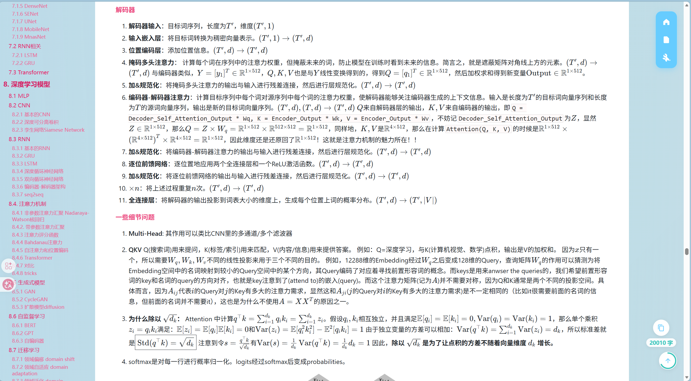
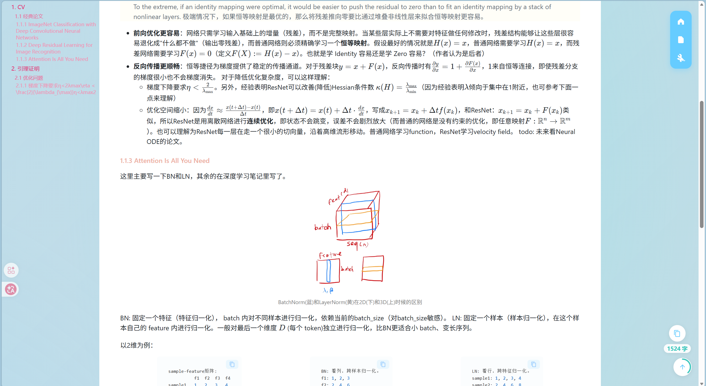

# AI 学习笔记
Hello！这是我的学习笔记，主要是ML、DL、RL、CV、NLP、RS等AI相关的内容，格式以 Markdown 为主，夹杂早期 Word 笔记等材料。笔记的仓库**可以直接下载下来看，无需经由我同意**。但是**请不要用于学习之外的用途**（比如不标注出处的转载、商业用途、大篇幅抄袭等），少量引用可以不注明出处，引用多了还是希望能注明出处是`virtual小满  https://github.com/virtualxiaoman/MLDLRL`

---

Attention！ 已经上线**在线阅读版**，可见https://virtualxiaoman.github.io/blog/

<div style="display: flex; flex-direction: column; align-items: center;">
    <div style="display: flex; justify-content: center; align-items: center; gap: 10px; flex-wrap: wrap;">
        
         
    </div>
    <p style="text-align: center; max-width: 800px; margin-top: 10px;">
       博客文章部分预览。还有其余功能等你来探索w~
    </p>
</div>


你也可以参考：https://github.com/virtualxiaoman/blog （vue）来自行构建本地阅读版。当然，使用typora，vscode等markdown编辑器也能正常阅读。
typora使用[latex主题](https://github.com/Keldos-Li/typora-latex-theme)或者我自己写的css模版（见本仓库的markdown-css文件夹）时，阅读效果更佳。

---

## 笔记导航

下面列出**完成度较高**的笔记：

| 主题 | 入口 | 推荐理由与内容                                  |
| --- | --- |------------------------------------------|
| 机器学习 | [机器学习.md](./机器学习.md) | **★ 推荐**：系统整理概论、特征工程、模型评估与选择、训练优化及经典模型。  |
| 深度学习 | [深度学习.md](./深度学习.md) | **★ 推荐**：包含神经网络手算、训练中的常见问题、核心组件、经典网络与模型。 |
| 数学基础 | [数学基础.docx](./数学基础.docx) / [PDF](./导出的PDF/docx导出的PDF/数学基础.pdf) | **★ 用于查阅**：覆盖线性代数、概率论等基础内容，可在学习模型前按需回看。  |


### 建议阅读顺序

1. 先用“数学基础”补齐必要的线性代数与概率论知识。
2. 阅读“机器学习”，并结合后续的实践笔记理解数据处理与模型训练。
3. 进入“深度学习”，再根据兴趣选择视觉、NLP、推荐、强化学习等专题。

## 仓库结构

标记说明：**★ 推荐**表示完成度较高、可优先阅读；**△ 按需**表示专题性或仍在整理，适合已有对应需求时查阅；**○ 存档**表示早期或零散材料，仅供参考。

| 笔记/文件夹 | 推荐度 | 大致内容 |
| --- | --- | --- |
| [深度学习.md](./深度学习.md) | ★ 推荐 | 神经网络计算、常见问题、激活与损失、优化器、正则化、数据处理、CNN/RNN/Transformer 与模型。 |
| [数学基础.docx](./数学基础.docx) / [数学基础 PDF](./导出的PDF/docx导出的PDF/数学基础.pdf) | ★ 推荐查阅 | 线性代数、概率论等机器学习所需的数学基础；以早期 Word/PDF 文档为主。 |
| [自然语言处理.md](./自然语言处理.md) | △ 按需 | 文本规范化、文本表示、文本分类、文本聚类等。 |
| [推荐系统.md](./推荐系统.md) | △ 按需 | 推荐系统架构、召回（协同过滤/向量/图）、粗排与精排。 |
| [深度学习实践.md](./深度学习实践.md) | △ 按需 | 以计算机视觉监督学习为主的实践记录入口。 |
| [机器学习.md](./机器学习.md) | △ 按需 | 概论、特征工程、评估与选择、训练优化、经典模型。 |
| [机器学习实践.md](./机器学习实践.md) | △ 按需 | 房价、Elo 商户推荐、加州房价等小型 Demo，以及广告点击率预估项目。 |
| [计算机视觉.md](./计算机视觉.md) | △ 按需 | HOG、DPM 等传统视觉方法，以及深度学习相关内容。 |
| [强化学习.md](./强化学习.md) | △ 按需 | 强化学习基础、MDP、Bellman 方程、表格型方法等。 |
| [扩散模型.md](./扩散模型.md) | △ 按需 | DDPM 的前向/反向过程与基础模型搭建。 |
| [论文阅读.md](./论文阅读.md) | △ 按需 | CV 经典论文与部分引理证明的阅读记录。 |
| [机器学习-docx.docx](./机器学习-docx.docx) | ○ 存档 | 较早的机器学习 Word 笔记，可与当前 Markdown 版本对照查阅。 |
| `零散东西的笔记/` | △ 按需 | [Git](./零散东西的笔记/git.md)、[LaTeX](./零散东西的笔记/LaTeX.md)、[Matplotlib](./零散东西的笔记/plt.md)、[Vue](./零散东西的笔记/vue.md)、[PEP 8/Python 环境](./零散东西的笔记/零碎东西的存档.md)等零散记录。 |
| `以前的笔记/` | ○ 存档 | 早期的代码基础、数据处理与数据分析 Word/PDF 材料；整体较旧，仅供参考。 |
| `导出的PDF/` | △ 按需 | Markdown 或 Word 导出的 PDF，包含机器学习、机器学习实践、深度学习与数学基础。 |
| `assets/` | — | 当前 Markdown 笔记引用的图片资源。 |

## 相关代码

数据分析、机器学习与深度学习相关的可复用模块和 Demo，可参考 [AI](https://github.com/virtualxiaoman/AI)(较新)或者[Easier_DataScience](https://github.com/virtualxiaoman/Easier_DataScience)。本仓库中的笔记会在需要时链接到对应实践。

## 参考资料

### 1.最主要、最好的的参考资料与个人的一点推荐
1. [《鸢尾花书》](https://github.com/Visualize-ML) - 从加减乘除到机器学习
    - **推荐理由**：配图极其优秀，整体逻辑比较连贯，原理讲解很棒。我所见过的最想让你看懂的书籍，能看出作者的用心。
    - **缺陷**：有些啰嗦，没办法速通，代码写的也是一坨，甚至不肯格式化一下。
2. [《动手学深度学习》](https://zh.d2l.ai/) - 面向中文读者的能运行、可讨论的深度学习教科书，简称d2l
    - **推荐理由**：深度学习实操，除了部分大一点的模型我的电脑太辣鸡直接爆显存之外，基本都能直接运行，而且原理的讲解确实牛逼，社区也不错。
    - **缺陷**：虽然是中文，但是很有机翻的感觉。什么都放在d2l.py里了，代码逻辑比较混乱，需要自己重构一部分代码，但是起码也算是我目前见过的代码写得比较好的了。
3. [李宏毅深度学习教程 LeeDL Tutorial](https://github.com/datawhalechina/leedl-tutorial) - 李宏毅的深度学习课程
    - **推荐理由**：不是入门书，可以先看[d2l](https://zh.d2l.ai/)再看这个。这个书提及了很多细节与问题，更多的是启发性思考，主要是讲解一些深度学习的原理。
    - **缺陷**：没有代码实现，然后感觉就是他的课的文字版，有些地方都没校验就直接放上去了，需要自己去看源视频。（因为我自己不喜欢看视频来学习，所以我看的是这个书，视频还是很不错的）
4. [Easier_DataScience](https://github.com/virtualxiaoman/Easier_DataScience) - [自荐]我写的一些便于MLDL等AI相关的module或是一些demo，希望调用或复用的时候更方便
    - **推荐理由**：方便调用，不用每次都写一遍
    - **缺陷**：还在更新中，有些模块还没写完或者还没测试，部分代码逻辑可能不够清晰，就当是自己的练手了。
5. [雷明-机器学习的数学](https://www.epubit.com/bookDetails?id=UB7812edb26d3f9) - 机器学习的数学基础
    - **推荐理由**：数学推导比较详细，适合想要深入了解的人。
    - **缺陷**：没图，全是公式。另外目前还没在网上找到电子书，我是买的纸质的。

(好像我格外喜欢电子书，逃~~)(我是Datawhale和d2l的狗~)


### 2.其余推荐资料
**没**打○的就是我**没看过**，阿巴阿巴~（没看的未来应该会看的，看完了再更新评价）。

中文社区的资料就这鬼样子，真的烂大街的我肯定不会放上来了。

以下排名分先后（我没看的不算）：
1. ○[AI数学笔记 Liang's Blog](https://wangliangster.github.io/#/) 
   ○[AI算法工程师手册 huaxiaozhuan](https://www.huaxiaozhuan.com/)
    - **比较难的公式推导都有**，按需查阅。
    - 感觉挺全面的。
2. ○[动手学ML](https://github.com/boyu-ai/Hands-on-ML) 
    - 电子书，免费。
    - 不是入门书，**适合有一定基础**的看。
    - 部分公式存在严重错误，但是讲解还可以，需要有自己的判断能力。
    - 习题答案可以参考：[motewei](https://github.com/motewei/Hands-on-ML-solutions)
3. ○[文亮-推荐系统技术原理与实践](https://www.epubit.com/bookDetails?id=UB831721e9d193a)
   - 有电子书(需要异步会员，但是异步会员可以通过已经购买了的纸质书兑换)，相当于半白嫖。
   - 整体**讲解还可以**，最好搭配[FunRec](https://datawhalechina.github.io/fun-rec/#/)一起看。
   - 举例大部分是阿里巴巴的模型，难道阿里巴巴给他打钱了？
4. ○[动手学NLP](https://github.com/boyu-ai/Hands-on-NLP)
    - 无电子版(异步都没电子版)，买了纸质书，书挺好的，但我现在被劝退了，我不适合学NLP，感觉NLP的理论不美。
5. ○[王晓华-从零开始大模型开发与微调：基于PyTorch与ChatGLM](http://www.tup.tsinghua.edu.cn/Wap/tsxqy.aspx?id=10334701)
    - 有电子版，付费，跟纸质版价格差不多。有[神秘链接](https://pan.baidu.com/s/1cY8htDmzXMIoJIan9aIWRw?pwd=fgyb)，但是要快手关注才能拿密码，我又没下。。。
    - 这本书不适合0基础，而是适合学了一点之后再看。其号称“通俗易懂”的原因是**难的都不讲**，都让读者“自行在网上查阅”。
    - 没有原理讲解，代码写的屎到不行而且有些感觉直接copy的连注释都是英文(我见过的最烂的)，唯一的优势是新且比较实用。
6. [动手学CV](https://github.com/boyu-ai/Hands-on-CV)
   - 无电子版，而且github仓库都没建好，纸质书好像也没了，所以我没看
7. [动手学RL](https://github.com/boyu-ai/Hands-on-RL)
    - 有电子版，据说好
8. [带注释的pytorch论文实现](https://nn.labml.ai/zh/)
    - 个人感觉翻译得非常差，但是类似的其他资源还没找到更好的
9. [强化学习导论](https://rl.qiwihui.com/zh-cn/latest/index.html)
10. [人大LLM-Book](https://github.com/LLMBook-zh/LLMBook-zh.github.io)
    - 可下载阅读

以下请避雷：
1. 扩散原理从入门到实战-异步图书：**没有原理讲解**，我看完了还是一知半解的状态，代码是英文原版的机翻。另外其实这是个[开源的书](https://huggingface.co/datasets/HuggingFace-CN-community/Diffusion-book-cn)，感觉不如看[这个开源资料](https://github.com/yangqy1110/Diffusion-Models/tree/main)。
2. 自动机器学习入门与实践-华中科技大学出版社：**没有原理讲解**，大部分是ML而非autoML，代码就是英文原版的一个字都没改。


### 3.部分大型的开源学习资源
1. [Datawhale-github](https://github.com/datawhalechina)或者[Datawhale-官网](https://datawhale.cn/learn)
好像都是免费，质量还挺不错的(但是因为显然每一章节的作者不相同，导致逻辑连贯性不够强、符号使用不太统一)，但是感觉最近更新的不多，好的教程似乎都已经是一两年前的了。整体来说，我觉得Datawhale的质量还是比较高的，并且有些教程确实是**独一无二**的，比如`plt`的我就没在其他地方看到研究得这么细致的。
2. [boyuai-github](https://github.com/boyu-ai)或者[boyuai-官网](https://www.boyuai.com)
有付费内容，但是动手学系列都是免费的，但是动手学NLP,CV的不知道为什么没有电子书了，所以只有ML,RL有电子书了，唉。


### 4.视频
1. [B站-这是我已经看完了的视频教程的一个收藏夹](https://space.bilibili.com/506925078/favlist?fid=2648566378)
主要包括：
- [BV1T84y167U9](https://www.bilibili.com/video/BV1T84y167U9/)  机器学习(传统的机器学习算法基本都有)。虽然我不推荐看唐宇迪的视频来学机器学习，但是他的视频确实简单，拿个二倍速过一遍当**入门**就行，不要去纠结其中的代码是怎么写的或者去纠结他公式推导的细节。
- [BV1RT411G7jJ](https://www.bilibili.com/video/BV1RT411G7jJ)  机器学习(侧重统计学习)。内容不是很多，但是讲的都很好
- [BV15V411W7VB](https://www.bilibili.com/video/BV15V411W7VB/)  机器学习(侧重神经网络)。跟上面一个一样，内容讲的很不错，能启发思考。

2. 李沐、李宏毅、吴恩达等大佬的视频，这里不给出链接了，B站一搜就有的，去Youtube看也行。真的比唐宇迪的强很多。


### 5.对于我阅读较久的书籍&视频的一些打分

| 书籍 | 整体印象 | 阅读舒适度 | 实用性 | 逻辑性 | 启发性 | 语言 |
|------|---------|-----------|-------|--------|-------|-------------------------------|
| [《动手学深度学习》](https://zh.d2l.ai/)|9| ★★★★★  | ★★★★☆ | ★★★★☆ | ★★★★☆ |★★★☆☆|
|  [李宏毅深度学习教程 LeeDL Tutorial](https://github.com/datawhalechina/leedl-tutorial) |9| ★★★★★ | ★★★☆☆ | ★★★★☆ | ★★★★★ |★★★☆☆ |
| [《鸢尾花书》](https://github.com/Visualize-ML)|8.5| ★★★★☆  | ★★★☆☆ | ★★★★☆ | ★★★★★ |★★★★★ |
| [《机器学习的数学》](https://www.epubit.com/bookDetails?id=UB7812edb26d3f9) |8| ★★★☆☆  | ★★★★☆ | ★★★★☆ | ★★★☆☆ |★★★★☆ |
| [动手学ML](https://github.com/boyu-ai/Hands-on-ML) |7| ★★★☆☆  | ★★★☆☆ | ★★★★☆ | ★★★☆☆ |★★★☆☆ |
| [BV1T84y167U9](https://www.bilibili.com/video/BV1T84y167U9/) | 5| ★★★★☆  | ★★★★☆ | ★★☆☆☆ | ★☆☆☆☆ |★★★☆☆ |

以上是我觉得还不错的资料的评分。评分十分主观，仅供参考，应当根据自己的学习**目的与风格**选择适合自己的学习资料。

- 整体印象是我的主观感受。
- 阅读舒适度是能不能让人有继续阅读的冲动。
- 实用性主要是看代码写的好不好。
- 逻辑性主要看作者的思维。
- 启发性主要看作者能否给我带来启发。
- 语言是指作者的语言表达能力，不是指代码的语言。包括：是否是母语或者翻译得是否是个正常人、描述是否清晰、用词是否准确。


---

<div style="display: none;">

md内统一使用的语法有(该div我设为了隐藏属性，因为方便我自己查阅以标准化md格式，但是github界面似乎并不支持div隐藏，阿巴阿巴)：

小标题：
<p style="color:#EC407A; font-weight:bold">1. 小标题</p>

图片：
<div style="display: flex; justify-content: center; align-items: center;">
    <div style="text-align: center;">
        
        <p style="font-size: small; color: gray;">注释</p>
    </div>
</div>

多图：

<div style="display: flex; justify-content: center; align-items: flex-start; gap: 20px; flex-wrap: wrap;">
    <div style="display: flex; flex-direction: column; align-items: center; flex: 0 1 45%; min-width: 200px;">
        
        <p style="text-align: center; margin-top: 8px; font-size: 14px; color: #333;">
            注释1
        </p>
    </div>
    <div style="display: flex; flex-direction: column; align-items: center; flex: 0 1 45%; min-width: 200px;">
        
        <p style="text-align: center; margin-top: 8px; font-size: 14px; color: #333;">
            注释2，
            <a href="https://arxiv.org/abs/..." target="_blank">论文名称</a>
        </p>
    </div>
</div>

<div style="display: flex; flex-direction: column; align-items: center;">
    <div style="display: flex; justify-content: center; align-items: center; gap: 10px; flex-wrap: wrap;">
        
         
    </div>
    <p style="text-align: center; max-width: 800px; margin-top: 10px;">
        单个注释
        <a href="https://arxiv.org/abs/...">论文名称</a>
    </p>
</div>


代码：

<div style="display: flex; justify-content: center; align-items: center;">
<div style=" max-height: 200px; max-width: 90%; overflow-y: auto; border: 1px solid #39c5bb; border-radius: 10px;">

```python
很长的一段代码
```

</div>
</div>

</div>

使用$\displaystyle$可以强制在行内公式中使用显示模式使其像$$$$一样形式。


typora导出markdown为PDF的格式设置如下：
页首：${title}-virtual小满
页尾：No. ${pageNo} / ${totalPages}
作者：virtual小满
