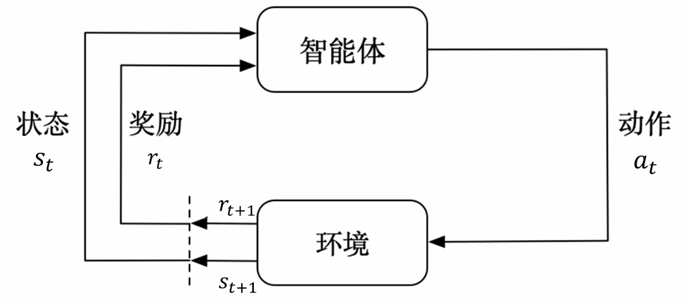
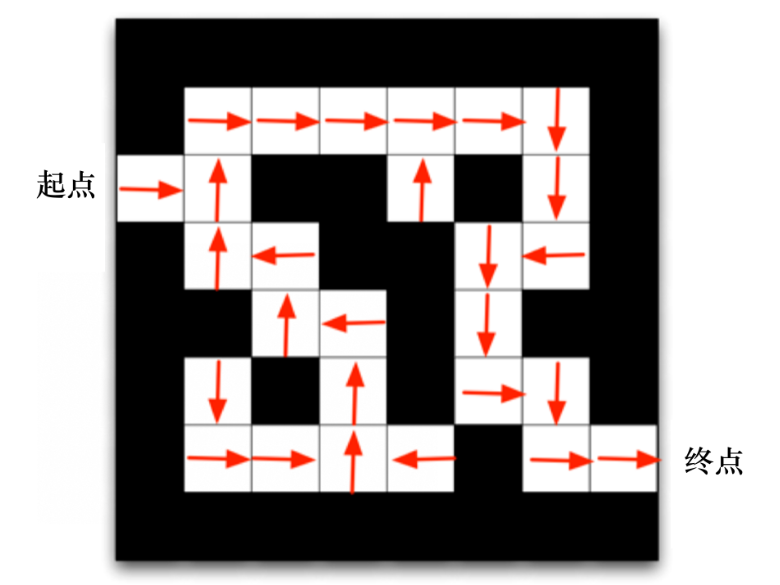
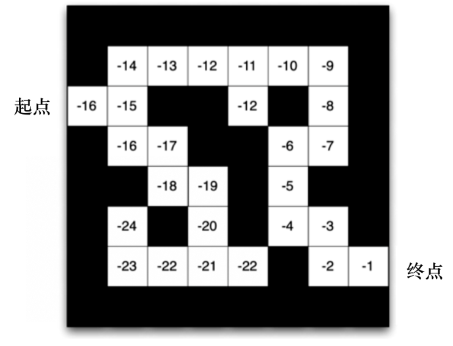
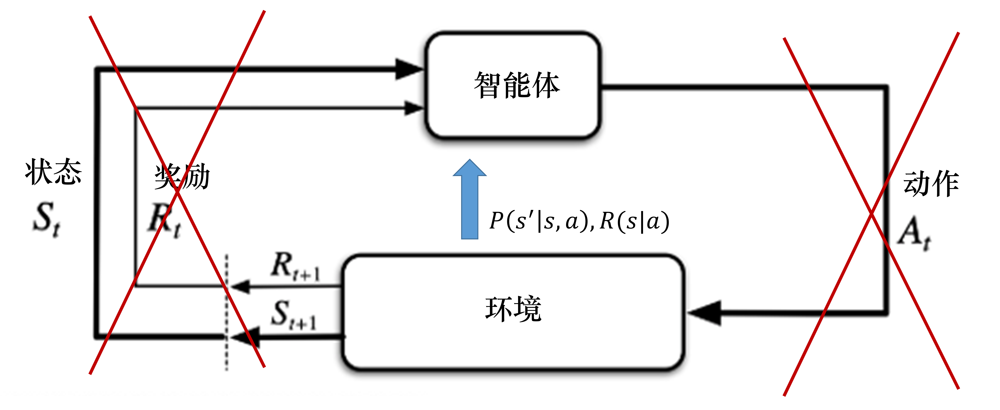
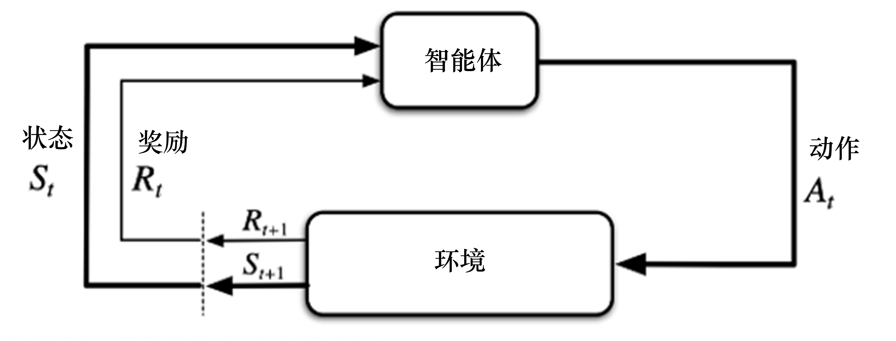
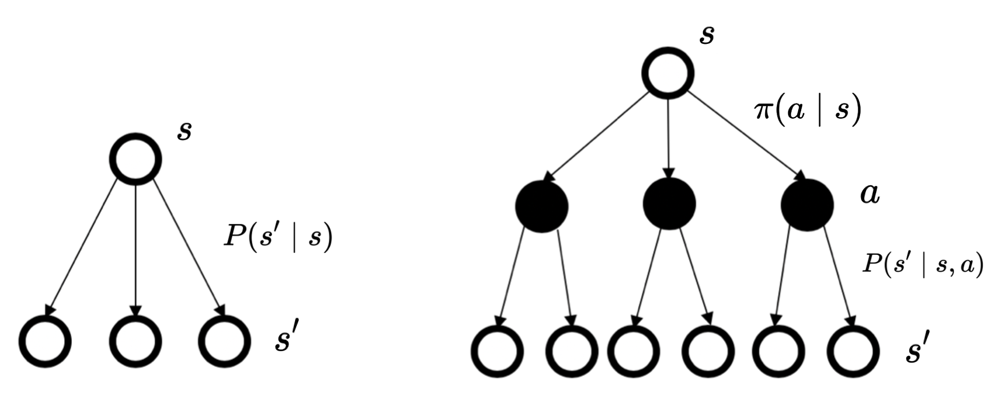

参考资料：
- [EasyRL](https://datawhalechina.github.io/easy-rl)，而EasyRL参考的是[davidsilver](https://www.davidsilver.uk/teaching/)，但我懒得看英文PPT~~
这本书感觉不适合初学，看到了https://datawhalechina.github.io/easy-rl/#/chapter3/chapter3?id=_33-%e5%85%8d%e6%a8%a1%e5%9e%8b%e9%a2%84%e6%b5%8b 等以后再看

# 1. 强化学习

强化学习(reinforcement learning，RL)讨论的问题是**智能体**`agent`怎么在复杂、不确定的**环境**`environment`里面去最大化它能获得的**奖励**。适合**多序列决策问题**。

在强化学习过程中，智能体与环境一直在**交互**。智能体在环境里面获取某个状态后，它会利用该状态输出一个**动作**`action`(决策`decision`)。然后这个动作会在环境之中被执行，环境会根据智能体采取的动作，输出下一个状态以及当前这个动作带来的奖励。智能体的目的就是尽可能多地从环境中获取奖励。

    

        
        
强化学习示意图

    

## 1.1 为什么需要强化学习
监督学习要求数据满足$\text{i.i.d}$，而且需要有标签。而在游戏等领域，这两个假设都不成立，游戏的上一帧与下一帧之间的关系非常强(连续性)，奖励稀疏(无及时反馈/延迟奖励)，这就导致了监督学习在这种情况下的表现不佳。

强化学习的特点：
- 输入的样本是**序列**数据。
- 环境可能会告诉我们这个动作是错误的，但是它并没有告诉我们正确的动作是什么，只能通过**尝试**来学习。
- 试错探索`trial-and-error exploration`：**探索**`exploration`和**利用**`exploitation`是RL的核心问题。
  - 探索：尝试一些新的动作，可能会得到更多奖励，也有可能变得一无所有
  - 利用：采取已知的可以获得最多奖励的动作，重复执行这个动作，因为我们知道这样做可以获得一定的奖励。
  - 因此，我们需要在探索和利用之间进行权衡，这也是在监督学习里面没有的情况。
- 监督者`supervisor`只有奖励信号`reward signal`，而且奖励信号是**延迟**的。
- 智能体的动作会**影响**它随后得到的数据，如果在训练过程中，智能体不能保持稳定，就会使我们采集到的数据非常糟糕，怎么让智能体的动作一直稳定地提升是一个很大的挑战。
- 监督学习算法的上限`upper bound`就是人类的表现，标注结果决定了它的表现永远不可能超越人类。但是对于强化学习，它在环境里面自己探索，有非常大的**潜力**，它可以获得超越人类的能力的表现。

## 1.2 术语

**回合**`episode`(试验`trial`)：一场游戏称为一个回合，包括了开始到结束的状态、动作和奖励信息。
**轨迹**`trajectory`：包含了从开始到结束的所有状态和动作，$\tau = (s_0, a_0, s_1, a_1, \cdots, s_T, a_T)$。其中$s_t$是时间步$t$的**状态**，$a_t$是时间步$t$的**动作**，$T$是轨迹的长度(可能是可变的)。
**预演**`rollout`：从当前帧对动作进行采样，生成很多局游戏，$\text{rollout} = \{\tau_1, \tau_2, \cdots, \tau_N\}$。其中$\tau_i$是第$i$个轨迹，$N$是预演的次数。
**历史**`history`：智能体在环境中的所有交互信息(状态、动作和奖励)，$H_t = (s_0, a_0, r_1, s_1, a_1, r_2, \cdots, s_{t-1}, a_{t-1}, r_t, s_t)$。其中$r_t$是时间步$t$的**奖励**。智能体在采取当前动作的时候会依赖于它之前得到的历史，所以整个游戏的状态是关于这个历史的函数$s_t=f(H_t)$。

**马尔可夫**：包含了状态、动作、奖励、状态转移概率等信息。环境用$s_t^e=f^e(H_t)$更新状态，智能体用$s_t^a=f^a(H_t)$更新状态，当智能体的状态与环境的状态**等价**的时候，即当智能体能够**观测**到环境的所有**状态**时，我们称这个环境是完全可观测的`fully observed`，此时RL问题就是一个MDP问题。
**MDP**`Markov Decision Process`：马尔可夫决策过程，满足$P(s_{t+1}^e|s_t^e, a_t^e) = P(s_{t+1}^e|s_t^e, a_t^a)$，观测值$o_t = s_t^e = s_t^a$。
MDP是一个五元组$(S, A, P, R, \gamma)$，其中$S$是状态空间，$s \in S$；$A$是动作空间，$a \in A$；$P$是状态转移概率$P(s_{t+1}|s_t, a_t)$；$R$是奖励函数，$R(s_t, a_t)$；$\gamma$是折扣因子，$0 \leq \gamma \leq 1$。
**POMDP**`Partially Observable Markov Decision Process`：部分可观测马尔可夫决策过程，状态转移概率依然满足$P(s_{t+1}^e | s_t^e, a_t^e) = P(s_{t+1}^e | s_t^e, a_t^a)$，但在POMDP中，智能体并不能直接观测到环境的真实状态$s_t^e$，观测值$o_t$是通过观测函数$\Omega$从环境状态$s_t^e$中生成的，是环境状态的**部分**或**噪声**观测，即$o_t = \Omega(s_t^e, a_t^a), o_t \neq s_t^e$。
POMDP是一个七元组$(S, A, P, R, \gamma, O, \Omega)$，其中$s \in S$是隐变量；$O$是观测空间，$o \in O$；$\Omega$是观测函数，定义为$P(o_t|s_t, a_t)$，其余与MDP相同。

**策略**`policy`：智能体在某个状态下采取某个动作的概率分布，$\pi(a|s) = P(a|s)$。$\pi$可以是确定性的`stochastic`，也可以是随机的`deterministic`。
**价值函数**`value function`：衡量某个状态或者状态-动作对的好坏的函数：价值函数$V(s)$或者动作价值函数$Q(s, a)$。$V(s)$是在状态$s$下的预期奖励，$Q(s, a)$是在状态$s$下采取动作$a$的预期奖励。
$$\begin{aligned}
V_\pi(s)&\doteq\mathbb{E}_\pi\left[G_t\mid s_t=s\right]=\mathbb{E}_\pi\left[\sum_{k=0}^\infty\gamma^kr_{t+k+1}\mid s_t=s\right]
\\
Q_\pi(s,a)&\doteq\mathbb{E}_\pi\left[G_t\mid s_t=s,a_t=a\right]=\mathbb{E}_\pi\left[\sum_{k=0}^\infty\gamma^kr_{t+k+1}\mid s_t=s,a_t=a\right]
\end{aligned}
$$下标$\pi$表示是在策略$\pi$下的价值函数，$\doteq$表示定义等于，$G_t$是时间步$t$的回报。
**回报**`return`：智能体在一个回合中获得的奖励的总和，$G_t = r_{t+1} + \gamma r_{t+2} + \cdots + \gamma^{T-t-1}r_T$。其中$\gamma$是折扣因子`discount factor`，$0 \leq \gamma \leq 1$，它决定了未来奖励的重要性，$T$是回合的长度，$r_t$是时间步$t$的奖励，也会记作$R(s_t, a_t)$。
**优势函数**`advantage function`：衡量某个动作相对于平均水平的好坏的函数，$A(s, a) = Q(s, a) - V(s)$。$A(s, a)$是在状态$s$下采取动作$a$的优势。
**贝尔曼方程**`Bellman equation`：强化学习中最重要的方程之一，它描述了价值函数之间的关系：
$$\begin{aligned}
V_\pi(s) &= R(s)+\gamma\mathbb{E}[V_\pi(s_{t+1})|s_t=s] \\
&= R(s)+\gamma\sum_{s'\in S}P(s'|s)V_\pi(s')  \\
Q_\pi(s, a) &= R(s, a)+\gamma\mathbb{E}[Q_\pi(s_{t+1}, a_{t+1})|s_t=s, a_t=a] \\
&= R(s, a)+\gamma\sum_{s'\in S}P(s'|s, a)V_\pi(s')
\end{aligned}
$$其中$R(s)$是在状态$s$下的奖励，$R(s, a)$是在状态$s$下采取动作$a$的奖励，$P(s'|s)$是状态转移概率，$P(s'|s, a)$是在状态$s$下采取动作$a$后转移到状态$s'$的概率。

## 1.3 两种方法

**基于策略的强化学习**`Policy-based RL`：每一个状态得到对应动作的概率，也就是直接学习策略$\pi(a|s)$，通过策略来选择动作。
**基于价值的强化学习**`Value-based RL`：每一个状态会返回一个价值，也就是显式地学习价值函数$V(s)$或者$Q(s, a)$，通过价值函数来选择动作，即：隐式地学习它的策略。

    

        
        
基于策略

    

        

        
        
基于价值

    

# 1.4 两种模型

**有模型**`Model-based`：通过环境的状态转移概率$P(s'|s, a)$和奖励函数$R(s, a)$来建立一个模型，而不需要智能体在每次迭代时通过实际动作去探索和观察环境的反应。
**免模型**`Model-free`：不需要知道$P(s'|s, a)$和$R(s, a)$，直接在环境中进行交互，通过采样来学习最优策略。

    

        
        
有模型，“交互”其实是环境提供$P(s'|s, a)$和$R(s, a)$

    

        

        
        
免模型，与环境进行状态、奖励、动作的交互

    

# 2. MDP
## 2.1 Markov

马尔可夫性质：未来的状态只与当前状态有关，与过去的状态无关，$P(s_{t+1}|s_t, a_t, s_{t-1}, a_{t-1}, \cdots) = P(s_{t+1}|s_t, a_t)$。
ps：如果不满足，可以使用RNN等模型来建模历史信息，获得包含历史信息的状态表征，表征过程也可以使用注意力机制等手段，最后在表征状态空间求解马尔可夫决策过程问题。

对于$N$个状态的马尔可夫链，可以使用一个$N \times N$的状态转移矩阵`state transition matrix`来描述马尔可夫性质，状态转移矩阵是一个$N \times N$的矩阵，$N$是状态的个数，$P$是状态转移概率矩阵，$P_{ij} = P(s_j|s_i)$。
$$\boldsymbol{P}=\left(\begin{array}{cccc}
p\left(s_1\mid s_1\right)&p\left(s_2\mid s_1\right)&\ldots&p\left(s_N\mid s_1\right)\\
p\left(s_1\mid s_2\right)&p\left(s_2\mid s_2\right)&\ldots&p\left(s_N\mid s_2\right)\\
\vdots&\vdots&\ddots&\vdots\\
p\left(s_1\mid s_N\right)&p\left(s_2\mid s_N\right)&\ldots&p\left(s_N\mid s_N\right)\end{array}\right)$$

## 2.2 Bellman Equation

注意到$V(s) = R(s)+\gamma\sum_{s'\in S}P(s'|s)V(s')$，以$s_1$为例，

$$\begin{aligned}
V(s_1) &= R(s_1)+\gamma\left[p\left(s_1\mid s_1\right)V(s_1)+p\left(s_2\mid s_1\right)V(s_2)+\ldots+p\left(s_N\mid s_1\right)V(s_N)\right] \\
&= R(s_1) + \begin{bmatrix} p\left(s_1\mid s_1\right)&p\left(s_2\mid s_1\right)&\ldots&p\left(s_N\mid s_1\right) \end{bmatrix} \begin{bmatrix} V(s_1) \\ V(s_2) \\ \vdots \\ V(s_N) \end{bmatrix} 
\end{aligned}$$我们可以将其写成矩阵形式：
$$\begin{aligned}
\left(\begin{array}{c}V\left(s_{1}\right)\\V\left(s_{2}\right)\\\vdots\\V\left(s_{N}\right)\end{array}\right)
&=\left(\begin{array}{c}R\left(s_{1}\right)\\R\left(s_{2}\right)\\\vdots\\R\left(s_{N}\right)\end{array}\right)
+\gamma\left(\begin{array}{cccc}p\left(s_{1}\mid s_{1}\right)&p\left(s_{2}\mid s_{1}\right)&\ldots&p\left(s_{N}\mid s_{1}\right)\\p\left(s_{1}\mid s_{2}\right)&p\left(s_{2}\mid s_{2}\right)&\ldots&p\left(s_{N}\mid s_{2}\right)\\\vdots&\vdots&\ddots&\vdots\\p\left(s_{1}\mid s_{N}\right)&p\left(s_{2}\mid s_{N}\right)&\ldots&p\left(s_{N}\mid s_{N}\right)\end{array}\right)
\left(\begin{array}{c}V\left(s_{1}\right)\\V\left(s_{2}\right)\\\vdots\\V\left(s_{N}\right)\end{array}\right)\\
\\
\boldsymbol{V}
&=\boldsymbol{R}+\gamma\boldsymbol{P}\boldsymbol{V}
\end{aligned}$$其中$\boldsymbol{V}$是价值函数向量，$\boldsymbol{R}$是奖励向量，$\boldsymbol{P}$是状态转移概率矩阵。显然易求出解析解$\boldsymbol{V}=(\boldsymbol{I}-\gamma\boldsymbol{P})^{-1}\boldsymbol{R}$。

## 2.3 MRP和MDP的区别

    

        
        
马尔可夫奖励过程MRP与马尔可夫决策过程MDP的区别。 前者直接从$S$中选择动作$s'$，后者先从$A$中选择动作$a$再在当前的$a$对应的$S$中选择动作$s'$。

    

## 2.4 Bellman Expectation Equation
**贝尔曼期望方程**`Bellman Expectation Equation`：对于MDP，我们可以通过贝尔曼期望方程来描述价值函数之间的关系。
由$Q_\pi(s, a) = R(s, a)+\gamma\sum_{s'\in S}P(s'|s, a)V_\pi(s')$和$V_\pi(s)=\sum_{a\in A}\pi(a\mid s)Q_\pi(s,a)$可得：
$$Q_\pi(s,a)=R(s,a)+\gamma\sum_{s'\in S}p\left(s'\mid s,a\right)\sum_{a'\in A}\pi\left(a'\mid s'\right)Q_\pi\left(s',a'\right)$$

## 2.5 Optimal Value Function
**最佳价值函数**`optimal value function`：最优价值函数$V^*(s)$是在状态$s$下采取最优动作$a$的预期奖励，$V^*(s) = \max_{\pi}V_\pi(s), \pi^*(s) = \arg\max_{\pi}V_\pi(s)$，二者都是让$V_\pi(s)$取得最大值，是等价的。
**最佳策略**`optimal policy`：当取得最佳价值函数后，我们可以通过对 Q 函数进行最大化来得到最佳策略：$\pi^*(a|s) = \begin{cases} 1, & \text{if } a = \arg\max_{a\in{A}}Q^*(s, a) \\ 0, & \text{otherwise} \end{cases}$。

## 2.6 策略搜索
如果穷举，则要考虑$|A|^{|S|}$种策略，所以一般使用策略迭代和价值迭代来求解最优策略。
### 2.6.1 策略迭代
1. 初始化策略$\pi_0$；
2. 评估策略：计算当前策略$\pi_i$的价值函数$V_{\pi_i}(s)$，$V^\pi(s)=\sum_{a\in A}\pi(a|s)\sum_{s^{\prime}\in S}P(s^{\prime}|s,a)[R(s,a,s^{\prime})+\gamma V^\pi(s^{\prime})]$；
3. 改进策略：根据当前策略$\pi_i$的价值函数$V_{\pi_i}(s)$，更新策略$\pi_{i+1}$，$\pi^{\prime}(s)=\arg\max_{a\in A}\sum_{s^{\prime}\in S}P(s^{\prime}|s,a)[R(s,a,s^{\prime})+\gamma V^{\pi}(s^{\prime})]$；
4. 重复2、3步，直到**策略**不再变化。

### 2.6.2 价值迭代
1. 初始化价值函数$V_0(s)$；
2. 更新价值函数：根据当前价值函数$V_i(s)$，更新价值函数$V_{i+1}(s)$，$V(s)=\max_{a\in A}\sum_{s^{\prime}\in S}P(s^{\prime}|s,a)[R(s,a,s^{\prime})+\gamma V(s^{\prime})]$；
3. 重复2步，直到**价值函数**不再变化。
4. 在每次迭代完成后，可以通过选择使得$V(s)$最大的动作来提取当前策略，$\pi(s)=\arg\max_{a\in A}\sum_{s'\in S}P(s'|s,a)[R(s,a,s')+\gamma V(s')]$，策略提取步骤类似于策略迭代中的策略改进，但在价值迭代中，这是最后一步。

# 3. 表格型方法
## 3.1 Q表格
**Q表格**`Q-table`：是一个$|S|\times|A|$的表格，其中$Q(s, a)$是在状态$s$下采取动作$a$的预期奖励。注意$Q(s, a)$不是即时奖励$R(s, a)$，而是从当前状态$s$开始，采取动作$a$后，经过可能的状态转移，累积未来奖励后的总价值。
每走一步更新一次Q表格，用下一个状态的Q值来更新当前状态的Q值，这种单步更新的方法被称为**时序差分**方法`Temporal Difference`，简称TD方法。

## 3.2 免模型预测
