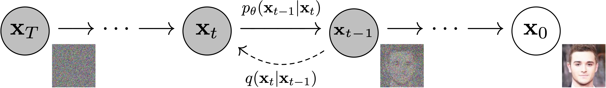

# 1. 简介
**扩散模型**(Diffusion Model)是深度学习生成模型的一种，生成模型还有VAE(Variational Autoencoder变分自编码器)、GAN(Generative Adversarial Network生成对抗网络)等。

扩散模型是一种基于概率的生成模型，它的基本思想是通过模拟粒子在空间中的扩散过程来生成数据。扩散模型的一个重要应用是生成图像数据，它可以生成具有**连续性**的图像数据，而不是离散的图像数据。

通过学习给定的训练样本，生成模型可以学会如何**生成**数据，比如生成图片或者声音。一个好的生成模型能生成一组**样式不同**的输出。这些输出会与训练数据相似，但不是一模一样的副本。

## 1.1 DDPM

    

                            
### 1.1.1 前向过程
**将数据噪声化**：
设训练数据分布为$x_0\sim q(x_0)$，$0$是初始状态，$x_t$的生成是$x_{t-1}$的数据加入高斯噪声，噪声的方差是由固定值$\beta_t \in (0,1)$确定的，噪声的均值由$x_{t-1}$与$\beta_t$决定。即：
$$q(x_t|x_{t-1}) = \mathcal{N}(x_t; \sqrt{1-\beta_t}x_{t-1}, \beta_t I)$$
其中，$I$是单位矩阵。
最终的噪声分布是：
$$q(x_t|x_0) = \prod_{i=1}^t q(x_i|x_{i-1})$$

### 1.1.2 反向过程
**去噪**：
$$q_(x_{t-1}|x_t,x_0) = \mathcal{N}(x_{t-1}; \tilde{\mu} (x_t,x_0),\tilde{\beta }I)$$
式中，$\tilde{\mu} (x_t,x_0) =\frac{\sqrt{\alpha_{t}}(1-\overline{\alpha}_{t-1})}{1-\overline{\alpha}_{t}}x_{t}+\frac{\sqrt{\overline{\alpha}_{t-1}}\beta_{t}}{1-\overline{\alpha}_{t}}x_{0} $，$\tilde{\beta} = \frac{1-\overline{\alpha}_{t-1}}{1-\overline{\alpha}_{t}}\beta_{t} $。因此方差是定值，而均值是由$x_t$与$x_0$决定的。

### 1.1.3 优化目标
$$L_{t-1}^{\mathrm{simple}}=\mathbb{E}_{x_{0},\epsilon\sim\mathcal{N}(0,I)}\bigg[\|\epsilon-\epsilon_{\theta}(\sqrt{\overline{\alpha}_{t}}x_{0}+\sqrt{1-\overline{\alpha}_{t}}\epsilon,t)\|^{2}\bigg]$$