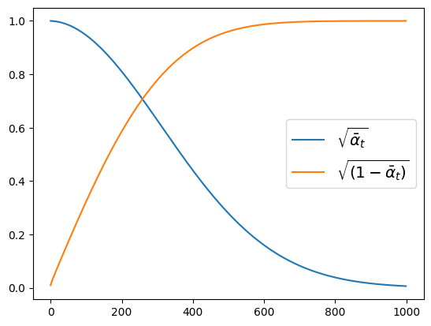
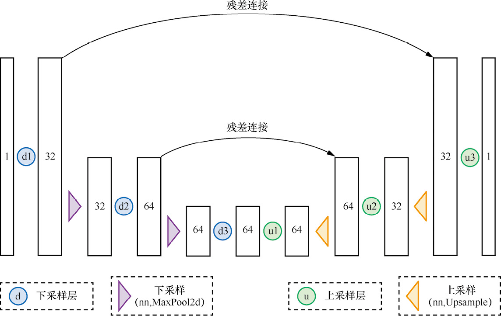

# 1. 简介
**扩散模型**(Diffusion Model)是深度学习生成模型的一种，生成模型还有VAE(Variational Autoencoder变分自编码器)、GAN(Generative Adversarial Network生成对抗网络)等。

扩散模型是一种基于概率的生成模型，它的基本思想是通过模拟粒子在空间中的扩散过程来生成数据。扩散模型的一个重要应用是生成图像数据，它可以生成具有**连续性**的图像数据，而不是离散的图像数据。

通过学习给定的训练样本，生成模型可以学会如何**生成**数据，比如生成图片或者声音。一个好的生成模型能生成一组**样式不同**的输出。这些输出会与训练数据相似，但不是一模一样的副本。

## 1.1 DDPM

<div align=center>
    
</div>
                            
### 1.1.1 前向过程
**将数据噪声化**：
设训练数据分布为$x_0\sim q(x_0)$，$0$是初始状态，$x_t$的生成是$x_{t-1}$的数据加入高斯噪声，噪声的方差是由固定值$\beta_t \in (0,1)$确定的，噪声的均值由$x_{t-1}$与$\beta_t$决定。即：
$$q(x_t|x_{t-1}) = \mathcal{N}(x_t; \sqrt{1-\beta_t}x_{t-1}, \beta_t I)$$
其中，$I$是单位矩阵。
最终的噪声分布是：
$$q(x_t|x_0) = \prod_{i=1}^t q(x_i|x_{i-1})$$

### 1.1.2 反向过程
**去噪**：
$$q_(x_{t-1}|x_t,x_0) = \mathcal{N}(x_{t-1}; \tilde{\mu} (x_t,x_0),\tilde{\beta }I)$$
式中，$\tilde{\mu} (x_t,x_0) =\frac{\sqrt{\alpha_{t}}(1-\overline{\alpha}_{t-1})}{1-\overline{\alpha}_{t}}x_{t}+\frac{\sqrt{\overline{\alpha}_{t-1}}\beta_{t}}{1-\overline{\alpha}_{t}}x_{0} $，$\tilde{\beta} = \frac{1-\overline{\alpha}_{t-1}}{1-\overline{\alpha}_{t}}\beta_{t} $。其中，$\overline{\alpha}_{t} = \prod_{i=1}^t\alpha_i$，$\alpha_i = 1-\beta_i$。因此方差是定值，而均值是由$x_t$与$x_0$决定的。
```python
# 查看alpha的变化
noise_scheduler = DDPMScheduler(num_train_timesteps=1000)
plt.plot(noise_scheduler.alphas_cumprod.cpu() ** 0.5, label=r"${\sqrt{\bar{\alpha}_t}}$")
plt.plot((1 - noise_scheduler.alphas_cumprod.cpu()) ** 0.5,label=r"$\sqrt{(1 - \bar{\alpha}_t)}$")
plt.legend(fontsize="x-large")
```
<div align=center>
    
    <p>噪声逐渐增加，输入逐渐减少。这个方法噪声的增速比线性变化x*(1-rate)+noise*rate的方案更快</p>
</div>

### 1.1.3 优化目标
$$L_{t-1}^{\mathrm{simple}}=\mathbb{E}_{x_{0},\epsilon\sim\mathcal{N}(0,I)}\bigg[\|\epsilon-\epsilon_{\theta}(\sqrt{\overline{\alpha}_{t}}x_{0}+\sqrt{1-\overline{\alpha}_{t}}\epsilon,t)\|^{2}\bigg]$$


# 2. 搭建扩散模型
## 2.1 模型结构
<p color="red">扩散模型的网络结构如下：</p>
<div align=center>
    
</div>

<details>
<summary>展开查看代码</summary>

提供了两种扩散模型的搭建方法，一种是手动实现的基础UNet的模型，另一种是使用`diffusers`库中的`UNet2DModel`模型。

1. **UNet2D模型**：
```python
from diffusers import UNet2DModel
model = UNet2DModel(
    sample_size=28,  # 目标图像的分辨率
    in_channels=1,  # 输入图像的通道数，RGB图像的通道数为3
    out_channels=1,  # 输出图像的通道数
    layers_per_block=2,  # 设置要在每一个UNet块中使用多少个ResNet层
    block_out_channels=(32, 64, 64),  # 与BasicUNet模型的配置基本相同
    down_block_types=(
        "DownBlock2D",  # 标准的ResNet下采样模块
        "AttnDownBlock2D",  # 带有空域维度self-att的ResNet下采样模块
        "AttnDownBlock2D",
    ),
    up_block_types=(
        "AttnUpBlock2D",
        "AttnUpBlock2D",  # 带有空域维度self-att的ResNet上采样模块
        "UpBlock2D",  # 标准的ResNet上采样模块
    ),
)
```

2. **基础UNet模型**：
```python
class BasicUNet(nn.Module):
    """一个十分简单的UNet网络部署"""

    def __init__(self, in_channels=1, out_channels=1):
        super().__init__()
        self.down_layers = torch.nn.ModuleList([
            nn.Conv2d(in_channels, 32, kernel_size=5, padding=2),
            nn.Conv2d(32, 64, kernel_size=5, padding=2),
            nn.Conv2d(64, 64, kernel_size=5, padding=2),
        ])
        self.up_layers = torch.nn.ModuleList([
            nn.Conv2d(64, 64, kernel_size=5, padding=2),
            nn.Conv2d(64, 32, kernel_size=5, padding=2),
            nn.Conv2d(32, out_channels, kernel_size=5, padding=2),
        ])
        self.act = nn.SiLU()  # 激活函数
        self.downscale = nn.MaxPool2d(2)  # 下采样
        self.upscale = nn.Upsample(scale_factor=2)  # 上采样

    def forward(self, x):
        h = []  # 用于存储下采样过程中的数据
        for i, l in enumerate(self.down_layers):
            x = self.act(l(x))  # 通过运算层与激活函数
            if i < 2:  # 选择除了第3层（最后一层）以外的层
                h.append(x)  # 排列供残差连接使用的数据
                x = self.downscale(x)  # 进行下采样以适配下一层的输入
        for i, l in enumerate(self.up_layers):
            if i > 0:  # 选择除了第1个上采样层以外的层
                x = self.upscale(x)  # Upscale上采样
                x += h.pop()  # 得到之前排列好的供残差连接使用的数据
            x = self.act(l(x))  # 通过运算层与激活函数
        return x
```
</details>

