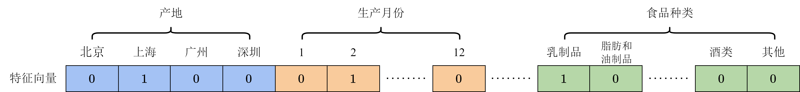
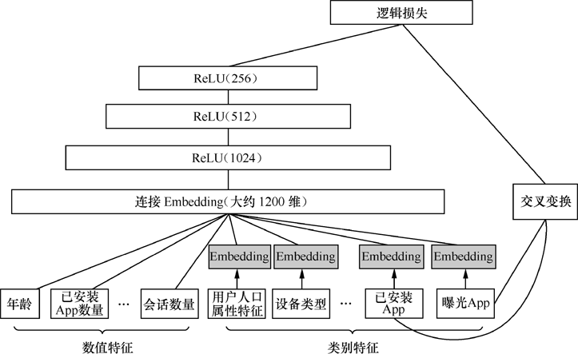
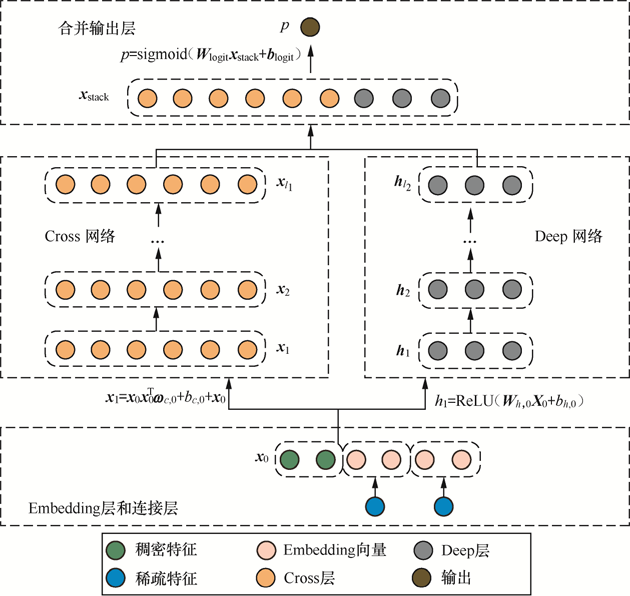
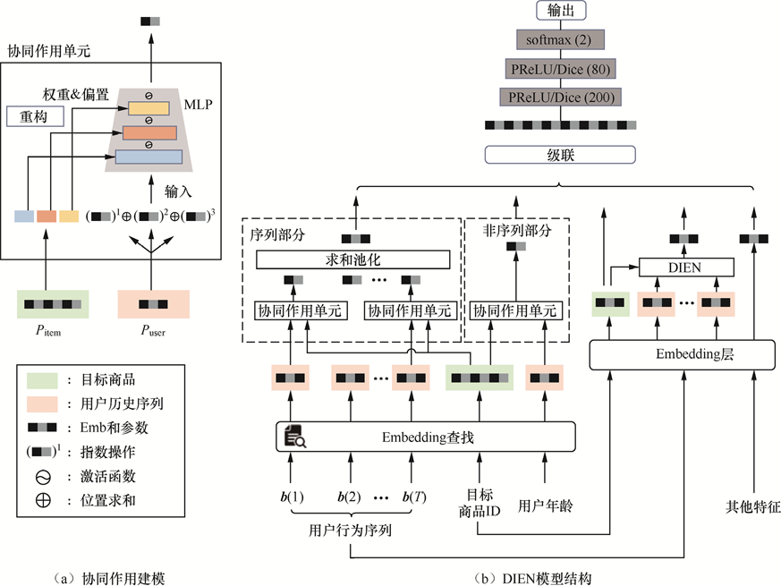

# $\color{ee0000} 1.\ 简介 $
## $\color{66ccff} 1.1\ 技术架构 $
$$ f(用户信息，资源信息，上下文信息，用户行为序列) = 推荐结果 $$

## $\color{66ccff} 1.2\ 搜广推 $
- 搜索：围绕着搜索词的信息高效获取问题
- 广告：直接增加公司收入
- 推荐：提高用户留存和活跃度
[具体区别-知乎-王喆 ↗​](https://zhuanlan.zhihu.com/p/430431149)

## $\color{66ccff} 1.3 \ 架构 $
### $\color{39c5bb} 1.3.1\ 系统架构 $
1. **离线层**：不用实时数据，不提供实时响应；(大量)
可以每天更新一次。
2. **近线层**：使用实时数据，不保证实时响应；(几分钟)
可以在用户访问时更新。
3. **在线层**：使用实时数据，保证实时在线服务。(几十毫秒)
在用户访问时实时响应，如开屏时的推荐。

<div style="text-align: center;">
<div style="display: inline-block; margin-right: 40px;">
    
</div>
<div style="display: inline-block">
    
</div>
</div>


### $\color{39c5bb} 1.3.2 \ 算法架构 $

<div style="text-align: center;">
    
</div>

- **召回**：不需要十分准确，但不可遗漏。快速稳定，兴趣多元、内容多样。
  - 非个性化召回、个性化召回
    - 个性化召回：content-based、behavior-based、feature-based
- **粗排**：兼顾精准性和低延迟。
- **精排**：精准性优先，目标ctr、cvr(点击率、转化率)，指标AUC。
  - 样本、特征、模型。
- **重排**：多样性优先，目标Point Wise、Pair Wise、List Wise(点对、对对、列表)，指标NDCG。
  - 基于运营策略、多样性、context上下文。

<details>

<summary><span style="color:#009688; font-weight:bold">点击展开具体算法</span></summary>

<p style="color:#EC407A; font-weight:bold">1. 画像层</p>

- 文本理解
  - RNN、TextCNN、FastText、Bert
- 关键词标签
  - TF-IDF、Bert、LSTM-CR
- 内容理解
  - TSN、RetinaFace、PSENet

<p style="color:#EC407A; font-weight:bold">2. 召回/粗排</p>

- 经典模型召回
  对user和item分别打上Embedding，然后user与item在线进行KNN计算实时查询最近领结果作为召回结果
  - FM、双塔DSSM、Multi-View DNN
- 序列模型召回
  有监督Next Item Prediction，无监督Sum Pooling
  - CBOW、Skip-Gram、GRU、Bert
- 用户序列拆分
  把用户行为序列打到多个embedding上(类似聚类)
  - Multi-Interest Network with Dynamic Routing for Recommendation at Tmall
- 知识图谱
  可解释性好但是效果差
  - KGAT、RippleNet
- 图模型
  编码的是静态知识，而不是用户比较直接的行为数据，所以效果一般
  - GraphSAGE、PinSage

<p style="color:#EC407A; font-weight:bold">3. 精排</p>

- 特征交叉模型
  - DCN、DeepFM、xDeepFM
- 序列模型
  关注用户此刻的兴趣向量（user interest vector）
  - DIN、DSIN、DIEN、SIM
- 多模态信息融合
  - Image Matters: Visually modeling user behaviors using Advanced Model Server、UMPR
- 多任务模型
  点击率模型(标题党)、时长模型(长视频)、完播率模型(短视频)
  - ESSM、MMoE、DUP
- 强化学习
  - DQN、Reinforcement Learning for Slate-based Recommender Systems: A Tractable Decomposition and Practical Methodology
- 跨域推荐
  比如QQ音乐的信息如何使用在腾讯视频上
  - DTCDR、MV-DNN、EMCDR
</details>

## $\color{66ccff} 1.4\ 参考资料 $

[电子书-FunRec ↗](https://datawhalechina.github.io/fun-rec/#/)
[纸质书-推荐系统技术原理与实践 ↗](https://www.epubit.com/bookDetails?id=UB831721e9d193a)


# $\color{ee0000} 2.\ 召回 $

<div style="text-align: center;">
<div style="display: inline-block; margin-right: 50px;">
    
    <p>多路召回</p>
</div>
<div style="display: inline-block;">
    
    <p>召回技术的演进图谱</p>
</div>
</div>

## $\color{66ccff} 2.1\ 基于协同过滤的召回 $

### $\color{39c5bb} 2.1.1\ 协同过滤(CF) $
<span style="color:#EC407A; font-weight:bold">协同过滤</span>(Collaborative Filtering)：基于用户行为数据，找到相似用户或物品， 重点是计算用户/物品之间的相似度。
- **基于用户的协同过滤**(UserCF)：找到相似用户，根据相似用户的行为推荐物品。
- **基于物品的协同过滤**(ItemCF)：找到相似物品，根据该用户的历史行为推荐物品。

### $\color{39c5bb} 2.1.2\ 相似度计算 $
记用户为$u,v$，物品为$i,j$，用户集合为$U$。

<p style="color:#EC407A; font-weight:bold">1. Jaccard相似度</p>

- 反映了两个交互物品交集的数量占这两个用户交互物品并集的数量的比例，适用于隐式反馈的二值数据。
  - **隐式反馈数据**是指从用户行为中隐含地推断出的偏好数据，而不是用户明确表达的偏好或评分。这种类型的数据通常来源于用户在系统中的交互行为，例如点击、浏览、购买等。这些行为可以隐含地表示用户对这些物品有某种程度的兴趣或偏好，但具体的兴趣程度并不明确。隐式反馈数据只记录用户是否与某个物品有过交互(0,1)，而不关心交互的具体程度。
  $$sim_{uv}=\frac{|N(u)\cap N(v)|}{|N(u)|\cup|N(v)|}$$
- 其中，$N(u)$,$N(v)$ 分别表示用户$u$和用户$v$交互物品的集合。
- 由于杰卡德相似系数一般无法反映具体用户的评分喜好信息，所以常用来评估用户**是否**会对某物品进行打分， 而不是预估用户会对某物品打多少分。
- `from sklearn.metrics.pairwise import jaccard_similarity_score`

<p style="color:#EC407A; font-weight:bold">2. 余弦相似度</p>

- 衡量了两个向量的夹角，适用于度量向量之间的**相似度**。
- 用户相似度
  $$sim_{uv}=\frac{|N(u)\cap N(v)|}{\sqrt{|N(u)|\cdot|N(v)|}}$$
- 物品相似度
  $$sim_{ij}=\frac{|I(i)\cap I(j)|}{\sqrt{|I(i)|\cdot|I(j)|}}$$
- 其中，$N(u)$,$N(v)$ 分别表示用户$u$和用户$v$交互物品的集合，$I(i)$,$I(j)$ 分别表示物品$i$和物品$j$被用户交互的集合。
- 设矩阵$A$为用户-物品交互矩阵，$A_{ij}=0,1$表示用户$i$对物品$j$是否交互，$A^{(i)}$表示用户$i$的评分向量，$A_j$表示物品$j$的评分向量，用户之间的相似度计算公式为：$sim_{uv}=\frac{A^{(u)}\cdot A^{(v)}}{\|A^{(u)}\|\cdot\|A^{(v)}\|}=\frac{u\cdot v}{|u|\cdot|v|}=cos(u,v)$。为了节省内存，$A$常使用字典进行存储。
- `from sklearn.metrics.pairwise import cosine_similarity`

<p style="color:#EC407A; font-weight:bold">3. Pearson相似度</p>

- 衡量了两个向量之间的线性相关性，度量的是两个变量的**变化趋势**是否一致，两个随机变量是不是同增同减。因为先对向量进行中心化处理，所以可以消除用户评分的绝对值差异，适用于评分数据，不适合布尔值向量。
- 用户之间的余弦相似度计算：$sim_{uv}= \frac{r_u\cdot r_v}{|r_u|\cdot |r_v|} = \frac{\sum_ir_{ui}*r_{vi}}{\sqrt{\sum_ir_{ui}^2}\sqrt{\sum_ir_{vi}^2}}$
- 皮尔逊相关系数与余弦相似度的计算公式非常类似：
$$sim(u,v)=\frac{\sum_{i}(r_{ui}-\bar{r}_u)(r_{vi}-\bar{r}_v)}{\sqrt{\sum_{i}(r_{ui}-\bar{r}_u)^2}\sqrt{\sum_{i}(r_{vi}-\bar{r}_v)^2}}\in[-1,1]$$
- 其中，$r_{ui},r_{vi}$分别表示用户$u$和用户$v$对物品$i$是否有交互(或具体评分值); $\bar{r}_u,\bar{r}_v$分别表示用户$u$和用户$v$交互的所有物品交互数量(或评分的平均值)；
- `from scipy.stats import pearsonr`, `np.corrcoef()`

<p style="color:#EC407A; font-weight:bold">4. Tanimoto</p>

$$sim_{uv}= \frac{r_u\cdot r_v}{\left \| r_u \right \| ^2+\left \| r_v \right \| ^2-{r_u\cdot r_v}}$$

### $\color{39c5bb} 2.1.3\ 基于用户的协同过滤(UserCF) $

<p style="color:#EC407A; font-weight:bold">1. 计算方法</p>

根据已有的用户向量计算用户$y$与其他用户$X$的相似度，得到与用户$y$最相似的$n$个用户。根据这 $n$个用户对物品$k$的评分情况和与$y$的相似程度猜测出$y$对$k$的评分。如果评分比较高的话， 就把$k$推荐给$y$， 否则不推荐。


| 用户 | 物品$I_1$ | 物品$I_2$ | 物品$I_3$ | ··· | 物品$k$ |
| ---- | ---- | ---- | ---- | ---- | ---- |
| 用户$y$ | 1 | 0 | 1 | ... | ? |
| 用户$X_1$ | 0 | 1 | 1 | ... | 0 |
| 用户$X_2$ | 1 | 0 | 0 | ... | 1 |


- **计算相似度**：计算用户$y$与其他用户$X$的相似度。可以采用余弦相似度、皮尔逊相似度等，找到与用户$y$最相似的$n$个用户。
- **推荐物品**：根据这$n$个用户对物品$k$的评分情况和与$y$的相似程度猜测出$y$对$k$的评分。公式如下：
$$r_{y,k}=\frac{\sum_{X_i\in N(y)}sim(y,X_i)\cdot r_{X_i,k}}{\sum_{X_i\in N(y)}|sim(y,X_i)|}$$
  - 式中，$r_{y,k}$表示用户$y$对物品$k$的评分，$N(y)$表示与用户$y$最相似的$n$个用户，$sim(y,X_i)$表示用户$y$与用户$X_i$的相似度，$r_{X_i,k}$表示用户$X_i$对物品$k$的评分。
  - 考虑到用户的评分主观性强，存在偏置(评分习惯)，有的用户喜欢打高分， 有的用户喜欢打低分的情况。因此公式变为：
$$r_{y,k}=\bar{r}_y+\frac{\sum_{X_i\in N(y)}sim(y,X_i)\cdot (r_{X_i,k}-\bar{r}_{X_i})}{\sum_{X_i\in N(y)}|sim(y,X_i)|}$$
  - 式中，$\bar{r}_y$表示用户$y$的平均评分，$\bar{r}_{X_i}$表示用户$X_i$的平均评分。因此消除了用户的评分偏置。
- **推荐结果**：实际计算时不止一个物品$k$，而是所有用户未交互过的物品，所以就根据评分排序，取TopN作为推荐结果。

<p style="color:#EC407A; font-weight:bold">2. 代码实现</p>
<details>
<summary><span style="color:#009688; font-weight:bold">点击展开查看UserCF完整代码</span></summary>

```python
import numpy as np
import pandas as pd

# 用户-物品评分数据，因为是稀疏矩阵，所以使用字典存储，后面也使用字典来计算用户相似度
user_data = {'y': {'A': 5, 'B': 3, 'C': 4, 'D': 4},
             'X1': {'A': 3, 'B': 1, 'C': 2, 'D': 3, 'k': 3},
             'X2': {'A': 4, 'B': 3, 'C': 4, 'D': 3, 'k': 5},
             'X3': {'A': 3, 'B': 3, 'C': 1, 'D': 5, 'k': 4},
             'X4': {'A': 1, 'B': 5, 'C': 5, 'D': 2, 'k': 1}
             }
user_names = list(user_data.keys())
# 用户相似度矩阵，行列均为用户名称
similarity_matrix = pd.DataFrame(
    np.identity(len(user_data)),
    index=user_names,
    columns=user_names
)

# 遍历每条用户-物品评分数据
for u1, info1 in user_data.items():
    for u2, info2 in user_data.items():
        if u1 == u2:
            continue
        vec1, vec2 = [], []  # 用户u1, u2对应的评分向量
        for item1, rating1 in info1.items():
            rating2 = info2.get(item1, -1)
            if rating2 == -1:
                continue
            vec1.append(rating1)
            vec2.append(rating2)
        similarity_matrix[u1][u2] = np.corrcoef(vec1, vec2)[0][1]  # 计算不同用户之间的皮尔逊相关系数
print(similarity_matrix)

target_user = 'y'
topN = 2
sim_users = similarity_matrix[target_user].sort_values(ascending=False)[1:topN+1].index.tolist()  # 去除自身
print(f'与用户{target_user}最相似的{topN}个用户为：{sim_users}')

weighted_scores = 0.
corr_values_sum = 0.
target_item = 'k'
for user in sim_users:
    sim_y_Xi = similarity_matrix[target_user][user]
    Xi_mean_rating = np.mean(list(user_data[user].values()))  # 用户Xi的平均评分
    weighted_scores += sim_y_Xi * (user_data[user][target_item] - Xi_mean_rating)  # 分子
    corr_values_sum += sim_y_Xi  # 分母
y_mean_rating = np.mean(list(user_data[target_user].values()))
target_item_pred = y_mean_rating + weighted_scores / corr_values_sum  # 预测用户y对物品k的评分
print(f'用户{target_user}对物品{target_item}的预测评分为：{target_item_pred}')
```
输出：
```
           y        X1        X2        X3        X4
y   1.000000  0.852803  0.707107  0.000000 -0.792118
X1  0.852803  1.000000  0.467707  0.489956 -0.900149
X2  0.707107  0.467707  1.000000 -0.161165 -0.466569
X3  0.000000  0.489956 -0.161165  1.000000 -0.641503
X4 -0.792118 -0.900149 -0.466569 -0.641503  1.000000
与用户y最相似的2个用户为：['X1', 'X2']
用户y对物品k的预测评分为：4.871979899370592
```
</details>


<p style="color:#EC407A; font-weight:bold">3. 优缺点</p>

- **优点**：
  - 简单、易于实现，不需要物品的内容信息，只需要用户的行为数据。
- **缺点**：
  - 商品量大，不同用户之间买的物品重叠性较低，导致相似度计算困难。尤其不适合冷启动、低频购买次数的问题。
  - 用户量大，用户相似度矩阵的存储开销非常大。


<p style="color:#EC407A; font-weight:bold">4. 算法评估</p>

UserCF和ItemCF结果评估是一致的。

- **召回率**：召回率越高，说明推荐系统越能将用户喜欢的物品推荐给用户。
  $$Recall=\frac{推荐成功的物品数}{用户喜欢的物品数}=\frac{推荐的topN\cap 用户在测试集上喜欢的物品集合}{用户在测试集上喜欢的物品集合}$$
- **准确率**：准确率越高，说明推荐系统推荐的物品越能让用户喜欢。
  $$Precision=\frac{推荐成功的物品数}{推荐出来的物品数}=\frac{推荐的topN\cap 用户在测试集上喜欢的物品集合}{推荐的topN}$$
- **覆盖率**：覆盖率反映了推荐算法发掘长尾的能力。覆盖率越高，说明推荐系统能够将长尾物品推荐给用户。
  $$Coverage=\frac{\bigcup_{u\in U}给用户u推荐的topN}{总物品数}=\frac{set(推荐系统给所有用户推荐的商品)}{总物品数}$$
- **多样性**：多样性是指推荐系统推荐出来的物品之间的差异性。多样性越高，说明推荐系统推荐的物品之间的差异性越大。
  $$Diversity=\frac{1}{|U|}\sum_{u\in U}diversity(u)$$
  - 其中，$diversity(u)$表示用户$u$推荐列表中物品之间的差异性：$diversity(u)=\frac2{|I_u|(|I_u|-1)}\sum_{i,j\in I_u,i\neq j}\mathrm{sim}(i,j)$，其中，$I_u$ 是用户 $u$ 的推荐列表，$|I_u|$ 是推荐列表中物品的数量，$\text{sim}(i, j)$ 是物品 $i$ 和物品 $j$ 之间的相似度。
- **新颖度**：用推荐列表中物品的平均流行度度量推荐结果的新颖度。如果推荐出的物品都很热门，说明推荐的新颖度较低。由于物品的流行度分布呈长尾分布，所以为了流行度的平均值更加稳定，在计算平均流行度时对每个物品的流行度取对数。
$$Novelty=\frac{1}{|I_u|}\sum_{i\in I_u}\log(p_i)$$
  - 其中，$p_i$为第$i$个物品的流行度(比如点击次数、购买次数等)。Novelty还有其他的度量方法，如$Novelty(u)=\frac{\sum_{i\in I_u}(1-Knows(u,i))}{N}$，其中Knows(u,i)是二值函数，当用户$u$了解物品$i$时取1。


### $\color{39c5bb} 2.1.4\ 基于物品的协同过滤(ItemCF) $

<p style="color:#EC407A; font-weight:bold">1. 计算方法</p>

ItemCF算法并不利用物品的内容属性计算物品之间的相似度，而是通过分析用户的行为记录来计算物品之间的相似度。该算法认为，物品$i$和物品$j$具有很大的相似度是因为喜欢$i$的用户也可能喜欢$j$。

| 用户 | 物品$I_1$ | 物品$I_2$ | 物品$I_3$ | ··· | 物品$k$ |
| ---- | ---- | ---- | ---- | ---- | ---- |
| 用户$y$ | 1 | 0 | 1 | ... | ? |
| 用户$X_1$ | 0 | 1 | 1 | ... | 0 |
| 用户$X_2$ | 1 | 0 | 0 | ... | 1 |

- **计算相似度**：计算物品$k$与其他物品$I$之间的相似度，找出n个物品。
- **推荐物品**：同样考虑物品之间的偏置：
$$P_{y,k}=\bar{r}_k+\frac{\sum_{I_i\in N(y)}sim(k,I_i)\cdot (r_{y,I_i}-\bar{r}_{I_i})}{\sum_{I_i\in N(y)}|sim(k,I_i)|}$$
- **推荐结果**：根据评分排序，取TopN作为推荐结果。


<p style="color:#EC407A; font-weight:bold">2. 代码实现</p>
<details>
<summary><span style="color:#009688; font-weight:bold">点击展开查看ItemCF完整代码</span></summary>

```python
import numpy as np
import pandas as pd

# 物品-用户评分数据
item_data = {'A': {'y': 5.0, 'X1': 3.0, 'X2': 4.0, 'X3': 3.0, 'X4': 1.0},
             'B': {'y': 3.0, 'X1': 1.0, 'X2': 3.0, 'X3': 3.0, 'X4': 5.0},
             'C': {'y': 4.0, 'X1': 2.0, 'X2': 4.0, 'X3': 1.0, 'X4': 5.0},
             'D': {'y': 4.0, 'X1': 3.0, 'X2': 3.0, 'X3': 5.0, 'X4': 2.0},
             'E': {'X1': 3.0, 'X2': 5.0, 'X3': 4.0, 'X4': 1.0}
             }
item_names = list(item_data.keys())
# 物品相似度矩阵，行列均为物品名称
similarity_matrix = pd.DataFrame(
    np.identity(len(item_data)),
    index=item_names,
    columns=item_names
)

# 遍历每条物品-用户评分数据
for i1, info1 in item_data.items():
    for i2, info2 in item_data.items():
        if i1 == i2:
            continue
        vec1, vec2 = [], []  # 物品i1, i2对应的评分向量
        for user, rating1 in info1.items():
            rating2 = info2.get(user, -1)
            if rating2 == -1:
                continue
            vec1.append(rating1)
            vec2.append(rating2)
        similarity_matrix[i1][i2] = np.corrcoef(vec1, vec2)[0][1]  # 计算不同物品之间的皮尔逊相关系数
print(similarity_matrix)

target_user = 'y'
target_item = 'E'
topN = 2
sim_items = []
sim_items_list = similarity_matrix[target_item].sort_values(ascending=False).index.tolist()
for item in sim_items_list:
    # 如果target_user对物品item评分过，也就是排除了target_item本身
    if target_user in item_data[item]:
        sim_items.append(item)
    if len(sim_items) == topN:
        break
print(f'与物品{target_item}最相似的{topN}个物品为：{sim_items}')

k_mean_rating = np.mean(list(item_data[target_item].values()))  # 物品k的平均评分
weighted_scores = 0.
corr_values_sum = 0.
for item in sim_items:
    sim_k_Ii = similarity_matrix[target_item][item]  # 物品k与物品I_i的相似度
    Ii_mean_rating = np.mean(list(item_data[item].values()))  # 物品I_i的平均评分
    weighted_scores += sim_k_Ii * (item_data[item][target_user] - Ii_mean_rating)  # 分子
    corr_values_sum += sim_k_Ii  # 分母
target_item_pred = k_mean_rating + weighted_scores / corr_values_sum
print(f'用户{target_user}对物品{target_item}的预测评分为：{target_item_pred}')
```
输出：
```
          A         B         C         D         E
A  1.000000 -0.476731 -0.123091  0.532181  0.969458
B -0.476731  1.000000  0.645497 -0.310087 -0.478091
C -0.123091  0.645497  1.000000 -0.720577 -0.427618
D  0.532181 -0.310087 -0.720577  1.000000  0.581675
E  0.969458 -0.478091 -0.427618  0.581675  1.000000
与物品E最相似的2个物品为：['A', 'D']
用户y对物品E的预测评分为：4.6
```
</details>


<p style="color:#EC407A; font-weight:bold">3. 优缺点</p>

- **优点**：
  - 适用于物品数量少，用户数量多的场景。
- **缺点**：
  - 物品数量大，计算物品之间的相似度开销大。
  - 物品的流行度分布不均匀，导致推荐出的物品都是热门物品，缺乏多样性。


### $\color{39c5bb} 2.1.5\ Swing算法 $

<p style="color:#EC407A; font-weight:bold">1. 计算方法</p>

若用户$u$和用户$v$之间除了购买过$i$外，还购买过商品$j$，则认为两件商品是具有某种程度上的相似的(准确说是“**相关度**”或者“**互补性**”)。
为了衡量$i,j$的相似性，比较同时购买了物品$i,j$的用户$u,v$，如果这两个用户共同购买的物品越少，即这两个用户原始兴趣不相似，但仍同时购买了两个相同的物品$i,j$，则物品$i,j$的相似性越高。
$$sim(i,j)=\sum_{u\in U_i\cap U_j}\sum_{v\in U_i\cap U_j}\frac{1}{\sqrt{|I_u|}\sqrt{|I_v|}}\cdot \frac1{\alpha+|I_u\cap I_v|}, u \ne v$$
其中$U_i$ 是点击过商品$i$的用户集合，$I_u$ 是用户u点击过的商品集合，$\alpha$是平滑系数,$\frac{1}{ \sqrt {|I_u|}}$, $\frac{1}{ \sqrt {|I_v|}}$是用户权重参数，来降低活跃用户的影响。


<p style="color:#EC407A; font-weight:bold">2. 代码实现</p>
<details>
<summary><span style="color:#009688; font-weight:bold">点击展开查看Swing完整代码</span></summary>
我的实现：

```python
import numpy as np
import pandas as pd

# 物品-用户点击数据
item_data = {
    'A': {'y': 1, 'X1': 1, 'X2': 1, 'X3': 1},
    'B': {'y': 1, 'X1': 1, 'X4': 1},
    'C': {'y': 0, 'X2': 1, 'X3': 1, 'X4': 1},
    'D': {'y': 1, 'X1': 1, 'X3': 1, 'X4': 1},
    'E': {'X2': 1, 'X3': 1, 'X4': 1}
}
item_names = list(item_data.keys())
# 物品相似度矩阵，行列均为物品名称
similarity_matrix = pd.DataFrame(
    np.zeros((len(item_data), len(item_data))),
    index=item_names,
    columns=item_names
)

# 计算物品相似度矩阵
alpha = 0.5
for i1 in item_data.keys():
    for i2 in item_data.keys():
        if i1 == i2:
            continue
        common_users = set(item_data[i1].keys()).intersection(set(item_data[i2].keys()))  # 共同点击过i1, i2的用户
        if not common_users:
            similarity_matrix[i1][i2] = 0
            continue
        sum_weights = 0
        for u in common_users:
            for v in common_users:
                if u == v:
                    continue  # 跳过同一个用户
                I_u = set(item for item, users in item_data.items() if u in users)
                I_v = set(item for item, users in item_data.items() if v in users)
                I_u_v = I_u.intersection(I_v)
                weight = 1 / (np.sqrt(len(I_u)) * np.sqrt(len(I_v)) * (alpha + len(I_u_v)))
                sum_weights += weight
        similarity_matrix[i1][i2] = sum_weights

print("物品相似度矩阵：")
print(similarity_matrix)

# 计算推荐评分
target_user = 'y'
target_item = 'E'
topN = 2

# 获取与目标物品最相似的topN物品
sim_items = []
sim_items_list = similarity_matrix[target_item].sort_values(ascending=False).index.tolist()
for item in sim_items_list:
    # 排除target_item本身
    if target_user in item_data[item]:
        sim_items.append(item)
    if len(sim_items) == topN:
        break
print(f'与物品{target_item}最相似的{topN}个物品为：{sim_items}')

k_mean_rating = np.mean([item_data[target_item][user] for user in item_data[target_item]])  # 物品k的平均评分
weighted_scores = 0.
corr_values_sum = 0.
for item in sim_items:
    sim_k_Ii = similarity_matrix[target_item][item]  # 物品k与物品I_i的相似度
    Ii_mean_rating = np.mean([item_data[item][user] for user in item_data[item]])  # 物品I_i的平均评分
    weighted_scores += sim_k_Ii * (item_data[item][target_user] - Ii_mean_rating)  # 分子
    corr_values_sum += sim_k_Ii  # 分母
target_item_pred = k_mean_rating + weighted_scores / corr_values_sum if corr_values_sum != 0 else k_mean_rating
print(f'用户{target_user}对物品{target_item}的购买预测为：{target_item_pred}')
```
输出：
```
物品相似度矩阵：
          A         B         C         D         E
A  0.000000  0.164957  0.538754  0.538754  0.164957
B  0.164957  0.000000  0.142857  0.538754  0.000000
C  0.538754  0.142857  0.000000  0.428571  0.538754
D  0.538754  0.538754  0.428571  0.000000  0.142857
E  0.164957  0.000000  0.538754  0.142857  0.000000
与物品E最相似的2个物品为：['C', 'A']
用户y对物品E的购买预测为：0.42580767318794366
```

FunRec实现（未给出相似度之后的计算）：

```python
from itertools import combinations
import pandas as pd


def load_data(train_path):
    train_data = pd.read_csv(train_path, sep="\t", engine="python", names=["userid", "itemid", "rate"])  # 提取用户交互记录数据
    train_data = train_data.drop(0)  # 第一行是列名
    train_data = train_data.astype(int)  # 转换数据类型
    print(train_data.head(3))
    return train_data


def get_uitems_iusers(train):
    u_items = dict()
    i_users = dict()
    for index, row in train.iterrows():  # 处理用户交互记录
        u_items.setdefault(row["userid"], set())  # 初始化该用户row["userid"]
        i_users.setdefault(row["itemid"], set())  # 初始化该物品
        u_items[row["userid"]].add(row["itemid"])  # 得到该用户交互过的所有item
        i_users[row["itemid"]].add(row["userid"])  # 得到该物品交互过的所有user
    print("使用的用户个数为：{}".format(len(u_items)))
    print("使用的item个数为：{}".format(len(i_users)))
    return u_items, i_users


def swing_model(u_items, i_users, alpha):
    # print([i for i in i_users.values()][:5])
    # print([i for i in u_items.values()][:5])
    item_pairs = list(combinations(i_users.keys(), 2))  # C(n,2) = (n!)/(2!(n-2)!) = (n(n-1))/2 = 50*49/2 = 1225
    print("item pairs length：{}".format(len(item_pairs)))
    item_sim_dict = dict()
    for (i, j) in item_pairs:
        user_pairs = list(combinations(i_users[i] & i_users[j], 2))  # 共同交互过i, j的用户对
        result = 0
        for (u, v) in user_pairs:
            result += 1 / (alpha + list(u_items[u] & u_items[v]).__len__())  # \frac1{\alpha+|I_u\cap I_v|},
        if result != 0:
            item_sim_dict.setdefault(i, dict())  # 初始化物品i
            item_sim_dict[i][j] = format(result, '.6f')
    return item_sim_dict  # 返回item相似度字典, key为item_id, value为与该item相似的item_id及相似度


def save_item_sims(item_sim_dict, top_k, path):
    new_item_sim_dict = dict()
    try:
        writer = open(path, 'w', encoding='utf-8')
        for item, sim_items in item_sim_dict.items():
            new_item_sim_dict.setdefault(item, dict())
            new_item_sim_dict[item] = dict(
                sorted(sim_items.items(), key=lambda k: k[1], reverse=True)[:top_k])  # 排序取出 top_k个相似的item
            writer.write('item_id:%d\t%s\n' % (item, new_item_sim_dict[item]))
        print("SUCCESS: top_{} item saved".format(top_k))
    except Exception as e:
        print(e.args)


if __name__ == "__main__":
    train_data_path = "input/ratings_final.txt"
    item_sim_save_path = "output/item_sim_dict.txt"
    alpha = 0.5
    top_k = 10  # 与item相似的前 k 个item
    train = load_data(train_data_path)
    u_items, i_users = get_uitems_iusers(train)
    item_sim_dict = swing_model(u_items, i_users, alpha)
    save_item_sims(item_sim_dict, top_k, item_sim_save_path)
```
输出：
```
item_id:10	{33: '9.369308', 31: '7.928368', 47: '5.119530', 29: '4.917776', 26: '4.831854', 5: '4.683046', 44: '4.008186', 34: '3.672097', 39: '3.564048', 35: '3.440806'}
item_id:40	{39: '6.158427', 23: '4.632332', 33: '4.158849', 31: '3.806523', 29: '3.648068', 37: '3.619602', 44: '3.429525', 47: '3.339190', 13: '2.779905', 38: '2.730002'}
item_id:38	{24: '6.053660', 34: '5.870747', 37: '3.573692', 16: '3.442025', 22: '3.350414', 44: '3.142554', 33: '3.035718', 19: '2.920647', 1: '2.838041', 43: '2.728516'}
item_id:41	{24: '6.010128', 35: '5.212512', 13: '4.167028', 33: '4.107981', 42: '3.528947', 31: '3.508580', 46: '3.186477', 5: '3.029635', 12: '2.768056', 16: '2.493831'}
item_id:1	{31: '7.446685', 33: '5.682953', 26: '5.509304', 25: '4.267118', 19: '3.768161', 42: '3.599587', 34: '3.567465', 47: '3.367748', 13: '3.305826', 29: '3.260593'}
item_id:19	{47: '7.296887', 29: '5.516440', 31: '4.385619', 34: '4.169741', 5: '3.913757', 13: '3.611356', 44: '3.491264', 28: '3.002532', 33: '2.969671', 35: '2.744241'}
item_id:50	{33: '8.690459', 27: '5.078108', 29: '4.640582', 47: '4.618278', 46: '4.478693', 35: '3.572142', 26: '3.049875', 13: '3.017851', 16: '2.997565', 44: '2.921754'}
item_id:49	{44: '3.339786', 29: '2.908996', 22: '2.822287', 26: '2.804519', 8: '2.512262', 14: '2.290975', 35: '2.152327', 46: '1.932279', 47: '1.859695', 5: '1.851126'}
item_id:18	{33: '9.920042', 39: '4.963052', 13: '3.424331', 44: '3.095113', 26: '3.067319', 28: '3.026770', 42: '2.541916', 11: '2.273064', 27: '2.131459', 12: '1.968478'}
item_id:17	{35: '4.230042', 44: '3.490393', 33: '2.887144', 16: '2.579394', 34: '2.490362', 29: '1.976302', 39: '1.716705', 27: '1.653835', 46: '1.594548', 15: '1.590245'}
item_id:29	{15: '7.765038', 31: '7.699624', 13: '7.647818', 23: '7.624496', 47: '6.841698', 26: '6.210281', 8: '6.187537', 39: '5.725741', 24: '5.666022', 6: '5.411497'}
item_id:36	{24: '5.823616', 37: '4.367127', 47: '4.106552', 12: '2.964950', 42: '2.911300', 33: '2.708663', 25: '2.404134', 16: '2.350667', 31: '2.273338', 13: '2.137498'}
item_id:4	{31: '5.609852', 44: '4.414842', 33: '4.036755', 24: '4.017716', 39: '2.561788', 47: '2.521624', 13: '2.157043', 26: '1.741391', 35: '1.683751', 15: '1.653737'}
item_id:45	{26: '5.482775', 35: '4.646579', 34: '4.081938', 11: '3.202662', 13: '3.001079', 30: '2.863475', 39: '2.676639', 24: '2.616236', 2: '2.573928', 5: '2.481827'}
item_id:27	{31: '5.421499', 26: '3.988214', 33: '3.633894', 21: '3.493322', 5: '3.339473', 16: '3.085929', 24: '2.921068', 35: '2.631777', 47: '2.299567', 28: '2.220544'}
item_id:44	{33: '7.679608', 35: '4.741540', 31: '4.397215', 37: '4.138681', 34: '4.053771', 39: '4.050300', 46: '3.907530', 48: '3.647042', 26: '3.598477', 15: '3.300210'}
item_id:26	{34: '6.816138', 31: '6.682804', 39: '5.334259', 33: '4.829264', 25: '4.774081', 5: '4.623790', 35: '4.499845', 3: '4.092521', 8: '3.597685', 13: '3.552098'}
item_id:37	{24: '6.843369', 47: '6.510498', 12: '6.430014', 43: '4.463759', 16: '4.037183', 31: '3.804751', 11: '3.745736', 33: '3.483176', 13: '3.426464', 25: '3.370829'}
item_id:21	{24: '5.424326', 33: '4.635283', 16: '3.070736', 31: '3.033045', 5: '3.022268', 34: '2.890594', 12: '2.462445', 2: '2.203518', 25: '1.944303', 47: '1.884469'}
item_id:39	{34: '5.951387', 11: '4.709477', 35: '4.594422', 24: '3.859427', 31: '3.639452', 28: '3.612227', 5: '3.518218', 8: '3.281585', 13: '3.192304', 25: '2.769550'}
item_id:48	{34: '4.169734', 47: '3.352142', 33: '2.325230', 31: '2.073971', 24: '1.853498', 43: '1.662014', 15: '1.615838', 5: '1.573125', 8: '1.377898', 23: '0.962713'}
item_id:33	{47: '9.778090', 31: '8.583368', 24: '7.860965', 42: '7.855050', 13: '7.480130', 35: '7.015999', 5: '6.818251', 12: '6.764609', 11: '6.272421', 43: '6.185646'}
item_id:31	{16: '7.105310', 5: '6.804654', 34: '6.040925', 42: '5.351108', 12: '5.088411', 13: '4.974254', 6: '4.522709', 47: '4.510200', 25: '4.144825', 24: '4.031206'}
item_id:8	{34: '7.980686', 22: '6.623847', 13: '3.555553', 24: '3.101205', 23: '3.059310', 6: '2.255133', 16: '2.133014', 46: '2.065485', 11: '2.017622', 42: '1.994395'}
item_id:42	{13: '7.610054', 47: '6.245807', 46: '4.083513', 24: '3.970524', 28: '2.697660', 16: '2.691497', 32: '2.042380', 22: '1.950787', 2: '1.864192', 11: '1.760448'}
item_id:22	{34: '6.418238', 47: '3.978257', 16: '3.115300', 46: '3.068168', 32: '2.713828', 13: '2.024774', 24: '1.994894', 6: '1.452366', 23: '1.434605', 12: '1.264802'}
item_id:46	{35: '6.741871', 24: '6.465305', 13: '5.543031', 47: '3.959384', 16: '3.904737', 14: '2.100597', 34: '2.009843', 23: '1.665809', 43: '1.365662', 9: '1.318219'}
item_id:24	{13: '9.051286', 12: '8.932852', 16: '7.994105', 47: '7.056703', 25: '5.138607', 34: '4.107616', 5: '3.916675', 23: '3.865081', 35: '3.327251', 11: '2.944826'}
item_id:30	{16: '4.278808', 34: '2.566232', 47: '1.778311', 3: '1.582892', 23: '1.169706', 11: '1.074682', 15: '1.071165', 6: '0.860447', 12: '0.638951', 5: '0.614136'}
item_id:32	{47: '2.562393', 11: '1.757731', 28: '1.635400', 5: '1.569821', 13: '1.463118', 23: '1.066609', 43: '1.011198', 12: '0.930438', 25: '0.924289', 35: '0.776113'}
item_id:14	{35: '2.999675', 16: '2.486331', 6: '2.298938', 12: '2.042664', 34: '1.674629', 25: '1.556820', 13: '1.454499', 28: '1.286698', 2: '1.209419', 7: '1.176068'}
item_id:43	{5: '6.015474', 16: '5.777772', 47: '4.198979', 35: '3.899262', 34: '2.491394', 15: '2.108719', 2: '1.653933', 28: '1.527717', 13: '1.513159', 23: '1.143745'}
item_id:28	{47: '4.465181', 34: '2.392612', 16: '2.009888', 35: '2.006491', 2: '1.871937', 13: '1.650812', 23: '1.515468', 5: '1.227799', 25: '1.181200', 3: '1.157692'}
item_id:7	{13: '1.737218', 35: '1.722211', 6: '1.688831', 16: '1.373115', 11: '1.012005', 25: '0.942200', 9: '0.825241', 12: '0.781583', 20: '0.404827', 34: '0.384314'}
item_id:2	{25: '2.863793', 13: '2.409164', 35: '2.256263', 34: '2.223412', 5: '1.959987', 3: '1.756192', 23: '1.414545', 16: '1.289138', 15: '1.263231', 12: '0.748327'}
item_id:11	{12: '6.191016', 13: '3.205327', 35: '2.463550', 47: '2.132076', 16: '1.844691', 5: '1.691581', 34: '1.441119', 6: '0.977622', 9: '0.929768', 23: '0.866365'}
item_id:47	{34: '7.172651', 13: '6.306686', 16: '5.733066', 23: '5.680964', 5: '4.475031', 20: '3.314331', 12: '2.738435', 3: '1.958704', 15: '1.652260', 9: '1.638983'}
item_id:5	{12: '6.600787', 13: '5.907053', 34: '4.839141', 25: '4.743027', 35: '3.908568', 15: '2.732167', 6: '1.742200', 23: '1.735456', 16: '1.714101', 3: '1.681806'}
item_id:35	{12: '4.986266', 13: '4.623114', 16: '3.369654', 34: '2.442132', 9: '2.008932', 25: '1.866088', 15: '1.683837', 6: '0.799530', 3: '0.778766', 20: '0.153846'}
item_id:34	{16: '6.049411', 15: '5.894930', 6: '5.486742', 23: '5.281373', 13: '3.893850', 25: '3.873124', 12: '2.577946', 3: '2.081190', 20: '1.876311', 9: '0.382418'}
item_id:23	{13: '3.898035', 6: '2.681844', 3: '1.643481', 16: '1.295438', 15: '1.281638', 12: '0.598291', 25: '0.117647', 20: '0.117647', 9: '0.095238'}
item_id:25	{13: '5.461985', 12: '4.039666', 20: '1.690132', 6: '1.649728', 16: '1.481843', 9: '0.694180', 15: '0.559179', 3: '0.556820'}
item_id:12	{13: '6.455876', 6: '3.627968', 20: '2.449737', 16: '2.022631', 9: '1.332711', 3: '0.295739'}
item_id:15	{13: '2.303888', 3: '1.099235', 16: '1.020237', 6: '0.783844', 9: '0.692284', 20: '0.286959'}
item_id:20	{6: '2.109553', 16: '1.629160', 13: '0.849959', 3: '0.153846', 9: '0.133333'}
item_id:16	{6: '2.801347', 13: '1.961959', 3: '0.964732', 9: '0.420513'}
item_id:3	{13: '0.619418', 6: '0.133333'}
item_id:9	{13: '1.410797', 6: '0.133333'}
item_id:6	{13: '0.389140'}
```
</details>

### $\color{#39c5bb}{2.1.6\ surprise算法}$

<p style="color:#EC407A; font-weight:bold">1. 类别层面</p>

$$\theta_{i,j}=p(c_{i,j}|c_j)=\frac{N(c_{i,j})}{N(c_j)}$$
- 其中，$N(c_{i,j})$为在购买过$i$之后购买j类的数量，$N(c_j)$为购买$j$类的数量。类似kmeans的inertia要看拐点，surprise的inertia要看曲线的拐点来选择相关类的个数。

<p style="color:#EC407A; font-weight:bold">2. 商品层面</p>

$$s_1(i,j)=\frac{\sum_{u\in U_i\cap U_j}1/(1+|t_{ui}-t_{uj}|)}{\|U_i\|\times\|U_j\|}$$
- 其中，$j$属于$i$的相关类 , 且$j$的购买时间晚于$i$。要注意购买顺序(前对后有影响)，购买时间(间隔越短越说明互补)

<p style="color:#EC407A; font-weight:bold">3. 聚类层面</p>

$$s_2(i,j)=s_1(L(i),L(j))$$

- 其中$L(i)$表示商品$i$所属的类别。
- 如何聚类？ 传统的聚类算法（k-means、DBSCAN）在数十亿产品规模下的淘宝场景中不可行，所以[作者](https://arxiv.org/pdf/2010.05525)采用了标签传播算法。
- 在哪里标签传播？ Item-item图，其中由Swing计算的排名靠前item为邻居，边的权重就是Swing分数。
- 表现如何？ 快速而有效，15分钟即可对数十亿个项目进行聚类。

<p style="color:#EC407A; font-weight:bold">4. 线性组合</p>

$$s(i, j)=\omega * s_{1}(i, j)+(1-\omega) * s_{2}(i, j)$$

- 其中，$\omega=0.8$是作者设置的权重超参数。

Surprise算法通过利用类别信息和标签传播技术解决了用户共同购买图上的稀疏性问题。


### $\color{#39c5bb}{2.1.7\ 矩阵分解 MF(matrix \ factorization)}$

<p style="color:#EC407A; font-weight:bold">1. 预测打分 </p>

假设$n$个用户，$M$部电影有$D$个特征。我们预测
$$R_{n\times M}=P_{n\times D}\times Q_{D\times M}$$
- 式中$R$(Rating)是预测$n$个用户对$M$部电影的**评分**，$P$(Preference)是**用户喜好**矩阵，$Q$(Quality)是**电影特征**矩阵。

例如：
P矩阵：
| |特征$D_1$|特征$D_2$|特征$D_3$|
|---|---|---|---|
|用户$p_1$|0.1|0.9|0.6|
|用户$p_2$|0.8|0.5|0.4|

Q矩阵：
| |电影$Q_1$|电影$Q_2$|电影$Q_3$|电影$Q_4$|
|---|---|---|---|---|
|特征$D_1$|0.7|0.2|0.3|0.4|
|特征$D_2$|0.1|0.6|0.9|0.2|
|特征$D_3$|0.5|0.8|0.4|0.1|

因此：
$$R=\begin{bmatrix}
0.1&0.9&0.6\\
0.8&0.5&0.4
\end{bmatrix}\times
\begin{bmatrix}
0.7&0.2&0.3&0.4\\
0.1&0.6&0.9&0.2\\
0.5&0.8&0.4&0.1
\end{bmatrix}
= \begin{bmatrix}
0.46&1.04&1.08&0.28\\
0.81&0.78&0.85&0.46
\end{bmatrix}$$

即：

|        |电影$Q_1$|电影$Q_2$|电影$Q_3$|电影$Q_4$|
|--------|-----|-----|-----|-----|
|用户$p_1$|0.46 |1.04| **1.08**| 0.28|
|用户$p_2$|0.81 |0.78| **0.85**| 0.46|


<p style="color:#EC407A; font-weight:bold">2. 反推用户、物品矩阵 </p>

**2.1 FunkSVD**(Latent Factor Model, LFM)
因为实际获取到的一般是稀疏矩阵$R_{n\times M}$，我们需要反推$P_{n\times D}$,$Q_{D\times M}$。因此损失函数就是预测的$R^{\prime}$与真实的$R$之间的误差，可选MSE。注意正则化的时候需要考虑每个用户对电影打分的数量不同，因此损失函数是：
$$ J(P,Q)=\frac12\sum_{i=1}^n\sum_{j=1}^M\mathbb{I}_{ij}\left((r_{ij}^{\prime}-r_{ij})^2+\lambda(\|\boldsymbol{p}^{(i)}\|^2+\|\boldsymbol{q}_j\|^2)\right)$$
- 其中，用户$i$对电影$j$的评分$r_{ij}^{\prime}$是用户偏好与电影特征的内积$r_{ij}^{\prime}=\boldsymbol{p}^{(i)}\boldsymbol{q}_j$，$\lambda$受示性函数$\mathbb{I}$控制，$\mathbb{I}_{ij}$代表用户$i$是否对电影$j$评分，$\boldsymbol{p}^{(i)}$是用户$i$的特征向量，$\boldsymbol{q}_j$是电影$j$的特征向量。
向量内积是**双线性函数**bilinear model。双线性的含义为，二元函数固定任意一个自变量时，函数关于另一个自变量线性。

**2.2 BiasSVD**（Bias Latent Factor Model）
在FunkSVD的基础上，加入用户偏好和物品偏好，即：
$$r_{ij}^{\prime}=\mu+b_u+b_i+\boldsymbol{p}^{(i)}\boldsymbol{q}_j$$
- 其中，$\mu$是全局平均评分，一般使用所有样本评分的均值；$b_u$是用户偏好，是用户$u$给出的所有评分的均值；$b_i$是物品偏好，是物品$i$得到的所有评分的均值。

<details>
<summary><span style="color:#009688; font-weight:bold">点击展开查看BiasSVD完整代码</span></summary>

```python
import random
import math


class BiasSVD:
    def __init__(self, rating_data, F=5, alpha=0.1, lmbda=0.1, max_iter=1000):
        self.F = F  # 这个表示隐向量的维度
        self.P = dict()  # 用户矩阵P  大小是[users_num, F]
        self.Q = dict()  # 物品矩阵Q  大小是[item_nums, F]
        self.bu = dict()  # 用户偏置系数
        self.bi = dict()  # 物品偏置系数
        self.mu = 0  # 全局偏置系数
        self.alpha = alpha  # 学习率
        self.lmbda = lmbda  # 正则项系数
        self.max_iter = max_iter  # 最大迭代次数
        self.rating_data = rating_data  # 评分矩阵

        for user, items in self.rating_data.items():
            # 初始化矩阵P和Q。随机数根据经验，和1/sqrt(F)成正比
            self.P[user] = [random.random() / math.sqrt(self.F) for x in range(0, F)]
            self.bu[user] = 0
            for item, rating in items.items():
                if item not in self.Q:
                    self.Q[item] = [random.random() / math.sqrt(self.F) for x in range(0, F)]
                    self.bi[item] = 0

    # 采用随机梯度下降的方式训练模型参数
    def train(self):
        cnt, mu_sum = 0, 0
        for user, items in self.rating_data.items():
            for item, rui in items.items():
                mu_sum, cnt = mu_sum + rui, cnt + 1
        self.mu = mu_sum / cnt

        for step in range(self.max_iter):
            # 遍历所有的用户及历史交互物品
            for user, items in self.rating_data.items():
                # 遍历历史交互物品
                for item, rui in items.items():
                    rhat_ui = self.predict(user, item)  # 评分预测
                    e_ui = rui - rhat_ui  # 评分预测偏差
                    # 参数更新
                    # $$b_u=b_u+\alpha(e_{ui}-\lambda b_u)$$
                    # $$b_i=b_i+\alpha(e_{ui}-\lambda b_i)$$
                    self.bu[user] += self.alpha * (e_ui - self.lmbda * self.bu[user])
                    self.bi[item] += self.alpha * (e_ui - self.lmbda * self.bi[item])
                    for k in range(0, self.F):
                        # p_{u,k}=p_{u,k}+\alpha e_{ui}q_{i,k}-\lambda p_{u,k}
                        # q_{i,k}=q_{i,k}+\alpha e_{ui}p_{u,k}-\lambda q_{i,k}
                        self.P[user][k] += self.alpha * (e_ui * self.Q[item][k] - self.lmbda * self.P[user][k])
                        self.Q[item][k] += self.alpha * (e_ui * self.P[user][k] - self.lmbda * self.Q[item][k])
            # 逐步降低学习率
            self.alpha *= 0.9

    # 评分预测
    def predict(self, user, item):
        # $$r_{ij}^{\prime}=\mu+b_u+b_i+\boldsymbol{p}^{(i)}\boldsymbol{q}_j$$
        return sum(self.P[user][f] * self.Q[item][f] for f in range(0, self.F))\
            + self.bu[user] + self.bi[item] + self.mu


# 加载数据
rating_data = {'y': {'A': 5, 'B': 3, 'C': 4, 'D': 4},
               'X1': {'A': 3, 'B': 1, 'C': 2, 'D': 3, 'k': 3},
               'X2': {'A': 4, 'B': 3, 'C': 4, 'D': 3, 'k': 5},
               'X3': {'A': 3, 'B': 3, 'C': 1, 'D': 5, 'k': 4},
               'X4': {'A': 1, 'B': 5, 'C': 5, 'D': 2, 'k': 1}
               }
biassvd = BiasSVD(rating_data, F=10)
biassvd.train()
# 预测用户y对物品k的评分
for item in ['k']:
    print(item, biassvd.predict('y', item))
```

输出(不固定)：
```
k 4.998386122960065
```
</details>

**2.3 MF小结**
用户和物品都用隐向量的形式存放，空间复杂度从$O(n^2)$降到$O((n+M)\cdot D)$，其中$D$是隐向量的维度。MF模型的优点是可以发现用户和物品的隐含特征，但是也有一些缺点：
- 没有考虑到用户特征，物品特征和上下文特征。
- 在缺乏用户历史行为的时候，无法进行有效的推荐。


### $\color{#39c5bb}{2.1.8\ 因子分解机\ FM(factorization\ machines)}$
MF的目标是从交互的结果中**计算出用户和物品的特征**。而FM则正好相反，希望通过物品的特征和某个用户点击这些物品的历史记录，**预测该用户点击其他物品的概率**，即点击率(click through rate，CTR)。

因为物品之间可能存在关联，所以也要引入**双线性模型**，记$\boldsymbol {x}$为物品的特征向量，$x_i$为第$i$个特征，$w_{ij}$为第$i$个特征和第$j$个特征的权重。FM模型的公式为：
$$y(\boldsymbol {x}) = \sum\limits_{i = 0}^D {{\theta _i}{x_i}}  + \sum\limits_{i = 1}^{D - 1} {\sum\limits_{j = i + 1}^D {{w_{ij}}{x_i}{x_j}} } $$
即$y(\boldsymbol {x}) = {\theta ^T}\boldsymbol {x} + \frac{1}{2}{{\boldsymbol {x}}^T}W{\boldsymbol {x}}$，其中${x_0} \equiv 1$对应偏置项。时间复杂度$O(D^2)$。

如果将物品离散编码，可以使用**多域独热编码**multi-field one-hot encoding，将物品的多个特征各自独热编码成的向量依次拼接起来。比如：
<div style="text-align:center">
    
</div>

在此编码方式下，$\frac{{\partial y}}{{\partial {w_{ij}}}} = {x_i}{x_j}$在大多数时候等于0，无法更新参数。矩阵分解$W = V{V^T}$后能解决这一问题，其中$W \in {\mathbb R^{D \times D}},V \in {\mathbb R^{D \times k}}$，$k$是隐向量的维度。此时算法的时间复杂度为$O(kD^2)$。

算法优化后时间复杂度$O(kD)$：
$$y(x) = \sum\limits_{i = 0}^D {{\theta _i}{x_i}}  + \frac{1}{2}\sum\limits_{f = 1}^k {\left( {{{\left( {\sum\limits_{i = 1}^D {{v_{if}}{x_i}} } \right)}^2} - \sum\limits_{i = 1}^D {v_{if}^2x_i^2} } \right)} $$
其中，$v_{if}$是第$i$个特征的第$f$个隐向量。由于本文章需要将 FM 模型用在召回，故将二阶特征交互项拆分为用户和物品项。记$U$表示用户相关特征集合，$I$表示物品相关特征集合。有：

$$\begin{aligned}
\text{MatchScore}_{FM} &= V_{item}V_{user}^T\\
&= \sum_{t\in I}w_tx_t+\frac12\sum_{f=1}^k\left(\left(\sum_{t\in I}v_{t,f}x_t\right)^2-\sum_{t\in I}v_{t,f}^2x_t^2\right)+\sum_{f=1}^k\left(\sum_{u\in U}v_{u,f}x_u\sum_{t\in I}v_{t,f}x_t\right)
\end{aligned}$$

- 其中，$w_t$是物品$t$的权重，$v_{t,f}$是物品$t$的第$f$个隐向量，$v_{u,f}$是用户$u$的第$f$个隐向量，$x_t$是物品$t$的特征向量，$x_u$是用户$u$的特征向量。
**用户向量**：
$$V_{user}=[1;\quad\sum_{u\in U}v_ux_u]$$
由两项表达式拼接得到，第一项为常数1，第二项是将用户相关的特征向量进行 sum pooling 。
假设用户集合$U$中有$n$个用户，每个用户的隐向量$v_u$的维度为$k$,则：$v_u=[v_{u1},v_{u2},\ldots,v_{uk}]$。对所有用户$u$求和：$\sum_{u\in U}v_ux_u=\sum_{u\in U}[v_{u1}x_u,v_{u2}x_u,\ldots,v_{uk}x_u]$，这意味着我们在每个维度上进行求和，最终结果是一个$k$维向量。那么，$V_{user}$的维度为$1+k$。
**物品向量**：
$$V_{itcm}=[\sum_{t\in I}w_tx_t+\frac{1}{2}\sum_{f=1}^k\left(\left(\sum_{t\in I}v_{t,f}x_t\right)^2-\sum_{t\in I}v_{t,f}^2x_t^2\right);\quad\sum_{t\in I}v_tx_t]$$
第一项表示物品相关特征向量的一阶、二阶特征交互，第二项是将物品相关的特征向量进行 sum pooling 。
同理，第一项的维度为1，假设物品集合$I$中有$m$个物品，每个物品的隐向量$v_t$的维度为$k$，则：$v_t=[v_{t1},v_{t2},\ldots,v_{tk}]$。对所有物品$t$求和：$\sum_{t\in I}v_tx_t=\sum_{t\in I}[v_{t1}x_t,v_{t2}x_t,\ldots,v_{tk}x_t]$，这意味着我们在每个维度上进行求和，最终结果是一个$k$维向量。那么，$V_{itcm}$的维度为$1+k$。

为什么不直接将FM中学习到的User Embedding:$\sum_{u\in U}v_ux_u$和Item Embedding:$\sum_{t\in I}v_tx_t$text的内积做召回呢？
因为用户喜欢的未必一定是与自身最匹配的，也包括一些自身性质极佳的item(e.g.热门item)，所以，非常有必要将`所有Item特征一阶权重之和`和`所有Item特征隐向量两两点积之和`考虑进去。

化简过程见[hml第7.3节](https://hml.boyuai.com/books/chapter7)以及[(更推荐)FunRec第2.1.2节](https://datawhalechina.github.io/fun-rec/#/ch02/ch2.1/ch2.1.2/FM)


### $\color{39c5bb} 2.1.9\ 协同过滤小结 $

<p style="color:#EC407A; font-weight:bold">1. UserCF和ItemCF的区别</p>

- **UserCF**：适用于用户少，物品多，时效性较强的场合，比较的是人与人之间的相似度，具备更强的社交属性。可以发现用户潜在的尚未发现的兴趣。例如新闻等。

- **ItemCF**：适用于物品少，用户多，物品相对稳定，用户兴趣稳定的场合，比较的是物品与物品之间的相似度，具备更强的个性化推荐属性。例如电影、音乐等。
  - item相比于用户变化的慢，且新item特征比较容易获得，所以ItemCF在实际应用中更加广泛。

<p style="color:#EC407A; font-weight:bold">2. Swing与MF相较于传统CF的优势</p>

- **Swing**：通过用户共同购买的事件计算物品之间的相似度。

- **MF**：通过矩阵分解的方式，将用户-物品交互矩阵分解为两个低维矩阵的乘积，得到用户和物品的Embedding。


<p style="color:#EC407A; font-weight:bold">3. 协同过滤算法的权重改进</p>

- **base 公式**
$$w_{ij}=\frac{|N(i)\bigcap N(j)|}{|N(i)|}$$
  - 该公式表示同时喜好物品$i$和物品$j$的用户数，占喜爱物品$i$的比例。
  - 缺点：若物品$j$为热门物品，那么它与任何物品的相似度都很高。

- **对热门物品进行惩罚**
$$w_{ij}=\frac{|N(i)\cap N(j)|}{\sqrt{|N(i)||N(j)|}}$$
  - 根据 base 公式在的问题，对物品$j$进行打压。打压的出发点很简单，就是在分母再除以一个物品$j$被购买的数量
  - 此时，若物品$j$为热门物品，那么对应的$N(j)$也会很大，受到的惩罚更多。

- **控制对热门物品的惩罚力度**
$$w_{ij}=\frac{|N(i)\cap N(j)|}{|N(i)|^{1-\alpha}|N(j)|^\alpha}$$
  - 除了第二点提到的办法，在计算物品之间相似度时可以对热门物品进行惩罚外。
  - 可以在此基础上，进一步引入参数 $\alpha$ ,这样可以通过控制参数 $\alpha$来决定对热门物品的惩罚力度。

- **对活跃用户的惩罚**
$$w_{ij}=\frac{\sum_{\mathrm{u\in N(i)\cap N(j)}}\frac1{\log1+|N(u)|}}{|N(i)|^{1-\alpha}|N(j)|^\alpha}$$
  - 在计算物品之间的相似度时，可以进一步将用户的活跃度考虑进来。
  - 对于异常活跃的用户，在计算物品之间的相似度时，他的贡献应该小于非活跃用户。

<p style="color:#EC407A; font-weight:bold">3. 协同过滤算法的问题</p>

- **泛化能力弱**
  - 无法将两个物品相似的信息推广到其他物品的相似性上。
- **头部效应明显， 处理稀疏向量的能力弱**
  - 热门物品具有很强的头部效应，容易跟大量物品产生相似，而尾部物品由于特征向量稀疏，导致很少被推荐。


## $\color{#66ccff}{2.2\ 基于向量的召回}$
Embedding就是用一个低维、稠密的向量表示一个对象，相当于对One-hot编码做了平滑处理。它将用户和物品映射到低维空间，通过内积计算相似度。
主要分为**i2i**和**u2u**两种召回，i2i得到的是物品的embedding，u2u得到的是用户和物品的embedding。


<div style="text-align: center;">
    
    
</div>

### $\color{#39c5bb}{2.2.1\ Word2Vec}$

> "You shall know a word by the company it keeps" (J. R. Firth 1957: 11)

分为Skip-gram和CBOW两种模型。
- **Skip-gram**：通过中心词预测上下文
- **CBOW**：通过上下文预测中心词

<div style="text-align: center;">
    
</div>

计算过程对比：
左图是根据中心词`believe`预测上下文的过程，右图是根据上下文预测中心词`believe`的过程。
中心词$w_t$维度变化是：$(1,V)\to (1,d) \to (1,V)$，式中$d$是$W$的列数。第一步是通过$W_{V\times d}$将中心词的one-hot编码转换为低维向量，第二步是通过上下文矩阵$W^{\prime}_{d\times V}$与softmax将低维向量转换为上下文词的概率分布。

<div style="text-align: center;">
    
    
</div>

设独热编码矩阵为$V$，中心词向量为$v_i$，上下文词向量为$u_j$，$W$,$W^\prime$分别是隐编码和输出概率的权重矩阵。独热编码里的第$i$行的低维编码就是$W$的第$i$行，因此维度从$(1,|V|)$降到$(1,W_D)$，其中$W_D$是$W$的列数。
$T$是文本长度，$c$是上下文窗口大小，$w_t$是中心词，$w_{t+j}$是上下文词，$j \in C$具体而言是$-c\leq j\leq c,j\ne 0$。
使用中心词和上下文词的相似性来计算概率$p$，最后得到损失函数$J$：
<p style="color:#EC407A; font-weight:bold">1. Skip-gram</p>

Skip-gram的损失函数为：
$$J=-\frac1T\sum_{t=1}^T\sum_{j \in C}\log p(w_{t+j}|w_t)$$
其中，$p(w_{t+j}|w_t)=\frac{exp(u_j^Tv_t)}{\sum_{i=1}^{|V|}exp(u_i^Tv_t)}$，$u_j$是上下文词$w_{t+j}$的向量, $v_t$是中心词$w_t$的向量， $|V|$是词汇表的大小。

<p style="color:#EC407A; font-weight:bold">2. CBOW</p>

CBOW的损失函数为：
$$J=-\frac1T\sum_{t=1}^T\log p(w_t|w_{t-j},\cdots,w_{t+j})$$

其中，$\bar u = \frac{\sum_{j \in C}u_{t+j}}{|C|}$，$p(w_t|w_{t-c},\cdots,w_{t+c})=\frac{exp(v_t^T\bar u)}{\sum_{i=1}^{|V|}exp(v_i^T\bar u)}$，$u_{t+j}$是上下文词的向量, $v_t$是中心词的向量，$\bar u$是上下文词的平均向量，$|C|$是上下文词的个数。

<p style="color:#EC407A; font-weight:bold">3. 代码实现</p>

<details>
<summary><span style="color:#009688; font-weight:bold">点击展开查看Word2Vec完整代码</span></summary>

注：FastText与Word2Vec的训练代码几乎一致，因此这里不给出FastText的代码。

1. **简单语料**
```python
from gensim.models import Word2Vec

# 示例语料
sentences = [
    ["I", "love", "natural", "language", "processing"],
    ["I", "enjoy", "machine", "learning"],
    ["I", "love", "programming"],
    ["natural", "language", "processing", "is", "fun"],
    ["machine", "learning", "is", "fun"],
    ["programming", "is", "fun"],
    ["machine", "learning", "is", "amazing"],
    ["deep", "learning", "is", "a", "subset", "of", "machine", "learning"],
    ["artificial", "intelligence", "is", "the", "future"]
]

# 参数vector_size表示词向量的维度，window表示上下文窗口大小，min_count表示最小词频(设置为1，表示所有出现过的词都将被考虑)，sg表示模型选择(0表示CBOW，1表示Skip-gram)
# 使用 Skip-gram 模型训练词向量
skipgram_model = Word2Vec(sentences, vector_size=50, window=3, min_count=1, sg=1, seed=42)
# 使用 CBOW 模型训练词向量
cbow_model = Word2Vec(sentences, vector_size=50, window=3, min_count=1, sg=0, seed=42)
SG_word_vectors = skipgram_model.wv  # 获取 Skip-gram 模型的词向量
CBOW_word_vectors = cbow_model.wv  # 获取 CBOW 模型的词向量
print(SG_word_vectors['natural'])  # 查看'natural'的词向量
print(SG_word_vectors.similarity('love', 'enjoy'))  # 计算'love'和'enjoy'的相似度
print(CBOW_word_vectors['natural'])
print(CBOW_word_vectors.similarity('love', 'enjoy'))
```
输出(因为设置了随机种子为42，所以输出不变)：
```
[ 1.99211426e-02  1.10961189e-02 -7.18320208e-03  1.88729670e-02
 -2.77304462e-05  2.97273145e-05 -2.65200273e-03 -1.42441131e-02
  1.73749384e-02 -1.94424614e-02 -1.30288973e-02 -1.08137988e-02
 -8.82801600e-03 -1.47270644e-02 -1.92814860e-02  7.10630929e-03
  1.87723450e-02 -1.51267508e-02 -8.13869014e-03  2.53136037e-04
  1.71001330e-02  7.77058257e-03  1.06474981e-02  3.24456976e-03
 -3.31867533e-03 -1.20089147e-02  1.45726334e-02  1.21650817e-02
 -1.89958680e-02  8.61627050e-03 -1.66244879e-02  9.55938827e-03
  1.30381957e-02 -1.47577636e-02 -2.64655659e-03 -1.50499176e-02
  2.69118510e-03  1.71025433e-02 -1.67651549e-02 -4.09697322e-03
  1.89247914e-02 -7.96200614e-03 -1.47113595e-02 -4.56641690e-04
  3.34811688e-04  6.51462236e-03 -7.45060900e-03  1.82248317e-02
  8.40980443e-04 -8.54207668e-03]
0.09877222
[ 1.99211426e-02  1.10961189e-02 -7.18320208e-03  1.88729670e-02
 -2.77304462e-05  2.97273145e-05 -2.65200273e-03 -1.42441131e-02
  1.73749384e-02 -1.94424614e-02 -1.30288973e-02 -1.08137988e-02
 -8.82801600e-03 -1.47270644e-02 -1.92814860e-02  7.10630929e-03
  1.87723450e-02 -1.51267508e-02 -8.13869014e-03  2.53136037e-04
  1.71001330e-02  7.77058257e-03  1.06474981e-02  3.24456976e-03
 -3.31867533e-03 -1.20089147e-02  1.45726334e-02  1.21650817e-02
 -1.89958680e-02  8.61627050e-03 -1.66244879e-02  9.55938827e-03
  1.30381957e-02 -1.47577636e-02 -2.64655659e-03 -1.50499176e-02
  2.69118510e-03  1.71025433e-02 -1.67651549e-02 -4.09697322e-03
  1.89247914e-02 -7.96200614e-03 -1.47113595e-02 -4.56641690e-04
  3.34811688e-04  6.51462236e-03 -7.45060900e-03  1.82248317e-02
  8.40980443e-04 -8.54207668e-03]
0.098765165
```

2. **实际数据**
```python
import re
from gensim.models import Word2Vec
from easier_excel import read_data

read_data.set_pd_option()
raw_df = read_data.read_df(path="data/ag_news/dataset/train.csv")
# 对rar_df的第三列（新闻内容）逐行进行处理并添加到列表里
text_list = [row[2] for row in raw_df.values]
# 对text_list的每个元素进行处理：去掉非字母字符，转小写，然后分割为单词列表
for i, text in enumerate(text_list):
    text = re.sub('[^A-Za-z]+', ' ', text).strip().lower()
    text_list[i] = text.split(" ")

# 使用word2vec训练词向量
path = "../model/word2vec/ag_news_word2vec.model"
model = Word2Vec(sentences=text_list, vector_size=100, window=5, min_count=5, workers=4)
model.save(path)  # 保存模型
model = Word2Vec.load(path)  # 加载模型
print("词向量矩阵的形状:", model.wv.vectors.shape)
print("nice的相似词:", model.wv.most_similar("nice"))
print("寻找不同词:", model.wv.doesnt_match("good nice terrible".split()))
print("获取相似度:", model.wv.similarity("happy", "excited"))
# # 获取词向量
# print(model.wv['good'])
# # 获取所有词
# print(model.wv.index_to_key)
# # 获取词向量矩阵
# print(model.wv.vectors)
```
输出：
``` 
词向量矩阵的形状: (23777, 100)
nice的相似词: [('happy', 0.8072608709335327), ('pretty', 0.7431333065032959), ('simple', 0.7430432438850403), ('feeling', 0.7355679273605347), ('lucky', 0.7346422672271729), ('always', 0.7252234220504761), ('quite', 0.7218983173370361), ('true', 0.7208051085472107), ('simply', 0.7169813513755798), ('favre', 0.7106463313102722)]
寻找不同词: terrible
获取相似度: 0.6986826
```

</details>

<p style="color:#EC407A; font-weight:bold">4. Word2Vec的问题</p>

- 无法处理新词、多义词、词序、长文本
- 计算$p$的时候分母是所有词的概率，计算量大。可以采用**负采样**，也就是以如下的采样概率选择词$w$来更新，类似于dropout：
$$P(w) = \frac{{f{{(w)}^{\frac{3}{4}}}}}{{\sum\limits_{j = 0}^n {[f{{(w)}^{\frac{3}{4}}}]} }}$$
式中$f(w)$表现其出现频次，$n$表示词典大小。另外，概率变为$p\left(w_{t+j}\mid w_t\right)=\sigma\left(u_j^Tv_t\right)\prod_{i=1}^{|N|}\sigma\left(-u_i^Tv_t\right)$，$\sigma(x)=\frac{1}{1+e^{-x}}$，$|N|$是以$P(w)$的概率采样后的negative words的个数。对于小规模数据集，选择5-20个negative words会比较好，对于大规模数据集可以仅选择2-5个negative words。
上面计算的是某词成为负样本的概率，还有一种方法是计算某词$w$成为正样本的概率$P(w) = \left( {\sqrt {\frac{{Z(w)}}{{0.001}} + 1} } \right) \times \frac{{0.001}}{{Z(w)}}$，其中$Z(w)$是词$w$的出现概率，这样能降低热门词被当做正样本的概率。

### $\color{#39c5bb}{2.2.2\ Item2Vec}$

Item2Vec是Word2Vec的一个变种，用于学习物品的Embedding。它假设对于一个集合的物品，它们之间是相似的，与用户购买它们的顺序、时间无关。

损失函数：
$$\frac{1}{K}\sum_{i=1}^{K}\sum_{j\neq i}^{K}\log p(w_{j}\mid w_{i})$$
- 式中，$p(w_j\mid w_i)=\sigma(u_i^Tv_j)\prod_{k=1}^N\sigma(-u_i^Tv_k)$，$u_i$是物品$i$的向量，$v_j$是物品$j$的向量，$\sigma(x)=\frac{1}{1+e^{-x}}$，$N$是负采样的个数。

在Skip-Gram模型中，每个单词${w_i}$有2个特征表示。Item2Vec同样如此，[论文](https://arxiv.org/pdf/1603.04259)中是将物品的中心词向量${u_i}$作为物品的特征向量。作者还提到了其他两种方式来表示物品向量：add: $u_i+v_i$，concat: $[u_i^Tv_i^T]^T$。


### $\color{#39c5bb}{2.2.3\ Aribnb}$

[Airbnb](https://dl.acm.org/doi/pdf/10.1145/3219819.3219885)的推荐系统是基于Item2Vec的，它描述了两种 Embedding 的构建方法，分别为：
- 用于描述短期实时性的个性化特征 Embedding：**listing Embeddings**
  `listing`表示房源的意思。
- 用于描述长期的个性化特征 Embedding：**user-type & listing type Embeddings**

<p style="color:#EC407A; font-weight:bold">1. Listing Embeddings</p>

假设用户$u$最近的行为序列为$[l_1,l_2,\ldots,l_n]$,其中$l_i$表示房源$i$。使用 Skip-gram 模型，损失函数：
$$\sum_{i=1}^n\sum_{-c\leq j\leq c,j\neq0}\log P(l_{i+j}|l_i)$$
- 其中，$P(l_{i+j}|l_i)=\frac{exp(v_{l_i}^Tv_{l_{i+j}})}{\sum_{k=1}^{|V|}exp(v_{l_i}^Tv_k)}$，$v_{l_i}$是房源$i$的向量，$|V|$是房源的数量。

**负采样**后的损失函数：
$$-\left( \sum_{(l,c)\in\mathcal{D}_p}\log\frac1{1+e^{-v_c^{T}v_l}}+\sum_{(l,c)\in\mathcal{D}_n}\log\frac1{1+e^{v_c^{T}v_l}} \right)$$
- 其中，$\mathcal{D}_p$是正样本集合(是共现对，$c$在$l$的一个上下文窗口中出现)，$\mathcal{D}_n$是负样本集合(不是上下文词)，$v_c$是词的上下文向量，$v_l$是词向量(词$l$本身的特征)。

改进--**正负样本集构建**的改进，增加了这两项：
$$\log\frac1{1+e^{-{v}_c^{T}{v}_{l_b}}}+\sum_{(l,m_n)\in\mathcal{D}_{m_n}}\log\frac1{1+e^{{v}_{m_n}^{T}{v}_l}}$$
- 其中，第一项里的$l_b$是`booked listing`，是用户在session中最终预定的房源，一般只会出现在结束位置，表示用户的最终选择，因此作为全局的上下文(正样本)。
第二项里的$m_n$与滑窗中的中心`listing`位于同一区域的负样本集，因为这些房源可能是用户可能选择的，但是用户没有选择。如果随机采集负样本，可能会有一些不合理的负样本，例如离用户选择的房源位置`market`太远的房源。
- 损失函数变为
$$-\left( \sum_{(l,c)\in\mathcal{D}_p}\log\frac1{1+e^{-v_c^{T}v_l}}
+\sum_{(l,c)\in\mathcal{D}_n}\log\frac1{1+e^{v_c^{T}v_l}}
+\log\frac1{1+e^{-{v}_c^{T}{v}_{l_b}}}
+\sum_{(l,m_n)\in\mathcal{D}_{m_n}}\log\frac1{1+e^{{v}_{m_n}^{T}{v}_l}} \right)$$

改进--**冷启动问题**的解决:
- 在新的`listing`被创建后，房主需要提供如位置、价格、类型等在内的信息。然后利用房主提供的房源信息，为其查找3个相似的`listing`，并将它们embedding的均值作为新`listing`的embedding表示。

<p style="color:#EC407A; font-weight:bold">2. User-type & Listing-type Embeddings</p>

Listing Embedding是基于用户的点击sessions学习得到的。同一个session内的点击时间间隔低于30分钟，所以它们更适合短期，session内的**个性化**需求。
长期兴趣的探索是基于`booking session`(用户的历史预定序列)，Embedding的构建方法与Listing Embeddings类似，只是在构建时，将用户的行为序列替换为用户的类型序列，房源的行为序列替换为房源的类型序列。

**问题**：
- `booking sessions`$S_b$ 数据量的大小远远小于`click sessions`$S_c$
- 用户类型的冷启动，长度为1的`session`无法学习到用户的兴趣
- 用户兴趣的变化，`booking`间隔时间较长
- 房源类型的冷启动，平台上大多数`listing`被预定的次数低于5-10次。

因此，Airbnb提出了基于`booking session`来学习用户和房源的Type Embedding。给定一个`booking sessions`集合$S_b$ ,其中包含了$M$个用户的`booking session`:
- 每个`booking session`表示为：$s_b=(l_{b1},\ldots,l_{bM})$，这里$l_{b1}$表示`listing`, 学习到Embedding记作$v_{l_{id}}$

Listing Embedding，与相应的`lisitng`是一一对应的，只包含了`listing`的信息。
而Type Embedding包含了房源和用户的类型信息(User-type Embedding和Listing-type Embedding)。
对于不同的`listing`，它们的Type Embedding可能是相同的(User 同样如此)。比如：`listing`可能是apartment_5stars_villa，`User`可能是西藏人_男_学生_21岁_工作山东_南翔_挖掘机。这样避免过于稀疏的问题，使得冷启动、动态变化的问题得到解决。

User-type的目标函数：
$$\begin{aligned}\underset{\theta}{\operatorname*{argmax}}&
\sum_{(u_t,c)\in\mathcal{D}_{book}}\log\frac1{1+e^{-v_c^T{v}_{u_t}}}
+\sum_{(u_t,c)\in\mathcal{D}_{neg}}\log\frac1{1+e^{v_c^Tv_{u_t}}}
+\sum_{(u_t,l_t)\in\mathcal{D}_{\mathrm{reject}}}\log\frac1{1+e^{v_{l_t}^{T}v_{u_t}}}\end{aligned}$$
Listing-type的目标函数：
$$\begin{aligned}\underset{\theta}{\operatorname*{argmax}}&
\sum_{(l_t,c)\in\mathcal{D}_{book}}\log\frac1{1+e^{-v_c^Tv_{l_t}}}
+\sum_{(l_t,c)\in\mathcal{D}_{neg}}\log\frac1{1+e^{v_c^Tv_{l_t}}}
+\sum_{(l_t,u_t)\in\mathcal{D}_{\mathrm{reject}}}\log\frac1{1+e^{v_{u_t}^Tv_{l_t}}}\end{aligned}$$
- 其中，$\mathcal{D}_{book}$是正样本集合，$\mathcal{D}_{neg}$是负样本集合，$\mathcal{D}_{reject}$是拒绝样本集合。
- 首先，我们对比与Listing Embedding的区别，在前两项(正负样本)的损失函数中，Listing Embedding是对`listing`$v_l$和`context`$v_c$的内积，而User-type Embedding是对`user`$v_{u_t}$和`context`$v_c$的内积，Listing-type Embedding是对`user`$v_{l_t}$和`listing`$v_l$的内积。
- 其次，为了提高用户预定房源以后，被主人接受的概率。同时，降低房源主人拒绝客人的概率。对于`reject`样本，User-type Embedding是对`user`$v_{u_t}$和`listing`$v_{l_t}$的内积，Listing-type Embedding是对`listing`$v_{l_t}$和`user`$v_{u_t}$的内积。

<p style="color:#EC407A; font-weight:bold">3. Airbnb检索策略</p>

在给定学习到的Listing Embedding，通过计算其向量$v_l$和来自同一区域的所有`listing`的向量$v_j$之间的余弦相似度，可以找到给定房源$l$的相似房源。
- 这些相似房源可在同一日期被预定（如果入住-离开时间已确定）。
- 相似度最高的$K$个房源被检索为相似房源。
- 基于排序模型GBDT，对预测结果进行排序。


### $\color{#39c5bb}{2.2.4\ YoutubeDNN}$

[YouTubeDNN](https://dl.acm.org/doi/pdf/10.1145/2959100.2959190)是一个深度学习模型，用于生成用户和视频的Embedding，目标是最大化观看时间，它的核心是一个深度神经网络，用于预测用户对视频的点击率。
召回模型的目的是在大量YouTube视频中检索出数百个和用户相关的视频来，也就是一个多分类的问题，即用户在某一个时刻点击了某个视频，可以建模成输入一个用户向量$u$，从海量视频$v$中预测出被点击的那个视频的概率。
$$P\left(w_t=i\mid U,C\right)=\frac{e^{v_iu}}{\sum_{j\in V}e^{v_ju}}$$
- 式中，$w_t$是用户在时刻$t$点击的视频，$U$是用户向量，$C$是上下文向量，$v_i$是视频$i$的向量，$V$是视频集合。

<p style="color:#EC407A; font-weight:bold">1. YoutubeDNN的网络结构(召回模型)</p>

<div style="text-align: center;">
    
    <p><small>图中模型的输出(ReLU上面)是就是用户u的embedding，图中箭头指向不是很好。。另外用户embedding的列维度等于视频embedding的行维度，视频embedding的列向量代表一个视频的的embedding。</small></p>
</div>

输入主要是用户侧的特征，包括用户观看的历史video序列，用户搜索的历史tokens，用户的人文特征，如位置、性别、年龄。通过embedding层，将这些特征映射到低维空间，然后将这些特征拼接在一起，输入到DNN中进行降维，最后输出一个用户向量$u$，而视频向量$v_i$是模型本身的参数。
- 用户历史、搜索序列，一般是`item_1,item_2,...,item_n`，通过embedding层映射到低维空间，然后使用average pooling融合(每一维求平均得到一个最终向量来表示用户的历史兴趣或搜索兴趣)。论文中是每个item事先通过w2v方式算好了的embedding，直接作为了输入，然后进行pooling融合。
- 用户人文特征，也是通过embedding层映射到低维空间，然后拼接在一起，输入到DNN中。对新用户的推荐会比较有帮助。

<p style="color:#EC407A; font-weight:bold">2. "Example Age"特征</p>

The example age is expressed as $t_\mathrm{max}-t_N$ where $t_\mathrm{max}$ is the maximum observed time in the training data.$t_N$代表的是用户$N$访问(或交互)这个视频的时间戳。
At serving time, this feature is set to zero (or slightly negative) to reflect that the model is making predictions at the very end of the training window.
<div style="text-align: center;">
    
    <p>效果图</p>
</div>

其实就是现在常用的位置上的除偏，传统的机器学习往往是对整个时间求平均，而事实上新视频的点击率可能会比较高。而在用户点击视频时也往往选择上方的。这些都需要给模型加上位置的feature，这样模型就能学到这些特征。
为什么有用？可能用户喜欢的是`新颖`，而不是这个`item`。
为什么不定义成$t_N-t_\mathrm{min}$？虽然二者等价(因为其和为constant)，但是因为example age在线上预测时是常量。
<div style="text-align: center;">
    
    <p>加上example age后的图</p>
</div>

[代码可见DeepMatch项目](https://github.com/shenweichen/DeepMatch/blob/master/examples/run_youtubednn.py)

### $\color{#39c5bb}{2.2.5\ 双塔模型}$

在线预估时满足低延时的要求，但是无法考虑到user和item特之间的特征交叉。
令$A$表示user侧特征，$B$表示item侧特征，双塔模型相当于假设$P(A,B)=P(A)P(B)$, 也即假设A、B之间是独立的。相对单塔模型，双塔模型的精度损失应该源于上述假设的不完全成立。

<p style="color:#EC407A; font-weight:bold">1. 经典双塔模型DSSM</p>

Deep Structured Semantic Model深度语义模型，是微软提出的一种用于文本检索的模型，用于计算query和doc之间的相似度。在推荐系统中，可以用于计算user和item之间的相似度。

<div style="text-align: center;">
    
</div>

user侧塔和item侧塔分别是一个DNN结构。输入特征，经过DNN得到embedding，然后计算两者之间的相似度(常用内积或者余弦值)，因此对于user和item两侧最终得到的embedding维度需要保持一致，即最后一层全连接层隐藏单元个数相同。

这种结构是**静态**的，即在整个网络中，user侧和item侧的特征交叉是在最后一层全连接层发生的，而在前面的层级，user侧和item侧的特征是独立的。

实际应用时，离线计算item集合，因为item的会相对稳定，不会频繁的变动。在线服务需要实时的通过拼接用户特征，输入到user侧的DNN当中，进而得到user embedding，在通过user embedding去 faiss中进行ANN检索，召回最相似的$k$个item embedding。

<p style="color:#EC407A; font-weight:bold">2. SENet</p>

[SENet](https://arxiv.org/pdf/1709.01507)

<div style="text-align: center;">
    
</div>

从上图可以看出SENET主要分为三个步骤Squeeze，Excitation, Re-weight，对应在推荐系统里是：

<div style="text-align: center;">
    
</div>

- **Squeeze阶段**：对每个特征的Embedding向量进行数据压缩与信息汇总，即在Embedding维度计算均值：
$$z_i=F_{sq}(e_i)=\frac1k\sum_{t=1}^ke_i^{(t)}$$
  - 其中$k$表示Embedding的维度，Squeeze阶段是将每个特征的Squeeze转换成单一的数值。

- **Excitation阶段**：这阶段是根据上一阶段得到的向量进行缩放，即将上阶段的得到的 $1\times f$ 的向量$Z$先压缩成 $1\times\frac fr$ 长度，然后在放回到$1\times f$ 的维度，其中$r$表示压缩的程度。这个过程的具体操作就是经过两层DNN。
$$A=F_{ex}(Z)=\delta_2(W_2\delta_1(W_1Z))$$
  - $\delta$一般取ReLU。该过程可以理解为：对于当前所有输入的特征，通过相互发生关联，来动态地判断哪些特征重要，哪些特征不重要，而这体现在Excitation阶段的输出结果$A$，其反应每个特征对应的重要性权重。第$i$个数值对应第$i$个特征Embedding的权重$A_i$。

- **Re-weight阶段**：是将Excitation阶段得到的每个特征对应的权重$A$再乘回到特征对应的Embedding里，就完成了对特征重要性的加权操作。
$$V=F_{ReWeight}(A,E)=[a_1\cdot e_1,\cdots,a_f\cdot e_f]=[v_1,\cdots,v_f]$$

这种结构可以通过对特征embedding先压缩，再交互，再选择，进而实现特征选择的效果。即：提前把没用的特征降权，重要的升权。并且这是动态模型，对于某个特征，在某个输入组合里可能是没用的$a_i=0$，但是换一个输入组合，有可能是重要特征。

相对FM模型，双塔DNN的优点是引入了**非线性**，但是因为这种非线性是在User侧特征之间/Item侧特征之间做的，而忽视了User侧和Item侧之间的特征交互。而单侧特征的多层非线性操作，可能反而会带来上面说的两侧特征交互太晚，细节信息损失的问题。而FM模型，特性和DNN双塔正好相反，它在User侧和Item侧**交互**方面比较有优势，因为没有深层，也没有非线性对单侧特征的深度融合，只在两侧特征Embedding层级发生交互作用，所以在特征Embedding层级能够更好地表达User侧和Item侧特征之间的交叉作用，当然，缺点是缺乏非线性。
SENet引入双塔模型可以**凸显**那些对高层User Embedding和Item Embedding的特征交叉起重要作用的特征，更有利于表达两侧的特征交互，避免单侧无效特征经过DNN双塔非线性融合时带来的噪声。

另外，双塔DNN很适合做多任务目标：

<div style="text-align: center;">
    
</div>

如上图所示，在user侧和item侧分别通过多个通道(DNN结构)为每个任务得到一个user embedding和item embedding，然后针对不同的目标分别计算user和item的相似度，并计算各个目标的损失，最后的优化目标可以是多个任务损失之和，或者使用多任务学习中的动态损失权重。

<p style="color:#EC407A; font-weight:bold">3. 双塔模型细节</p>

**3.1 归一化与温度系数**
在[Google的双塔召回模型](https://dl.acm.org/doi/abs/10.1145/3298689.3346996)中，重点介绍了两个trick，将user和item侧输出的embedding进行归一化以及对于內积值除以温度系数：
**归一化**：对user侧和item侧的输入embedding，进行L2归一化
$$u(x,\theta)\leftarrow=\frac{u(x,\theta)}{||u(x,\theta)||_2},v(x,\theta)\leftarrow=\frac{v(x,\theta)}{||v(x,\theta)||_2}$$
- 归一化的操作主要原因是因为向量点积距离是非度量空间，不满足三角不等式，而归一化的操作使得点击行为转化成了欧式距离。因为向量点积**不保序**，例如空间上三个点$A(10,0),B(0,10),C(11,0)$，利用向量点积计算的距离$d_{A,B}<d_{A,C}$，但是在欧式距离下这是错误的。而归一化的操作则会让向量点积转化为欧式距离，因为归一化后的向量的点积就是它们之间的余弦相似度：$cos(\left \langle u,v\right \rangle)=\frac{u\cdot v}{||u||_2||v||_2}$(越正相似值越大)。归一化后的向量之间的欧式距离可以表示为：$||u-v||_2^2=2-2cos(\left \langle u,v\right \rangle)$(越正相似距离越小)。因此，归一化的操作让点积(余弦相似度)和欧式距离之间有了明确的对应关系。
为什么要使用欧氏距离？ANN一般是通过计算欧式距离进行检索，这样转化成欧式空间，保证训练和检索一致。

**温度系数**：对归一化之后的向量计算内积之后，除以一个固定的超参$r$ ,论文中命名为温度系数。
$$s(u,v)=\frac{\left \langle u(x,\theta),v(x,\theta)  \right \rangle }r$$

**3.2 负样本**
训练精排模型的时候(假设是优化点击目标)，一般会用`用户点击`做为正例，`曝光未点击`做为负例，来训练模型。但在召回阶段，这样会出现：**Sample Selection Bias**(样本选择偏差)。对于召回模型来说，它的输入数据是所有物料库里的物品，如果仍然用`曝光未点击`做为召回和粗排的负例训练数据，那这个训练集合只是全局物料库的一小部分，与实际输入的分布差异比较大。可能使得模型泛化性差、忽略冷门物品。

各种负采样的对比表格如下：

|方法|优点|缺点|
|---|-----|-----|
|曝光未点击数据|较好地模拟用户兴趣分布|负例不够随机，Sample Selection Bias|
|全局随机选择负例|简单|负例质量不高，难以区分用户兴趣，模型能力不足|
|Batch内随机选择负例|增强了负例的多样性，有利于模型训练|这个方法是在一个训练batch里，在所有其它用户的正例里进行随机选择，因此难以保证负例的真实性和代表性|
|曝光数据随机选择负例|较好地模拟用户兴趣分布|需要大量曝光数据|
|基于Popularity随机选择负例|选取热门物品作为负例，有助于提高模型的区分能力|容易导致流行度偏差，影响模型的泛化能力|
|基于Hard选择负例|选取与正例相似度较高的物品(最难区分的负例)，增强模型的判别能力|难以保证负例的多样性，计算复杂度高，可能引入噪声数据，影响模型稳定性|

总之，曝光未点击数据还是需要的，但是要与其他方法混合使用，还要考虑应用场景。

## $\color{#66ccff}{2.3\ 基于图的召回}$
### $\color{#39c5bb}{2.3.1\ 为什么要图}$
用户行为数据是一个图，**物品是图的节点**，**物品之间的关系是图的边**。对于相似结构的两个图，对应的节点和边的相似性也会比较高。避免embedding不相近但是实际上相近的物品，提高召回的准确性。

### $\color{#39c5bb}{2.3.2\ DeepWalk随机游走图}$
将所有的用户的行为序列转化成行为图，对于行为图的节点$v_i$和$v_j$，其权重$w_{ij}$是从物品$v_i$到$v_j$的转移概率。
**随机游走**：随机从一个节点开始，以$w_{ij}$的概率去选择邻接点，最终从图中采样出一些节点序列，然后通过Word2Vec的方式学习节点的embedding。
问题仍然是冷启动、不利于出现次数少的商品。

### $\color{#39c5bb}{2.3.3\ EGES}$
EGES(Embedding-based Graph Edge Sampling，基于边采样的图嵌入方法)是一种基于图的召回方法，主要用于解决冷启动问题。设物品$v$含有$n$个辅助信息(如店铺名称、物品风格)，将稀疏特征编码的辅助信息转为稠密向量$W_{i}^{(v)}\in \mathbb{R}^D$，然后使用加权平均$H_v=\frac{\sum_{i=0}^ne^{\alpha_i^{(v)}}\cdot W_i^{(v)}}{\sum_{i=0}^ne^{\alpha_i^{(v)}}}$，其中$\alpha_i$是辅助信息的权重，使用softmax函数计算，$i=0$表示物品自身。一般权重最大的是自身，其次是店铺。

### $\color{#39c5bb}{2.3.4\ Node2vec}$
Node2vec是DeepWalk的改进，它考虑DFS与BFS。
同质性：DFS，距离相近，使得一个集合内部的节点具有更高的相似度。比如都是同类新闻。
结构性：BFS，结构相近，使得embedding更能刻画当前节点邻域的结构信息。比如都是热点新闻。
从$v_i$跳跃到$v_j$的概率是
$$P_{ij}=\alpha\cdot w_{ij},\ \ 
 \alpha = \begin{cases}
    1/p,\ d=0 \\
    1,\ \ \ \ \ d=1 \\
    1/q,\ d=2
    \end{cases}$$其中$w_{ij}$是边$ij$的权重，$d$是$v_i$到$v_j$的距离，$p$(返回参数)和$q$(进出参数)是超参数，$p$越小随机游走越倾向于回到上一个节点(BFS)，$q$越小随机游走越倾向于探索新的节点(DFS)，当$p=q=1$时，就是标准的随机游走。

### $\color{#39c5bb}{2.3.5\ GCN}$
GCN(Graph Convolutional Network，图卷积网络)是一种基于图的神经网络。
定义拉普拉斯矩阵$L=D-A=I-D^{-\frac12}AD^{-\frac12}=U\Lambda U^T$，其中$D$是度矩阵，$A$是邻接矩阵，$U$是归一化的拉普拉斯矩阵,形状都是$N\times N$。
多层图卷积的规则是：
$$H^{(l+1)}=\sigma(\tilde{D}^{-\frac12}\tilde{A}\tilde{D}^{-\frac12}H^{(l)}W^{(l)})$$
其中$\tilde{A}=A+I$，$\tilde{D}$是$\tilde{A}$的度矩阵，$H^{(l)}\in \mathbb{R}^{N\times C_l}$是第$l$层的节点特征矩阵，$C_l$是当前特征维数，$W^{(l)}\in \mathbb{R}^{C_l\times H_{l+1}}$是第$l$层的权重矩阵，$\sigma$是激活函数。最后一层的输出$H^{(L)}$就是节点的embedding，可以使用softmax得到类别。
问题：需要一次性载入拉普拉斯矩阵，增加新节点需要重新训练。

### $\color{#39c5bb}{2.3.6\ GraphSAGE}$
GCN将embedding通过拉普拉斯矩阵传递，而GraphSAGE则是通过邻接节点的embedding传递。
1. 邻接点采样：对于每个节点$v$，从其邻接节点中采样一部分节点(固定数目)，得到采样集合$N(v)$。多次聚合之后，每个节点就能聚合到更远的信息。
2. 聚合函数：
- 平均：$h_v^{(l+1)}=\sigma(W^{(l)}\cdot \text{mean}\{h_u^{(l)},\forall u\in N(v)\})$，先求均值再乘权重，最后非线性激活。
- 池化：$h_v^{(l+1)}=\text{pool}(\{\sigma(W^{(l)}\cdot h_u^{(l)},\forall u\in N(v))\})$，最大池化。
- LSTM：$h_v^{(l+1)}=\text{LSTM}(\{\sigma(W^{(l)}\cdot h_u^{(l)},\forall u\in N(v))\})$，LSTM会考虑到邻接节点的顺序，因此需要把邻接点的顺序打乱。
3. 预测输出：使用聚合生成的节点embedding，通过softmax预测节点的类别。


# $\color{#ee0000}{3\ 粗排}$
## $\color{#66ccff}{3.1\ 统计}$
使用历史CTR(点击率)等指标，对物品进行排序，还是冷启动与长尾问题。
可以通过威尔逊区间进行修正：
$$\begin{aligned}
\text{lower bound}&=\frac{\hat{p}+\frac{z^2}{2n}-z\sqrt{\frac{\hat{p}(1-\hat{p})}n+\frac{z^2}{4n^2}}}{1+\frac{z^2}n},\\
\text{upper bound}&=\frac{\hat{p}+\frac{z^2}{2n}+z\sqrt{\frac{\hat{p}(1-\hat{p})}n+\frac{z^2}{4n^2}}}{1+\frac{z^2}n}.
\end{aligned}$$
对于CTR指标，$\hat{p}$是CTR，$n$是曝光次数：
$$\begin{aligned}
\hat{p} = CTR &= \frac{click}{impression},\\
CTR_{\text{lower bound}} &= \frac{click+\frac{z^2}{2}-z\sqrt{\frac{click(1-click)}{impression}+\frac{z^2}{4}}}{impression+z^2},\\
CTR_{\text{upper bound}} &= \frac{click+\frac{z^2}{2}+z\sqrt{\frac{click(1-click)}{impression}+\frac{z^2}{4}}}{impression+z^2}
\end{aligned}$$
其中$z$是置信度，一般取3，$click$是点击次数，$impression$是曝光次数。
排序的时比较的是$CTR_{\text{lower bound}}$。
置信区间的作用是：当点击次数较少时，CTR的估计值会有较大的波动，置信区间可以帮助我们更好地估计CTR的真实值。

## $\color{#66ccff}{3.2\ 机器学习}$
LR，GBDT。但特征交叉能力有限，无法处理高维稀疏特征。

## $\color{#66ccff}{3.3\ 深度学习}$
### $\color{#39c5bb}{3.3.1\ 向量内积}$
将用户和物品的embedding进行内积，得到一个分数，然后通过softmax得到概率，最后排序。
这个embedding是通过双塔DNN得到的，因此线上的时候只需要计算内积，但无法处理用户和物品之间的特征交叉、无法实时响应、迭代时需要重新生成embedding、无法处理冷启动问题。

### $\color{#39c5bb}{3.3.2\ WDL}$
Wide & Deep Learning，结合了LR和DNN，LR用于处理低阶特征(人工交叉特征)，DNN用于处理高阶特征。
<div style="text-align: center;">
    
</div>

### $\color{#39c5bb}{3.3.3\ COLD}$
<div style="text-align: center;">
    
</div>

可以任意特征交叉，还能实时训练，这是因为COLD在特征筛选时使用了SE Block。具体而言，对于$D$个特征$e_1,e_2,\cdots,e_D$，其权重的计算为$$s=\text{Sigmoid}(W[e_1,e_2,\cdots,e_D]+b)$$其中$W$是一个全连接层，$s$是一个$D$维向量，表示每个特征的权重。然后，特征$e_i$的embedding乘上权重$s_i$，再进行训练。
为了平衡算力和效果，一般会对特征进行筛选，选择前TopK个权重的特征，然后选择AUC最高的特征进行特征交叉。

### $\color{#39c5bb}{3.3.4\ 知识蒸馏}$

<p style="color:#EC407A; font-weight:bold">1. 知识蒸馏的简介</p>

**知识蒸馏**(knowledge distillation)：通过教师网络来指导学生网络的训练，将复杂、学习能力强的教师网络学到的特征表示“蒸馏”出来，传递给参数小、学习能力弱的学生网络，从而得到一个速度快、表达能力强的学生网络。

和一般的模型蒸馏(model distillation，MD)不同，**优势特征蒸馏**(privileged features distillation，PFD)的教师学生网络结构相同，但是教师网络的输入特征比学生网络多。如下图：
<div style="text-align: center;">
<div style="display: inline-block; margin-right: 40px;">
    
</div>
<div style="display: inline-block;">
   
</div>
</div>
对于淘宝粗排，常规特征是用户特征和商品特征，优势特征是交叉特征。对于淘宝精排，优势特征是穿越特征(在预估时获取不到的特征，如停留时长)。

<p style="color:#EC407A; font-weight:bold">2. 知识蒸馏的原理</p>

**知识蒸馏**的目标是学生网络的输出和教师网络的输出尽可能相似，使用下标$s,d,t$依次代表学生、蒸馏、教师：
$$\min_{W_{s},W_{t}}\left(1-\lambda\right)*L_{s}\left(y,f\left(X;W_{s}\right)\right)+\lambda*L_{\mathrm{d}}\left(f\left(X,X^{*};W_{t}\right),f\left(X;W_{s}\right)\right)+L_{\mathrm{t}}\left(y,f\left(X,X^{*};W_{\mathrm{t}}\right)\right)$$
式中，$X,X^*$是普通/优势特征，$y$是标签，$L$是交叉熵损失函数，$\lambda$是平衡两个损失函数的超参数。损失函数如下：
$$L_{\mathrm{s}}=\frac{1}{N}\sum_{i=1}^{N}\Bigl(y_{i}\log f\bigl(X;W_{s}\bigr)+\bigl(1-y_{i}\bigr)\log\bigl(1-f\bigl(X;W_{s}\bigr)\bigr)\Bigr)\\L_{\mathrm{d}}=\frac{1}{N}\sum_{i=1}^{N}\Bigl(f\Bigl(X,X^{*};W_{\mathrm{t}}\Bigr)\log f\bigl(X;W_{\mathrm{s}}\bigr)+\Bigl(1-f\Bigl(X,X^{*};W_{\mathrm{t}}\Bigr)\Bigr)\log\Bigl(1-f\bigl(X;W_{\mathrm{s}}\bigr)\Bigr)\Bigr)$$
当教师网络预先训练好时，不需要$L_{\mathrm{t}}\left(y,f\left(X,X^{*};W_{\mathrm{t}}\right)\right)$这一项，但先训练教师网络会让训练时间更多。而同步更新两个网络会让学生在前期学到欠拟合的教师网络，所以在前$k$步迭代时将$\lambda$设为0，这样在欠拟合阶段只更新教师网络而不更新学生网络。
线上服务时计算用户向量，而商品向量是离线计算好了的。


# $\color{#ee0000}{4\ 精排}$
## $\color{#66ccff}{4.1\ 机器学习方法}$

<div style="text-align: center;">
    
</div>

### $\color{#39c5bb}{4.1.1\ FFM}$
FM上文已经讲过了，就是对embedding进行特征交叉，虽然是二阶，但是时间复杂度是$O(kD)$。
FFM：
$$\begin{aligned}
\hat{y}_{FM}(x)&:=w_0+\sum_{i=1}^nw_ix_i+\sum_{i=1}^n\sum_{j=i+1}^n\left\langle v_i,v_j\right\rangle x_ix_j \\
&\Downarrow \\
\hat{y}_{FFM}(x)&:=w_0+\sum_{i=1}^nw_ix_i+\sum_{i=1}^n\sum_{j=i+1}^n\left\langle v_{i,f_j},v_{j,f_i}\right\rangle x_ix_j
\end{aligned}$$
FFM和FM的区别在于隐向量由原来的$v_i$变成了$v_{i,f_j}$，其中$f_j$表示特征$x_j$对应的特征域，这意味着每个特征对应的不是唯一的隐向量，而是一组隐向量。FM可以看作FFM的特例，它把所有特征都归属到一个特征域中。
FMM无法简化为$O(kD)$。可参考[美团的文章](https://tech.meituan.com/2016/03/03/deep-understanding-of-ffm-principles-and-practices.html)。

### $\color{#39c5bb}{4.1.2\ GBDT+LR}$

通过GBDT生成组合特征向量，然后输入到LR(逻辑回归)模型中，如左图：
<div style="text-align: center;">
<div style="display: inline-block; margin-right: 40px;">
    
    <p>GBDT+LR模型结构</p>
</div>
<div style="display: inline-block;">
   
   <p>GBDT生成组合特征向量的过程</p>
</div>
</div>

如右图，假设GBDT模型由两棵决策树组成，每棵树有4个叶节点。输入训练样本$x$后：在第一棵树中，样本落到第2个叶节点，对应的特征向量为$[0, 1, 0, 0]$，第二棵树中对应的特征向量为$[0, 0, 0, 1]$，生成的组合向量是$\left [0, 1, 0, 0, 0, 0, 0, 1\right]$，然后将组合向量输入到LR里面。原始特征$x$在经过GBDT模型后被转换为叶节点上的编码(这些叶节点可以看作新的特征)，不需要直接使用$x$的embedding。
使用$\text{NE}$(Normalized Entropy)来评估模型性能，它是交叉熵损失的归一化版本：
$$\text{NE}=\frac{-\frac1N\sum_{i=1}^n\left(\frac{1+y_i}2\log(p_i)+\frac{1-y_i}2\log(1-p_i)\right)}{-\left(p\log(p)+(1-p)\log(1-p)\right)}$$
其中$y_i$是真实标签，$p_i$是预测标签，$p$是真实CTR(随着时间和数据的变化而变化)。经验CTR可能会因为数据集的不同而有所不同，如果直接使用未归一化的交叉熵损失，模型的性能度量可能会受到数据集CTR的影响。通过归一化，可以使得不同数据集上的模型性能具有可比性。


### $\color{#39c5bb}{4.1.3\ MLR}$

MLR利用分片线性方式对数据进行拟合，相比LR模型，能够学习到更高阶的特征交叉。

<div style="text-align: center;">
    
</div>

$$\begin{aligned}
P\left(y=1\big|x;\Theta\right)&=g\left(\sum_{i=1}^{m}\sigma\big(u_{i}^{\mathrm{T}}x\big)*\eta\big(w_{i}^{\mathrm{T}}x\big)\right)\\
&\Downarrow\\
P\left(y=1\big|x;\Theta\right)&=\sum_{i=1}^{m}\text{softmax}\left(u_{i}^{\mathrm{T}}x\right)*\text{sigmoid}\left(w_{i}^{\mathrm{T}}x\right)=\sum_{i=1}^{m}\left(\frac{\exp\left(u_{i}^{\mathrm{T}}x\right)}{\sum_{j=1}^{m}\exp\left(u_{j}^{\mathrm{T}}x\right)}*\frac{1}{1+\exp\left(-w_{i}^{\mathrm{T}}x\right)}\right)
\end{aligned}$$式中，$m$是特征交叉的个数，$u_i$和$w_i$是特征交叉的权重，$\sigma$是聚合函数(聚类，决定空间的划分)，$\eta$是拟合函数(分类，决定空间的预测)，$g$保证输出在0-1之间。
在实际中，$\sigma$是softmax函数，$\eta$是sigmoid函数，$g(x)=x$。MLR模型的优势在于可以学习到更高阶的特征交叉，但是模型的复杂度也随之增加。
$$P\left(y=1|x;\Theta\right)=\left(\sum_{i=1}^{m}\left(\frac{\exp\left(u_{i}^{T}x_{u}\right)}{\sum_{j=1}^{m}\exp\left(u_{j}^{T}x_{u}\right)}*\frac{1}{1+\exp\left(-w_{i}^{T}x_{a}\right)}\right)\right)*\frac{1}{1+\exp\left(-w^{T}x_{l}\right)}$$
式中，$x_u$是用户特征，$x_a$是物品特征，$x_l$是位置特征(使用乘法加权的影响比加法更显著)。

## $\color{#66ccff}{4.2\ 深度学习方法}$

<div style="text-align: center;">
    
</div>

### $\color{#39c5bb}{4.2.1\ WDL}$

<div style="text-align: center;">
<div style="display: inline-block; margin-right: 40px;">
    
    <p>WDL模型结构</p>
</div>
<div style="display: inline-block;">
   
   <p>将WDL模型部署在Google Play中</p>
</div>
</div>

$$\begin{aligned}
\text{Wide:  }\phi_{k}\left(x\right)&=\prod_{i=1}^{d}x_{i}^{c_{k_{i}}},c_{k_{i}}\in\left\{0,1\right\}\\
\text{Deep:  }a^{(l+1)}&=f\left(W^{(l)}a^{(l)}+b^{(l)}\right)\\
\text{Predict:  }P(Y=1\mid x)&=\sigma\left(w_{\mathrm{wido}}^{\mathrm{T}}\left[x,\phi(x)\right]+w_{\mathrm{doop}}^{\mathrm{T}}a^{(l_{f})}+b\right)
\end{aligned}$$其中，Wide部分是通用的线性模型$y=w^{\mathrm{T}}x+b$，对输入特征进行交叉：$d$表示特征维度，$x$表示特征向量，$x_i$表示第$i$维特征，如果第$i$维特征参与了交叉，则$c_{k_i}$为1，否则为0。
Deep部分是一个多层神经网络，对于高维稀疏特征，首先将其转化为稠密的Embedding(大小一般为10～100)，然后将Embedding级联(concat)到一起后输入MLP，每一层的计算方式如上式$\text{Deep}$。

### $\color{#39c5bb}{4.2.2\ DCN}$
DCN(Deep & Cross Network)将Wide改为Cross，用于增强特征之间的交叉力度。
DCN-v2增加了stacked结构(但与Parallel效果没有显著优劣差异)，增加了哈达玛积
<div style="text-align: center;">
<div style="display: inline-block; margin-right: 40px;">
    
    <p>DCN</p>
</div>
<div style="display: inline-block;">
   
   <p>DCN-v2</p>
</div>
</div>

第$l+1$层的Cross Network的计算方式如下：
$$\begin{aligned}
\text{v1: }x_{l+1}&=x_{0}x_{l}^{T}w_{l}+b_{l}+x_{l}=f(x_{l},w_{l},b_{l})+x_{l}\\
\text{v2: }x_{l+1}&=x_{0}\odot(w_{l}x_{l}+b_{l})+x_{l}=x_0\odot(U_l(V_l^Tx_l)+b_l)+x_l
\end{aligned}$$其中，$x_0$是输入特征，$x_l$是上一层的输出特征，$w_l$和$b_l$是权重和偏置。$\odot$是哈达玛积，$U_l$和$V_l$是权重矩阵，$b_l$是偏置，$x_0$是输入特征，$x_l$是上一层的输出特征，因为$w\in \mathbb{R}^{d\times d}$较大，所以分解为$U,V\in \mathbb{R}^{d\times k}(k\ll d)$。
<div style="text-align: center;">
<div style="display: inline-block; margin-right: 40px;">
    
    <p>DCN</p>
</div>
<div style="display: inline-block;">
   
   <p>DCN-v2</p>
</div>
</div>

除了对原有交叉网络进行改进，DCN-v2还引入了MOE网络结构，进一步提升了特征交叉能力：
$$\begin{aligned}
x_{l+1}&=\sum_{i=1}^{K}G_{i}\left(x_{l}\right)E_{i}\left(x_{l}\right)+x_{l}\\
E_{i}\left(x_{l}\right)&=x_{0}\odot\left(U_{l}^{i}\left(\left(V_{l}^{i}\right)^{\mathrm{T}}x_{l}\right)+b_{l}\right)\end{aligned}$$

<div style="text-align: center;">
    
</div>

### $\color{#39c5bb}{4.2.3\ DIN}$
阿里巴巴推荐系统发展历程：
<div style="text-align: center;">
    
</div>

[DIN](https://arxiv.org/pdf/1706.06978)模型结构：
<div style="text-align: center;">
    
</div>
因为用户当前的兴趣只和之前的某些行为有较大的关系，因此DIN模型引入了注意力机制，对历史行为进行加权：

$$V_{u}=\sum_{i=1}^{N}w_{i}*V_{i}=\sum_{i=1}^{N}g(V_i,V_a)*V_{i}$$
其中，$V_u$是用户向量，$V_i$是历史行为$i$的向量，$V_a$是目标物品的向量，$g$是注意力机制，$g$的计算方式是一个神经网络(图右上角)。


### $\color{#39c5bb}{4.2.4\ DIEN}$
DIN虽然能让各个行为之间的权重不同，但无法得知兴趣的转移概率。DIEN让推荐系统从学习“历史兴趣”转变为学习“预测下次”，从而更好地捕捉用户的序列兴趣变化。
<div style="text-align: center;">
    
</div>


### $\color{#39c5bb}{4.2.5\ DSIN}$
DIEN使用的是GRU，考虑到耗时，线上最多只能处理长度为50的序列，DSIN则将序列分为不同主题，认为用户每次的行为组成一个会话，30分钟内没有行为再结束当前会话，一个会话内的行为是相近的，因此可以使用同一个主题。但要注意适用范围，对于带有目标性的购物，DSIN效果会更好，而对于无目标性的新闻浏览，用户不一定每次都是在看同一个主题的新闻。

<div style="text-align: center;">
    
</div>


### $\color{#39c5bb}{4.2.6\ SIM}$
将用户的行为序列扩展到整个用户的生命周期，使用硬搜索(相同类别)来查询用户的行为。

<div style="text-align: center;">
    
</div>


### $\color{#39c5bb}{4.2.7\ CAN}$

<div style="text-align: center;">
    
</div>

