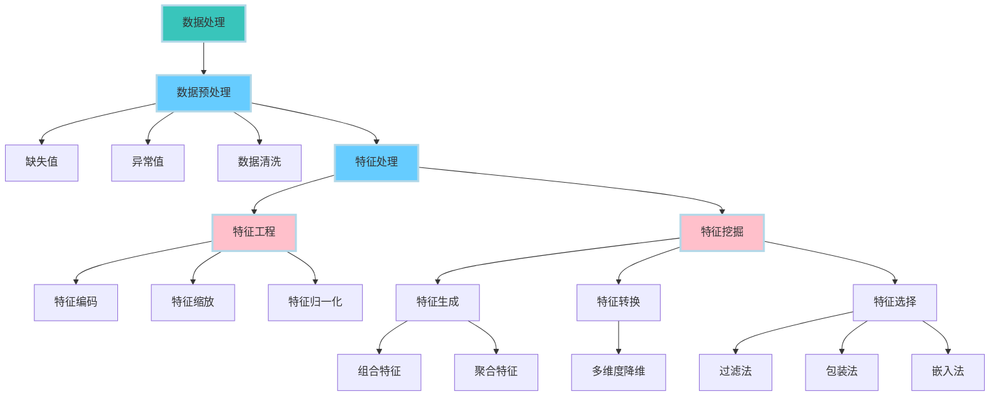

参考书籍：
- 《机器学习高级实践·计算广告、供需预测、智能营销、动态定价》机械工业出版社
  - 作者在知乎有[专栏](https://www.zhihu.com/column/c_1178789002160803840)，以后再看

# 1. 概论

## 1.1 流程
以广告为例，仅对1进行说明，其余会在下文给出。
1. 业务场景拆解
 - 自顶向下：从整体目标拆解为具体任务
 - 时间顺序：业务过程
 - 生命周期：AARRR：获取用户Acquisition、提高活跃度Activation、提高留存Retention、带来收入Revenue、用户自发推荐Refer。
2. 构建特征工程
3. 模型评估与选择
4. 模型训练与优化


# 2. 特征工程
将原始数据处理转化成更能表达业务问题的特征。DNN的网络结构就是在做特征工程。
特征有：基本特征、统计特征、组合特征。

| 模块 | 作用说明 |
|------|--------|
| 数据预处理 | 修复异常和缺失，确保数据的**质量**(完整性,准确性,一致性)，减少噪声 |
| 特征工程 | 调整数据，使特征**符合模型的输入要求**，具有*可操作*性 |
| 特征挖掘 | 从现有数据中生成或提取有价值的信息，**丰富**特征空间 |
| 特征生成 | **生成**新的有意义特征，提升模型的表达能力 |
| 特征转换 | 将特征**转换**为模型更容易理解的形式，简化或增强特征 |
| 特征选择 | **筛选**出对模型最有帮助的特征，减少冗余特征 |

终极目的都是为了提高模型的泛化能力，提高模型的预测准确性。



## 2.1 数据预处理

### 2.1.1 缺失值

#### 2.1.1.1 缺失值的类型

| 缺失值类型 | 说明 | 例子 | 处理方法 | 示例代码 |
|-----------|------|------|----------|----------|
| 完全随机缺失MCAR | 与任何变量无关，因此不会引入偏差 | 部分参与者没有填写年龄字段(与其他变量无关) | 删除；(均值)填充；([MICE](#MICE-interposition))插补 | `df.dropna(), df.fillna()` |
| 随机缺失MAR | 与其他变量有关，但与缺失值本身无关 | 女性(其他变量)更不愿填写体重(缺失值) | (MICE)插补；(回归)预测 | `df.interpolate()` |
| 非随机缺失MNAR | 与缺失值本身有关 | 低/高收入人群(当前变量)不愿填写收入 | (EM)预测；敏感性分析 | |

处理方法的解释如下：
1. **删除**：对于MCAR或者缺失值比例过多($50~80\%$)的可以删除，因为随机性强，大概率不包含对建模有用的信息。易导致信息丢失。
2. **填充**：正态$\rightarrow$均值；偏态$\rightarrow$中位数；离散型/分类$\rightarrow$众数。易产生有偏数据。
3. **插补**：对于M#AR，插补时可以使用不同模型分开插补，如对于男性和女性分别用两个不同的回归方程预测体重。
4. **[敏感性分析](#Sensitivity-Analysis)**：对于MNAR，可以通过假设不同的缺失值机制(如收入高于某个阈值缺失率增加)，对模型的稳健性进行检验(模型输出结果不会因为小的缺失模式变化而有大的偏移)。

事实上还是应该具体问题具体分析，比如可能有如下假设与影响：
 - 删除时其实认为缺失值是均匀分布的，因此会影响数据的[代表性](#data-representativeness)，因为可能会无意间删除较多某个子群体(特定类别)的数据。
 - 偏态数据的填充还可能基于分布特征，如使用对数转换后的均值填充。
 - 均值填充会低估数据的变异性，从而使模型估计更加保守；分类变量用众数填补很容易导致类不均衡。


<a id="MICE-interposition"></a>

> **MICE**：多重插补法，todo: 原理待补充。

<a id="Sensitivity-Analysis"></a>
> **敏感性分析**：用相对改变量衡量结果对参数的敏感程度，$T$对$s$的敏感度$S(T,s)=\frac{\Delta T/T}{\Delta s/s}=\frac{\partial T}{\partial s}\frac{s}{T}$。

<a id="data-representativeness"></a>

> 数据的**代表性**是指样本数据能够准确反映总体特征的程度，代表性越强，说明样本数据越接近总体真实情况。代表性不足的样本可能会导致偏差，使模型的预测或分析结果不准确。

---

#### 2.1.1.2 缺失值的类型的判断方法

1. **可视化**：缺失值的可视化，如`sns.countplot(data=df, x='target', hue='missing')`。
2. **统计检验**：缺失值与其他变量的关系，如卡方检验，$t$检验，$F$检验。
3. **模型预测**：使用模型预测缺失值，如回归模型。

下面主要介绍卡方检验。
<p style="color:#EC407A; font-weight:bold">1. 卡方检验</p>

1. **如何使用？**
```python
from sklearn.feature_selection import chi2
chi2_score, p_value = chi2(data[target], data[missing])  # target可以是很多列，missing是缺失列(0/1，可由.isnull().astype(int)获得)
```
- **Chi2 Score**：表示两个特征之间的关联程度。卡方值越大，说明这两个特征之间的关联越强。
- **p-value**：表示结果的显著性水平。p值越小，表明在统计上越不可能是由于随机性导致的关联，一般p值小于0.05被认为有显著性关联。

对于某个缺失列（如`Cabin_missing`），计算它与其他特征之间的卡方值和p值，如果某个特征与缺失列的**卡方值较高**，且**p值较低**（<0.05），可以认为该特征与缺失情况**有**较强的关联性。反之说明可能不存在显著关联。

2. **卡方检验的原理**

先谈**拒绝原假设**：
准确定义：
- $p$值：在原假设$H_0$为真时，得到当前观测结果或**更极端**的结果的概率。
- $\alpha$：在$H_0$为真时，但检验后拒绝$H_0$的概率，即犯**第I类**错误的概率。

如果$p<\alpha$，则可以拒绝原假设，认为样本数据足够强烈地反驳原假设，一般取$\alpha=0.05$。
`P值是犯第I类错误的实际概率，而α是犯第一类错误的最大概率`（本句不严谨，但可以帮助理解，[出处](https://zhuanlan.zhihu.com/p/52476581)。更好的理解是p值衡量当前数据在原假设下的**罕见性**，$\alpha$是我们愿意容忍的第I类错误概率的**上限**(控制判断的严格性)）。

在卡方检验中，原假设$H_0$是两个变量独立，即没有关联。
1. **构建列联表**：假设我们有两个分类变量A和B，我们可以统计A的每种类别与B的每种类别的共同出现次数，形成一个列联表。
2. **计算期望频数**：假设A和B不相关，根据行列的总计数，计算出期望的频数。即，如果A和B独立，预计每个类别组合的出现次数是多少。
3. **计算卡方值**：卡方值反映了实际频数和期望频数之间的偏离程度：
$$\chi^2 = \sum_{i=1}^{m} \sum_{j=1}^{n} \frac{(O_{ij} - E_{ij})^2}{E_{ij}}$$式中$O_{ij}$是位于列联表$(i,j)$的实际出现的频数。$E_{ij}$是位于联列表$(i,j)$的期望频数，表示在独立假设下该单元格(该类别组合)的理论频数。
4. **显著性判断**：卡方值越大，表示实际数据偏离独立假设的程度越大，p值越小，表示拒绝独立假设的可能性越大，即认为两者相关。

根据卡方检验可以猜测：
1. **MCAR**：若缺失情况与任何可观测特征无显著关联（p值均较高），可能是MCAR。
2. **MAR**：若缺失情况与其他特征有显著关联（p值显著低于0.05），则可能是MAR。
3. **MNAR**：无法单凭卡方检验判断，通常需要基于领域知识和其他统计方法的辅助。

不过卡方检验只能用于分类变量，无法处理连续变量。

3. **动手算卡方检验**

|      | 吸烟 | 不吸烟 | 总计 |
|------|------|--------|------|
| 男性 | 30   | 50     | 80   |
| 女性 | 20   | 100    | 120  |
| 总计 | 50   | 150    | 200  |

- **获取实际频数**：$O_{11}=30$，$O_{12}=50$，$O_{21}=20$，$O_{22}=100$。
- **计算期望频数**：$E_{ij}=\frac{R_i \times C_j}{N}$，其中$R_i$是行$i$的总计数，$C_j$是列$j$的总计数，$N$是总计数。
即：$E_{11}=\frac{80 \times 50}{200}=20$，$E_{12}=\frac{80 \times 150}{200}=60$，$E_{21}=\frac{120 \times 50}{200}=30$，$E_{22}=\frac{120 \times 150}{200}=90$。
- **计算卡方值**：$\chi^2 = \frac{(30-20)^2}{20} + \frac{(50-60)^2}{60} + \frac{(20-30)^2}{30} + \frac{(100-90)^2}{90}=5+1.67+3.33+1.11=11.11$。
查[表](https://statorials.org/cn/%E5%8D%A1%E6%96%B9%E5%88%86%E5%B8%83%E8%A1%A8/)可知，$\chi^2_{0.05}(1)=3.841$，由于$11.11>3.841$，因此拒绝原假设，即吸烟与性别有关联。
- **计算自由度**：$\text{df}=(r-1) \times (c-1)$，其中$r$是行数，$c$是列数。这里自由度为$1 \times 1=1$。
- **计算p值**：$p = P(\chi^2 \geq 11.11 \mid \text{df} = 1)$，使用代码`p_value = 1 - chi2.cdf(chi2_value, df)`可得$\text{p-value}=0.000858$。

代码验证：

<div style="display: flex; justify-content: center; align-items: center;">
<div style=" max-height: 200px; max-width: 90%; overflow-y: auto; border: 1px solid #39c5bb; border-radius: 10px;">

```python
from scipy.stats import chi2
from scipy.stats import chi2_contingency

# 观测频数表（列联表）
observed = [
    [30, 50],  # 男性：吸烟、不吸烟
    [20, 100]  # 女性：吸烟、不吸烟
]

# 计算总计
total = sum(sum(row) for row in observed)
row_totals = [sum(row) for row in observed]
col_totals = [sum(col) for col in zip(*observed)]

# 计算期望频数表
expected = [[(row_total * col_total) / total for col_total in col_totals] for row_total in row_totals]

# 计算卡方值
chi2_value = sum((observed[i][j] - expected[i][j]) ** 2 / expected[i][j] 
                 for i in range(len(observed)) for j in range(len(observed[0])))

# 自由度
df = (len(observed) - 1) * (len(observed[0]) - 1)

# 计算p值
p_value = 1 - chi2.cdf(chi2_value, df)

# 输出结果
print("卡方值 (Chi-square):", chi2_value)
print("自由度 (Degrees of freedom):", df)
print("P-value:", p_value)

# 使用chi2_contingency计算卡方检验的结果
chi2_value, p_value, df, expected = chi2_contingency(observed)  # 如果不希望修正，可以设置correction=False，此时结果与手动计算一致

# 输出结果
print("卡方值 (Chi-square):", chi2_value)
print("自由度 (Degrees of freedom):", df)
print("P-value:", p_value)
print("期望频数 (Expected frequencies):")
print(expected)
```

</div>
</div>


输出：
默认是correction=True，即使用Yates校正。Yates连续性修正主要是为了调整在样本量较小或者期望频数较低时，避免卡方检验的结果过于偏向显著。$\chi^2 = \sum \frac{|O_{ij} - E_{ij}| - 0.5}{\sqrt{E_{ij}}}$
```python
卡方值 (Chi-square): 11.11111111111111
自由度 (Degrees of freedom): 1
P-value: 0.0008581206663936802
卡方值 (Chi-square): 10.027777777777779
自由度 (Degrees of freedom): 1
P-value: 0.001541969568939952
期望频数 (Expected frequencies):
[[20. 60.]
 [30. 90.]]
```
设置correction=False，就与手动计算的结果一致：
```python
卡方值 (Chi-square): 11.11111111111111
自由度 (Degrees of freedom): 1
P-value: 0.0008581206663936802
卡方值 (Chi-square): 11.11111111111111
自由度 (Degrees of freedom): 1
P-value: 0.0008581206663936758
期望频数 (Expected frequencies):
[[20. 60.]
 [30. 90.]]
 ```

---

### 2.1.2 异常值
#### 2.1.2.1 异常值的类型
1. **伪异常值**：如双十一的销售额。
2. **真异常值**：数据本身的噪声点/离群点。

#### 2.1.2.2 异常值的判断方法

| 方法 | 说明 | 优点 | 缺点 |
|------|------|------|------|
| MAD | Median Absolute Deviation, 中位数绝对偏差 | 鲁棒性强，能处理有偏分布，受极端值影响小 | - |
| 3$\sigma$原则 | $1\sigma,2\sigma,3\sigma$分别对应$68.27\%,95.45\%,99.73\%$的数据 | 简单 | 需要数据分布近似正态分布 |
| 箱线图 | 通过四分位数，判断异常值 | 适合长尾数据，对离群值的敏感性较强 | 数据分布不平衡时可能会误判 |
| DBSCAN | 将密度较小的点划分为异常值 | 能够处理多维数据 | 需要调参 |


<p style="color:#EC407A; font-weight:bold">1. MAD</p>

**不易受极端值影响。**

对于数据集$X = \{x_1, x_2, \ldots, x_n\}$：
- 计算数据的**中位数**：$M=\text{Median}(X)$
- 计算**绝对偏差**：计算每个数据点与中位数的绝对偏差$|x_i - M|$，形成一个新数据集：$\mathcal{D} = \{|x_1 - M|, |x_2 - M|, \ldots, |x_n - M|\}$
- 计算**绝对偏差的中位数**：对$\mathcal{D}$求中位数得到MAD：$\text{MAD} = \text{Median}(\mathcal{D}) = \text{Median}(|x_i - M|)$
- 计算**修正Z分数**：对于每个数据点$x_i$，计算其修正Z分数：$\text{Modified }Z = \frac{|x_i - M|}{\text{MAD}'} = \frac{|x_i - M| \cdot \Phi^{-1}(0.75)}{\text{MAD}}$，其中$\Phi^{-1}(0.75) \approx 0.6745$。
为什么是0.75？由$P(|X-M|\le \text{MAD})=0.5$得$P(\frac{|X-M|}{\sigma}\le \frac{\text{MAD}}{\sigma})=0.5$，因为对于正态分布有$P(|Z|\leq k)=0.5\Rightarrow k\approx0.6745$，因此$\frac{\text{MAD}}{\sigma}\approx0.6745$，为了使得MAD作为一致估计量来估计标准差$\sigma$，需要修正为$\text{MAD}'=\frac{\text{MAD}}{0.6745}=\frac{\text{MAD}}{\Phi^{-1}(0.75)}$。
- 判断**离群值**：若修正Z分数大于某个阈值（如$3.5 \rightarrow 99.95\%$），则将其视为离群值。


<div style="display: flex; justify-content: center; align-items: center;">
<div style=" max-height: 200px; max-width: 90%; overflow-y: auto; border: 1px solid #39c5bb; border-radius: 10px;">

```python
import pandas as pd
import numpy as np
from scipy.stats import norm

df = pd.read_csv("../input/titanic.csv")

def mad_based_outlier(points, thresh=3.5):
    med = np.median(points, axis=0)  # 计算中位数
    abs_dev = np.absolute(points - med)  # 计算绝对偏差
    med_abs_dev = np.median(abs_dev)  # 计算绝对偏差的中位数
    mod_z_score = norm.ppf(0.75) * abs_dev / med_abs_dev  # 计算修正的Z分数
    return mod_z_score > thresh  # 返回是否为离群值

# 选择要检测离群值的特征，例如 'Age' 和 'Fare'，在原数据集上保留去除缺失值后的索引以便后续筛选
age_series = df['Age'].dropna()
fare_series = df['Fare'].dropna()
# 检测离群值并返回布尔数组
age_outliers = mad_based_outlier(age_series)
fare_outliers = mad_based_outlier(fare_series)

# 根据原始索引筛选离群值
print("Age column outliers:", age_series[age_outliers].tolist())
print("Fare column outliers:", fare_series[fare_outliers].tolist())
# 输出离群值的阈值(根据原始数据里的的min和max来确定阈值)
print("Age column outliers threshold:", age_series[age_outliers].min(), age_series[age_outliers].max())
print("Fare column outliers threshold:", fare_series[fare_outliers].min(), fare_series[fare_outliers].max())
```

</div>
</div>


<p style="color:#EC407A; font-weight:bold">2. 3σ原则</p>

<p style="color:#EC407A; font-weight:bold">3. 箱线图</p>

<div style="display: flex; justify-content: center; align-items: center;">
<div style=" max-height: 200px; max-width: 90%; overflow-y: auto; border: 1px solid #39c5bb; border-radius: 10px;">

```python
import pandas as pd
import numpy as np

df = pd.read_csv("../input/titanic.csv")

def three_sigma(df_col):
    rule = (df_col.mean() - 3 * df_col.std() > df_col) | (df_col.mean() + 3 * df_col.std() < df_col)
    index = np.arange(df_col.shape[0])[rule]  # 找出符合规则的索引
    outrange = df_col.iloc[index]  # 使用索引筛选出离群值
    return outrange

def box_plot_outliers(s):
    q1, q3 = s.quantile(.25), s.quantile(.75)
    iqr = q3 - q1  # 计算四分位数间距
    low, up = q1 - 1.5 * iqr, q3 + 1.5 * iqr  # 计算上下阈值
    outlier = s.mask((s < low) | (s > up))  # 筛选离群值并用NaN填充非离群值部分
    return outlier

# 选择要检测离群值的特征，例如 'Age' 和 'Fare'，在原数据集上保留去除缺失值后的索引以便后续筛选
age_series = df['Age'].dropna()
fare_series = df['Fare'].dropna()

# 使用 three_sigma 函数检测离群值
age_outliers_three_sigma = three_sigma(age_series)
fare_outliers_three_sigma = three_sigma(fare_series)

# print("Age column outliers (three sigma):", age_outliers_three_sigma.tolist())
# print("Fare column outliers (three sigma):", fare_outliers_three_sigma.tolist())
print("Age column outliers threshold (three sigma):", age_outliers_three_sigma.min(), age_outliers_three_sigma.max())
print("Fare column outliers threshold (three sigma):", fare_outliers_three_sigma.min(), fare_outliers_three_sigma.max())

# 使用 box_plot_outliers 函数检测离群值
age_outliers_box_plot = box_plot_outliers(age_series)
fare_outliers_box_plot = box_plot_outliers(fare_series)

# 输出离群值以及阈值范围
# print("Age column outliers (box plot):", age_outliers_box_plot.dropna().tolist())
# print("Fare column outliers (box plot):", fare_outliers_box_plot.dropna().tolist())
print("Age column outliers threshold (box plot):", age_outliers_box_plot.min(), age_outliers_box_plot.max())
print("Fare column outliers threshold (box plot):", fare_outliers_box_plot.min(), fare_outliers_box_plot.max())
```

</div>
</div>

对于泰坦尼克号数据集，上面三种方法得到的异常值阈值如下：
| 方法 | Age | Fare |
|------|-----|------|
| MAD | $[80.0, 80.0]$ | $[50.4958, 512.3292]$ | 
| 3$\sigma$ | $[74.0, 80.0]$ | $[211.3375, 512.3292]$ |
| 箱线图 | $[0.42, 64.0]$ | $[0.0, 65.0]$ |

#### 2.1.2.3 异常值的处理方法

1. **删除**：删除异常值，但可能会丢失有用信息。
2. **视为缺失值**：按照缺失值处理。
3. **模型修正**：下游阶段使用树模型这种对异常值不敏感的模型。 


### 2.1.3 数据清洗

目标：确保数据的一致性、准确性和完整性，即识别并修正错误数据、重复数据、格式不规范的数据等问题。
常见操作包括：
- 删除或修正重复数据。
- 统一格式（例如日期格式、文本大小写等，即编码、命名上的差异）。
- 移除无用的列或数据。
- 处理不一致的数据（例如，Age="20"但Birthday="03/07/1997"）。

## 2.2 特征处理

### 2.2.1 数值特征处理

<p style="color:#EC407A; font-weight:bold">1. 连续特征离散化</p>

**为什么要离散化**：鲁棒性增强、引入非线性关系、容易做特征交叉、降低计算复杂度。
**方法**：排序$\rightarrow$选择分割点$\rightarrow$自顶向下划分/自底向上合并直至满足停止准则。

1. 无监督离散化：等宽、等频、聚类。
2. 有监督离散化：最小熵法、卡方分箱、Best-KS分箱。

```python
df['Fare_cut'] = pd.cut(df['Fare'], bins=5)  # bin：分箱的数量
df['Fare_qcut'] = pd.qcut(df['Fare'], q=5)  # q：分箱的数量
df['Fare_kmeans'] = kmeans.fit_predict(df[['Fare']])
```

**最小熵法**：
自顶向下的分箱法，使得所有分箱的总熵值最小，以最大程度地保证分箱后的数据集的纯度，原理与决策树相似。
信息熵$H(X)=-\sum_{i=1}^{n}p_i\log_2p_i$，条件熵$H(Y|X)=\sum_{i=1}^{n}p_iH(Y|X=x_i)=-\sum_{i=1}^{n}p_i\sum_{j=1}^{m}p_{ij}\log_2p_{ij}$，信息增益$G(X,Y)=H(Y)-H(Y|X)$。其中$p_i\triangleq P(X=x_i),p_j\triangleq P(Y=y_j),p_{ij}\triangleq P(Y=y_j|X=x_i)$。
信息增益：在一个条件下，信息复杂度（不确定性）减少的程度。
> todo: 本部分内容之后应当放在决策树算法部分。

<div style="display: flex; justify-content: center; align-items: center;">
<div style=" max-height: 200px; max-width: 90%; overflow-y: auto; border: 1px solid #39c5bb; border-radius: 10px;">

```python
# 目前暂没更新最小熵法分箱完整方法，个人觉得使用决策树即可
class Entropy(object):
    def entropy(self, x):
        # 信息熵
        p = x.value_counts(normalize=True)  # 计算每个类别的频率
        p = p[p > 0]  # 去除0的值，否则log无穷大
        e = -(p * np.log2(p)).sum()  # 计算信息熵
        return e

    def cond_entropy(self, x, y):
        # 条件熵
        p = y.value_counts(normalize=True)  # 计算每个类别的频率
        e = 0  # 初始化条件熵
        for yi in y.unique():  # 遍历目标变量的每个类别
            e += p[yi] * self.entropy(x[y == yi])  # 计算条件熵
        return e

    def info_gain(self, x, y):
        # 信息增益
        g = self.entropy(x) - self.cond_entropy(x, y)  # 计算信息增益
        return g
```

</div>
</div>

**卡方分箱**：
基于卡方检验的分箱方法，通过计算相邻两个区间的卡方值，选择卡方值最小的相邻区间进行合并，直到满足停止准则。


<div style="display: flex; justify-content: center; align-items: center;">
<div style=" max-height: 200px; max-width: 90%; overflow-y: auto; border: 1px solid #39c5bb; border-radius: 10px;">

```python
import numpy as np
import pandas as pd
from scipy.stats import chi2_contingency

def chi_merge(df, column, target, max_bins=5):
    # 初始分箱：先将列值分成最大数量的箱子
    bins = [0, 10, 20, 30, 40, 50]  # 这里你可以调整初始分箱
    df['Fare_chimerge'] = pd.cut(df[column], bins=bins)
    
    # 计算卡方统计量并合并区间
    while len(df['Fare_chimerge'].unique()) > max_bins:
        # 计算每一对相邻分箱的卡方值
        chi_results = []
        for i in range(len(bins) - 1):
            # 获取当前相邻两个区间的数据
            subset = df[(df['Fare_chimerge'] == bins[i]) | (df['Fare_chimerge'] == bins[i + 1])]
            
            # 如果某个分箱没有数据，跳过该分箱
            if subset.empty:
                continue
            
            # 计算卡方统计量
            contingency_table = pd.crosstab(subset[column], subset[target])
            chi2, p, dof, expected = chi2_contingency(contingency_table)
            chi_results.append((i, chi2))  # 保存卡方值和对应的区间
        
        # 找到卡方值最小的相邻区间进行合并
        if chi_results:  # 如果没有空的分箱
            min_chi = min(chi_results, key=lambda x: x[1])
            min_index = min_chi[0]
            bins[min_index] = (bins[min_index] + bins[min_index + 1]) / 2  # 合并这两个区间
            df['Fare_chimerge'] = pd.cut(df[column], bins=bins)  # 重新计算分箱
        else:
            break  # 如果没有有效的分箱，则终止合并过程
    
    return df

# 使用卡方分箱
df = chi_merge(df, 'Fare', 'Survived')
# 绘制结果
plot_fare_distribution(df, "Fare_chimerge", "Chi-Merge Discretization")
```
</div>
</div>


**Best-KS分箱**：
基于KS统计量的分箱方法，通过计算相邻两个区间的KS值，选择KS值最大的相邻区间进行合并，直到满足停止准则。
- < 0.2：不具有区分度；0.2-0.3：具有一定区分度；0.3-0.5：具有较强区分度；> 0.5：具有很强区分度。
> todo: 原理

<p style="color:#EC407A; font-weight:bold">2. 数值数据变换</p>

改变数据的原始分布，使变换后的数据分布更符合模型的假设。如线性模型的正态性(误差$\varepsilon \sim N(0,\sigma^2)$)、方差齐性(任取子样本集合$X_i$，其方差$\text{Var}(\varepsilon_i)=\sigma^2$不随选取的样本集合的变化而改变)。

**方法**：数据分布+均值+方差可视化$\rightarrow$选择合适的变换$\rightarrow$代入模型以确认有效性。

| 方法 | 说明 | 优点 | 作用 |
|------|------|------|------|
| 平方根变换 | $y=\sqrt{x}$ | 适用于偏态分布 | 减少数据的偏斜 |
| 对数变换 | $y=\log(x)$ | 适用于长尾分布 | 减少长尾效应 |
| 指数变换 | $y=e^x$ | 适用于偏态分布 | 拉伸数据 |
| Box-Cox变换 | $y=\frac{x^\lambda-1}{\lambda}$ | 适用于正态分布的正值数据 | 使其更接近正态分布 |
| Yeo-Johnson变换 | $y=\begin{cases}((x+1)^{\lambda}-1)/\lambda & x\geq0 \\ -((1-x)^{2-\lambda}-1)/(2-\lambda) & x<0\end{cases}$ | 适用于正态分布，可处理负数 | 使其更接近正态分布 |

对于Box-Cox变换，当$\lambda=0$时，$y=\log(x)$；当$\lambda=0.5$时，$y=\sqrt{x}$；当$\lambda=1$时，$y=x$；当$\lambda=-1$时，$y=1/x$。注意$\lambda=0$准确公式是$y=\lim_{\lambda\to0}\frac{x^\lambda-1}{\lambda}$，对其洛必达即可，注意$x$是常数而$\lambda$才是变量。

<div style="display: flex; justify-content: center; align-items: center;">
<div style=" max-height: 200px; max-width: 90%; overflow-y: auto; border: 1px solid #39c5bb; border-radius: 10px;">

```python
import numpy as np
import matplotlib.pyplot as plt
from scipy.stats import boxcox
from sklearn.preprocessing import PowerTransformer

np.random.seed(42)
# data = np.random.exponential(scale=2, size=10000)  # 生成模拟数据（长尾分布）
data = np.random.uniform(1, 100, 10000)  # 生成均匀分布数据

# 数据变换函数
def log_transform(x):
    return np.log(x + 1)

def sqrt_transform(x):
    return np.sqrt(x)

def exp_transform(x):
    return np.exp(x / np.max(x))  # 防止溢出

def boxcox_transform(x):
    return boxcox(x + 1)[0]  # 加1以避免0值

def yeo_johnson_transform(x):
    transformer = PowerTransformer(method='yeo-johnson')
    return transformer.fit_transform(x.reshape(-1, 1)).flatten()

# 应用变换
transforms = {
    "Original": data,
    "Log": log_transform(data),
    "Square Root": sqrt_transform(data),
    "Exponential": exp_transform(data),
    "Box-Cox": boxcox_transform(data),
    "Yeo-Johnson": yeo_johnson_transform(data)
}

# 可视化
fig, axes = plt.subplots(2, 3, figsize=(12, 12))
axes = axes.ravel()

for i, (name, transformed_data) in enumerate(transforms.items()):
    axes[i].hist(transformed_data, bins=30, alpha=0.7, color="skyblue", edgecolor="black")
    axes[i].set_title(name)
    axes[i].set_xlabel("Value")
    axes[i].set_ylabel("Frequency")

plt.tight_layout()
plt.show()
```
</div>
</div>

输出：
<div style="display: flex; justify-content: center; align-items: center;">
    <div style="text-align: center;">
        
        <p style="font-size: small; color: gray;">以均匀分布为例实施的变换</p>
    </div>
</div>


<p style="color:#EC407A; font-weight:bold">3. 标准化</p>

让特征的数量级统一，避免模型收敛慢。

| 方法 | 说明 | 优点 | 缺点 |
|------|------|------|------|
| Min-Max标准化 | $X_i'=\frac{X_i-\min(X)}{\max(X)-\min(X)}$ | 简单 | 受异常值影响大，新数据加入后需要重新计算 |
| Z-score标准化 | $X_i'=\frac{X_i-\mu}{\sigma}$ | 标准化后的数据$X' \sim N(0,1)$ | 受异常值影响小 |
| 小数定标标准化 | $X_i'=\frac{X_i}{10^k}$，其中$k=\lfloor\log_{10}(\max(\|X\|))\rfloor $ | 适用于数据遍布多个数量级，非常离散的情况 | 不利于建模时的数据区分 |

Min-Max映射到$[a,b]$：$X_i'=(b-a)\frac{X_i-\min(X)}{\max(X)-\min(X)}+a$。
Z-Score当存在离群值时，将$\sigma$替换为平均绝对差(Mean Absolute Deviation, MAD)$s = \frac{\sum_{i=1}^{n} \left| f_i - \mu \right|}{n}$。
小数定标的$k$实质上是使得数据的绝对值最大值小于1。偶尔也会使用$\mu$。

### 2.2.2 类别特征处理

## 2.3 特征筛选

### 2.3.1 过滤法

### 2.3.2 包装法

### 2.3.3 嵌入法


# 3. 模型评估与选择


# 4. 模型训练与优化


