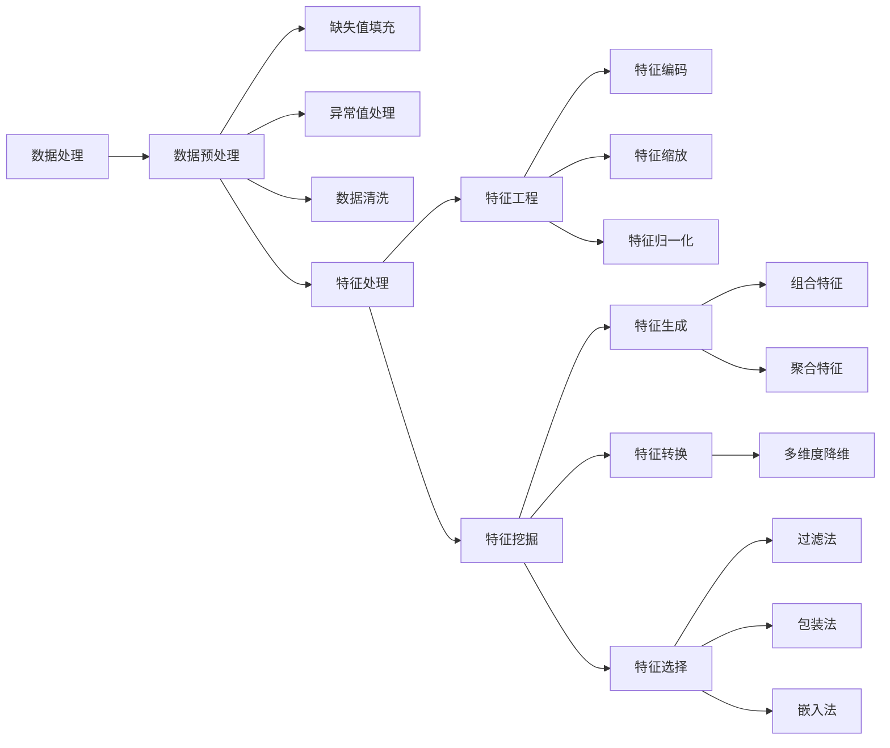

# 1. 概论

## 1.1 流程
以广告为例，仅对1进行说明，其余会在下文给出。
1. 业务场景拆解
 - 自顶向下：从整体目标拆解为具体任务
 - 时间顺序：业务过程
 - 生命周期：AARRR：获取用户Acquisition、提高活跃度Activation、提高留存Retention、带来收入Revenue、用户自发推荐Refer。
2. 构建特征工程
3. 模型评估与选择
4. 模型训练与优化


# 2. 特征工程
将原始数据处理转化成更能表达业务问题的特征。DNN的网络结构就是在做特征工程。
特征有：基本特征、统计特征、组合特征。

| 模块 | 作用说明 |
|------|--------|
| 数据预处理 | 修复异常和缺失，确保数据的**质量**(完整性,准确性,一致性)，减少噪声 |
| 特征工程 | 调整数据，使特征**符合模型的输入要求**，具有*可操作*性 |
| 特征挖掘 | 从现有数据中生成或提取有价值的信息，**丰富**特征空间 |
| 特征生成 | **生成**新的有意义特征，提升模型的表达能力 |
| 特征转换 | 将特征**转换**为模型更容易理解的形式，简化或增强特征 |
| 特征选择 | **筛选**出对模型最有帮助的特征，减少冗余特征 |

终极目的都是为了提高模型的泛化能力，提高模型的预测准确性。



## 2.1 数据预处理

### 2.1.1 缺失值

#### 2.1.1.1 缺失值的类型

| 缺失值类型 | 说明 | 例子 | 处理方法 |
|-----------|------|------|----------|
| 完全随机缺失MCAR | 与任何变量无关，因此不会引入偏差 | 部分参与者没有填写年龄字段(与其他变量无关) | 删除；(均值)填充；([MICE](#MICE-interposition))插补 |
| 随机缺失MAR | 与其他变量有关，但与缺失值本身无关 | 女性(其他变量)更不愿填写体重(缺失值) | (MICE)插补；(回归)预测 |
| 非随机缺失MNAR | 与缺失值本身有关 | 低/高收入人群(当前变量)不愿填写收入 | (EM)预测；敏感性分析 |

处理方法的解释如下：
1. **删除**：对于MCAR或者缺失值比例过多($50~80\%$)的可以删除，因为随机性强，大概率不包含对建模有用的信息。易导致信息丢失。
2. **填充**：正态$\rightarrow$均值；偏态$\rightarrow$中位数；离散型/分类$\rightarrow$众数。易产生有偏数据。
3. **插补**：对于M#AR，插补时可以使用不同模型分开插补，如对于男性和女性分别用两个不同的回归方程预测体重。
4. **[敏感性分析](#Sensitivity-Analysis)**：对于MNAR，可以通过假设不同的缺失值机制(如收入高于某个阈值缺失率增加)，对模型的稳健性进行检验(模型输出结果不会因为小的缺失模式变化而有大的偏移)。

事实上还是应该具体问题具体分析，比如可能有如下假设与影响：
 - 删除时其实认为缺失值是均匀分布的，因此会影响数据的[代表性](#data-representativeness)，因为可能会无意间删除较多某个子群体(特定类别)的数据。
 - 偏态数据的填充还可能基于分布特征，如使用对数转换后的均值填充。
 - 均值填充会低估数据的变异性，从而使模型估计更加保守；分类变量用众数填补很容易导致类不均衡。


<a id="MICE-interposition"></a>

> **MICE**：多重插补法，待补充。

<a id="Sensitivity-Analysis"></a>
> **敏感性分析**：用相对改变量衡量结果对参数的敏感程度，$T$对$s$的敏感度$S(T,s)=\frac{\bigtriangleup T/T}{\bigtriangleup s/s}=\frac{\partial T}{\partial s}\frac{s}{T}$。

<a id="data-representativeness"></a>

> 数据的**代表性**是指样本数据能够准确反映总体特征的程度，代表性越强，说明样本数据越接近总体真实情况。代表性不足的样本可能会导致偏差，使模型的预测或分析结果不准确。

---

#### 2.1.1.1 缺失值的类型的判断方法

1. **可视化**：缺失值的可视化，如`sns.countplot(data=df, x='target', hue='missing')`。
2. **统计检验**：缺失值与其他变量的关系，如卡方检验，$t$检验，$F$检验。
3. **模型预测**：使用模型预测缺失值，如回归模型。

下面主要介绍卡方检验。
**卡方检验**：
1. **如何使用？**
```python
from sklearn.feature_selection import chi2
chi2_score, p_value = chi2(data[target], data[missing])  # target可以是很多列，missing是缺失列(0/1，可由.isnull().astype(int)获得)
```
- **Chi2 Score**：表示两个特征之间的关联程度。卡方值越大，说明这两个特征之间的关联越强。
- **p-value**：表示结果的显著性水平。p值越小，表明在统计上越不可能是由于随机性导致的关联，一般p值小于0.05被认为有显著性关联。

对于某个缺失列（如`Cabin_missing`），计算它与其他特征之间的卡方值和p值，如果某个特征与缺失列的**卡方值较高**，且**p值较低**（<0.05），可以认为该特征与缺失情况**有**较强的关联性。反之说明可能不存在显著关联。

2. **卡方检验的原理**

先谈**拒绝原假设**：
准确定义：
- $p$值：在原假设$H_0$为真时，得到当前观测结果或**更极端**的结果的概率。
- $\alpha$：在$H_0$为真时，但检验后拒绝$H_0$的概率，即犯**第I类**错误的概率。

如果$p<\alpha$，则可以拒绝原假设，认为样本数据足够强烈地反驳原假设，一般取$\alpha=0.05$。
`P值是犯第I类错误的实际概率，而α是犯第一类错误的最大概率`（本句不严谨，但可以帮助理解，[出处](https://zhuanlan.zhihu.com/p/52476581)。更好的理解是p值衡量当前数据在原假设下的**罕见性**，$\alpha$是我们愿意容忍的第I类错误概率的**上限**(控制判断的严格性)）。

在卡方检验中，原假设$H_0$是两个变量独立，即没有关联。
1. **构建列联表**：假设我们有两个分类变量A和B，我们可以统计A的每种类别与B的每种类别的共同出现次数，形成一个列联表。
2. **计算期望频数**：假设A和B不相关，根据行列的总计数，计算出期望的频数。即，如果A和B独立，预计每个类别组合的出现次数是多少。
3. **计算卡方值**：卡方值反映了实际频数和期望频数之间的偏离程度：
$$\chi^2 = \sum_{i=1}^{m} \sum_{j=1}^{n} \frac{(O_{ij} - E_{ij})^2}{E_{ij}}$$式中$O_{ij}$是位于列联表$(i,j)$的实际出现的频数。$E_{ij}$是位于联列表$(i,j)$的期望频数，表示在独立假设下该单元格(该类别组合)的理论频数。
4. **显著性判断**：卡方值越大，表示实际数据偏离独立假设的程度越大，p值越小，表示拒绝独立假设的可能性越大，即认为两者相关。

根据卡方检验可以猜测：
1. **MCAR**：若缺失情况与任何可观测特征无显著关联（p值均较高），可能是MCAR。
2. **MAR**：若缺失情况与其他特征有显著关联（p值显著低于0.05），则可能是MAR。
3. **MNAR**：无法单凭卡方检验判断，通常需要基于领域知识和其他统计方法的辅助。

不过卡方检验只能用于分类变量，无法处理连续变量。

3. **动手算卡方检验**

|      | 吸烟 | 不吸烟 | 总计 |
|------|------|--------|------|
| 男性 | 30   | 50     | 80   |
| 女性 | 20   | 100    | 120  |
| 总计 | 50   | 150    | 200  |

- **获取实际频数**：$O_{11}=30$，$O_{12}=50$，$O_{21}=20$，$O_{22}=100$。
- **计算期望频数**：$E_{ij}=\frac{R_i \times C_j}{N}$，其中$R_i$是行$i$的总计数，$C_j$是列$j$的总计数，$N$是总计数。
即：$E_{11}=\frac{80 \times 50}{200}=20$，$E_{12}=\frac{80 \times 150}{200}=60$，$E_{21}=\frac{120 \times 50}{200}=30$，$E_{22}=\frac{120 \times 150}{200}=90$。
- **计算卡方值**：$\chi^2 = \frac{(30-20)^2}{20} + \frac{(50-60)^2}{60} + \frac{(20-30)^2}{30} + \frac{(100-90)^2}{90}=5+1.67+3.33+1.11=11.11$。
查[表](https://statorials.org/cn/%E5%8D%A1%E6%96%B9%E5%88%86%E5%B8%83%E8%A1%A8/)可知，$\chi^2_{0.05}(1)=3.841$，由于$11.11>3.841$，因此拒绝原假设，即吸烟与性别有关联。
- **计算自由度**：$\text{df}=(r-1) \times (c-1)$，其中$r$是行数，$c$是列数。这里自由度为$1 \times 1=1$。
- **计算p值**：$p = P(\chi^2 \geq 11.11 \mid \text{df} = 1)$，使用代码`p_value = 1 - chi2.cdf(chi2_value, df)`可得$\text{p-value}=0.000858$。

代码验证：
```python
from scipy.stats import chi2
from scipy.stats import chi2_contingency

# 观测频数表（列联表）
observed = [
    [30, 50],  # 男性：吸烟、不吸烟
    [20, 100]  # 女性：吸烟、不吸烟
]

# 计算总计
total = sum(sum(row) for row in observed)
row_totals = [sum(row) for row in observed]
col_totals = [sum(col) for col in zip(*observed)]

# 计算期望频数表
expected = [[(row_total * col_total) / total for col_total in col_totals] for row_total in row_totals]

# 计算卡方值
chi2_value = sum((observed[i][j] - expected[i][j]) ** 2 / expected[i][j] 
                 for i in range(len(observed)) for j in range(len(observed[0])))

# 自由度
df = (len(observed) - 1) * (len(observed[0]) - 1)

# 计算p值
p_value = 1 - chi2.cdf(chi2_value, df)

# 输出结果
print("卡方值 (Chi-square):", chi2_value)
print("自由度 (Degrees of freedom):", df)
print("P-value:", p_value)

# 使用chi2_contingency计算卡方检验的结果
chi2_value, p_value, df, expected = chi2_contingency(observed)  # 如果不希望修正，可以设置correction=False，此时结果与手动计算一致

# 输出结果
print("卡方值 (Chi-square):", chi2_value)
print("自由度 (Degrees of freedom):", df)
print("P-value:", p_value)
print("期望频数 (Expected frequencies):")
print(expected)
```
输出：
默认是correction=True，即使用Yates校正。
Yates连续性修正主要是为了调整在样本量较小或者期望频数较低时，避免卡方检验的结果过于偏向显著。$\chi^2 = \sum \frac{|O_{ij} - E_{ij}| - 0.5}{\sqrt{E_{ij}}}$
```
卡方值 (Chi-square): 11.11111111111111
自由度 (Degrees of freedom): 1
P-value: 0.0008581206663936802
卡方值 (Chi-square): 10.027777777777779
自由度 (Degrees of freedom): 1
P-value: 0.001541969568939952
期望频数 (Expected frequencies):
[[20. 60.]
 [30. 90.]]
```
设置correction=False：
```
卡方值 (Chi-square): 11.11111111111111
自由度 (Degrees of freedom): 1
P-value: 0.0008581206663936802
卡方值 (Chi-square): 11.11111111111111
自由度 (Degrees of freedom): 1
P-value: 0.0008581206663936758
期望频数 (Expected frequencies):
[[20. 60.]
 [30. 90.]]
 ```


---

## 2.2 特征工程


## 2.3 特征挖掘


# 3. 模型评估与选择


# 4. 模型训练与优化


