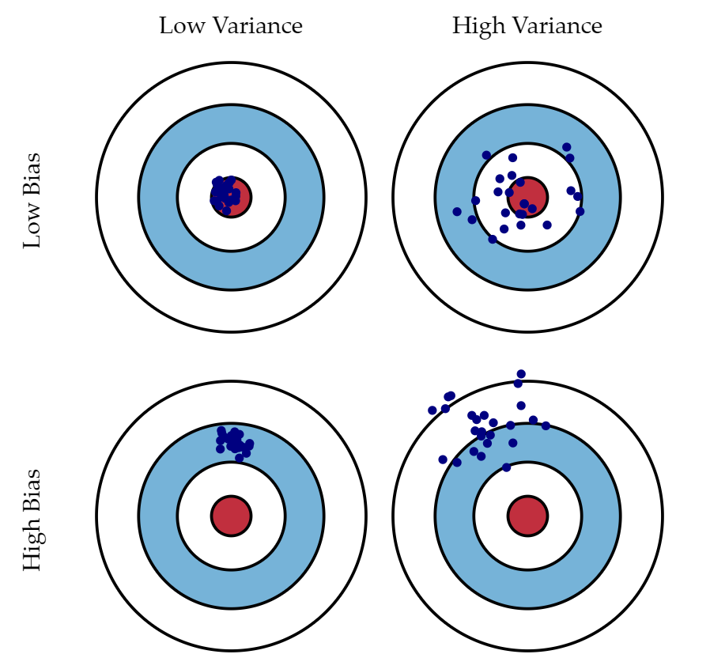
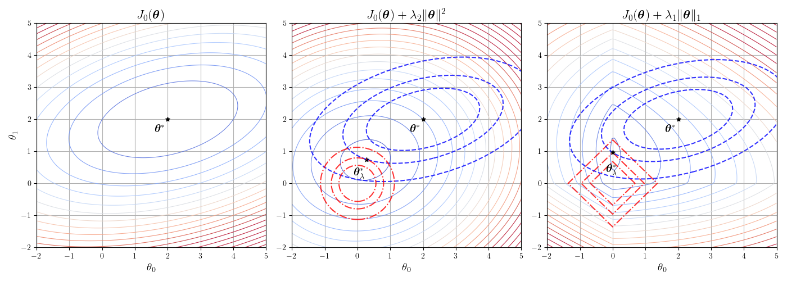
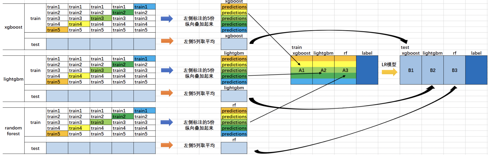

> 如果只是了解概念而不完全弄懂其本质，那还不如ChatGPT。

参考网址：
- [Wikipedia](https://en.wikipedia.org/wiki/Main_Page) 我只能说公式上Wikipedia搜就对了。
- [stackoverflow](https://stackoverflow.com/)
- [towardsdatascience](https://towardsdatascience.com/)
- [The Elements of Statistical Learning](https://esl.hohoweiya.xyz/index.html) 《统计学习要素》的中文版，其github在[ESL-CN](https://github.com/szcf-weiya/ESL-CN)。

即使不是CSDN这byd，像知乎，博客园也有很多是搬运上面的文章的，中文资料生态啊...而且英文可以用[插件](https://microsoftedge.microsoft.com/addons/detail/%E6%B2%89%E6%B5%B8%E5%BC%8F%E7%BF%BB%E8%AF%91-%E7%BD%91%E9%A1%B5%E7%BF%BB%E8%AF%91%E6%8F%92%E4%BB%B6-pdf%E7%BF%BB%E8%AF%91-/amkbmndfnliijdhojkpoglbnaaahippg?hl=zh-CN)翻译。

参考书籍：
- [《机器学习高级实践·计算广告、供需预测、智能营销、动态定价》机械工业出版社](https://book.douban.com/subject/36648547/)
  - 作者在知乎有[专栏](https://www.zhihu.com/column/c_1178789002160803840)，以后再看
- [《动手学机器学习》](https://hml.boyuai.com/)


章节与对应代码，代码大部分由GPT-4o生成，仅为验证知识点所用。代码内的笔记为草稿，请以本文档为准。仅供参考。
| 章节 | 代码 | 数据集 |
|------|------|-----|
| 1. 概论 | 无 | 无 |
| 2. 特征工程 | [Github data_preprocessing.ipynb](https://github.com/virtualxiaoman/Easier_DataScience/blob/master/data_analyse/ML_HUB/FE_1_data_preprocessing.ipynb) | 泰坦尼克号 |
| 3. 模型评估 | [Github model_evaluation.ipynb](https://github.com/virtualxiaoman/Easier_DataScience/blob/master/data_analyse/ML_HUB/FE_2_Model_evaluation.ipynb) | 鸢尾花 |
| 4. 模型优化 | [Github model_selection.ipynb](https://github.com/virtualxiaoman/Easier_DataScience/blob/master/data_analyse/ML_HUB/FE_3_Model_optimization.ipynb) | 鸢尾花 |


# 1. 概论

## 1.1 流程
以广告为例，仅对第1点的方法进行说明，其余会在下文给出。
1. 业务场景拆解
 - 自顶向下：从整体目标拆解为具体任务
 - 时间顺序：业务过程
 - 生命周期：AARRR：获取用户Acquisition、提高活跃度Activation、提高留存Retention、带来收入Revenue、用户自发推荐Refer。
2. 构建特征工程
3. 模型评估与选择
4. 模型训练与优化


# 2. 特征工程
将原始数据处理转化成更能表达业务问题的特征。DNN的网络结构就是在做特征工程。
特征有：基本特征、统计特征、组合特征。

| 模块 | 作用说明 |
|------|--------|
| 数据预处理 | 修复异常和缺失，确保数据的**质量**(完整性,准确性,一致性)，减少噪声 |
| 特征工程 | 调整数据，使特征**符合模型的输入要求**，具有*可操作*性 |
| 特征挖掘 | 从现有数据中生成或提取有价值的信息，**丰富**特征空间 |
| 特征生成 | **生成**新的有意义特征，提升模型的表达能力 |
| 特征转换 | 将特征**转换**为模型更容易理解的形式，简化或增强特征 |
| 特征选择 | **筛选**出对模型最有帮助的特征，减少冗余特征 |

终极目的都是为了提高模型的泛化能力，提高模型的预测准确性。


## 2.1 数据预处理

### 2.1.1 缺失值

#### 2.1.1.1 缺失值的类型

| 缺失值类型 | 说明 | 例子 | 处理方法 | 示例代码 |
|-----------|------|------|----------|----------|
| 完全随机缺失MCAR | 与任何变量无关，因此不会引入偏差 | 部分参与者没有填写年龄字段(与其他变量无关) | 删除；(均值)填充；([MICE](#MICE-interposition))插补 | `df.dropna(), df.fillna()` |
| 随机缺失MAR | 与其他变量有关，但与缺失值本身无关 | 女性(其他变量)更不愿填写体重(缺失值) | (MICE)插补；(回归)预测 | `df.interpolate()` |
| 非随机缺失MNAR | 与缺失值本身有关 | 低/高收入人群(当前变量)不愿填写收入 | (EM)预测；敏感性分析 | |

处理方法的解释如下：
1. **删除**：对于MCAR或者缺失值比例过多($50~80\%$)的可以删除，因为随机性强，大概率不包含对建模有用的信息。易导致信息丢失。
2. **填充**：正态$\rightarrow$均值；偏态$\rightarrow$中位数；离散型/分类$\rightarrow$众数。易产生有偏数据。
3. **插补**：对于M#AR，插补时可以使用不同模型分开插补，如对于男性和女性分别用两个不同的回归方程预测体重。
4. **[敏感性分析](#Sensitivity-Analysis)**：对于MNAR，可以通过假设不同的缺失值机制(如收入高于某个阈值缺失率增加)，对模型的稳健性进行检验(模型输出结果不会因为小的缺失模式变化而有大的偏移)。

事实上还是应该具体问题具体分析，比如可能有如下假设与影响：
 - 删除时其实认为缺失值是均匀分布的，因此会影响数据的[代表性](#data-representativeness)，因为可能会无意间删除较多某个子群体(特定类别)的数据。
 - 偏态数据的填充还可能基于分布特征，如使用对数转换后的均值填充。
 - 均值填充会低估数据的变异性，从而使模型估计更加保守；分类变量用众数填补很容易导致类不均衡。


<a id="MICE-interposition"></a>

> **MICE**：多重插补法，todo: 原理待补充。

<a id="Sensitivity-Analysis"></a>
> **敏感性分析**：用相对改变量衡量结果对参数的敏感程度，$T$对$s$的敏感度$S(T,s)=\frac{\Delta T/T}{\Delta s/s}=\frac{\partial T}{\partial s}\frac{s}{T}$。

<a id="data-representativeness"></a>

> 数据的**代表性**是指样本数据能够准确反映总体特征的程度，代表性越强，说明样本数据越接近总体真实情况。代表性不足的样本可能会导致偏差，使模型的预测或分析结果不准确。

---

#### 2.1.1.2 缺失值的类型的判断方法

1. **可视化**：缺失值的可视化，如`sns.countplot(data=df, x='target', hue='missing')`。
2. **统计检验**：缺失值与其他变量的关系，如卡方检验，$t$检验，$F$检验。
3. **模型预测**：使用模型预测缺失值，如回归模型。

下面主要介绍卡方检验。
<p style="color:#EC407A; font-weight:bold">1. 卡方检验</p>

1. **如何使用？**
```python
from sklearn.feature_selection import chi2
chi2_score, p_value = chi2(data[target], data[missing])  # target可以是很多列，missing是缺失列(0/1，可由.isnull().astype(int)获得)
```
- **Chi2 Score**：表示两个特征之间的关联程度。卡方值越大，说明这两个特征之间的关联越强。
- **p-value**：表示结果的显著性水平。p值越小，表明在统计上越不可能是由于随机性导致的关联，一般p值小于0.05被认为有显著性关联。

对于某个缺失列（如`Cabin_missing`），计算它与其他特征之间的卡方值和p值，如果某个特征与缺失列的**卡方值较高**，且**p值较低**（<0.05），可以认为该特征与缺失情况**有**较强的关联性。反之说明可能不存在显著关联。

2. **卡方检验的原理**

先谈**拒绝原假设**：
准确定义：
- $p$值：在原假设$H_0$为真时，得到当前观测结果或**更极端**的结果的概率。
- $\alpha$：在$H_0$为真时，但检验后拒绝$H_0$的概率，即犯**第I类**错误的概率。

如果$p<\alpha$，则可以拒绝原假设，认为样本数据足够强烈地反驳原假设，一般取$\alpha=0.05$。
`P值是犯第I类错误的实际概率，而α是犯第一类错误的最大概率`（本句不严谨，但可以帮助理解，[出处](https://zhuanlan.zhihu.com/p/52476581)。更好的理解是p值衡量当前数据在原假设下的**罕见性**，$\alpha$是我们愿意容忍的第I类错误概率的**上限**(控制判断的严格性)）。

在卡方检验中，原假设$H_0$是两个变量独立，即没有关联。
1. **构建列联表**：假设我们有两个分类变量A和B，我们可以统计A的每种类别与B的每种类别的共同出现次数，形成一个列联表。
2. **计算期望频数**：假设A和B不相关，根据行列的总计数，计算出期望的频数。即，如果A和B独立，预计每个类别组合的出现次数是多少。
3. **计算卡方值**：卡方值反映了实际频数和期望频数之间的偏离程度：
$$\chi^2 = \sum_{i=1}^{m} \sum_{j=1}^{n} \frac{(O_{ij} - E_{ij})^2}{E_{ij}}$$式中$O_{ij}$是位于列联表$(i,j)$的实际出现的频数。$E_{ij}$是位于联列表$(i,j)$的期望频数，表示在独立假设下该单元格(该类别组合)的理论频数。
4. **显著性判断**：卡方值越大，表示实际数据偏离独立假设的程度越大，p值越小，表示拒绝独立假设的可能性越大，即认为两者相关。

根据卡方检验可以猜测：
1. **MCAR**：若缺失情况与任何可观测特征无显著关联（p值均较高），可能是MCAR。
2. **MAR**：若缺失情况与其他特征有显著关联（p值显著低于0.05），则可能是MAR。
3. **MNAR**：无法单凭卡方检验判断，通常需要基于领域知识和其他统计方法的辅助。

不过卡方检验只能用于分类变量，无法处理连续变量。

3. **动手算卡方检验**

|      | 吸烟 | 不吸烟 | 总计 |
|------|------|--------|------|
| 男性 | 30   | 50     | 80   |
| 女性 | 20   | 100    | 120  |
| 总计 | 50   | 150    | 200  |

- **获取实际频数**：$O_{11}=30$，$O_{12}=50$，$O_{21}=20$，$O_{22}=100$。
- **计算期望频数**：$E_{ij}=\frac{R_i \times C_j}{N}$，其中$R_i$是行$i$的总计数，$C_j$是列$j$的总计数，$N$是总计数。
即：$E_{11}=\frac{80 \times 50}{200}=20$，$E_{12}=\frac{80 \times 150}{200}=60$，$E_{21}=\frac{120 \times 50}{200}=30$，$E_{22}=\frac{120 \times 150}{200}=90$。
- **计算卡方值**：$\chi^2 = \frac{(30-20)^2}{20} + \frac{(50-60)^2}{60} + \frac{(20-30)^2}{30} + \frac{(100-90)^2}{90}=5+1.67+3.33+1.11=11.11$。
查[表](https://statorials.org/cn/%E5%8D%A1%E6%96%B9%E5%88%86%E5%B8%83%E8%A1%A8/)可知，$\chi^2_{0.05}(1)=3.841$，由于$11.11>3.841$，因此拒绝原假设，即吸烟与性别有关联。
- **计算自由度**：$\text{df}=(r-1) \times (c-1)$，其中$r$是行数，$c$是列数。这里自由度为$1 \times 1=1$。
- **计算p值**：$p = P(\chi^2 \geq 11.11 \mid \text{df} = 1)$，使用代码`p_value = 1 - chi2.cdf(chi2_value, df)`可得$\text{p-value}=0.000858$。

代码验证：

<div style="display: flex; justify-content: center; align-items: center;">
<div style=" max-height: 200px; max-width: 90%; overflow-y: auto; border: 1px solid #39c5bb; border-radius: 10px;">

```python
from scipy.stats import chi2
from scipy.stats import chi2_contingency

# 观测频数表（列联表）
observed = [
    [30, 50],  # 男性：吸烟、不吸烟
    [20, 100]  # 女性：吸烟、不吸烟
]

# 计算总计
total = sum(sum(row) for row in observed)
row_totals = [sum(row) for row in observed]
col_totals = [sum(col) for col in zip(*observed)]

# 计算期望频数表
expected = [[(row_total * col_total) / total for col_total in col_totals] for row_total in row_totals]

# 计算卡方值
chi2_value = sum((observed[i][j] - expected[i][j]) ** 2 / expected[i][j] 
                 for i in range(len(observed)) for j in range(len(observed[0])))

# 自由度
df = (len(observed) - 1) * (len(observed[0]) - 1)

# 计算p值
p_value = 1 - chi2.cdf(chi2_value, df)

# 输出结果
print("卡方值 (Chi-square):", chi2_value)
print("自由度 (Degrees of freedom):", df)
print("P-value:", p_value)

# 使用chi2_contingency计算卡方检验的结果
chi2_value, p_value, df, expected = chi2_contingency(observed)  # 如果不希望修正，可以设置correction=False，此时结果与手动计算一致

# 输出结果
print("卡方值 (Chi-square):", chi2_value)
print("自由度 (Degrees of freedom):", df)
print("P-value:", p_value)
print("期望频数 (Expected frequencies):")
print(expected)
```

</div>
</div>


输出：
默认是correction=True，即使用Yates校正。Yates连续性修正主要是为了调整在样本量较小或者期望频数较低时，避免卡方检验的结果过于偏向显著。$\chi^2 = \sum \frac{|O_{ij} - E_{ij}| - 0.5}{\sqrt{E_{ij}}}$
```python
卡方值 (Chi-square): 11.11111111111111
自由度 (Degrees of freedom): 1
P-value: 0.0008581206663936802
卡方值 (Chi-square): 10.027777777777779
自由度 (Degrees of freedom): 1
P-value: 0.001541969568939952
期望频数 (Expected frequencies):
[[20. 60.]
 [30. 90.]]
```
设置correction=False，就与手动计算的结果一致：
```python
卡方值 (Chi-square): 11.11111111111111
自由度 (Degrees of freedom): 1
P-value: 0.0008581206663936802
卡方值 (Chi-square): 11.11111111111111
自由度 (Degrees of freedom): 1
P-value: 0.0008581206663936758
期望频数 (Expected frequencies):
[[20. 60.]
 [30. 90.]]
 ```

---

### 2.1.2 异常值
#### 2.1.2.1 异常值的类型
1. **伪异常值**：如双十一的销售额。
2. **真异常值**：数据本身的噪声点/离群点。

#### 2.1.2.2 异常值的判断方法

| 方法 | 说明 | 优点 | 缺点 |
|------|------|------|------|
| MAD | Median Absolute Deviation, 中位数绝对偏差 | 鲁棒性强，能处理有偏分布，受极端值影响小 | - |
| 3$\sigma$原则 | $1\sigma,2\sigma,3\sigma$分别对应$68.27\%,95.45\%,99.73\%$的数据 | 简单 | 需要数据分布近似正态分布 |
| 箱线图 | 通过四分位数，判断异常值 | 适合长尾数据，对离群值的敏感性较强 | 数据分布不平衡时可能会误判 |
| DBSCAN | 将密度较小的点划分为异常值 | 能够处理多维数据 | 需要调参 |


<p style="color:#EC407A; font-weight:bold">1. MAD</p>

**不易受极端值影响。**

对于数据集$X = \{x_1, x_2, \ldots, x_n\}$：
- 计算数据的**中位数**：$M=\text{Median}(X)$
- 计算**绝对偏差**：计算每个数据点与中位数的绝对偏差$|x_i - M|$，形成一个新数据集：$\mathcal{D} = \{|x_1 - M|, |x_2 - M|, \ldots, |x_n - M|\}$
- 计算**绝对偏差的中位数**：对$\mathcal{D}$求中位数得到MAD：$\text{MAD} = \text{Median}(\mathcal{D}) = \text{Median}(|x_i - M|)$
- 计算**修正Z分数**：对于每个数据点$x_i$，计算其修正Z分数：$\text{Modified }Z = \frac{|x_i - M|}{\text{MAD}'} = \frac{|x_i - M| \cdot \Phi^{-1}(0.75)}{\text{MAD}}$，其中$\Phi^{-1}(0.75) \approx 0.6745$。
为什么是0.75？由$P(|X-M|\le \text{MAD})=0.5$得$P(\frac{|X-M|}{\sigma}\le \frac{\text{MAD}}{\sigma})=0.5$，因为对于正态分布有$P(|Z|\leq k)=0.5\Rightarrow k\approx0.6745$，因此$\frac{\text{MAD}}{\sigma}\approx0.6745$，为了使得MAD作为一致估计量来估计标准差$\sigma$，需要修正为$\text{MAD}'=\frac{\text{MAD}}{0.6745}=\frac{\text{MAD}}{\Phi^{-1}(0.75)}$。
- 判断**离群值**：若修正Z分数大于某个阈值（如$3.5 \rightarrow 99.95\%$），则将其视为离群值。


<div style="display: flex; justify-content: center; align-items: center;">
<div style=" max-height: 200px; max-width: 90%; overflow-y: auto; border: 1px solid #39c5bb; border-radius: 10px;">

```python
import pandas as pd
import numpy as np
from scipy.stats import norm

df = pd.read_csv("../input/titanic.csv")

def mad_based_outlier(points, thresh=3.5):
    med = np.median(points, axis=0)  # 计算中位数
    abs_dev = np.absolute(points - med)  # 计算绝对偏差
    med_abs_dev = np.median(abs_dev)  # 计算绝对偏差的中位数
    mod_z_score = norm.ppf(0.75) * abs_dev / med_abs_dev  # 计算修正的Z分数
    return mod_z_score > thresh  # 返回是否为离群值

# 选择要检测离群值的特征，例如 'Age' 和 'Fare'，在原数据集上保留去除缺失值后的索引以便后续筛选
age_series = df['Age'].dropna()
fare_series = df['Fare'].dropna()
# 检测离群值并返回布尔数组
age_outliers = mad_based_outlier(age_series)
fare_outliers = mad_based_outlier(fare_series)

# 根据原始索引筛选离群值
print("Age column outliers:", age_series[age_outliers].tolist())
print("Fare column outliers:", fare_series[fare_outliers].tolist())
# 输出离群值的阈值(根据原始数据里的的min和max来确定阈值)
print("Age column outliers threshold:", age_series[age_outliers].min(), age_series[age_outliers].max())
print("Fare column outliers threshold:", fare_series[fare_outliers].min(), fare_series[fare_outliers].max())
```

</div>
</div>


<p style="color:#EC407A; font-weight:bold">2. 3σ原则</p>

<p style="color:#EC407A; font-weight:bold">3. 箱线图</p>

<div style="display: flex; justify-content: center; align-items: center;">
<div style=" max-height: 200px; max-width: 90%; overflow-y: auto; border: 1px solid #39c5bb; border-radius: 10px;">

```python
import pandas as pd
import numpy as np

df = pd.read_csv("../input/titanic.csv")

def three_sigma(df_col):
    rule = (df_col.mean() - 3 * df_col.std() > df_col) | (df_col.mean() + 3 * df_col.std() < df_col)
    index = np.arange(df_col.shape[0])[rule]  # 找出符合规则的索引
    outrange = df_col.iloc[index]  # 使用索引筛选出离群值
    return outrange

def box_plot_outliers(s):
    q1, q3 = s.quantile(.25), s.quantile(.75)
    iqr = q3 - q1  # 计算四分位数间距
    low, up = q1 - 1.5 * iqr, q3 + 1.5 * iqr  # 计算上下阈值
    outlier = s.mask((s < low) | (s > up))  # 筛选离群值并用NaN填充非离群值部分
    return outlier

# 选择要检测离群值的特征，例如 'Age' 和 'Fare'，在原数据集上保留去除缺失值后的索引以便后续筛选
age_series = df['Age'].dropna()
fare_series = df['Fare'].dropna()

# 使用 three_sigma 函数检测离群值
age_outliers_three_sigma = three_sigma(age_series)
fare_outliers_three_sigma = three_sigma(fare_series)

# print("Age column outliers (three sigma):", age_outliers_three_sigma.tolist())
# print("Fare column outliers (three sigma):", fare_outliers_three_sigma.tolist())
print("Age column outliers threshold (three sigma):", age_outliers_three_sigma.min(), age_outliers_three_sigma.max())
print("Fare column outliers threshold (three sigma):", fare_outliers_three_sigma.min(), fare_outliers_three_sigma.max())

# 使用 box_plot_outliers 函数检测离群值
age_outliers_box_plot = box_plot_outliers(age_series)
fare_outliers_box_plot = box_plot_outliers(fare_series)

# 输出离群值以及阈值范围
# print("Age column outliers (box plot):", age_outliers_box_plot.dropna().tolist())
# print("Fare column outliers (box plot):", fare_outliers_box_plot.dropna().tolist())
print("Age column outliers threshold (box plot):", age_outliers_box_plot.min(), age_outliers_box_plot.max())
print("Fare column outliers threshold (box plot):", fare_outliers_box_plot.min(), fare_outliers_box_plot.max())
```

</div>
</div>

对于泰坦尼克号数据集，上面三种方法得到的异常值阈值如下：
| 方法 | Age | Fare |
|------|-----|------|
| MAD | $[80.0, 80.0]$ | $[50.4958, 512.3292]$ | 
| 3$\sigma$ | $[74.0, 80.0]$ | $[211.3375, 512.3292]$ |
| 箱线图 | $[0.42, 64.0]$ | $[0.0, 65.0]$ |

#### 2.1.2.3 异常值的处理方法

1. **删除**：删除异常值，但可能会丢失有用信息。
2. **视为缺失值**：按照缺失值处理。
3. **模型修正**：下游阶段使用树模型这种对异常值不敏感的模型。 


### 2.1.3 数据清洗

目标：确保数据的一致性、准确性和完整性，即识别并修正错误数据、重复数据、格式不规范的数据等问题。
常见操作包括：
- 删除或修正重复数据。
- 统一格式（例如日期格式、文本大小写等，即编码、命名上的差异）。
- 移除无用的列或数据。
- 处理不一致的数据（例如，Age="20"但Birthday="03/07/1997"）。

## 2.2 特征处理

### 2.2.1 数值特征处理

<p style="color:#EC407A; font-weight:bold">1. 连续特征离散化</p>

**为什么要离散化**：鲁棒性增强、引入非线性关系、容易做特征交叉、降低计算复杂度。
**方法**：排序$\rightarrow$选择分割点$\rightarrow$自顶向下划分/自底向上合并直至满足停止准则。

1. 无监督离散化：等宽、等频、聚类。
2. 有监督离散化：最小熵法、卡方分箱、Best-KS分箱。

```python
df['Fare_cut'] = pd.cut(df['Fare'], bins=5)  # bin：分箱的数量
df['Fare_qcut'] = pd.qcut(df['Fare'], q=5)  # q：分箱的数量
df['Fare_kmeans'] = kmeans.fit_predict(df[['Fare']])
```

**最小熵法**：
自顶向下的分箱法，使得所有分箱的总熵值最小，以最大程度地保证分箱后的数据集的纯度，原理与决策树相似。
信息熵$H(X)=-\sum_{i=1}^{n}p_i\log_2p_i$，条件熵$H(Y|X)=\sum_{i=1}^{n}p_iH(Y|X=x_i)=-\sum_{i=1}^{n}p_i\sum_{j=1}^{m}p_{ij}\log_2p_{ij}$，信息增益$G(X,Y)=H(Y)-H(Y|X)$。其中$p_i\triangleq P(X=x_i),p_j\triangleq P(Y=y_j),p_{ij}\triangleq P(Y=y_j|X=x_i)$。
信息增益：在一个条件下，信息复杂度（不确定性）减少的程度。
> todo: 本部分内容之后应当放在决策树算法部分。

<div style="display: flex; justify-content: center; align-items: center;">
<div style=" max-height: 200px; max-width: 90%; overflow-y: auto; border: 1px solid #39c5bb; border-radius: 10px;">

```python
# 目前暂没更新最小熵法分箱完整方法，个人觉得使用决策树即可
class Entropy(object):
    def entropy(self, x):
        # 信息熵
        p = x.value_counts(normalize=True)  # 计算每个类别的频率
        p = p[p > 0]  # 去除0的值，否则log无穷大
        e = -(p * np.log2(p)).sum()  # 计算信息熵
        return e

    def cond_entropy(self, x, y):
        # 条件熵
        p = y.value_counts(normalize=True)  # 计算每个类别的频率
        e = 0  # 初始化条件熵
        for yi in y.unique():  # 遍历目标变量的每个类别
            e += p[yi] * self.entropy(x[y == yi])  # 计算条件熵
        return e

    def info_gain(self, x, y):
        # 信息增益
        g = self.entropy(x) - self.cond_entropy(x, y)  # 计算信息增益
        return g
```

</div>
</div>

**卡方分箱**：
基于卡方检验的分箱方法，通过计算相邻两个区间的卡方值，选择卡方值最小的相邻区间进行合并，直到满足停止准则。


<div style="display: flex; justify-content: center; align-items: center;">
<div style=" max-height: 200px; max-width: 90%; overflow-y: auto; border: 1px solid #39c5bb; border-radius: 10px;">

```python
import numpy as np
import pandas as pd
from scipy.stats import chi2_contingency

def chi_merge(df, column, target, max_bins=5):
    # 初始分箱：先将列值分成最大数量的箱子
    bins = [0, 10, 20, 30, 40, 50]  # 这里你可以调整初始分箱
    df['Fare_chimerge'] = pd.cut(df[column], bins=bins)
    
    # 计算卡方统计量并合并区间
    while len(df['Fare_chimerge'].unique()) > max_bins:
        # 计算每一对相邻分箱的卡方值
        chi_results = []
        for i in range(len(bins) - 1):
            # 获取当前相邻两个区间的数据
            subset = df[(df['Fare_chimerge'] == bins[i]) | (df['Fare_chimerge'] == bins[i + 1])]
            
            # 如果某个分箱没有数据，跳过该分箱
            if subset.empty:
                continue
            
            # 计算卡方统计量
            contingency_table = pd.crosstab(subset[column], subset[target])
            chi2, p, dof, expected = chi2_contingency(contingency_table)
            chi_results.append((i, chi2))  # 保存卡方值和对应的区间
        
        # 找到卡方值最小的相邻区间进行合并
        if chi_results:  # 如果没有空的分箱
            min_chi = min(chi_results, key=lambda x: x[1])
            min_index = min_chi[0]
            bins[min_index] = (bins[min_index] + bins[min_index + 1]) / 2  # 合并这两个区间
            df['Fare_chimerge'] = pd.cut(df[column], bins=bins)  # 重新计算分箱
        else:
            break  # 如果没有有效的分箱，则终止合并过程
    
    return df

# 使用卡方分箱
df = chi_merge(df, 'Fare', 'Survived')
# 绘制结果
plot_fare_distribution(df, "Fare_chimerge", "Chi-Merge Discretization")
```
</div>
</div>


**Best-KS分箱**：
基于KS统计量的分箱方法，通过计算相邻两个区间的KS值，选择KS值最大的相邻区间进行合并，直到满足停止准则。
- < 0.2：不具有区分度；0.2-0.3：具有一定区分度；0.3-0.5：具有较强区分度；> 0.5：具有很强区分度。
> todo: 原理

<p style="color:#EC407A; font-weight:bold">2. 数值数据变换</p>

改变数据的原始分布，使变换后的数据分布更符合模型的假设。如线性模型的正态性(误差$\varepsilon \sim N(0,\sigma^2)$)、方差齐性(任取子样本集合$X_i$，其方差$\text{Var}(\varepsilon_i)=\sigma^2$不随选取的样本集合的变化而改变)。

**方法**：数据分布+均值+方差可视化$\rightarrow$选择合适的变换$\rightarrow$代入模型以确认有效性。

| 方法 | 说明 | 优点 | 作用 |
|------|------|------|------|
| 平方根变换 | $y=\sqrt{x}$ | 适用于偏态分布 | 减少数据的偏斜 |
| 对数变换 | $y=\log(x)$ | 适用于长尾分布 | 减少长尾效应 |
| 指数变换 | $y=e^x$ | 适用于偏态分布 | 拉伸数据 |
| Box-Cox变换 | $y=\frac{x^\lambda-1}{\lambda}$ | 适用于正态分布的正值数据 | 使其更接近正态分布 |
| Yeo-Johnson变换 | $y=\begin{cases}((x+1)^{\lambda}-1)/\lambda & x\geq0 \\ -((1-x)^{2-\lambda}-1)/(2-\lambda) & x<0\end{cases}$ | 适用于正态分布，可处理负数 | 使其更接近正态分布 |

对于Box-Cox变换，当$\lambda=0$时，$y=\log(x)$；当$\lambda=0.5$时，$y=\sqrt{x}$；当$\lambda=1$时，$y=x$；当$\lambda=-1$时，$y=1/x$。注意$\lambda=0$准确公式是$y=\lim_{\lambda\to0}\frac{x^\lambda-1}{\lambda}$，对其洛必达即可，注意$x$是常数而$\lambda$才是变量。

<div style="display: flex; justify-content: center; align-items: center;">
<div style=" max-height: 200px; max-width: 90%; overflow-y: auto; border: 1px solid #39c5bb; border-radius: 10px;">

```python
import numpy as np
import matplotlib.pyplot as plt
from scipy.stats import boxcox
from sklearn.preprocessing import PowerTransformer

np.random.seed(42)
# data = np.random.exponential(scale=2, size=10000)  # 生成模拟数据（长尾分布）
data = np.random.uniform(1, 100, 10000)  # 生成均匀分布数据

# 数据变换函数
def log_transform(x):
    return np.log(x + 1)

def sqrt_transform(x):
    return np.sqrt(x)

def exp_transform(x):
    return np.exp(x / np.max(x))  # 防止溢出

def boxcox_transform(x):
    return boxcox(x + 1)[0]  # 加1以避免0值

def yeo_johnson_transform(x):
    transformer = PowerTransformer(method='yeo-johnson')
    return transformer.fit_transform(x.reshape(-1, 1)).flatten()

# 应用变换
transforms = {
    "Original": data,
    "Log": log_transform(data),
    "Square Root": sqrt_transform(data),
    "Exponential": exp_transform(data),
    "Box-Cox": boxcox_transform(data),
    "Yeo-Johnson": yeo_johnson_transform(data)
}

# 可视化
fig, axes = plt.subplots(2, 3, figsize=(12, 12))
axes = axes.ravel()

for i, (name, transformed_data) in enumerate(transforms.items()):
    axes[i].hist(transformed_data, bins=30, alpha=0.7, color="skyblue", edgecolor="black")
    axes[i].set_title(name)
    axes[i].set_xlabel("Value")
    axes[i].set_ylabel("Frequency")

plt.tight_layout()
plt.show()
```
</div>
</div>

输出：
<div style="display: flex; justify-content: center; align-items: center;">
    <div style="text-align: center;">
        
        <p style="font-size: small; color: gray;">以均匀分布为例实施的变换</p>
    </div>
</div>


<p style="color:#EC407A; font-weight:bold">3. 标准化</p>

让特征的数量级统一，避免模型收敛慢。

| 方法 | 说明 | 优点 | 缺点 |
|------|------|------|------|
| Min-Max标准化 | $X_i'=\frac{X_i-\min(X)}{\max(X)-\min(X)}$ | 简单 | 受异常值影响大，新数据加入后需要重新计算 |
| Z-score标准化 | $X_i'=\frac{X_i-\mu}{\sigma}$ | 标准化后的数据$\mu=0,\sigma=1$ | 受异常值影响小 |
| 小数定标标准化 | $X_i'=\frac{X_i}{10^k}$，其中$k=\lfloor\log_{10}(\max(\|X\|))\rfloor $ | 适用于数据遍布多个数量级，非常离散的情况 | 不利于建模时的数据区分 |
| 最大绝对值缩放 | $X_i'=\frac{X_i}{\max(\|X\|)}$，没有负值时与转为$[0,1]$的Min-Max一致 | 转到$[-1,1]$区间 | 同Min-Max |
| 特征归一化 | $X_i'=\frac{X_i}{\|\|X\|\|}$ | 稀疏数据（如文本分类或推荐系统）或对方向敏感的模型（如余弦相似度） |  |

1. Min-Max映射到$[a,b]$：$X_i'=(b-a)\frac{X_i-\min(X)}{\max(X)-\min(X)}+a$。
2. Z-Score当存在离群值时，将$\sigma$替换为平均绝对差(Mean Absolute Deviation, MAD)$s = \frac{\sum_{i=1}^{n} \left| f_i - \mu \right|}{n}$。标准化后的数据不一定是$X' \sim N(0,1)$，这是因为线性变换$y=Ax+b$**不会改变数据的分布形状**，只会改变其位置($x$)和尺度($A$)。因此，Z-score只是使得处理后的数据具有固定均值0和标准差1，可参考我的[issue](https://github.com/Visualize-ML/Book6_First-Course-in-Data-Science/issues/16)。其余线性变换也不会改变数据的分布形状，均不再赘述。
3. 小数定标的$k$就是使得数据的绝对值最大值小于1的最小$k$。偶尔也会使用$\mu$。
4. 特征归一化是将特征向量除以其范数，使得特征向量的范数为1。L1范数是$\|X\|_1=\sum_{i=1}^{n}|X_i|$，L2范数是$\|X\|_2=\sqrt{\sum_{i=1}^{n}X_i^2}$。因为L1更大，所以归一化之后的数据值会比L2的小。二者关系是：$$\|X\|_2 \leq \|X\|_1 \leq \sqrt{n} \|X\|_2$$即：$\sqrt{\sum_{i=1}^{n}X_i^2} \leq \sum_{i=1}^{n}|X_i| \leq  \sqrt{n\sum_{i=1}^{n}X_i^2}$，证明如下：
- 注意到$\sum_{i=1}^{n} X_{i}^{2} \leq \left(\sum_{i=1}^{n} |X_{i}|\right)^{2}$（因为展开右边平方项时得到$2\sum_{i=1}^{n-1}\sum_{j=i+1}^{n}|X_i||X_j|$是非负的）
- 柯西-施瓦茨不等式：$\left(\sum_{i=1}^{n} a_{i} b_{i}\right)^{2} \leq \left(\sum_{i=1}^{n} a_{i}^{2}\right)\left(\sum_{i=1}^{n} b_{i}^{2}\right)$，取$a_i=1,b_i=X_i$得到$\left(\sum_{i=1}^{n} X_{i}\right)^{2} \leq n \sum_{i=1}^{n} X_{i}^{2}$
特征归一化只关注特征的相对比例（方向），消除了幅值（大小）的干扰。我个人理解是为下游的余弦相似度计算做简化（变为点积），或者是下游的模型可能没有考虑到幅值的不利影响，在这里先考虑了。

<div style="display: flex; justify-content: center; align-items: center;">
<div style=" max-height: 200px; max-width: 90%; overflow-y: auto; border: 1px solid #39c5bb; border-radius: 10px;">

```python
import pandas as pd
import numpy as np
import matplotlib.pyplot as plt
from sklearn.preprocessing import MinMaxScaler, StandardScaler, MaxAbsScaler, normalize

data = pd.read_csv('../input/titanic.csv')
age_data = data['Age'].dropna().values.reshape(-1, 1)  # 去掉nan，转为二维数组以适配 sklearn

# 定义标准化方法
scalers = {
    "Min-Max": MinMaxScaler(),
    "Z-score": StandardScaler(),
    "MaxAbs": MaxAbsScaler(),
    "L1": lambda x: normalize(x, norm='l1'),
    "L2": lambda x: normalize(x, norm='l2')
}

# 创建子图
fig, axes = plt.subplots(2, 3, figsize=(18, 10))  # 2行3列的子图布局
axes = axes.flatten()  # 将二维数组转为一维，方便索引

# 绘制原始数据的 PDF
axes[0].hist(age_data, bins=30, density=True, alpha=0.6, label="Original PDF", color='green')
axes[0].set_title("Original Age Data PDF")
axes[0].set_xlabel("x", fontsize=12)
axes[0].set_ylabel("y", fontsize=12)
axes[0].grid(alpha=0.5)

# 对数据应用各标准化方法并绘制 PDF
for i, (name, scaler) in enumerate(scalers.items(), start=1):
    if callable(scaler):  # 检测是否为函数（特征归一化是直接调用的函数）
        transformed_data = scaler(age_data.reshape(1, -1)).flatten()
    else:
        transformed_data = scaler.fit_transform(age_data)
    
    axes[i].hist(transformed_data, bins=30, density=True, alpha=0.6, label=f"{name} PDF")
    axes[i].set_title(f"{name} PDF")
    axes[i].set_xlabel("x", fontsize=12)
    axes[i].set_ylabel("y", fontsize=12)
    axes[i].grid(alpha=0.5)

plt.tight_layout()
plt.show()
```
</div>
</div>

<div style="display: flex; justify-content: center; align-items: center;">
    <div style="text-align: center;">
        
        <p style="font-size: small; color: gray;">以泰坦尼克号的Age属性为例</p>
    </div>
</div>


### 2.2.2 类别特征处理

<p style="color:#EC407A; font-weight:bold">1. 类别变量处理</p>

1. 序列编码：能表达特征的优先级，但可能引入偏序关系，误导模型。`OrdinalEncoder`
2. 独热编码：将类别特征转换为二进制向量，几乎不可避免维度灾难。`OneHotEncoder`
3. 散列技巧：为解决One-Hot的问题，将类别特征映射到固定长度的向量，但可解释性差。`FeatureHasher`

<p style="color:#EC407A; font-weight:bold">2. 特征交叉</p>

1. **显式交叉**，下面以$X=[x_1,x_2,x_3], Y=[y_1,y_2,y_3]$为例：
- 内积：$x_i \cdot y_j = x_1y_1+x_2y_2+x_3y_3$
- 外积：$X\otimes Y=\begin{bmatrix}x_1y_1&x_1y_2&x_1y_3\\x_2y_1&x_2y_2&x_2y_3\\x_3y_1&x_3y_2&x_3y_3\end{bmatrix}$
- Hadamard积：$x_i \odot y_j = [x_1y_1,x_2y_2,x_3y_3]$

2. **隐式交叉**，通过模型自动学习特征交叉，如FM、FFM、DeepFM等。
- FM：$y=w_0+\sum_{i=1}^{n}w_ix_i+\sum_{i=1}^{n}\sum_{j=i+1}^{n}\langle v_i,v_j\rangle x_ix_j$，其中$\langle v_i,v_j\rangle$是$v_i$和$v_j$的内积。前两项是一阶特征项，第三项是二阶特征项。
- FFM：$y=w_0+\sum_{i=1}^{n}w_ix_i+\sum_{i=1}^{n}\sum_{j=1}^{m}\langle v_i,v_j\rangle x_ix_j$，其中$m$是字段数。
- DeepFM：FM+DNN，FM的输出作为DNN的输入。

> todo: 特征交叉本来是很重要的，但是暂时没有找到实践代码，所以先丢个todo

## 2.3 特征筛选

### 2.3.1 过滤法

特征选择前置于模型选择与训练之前，快速筛选无用特征。

<p style="color:#EC407A; font-weight:bold">1. 常量特征筛选</p>

其实就是用方差筛选，`VarianceThreshold(threshold=0.0)`选择常量特征，`VarianceThreshold(threshold=0.02)`选择准常量特征。
注意准常量特征可能是类别极不平衡的体现，不能无脑删除。

<p style="color:#EC407A; font-weight:bold">2. 单变量选择法</p>

`SelectKBest`、`SelectPercentile`，前者是选择前$k$个特征，后者是选择前$k\%$的特征。评分标准有`f_classif`、`chi2`、`mutual_info_classif`(分类任务)，`f_regression`、`r_regression`、`mutual_info_regression`(回归任务)。

<p style="color:#EC407A; font-weight:bold">3. 信息增益法</p>

就是2中的`mutual_info_classif`和`mutual_info_regression`。

<p style="color:#EC407A; font-weight:bold">4. Fisher评分</p>

`fisher_score`，计算公式为$F=\frac{\sum_{i=1}^{n}(\mu_i-\mu)^2}{\sum_{i=1}^{n}\sum_{j=1}^{n}(x_{ij}-\mu_i)^2}$，其中$\mu_i$是第$i$个特征的均值，$\mu$是所有特征的均值，$x_{ij}$是第$i$个特征的第$j$个样本。

<p style="color:#EC407A; font-weight:bold">5. 相关性矩阵</p>

`df.corr()`，是皮尔逊相关系数，$\rho_{X,Y} = \frac{\sum_{i=1}^{n} (x_i - \bar{X})(y_i - \bar{Y})}{\sqrt{\sum_{i=1}^{n} (x_i - \bar{X})^2 \sum_{i=1}^{n} (y_i - \bar{Y})^2}} \in [-1,1]$。

### 2.3.2 包装法

使用特征的子集训练模型，对比加入特征前后模型的性能来决定是否加入或删除特征，计算代价较高。

1. 前向：从空集开始，每次加入最好的特征。贪心算法。
2. 后向：从全集开始，每次删除最不重要的特征。
3. 穷举：遍历所有特征与特征组合，选择最佳的特征子集。
4. 递归特征消除：每次保留最好的特征，删除最不重要的特征。
5. RFECV：结合Cross-Validation，以寻求最优的特征数量。（前面的都要指定`n_features_to_select`这样的参数）

以泰坦尼克号数据集的`'Pclass', 'Sex', 'Age', 'SibSp', 'Parch', 'Fare', 'Embarked'`特征为例，其包装法的运行结果如下：
| 方法 | 特征子集 | 准确率 | 时间(s) |
|------|----------|--------|-----|
| 前向选择 | `'Sex', 'Parch', 'Fare'` | 0.793 | 8.8 |
| 后向选择 | `'Pclass', 'Sex', 'Age', 'SibSp'` | 0.799 | 13.2 |
| 穷举法EFS | `'Pclass', 'Sex', 'Age', 'SibSp'` | 0.799 | 86 |
| 递归消除RFE | `'Pclass', 'Sex', 'Age', 'SibSp', 'Fare'` | 0.804 | 0.6 |
| RFECV | `'Pclass', 'Sex', 'Age', 'SibSp', 'Fare'` | 0.804 | 6.2 |

### 2.3.3 嵌入法

1. 引入$L_1$正则化项，使得一些特征的系数为0，从而实现特征剔除。`LassoCV`，系数`lasso.coef_`的绝对值越大，特征的重要性越高。
2. 使用树模型进行特征选择。`SelectFromModel(rf)`


# 3. 模型评估与选择

## 3.1 模型评估

### 3.1.1 评估目标

筛选出泛化能力强的模型。

### 3.1.2 评估方法

主要是对完整的数据集进行有效的划分，以保证评估结果的准确性。

<p style="color:#EC407A; font-weight:bold">1. 留出法</p>

划分为train, valid, test三个数据集，train用于训练，valid用于调参，test用于评估，比例一般为6:2:2。`train_test_split`。
注意：数据集间的数据应当互斥，还要保证数据分布的**一致性**（比如分类问题中，各类别的比例应当一致，可以使用分层抽样）。
一致性其实不好保证，对泰坦尼克号数据集进行`train_test_split(X, y, test_size=0.4, random_state=42)`，得到的结果如下：
```python
训练集上的回归系数:
[-0.04761385  0.01932153  0.25603174 -0.25603174  0.11621646  0.05061214
 -0.1668286 ]
测试集上的回归系数:
[-0.09023746 -0.0226823   0.24574646 -0.24574646  0.27427401 -0.06382405
 -0.21044996]
训练集上的 R² 准确率: 0.3848
测试集上的 R² 准确率: 0.3975
```

<p style="color:#EC407A; font-weight:bold">2. K折交叉验证</p>

划分为train, test两个数据集，train再划分为$k$个互斥子集，每次取$k-1$个子集训练，剩下的子集验证，重复$k$次。`KFold`。
注意：适用于数据集较小的情况。当$k=n$时，即为留一法。一般$k\in [5,10]$。

<p style="color:#EC407A; font-weight:bold">3. 自助法</p>

当数据量很小，留出法和交叉验证法很容易引起样本偏差。
自助法Bootstrap每次从数据集中有放回地抽取一个样本，重复$n$次，得到$n$个样本，这$n$个样本(可能重复，不去重)组成了训练集，剩下的样本组成了验证集。`Bootstrap`。
注意：自助法引入了**估计偏差**(训练数据无法完全代表真实分布)，但是可以**减小方差**(训练集之间的差异可用来平均掉因特定样本分布造成的偶然误差)。$n$次未被选中的概率是$(1-\frac{1}{n})^n\approx e^{-1}\approx 0.368$。


### 3.1.3 评估指标

<p style="color:#EC407A; font-weight:bold">1. 分类问题</p>

1. **混淆矩阵**confusion matrix，以`sklearn.metrics`的`confusion_matrix`的矩阵输出顺序为准：

|  | 预测反例 | 预测正例 |
|------|------|------|
| **真实反例** | TN真阴 | FP假阳 |
| **真实正例** | FN假阴 | TP真阳 |

P,N表示预测的类别结果，T,F表示预测是否正确。

---

2. **准确率**：$\text{Accuracy}=\frac{TP+TN}{TP+TN+FP+FN}$，所有样本中被正确分类的比例。
3. **错误率**：$\text{Error Rate}=1-\text{Accuracy}=\frac{FP+FN}{TP+TN+FP+FN}$，所有样本中被错误分类的比例。
4. **查准率**/精确率：$\text{Precision}=\frac{TP}{TP+FP}$，分类成正样本的确实是正样本的概率。
5. **查全率**/召回率/敏感性：$\text{Recall}=\frac{TP}{TP+FN}$，将所有的正样本正确找出来的概率。
6. **F1值**：$\text{F1}=\frac{2}{\frac{1}{\text{P}}+\frac{1}{\text{R}}}=\frac{2\text{P}\text{R}}{\text{P}+\text{R}}=\frac{2TP}{2TP+FP+FN}\in [0,1]$，查准率$\text{P}$和查全率$\text{R}$的调和平均数，$\text{F1}$更接近$\text{P},\text{R}$较小的值，所以$\text{P}$与$\text{R}$的差距越小，$\text{F1}$越大。调和平均的经典例子是：去程速度$30$返程速度$10$求得平均速度为$15$。如果需要加权，可以使用$\text{F}_\beta$：
$\text{F}_\beta=\frac{\frac1{1+\beta^2}+\frac{\beta^2}{1+\beta^2}}{\frac{\frac1{1+\beta^2}}{\text{P}}+\frac{\frac{\beta^2}{1+\beta^2}}{\text{R}}}=\frac{(1+\beta^2)\text{P}\text{R}}{\beta^2\text{P}+\text{R}}$，$\text{P}$和$\text{R}$的权重分别是$\frac{1}{1+\beta^2}$和$\frac{\beta^2}{1+\beta^2}$。当$\beta>1$时，更看重查全率；当$\beta<1$时，更看重查准率。
---
7. **ROC曲线**：横轴为假阳率$\text{FPR}=\frac{FP}{FP+TN}$，纵轴为真阳率$\text{TPR}=\frac{TP}{TP+FN}=\text{Recall}$。ROC曲线越靠近左上角越好。
8. **AUC**：ROC曲线下的面积，越接近1越好。
9. **特异度**：$\text{Specificity}=1-\text{FPR}=\frac{TN}{FP+TN}$，从真负样本中正确识别负样本的概率。

ROC从右上角到左下角，阈值(一个实例被分类为正类的界限)由$0$增大到$1$(越来越容易预测成$\text{N}$)。
例如，某样本真实类别为$\text{N}$，模型判断它是$\text{P}$的阈值为$0.305$。在阈值从$0.3$增大到$0.31$的过程中，仅有这一个样本由$\text{P}$变为$\text{N}$(假设其他样本的类别预测没有变化)。也就是，真阳性和假阴性没有变化，假阳性减少，真阴性增加，从而$\text{TPR}$不变、$\text{FPR}$减小，在ROC上是一条**水平线**。
相反，某样本真实类别为$\text{P}$，那么真阳性减少、假阴性增加、假阳性和真阴性不变，从而$\text{TPR}$减小，$\text{FPR}$不变，在ROC上是一条**竖直线**。
由于数据集是离散的，而模型预测的概率值连续，绝大多数情况下不会有两个样本的预测值相同。因此，ROC曲线一般是阶梯状，仅当不少于两个且类别不同的样本被模型赋予了完全相同预测值，ROC曲线才会出现斜线的部分。显然，因为$\text{FPR},\text{TPR}$分母始终不变，分子减小，所以曲线只会朝向左下，这一点不同于PR曲线。
原点处，模型仅在预测概率严格大于$1$时才将样本归为正类，因此所有样本都会被预测为负类。所以，$\text{TPR}=\text{FPR}=0$。

<div style="display: flex; justify-content: center; align-items: center;">
    <div style="text-align: center;">
        
        <p style="font-size: small; color: gray;">受试者操作特征（receiver operating characteristic，ROC）曲线 与 精确率-召回率曲线(Precision-Recall Curve, PR)曲线</p>
    </div>
</div>

9. **PR曲线**：横轴为查全率，纵轴为查准率。PR曲线越靠近右上角越好。
10. **AP**：Average Precision，PR曲线下的面积，越接近1越好。

PR曲线从左上角到右下角，阈值由$1$减小到$0$(越来越容易预测为$\text{P}$)。
例如，某样本真实类别为$\text{N}$，模型预测概率从低于阈值变为高于阈值，模型错误识别该样本为$\text{P}$，真阳性和假阴性不变，假阳性增加，真阴性减少，从而$\text{Precision}$减小，$\text{Recall}$不变，在PR曲线上是一条**竖直线**。
某样本真实类别为$\text{P}$，假阴性减少，真阳性增加，假阳性和真阴性不变，从而$\text{Recall}$增加，$\text{Precision}$增加，在PR曲线上是一条**向右上的线**。
一般地，假设有$a$个$\text{P}$样本的预测变为$\text{P}$，$b$个$\text{N}$的样本的预测变为$\text{P}$，显然$\Delta \text{Precision}=\frac{\text{TP}+a}{(\text{TP}+a)+(\text{FP}+b)}-\frac{TP}{TP+FP}=\frac{a\text{FP}-b\text{TP}}{(\text{TP}+a)+(\text{FP}+b)(TP+FP)}$，斜率大于或小于0视$a\text{FP}-b\text{TP}$而定。

**小结**：
有$a$个$\text{P}$样本的预测变为$\text{N}$，$b$个$\text{N}$的样本的预测变为$\text{N}$时，混淆矩阵变为：
|  | 预测反例 | 预测正例 |
|------|------|------|
| **真实反例** | TN+b | FP-b |
| **真实正例** | FN+a | TP-a |

有$a$个$\text{P}$样本的预测变为$\text{P}$，$b$个$\text{N}$的样本的预测变为$\text{P}$时，混淆矩阵变为：
|  | 预测反例 | 预测正例 |
|------|------|------|
| **真实反例** | TN-b | FP+b |
| **真实正例** | FN-a | TP+a |

11. **损失函数**：
记真实标签为$y_i$，真实标签对应类别(label)的预测概率值为$p_{y_i}$，有$p_{y_i}=\frac{\exp (o_i)}{\sum_K \exp (o_k)}$，$o_i$是输出层中的类别$i$。设模型的预测分数(score)为$\hat{y}_i$。
在二分类中，用$y_i=0,1$代表第$i$个样本属于负类/正类。在多分类中，用$y_{i,k}=0,1$代表第$i$个样本不属于/属于类别$k$。
因为我们几乎总是假设正类的标签是1，负类别是0，所以输出层的值$p_{y_i}$可以视为是正类别的概率，下文中$p_{y_i}, p$都指的是正类别的概率，二者无异。
- KL散度函数(**相对熵**)(Kullback-Leibler divergence):$\text{KL}=\sum_{i=1}^ny_i\ln\frac{y_i}{p_{y_i}}$
- **交叉熵** Cross-Entropy: $\text{CE}=-\sum_{i=1}^ny_i\ln p_{y_i}$，**二分类** $\text{CE}=-\frac1n\sum_{i=1}^n\left[y_i\ln p_{y_i}+\left(1-y_i\right)\ln\left(1-p_{y_i}\right)\right]$，**$K$分类**：$\text{CE}=-\frac1n\sum_{i=1}^n\sum_{k=1}^Ky_{i,k}\ln(p_{y_{i,k}})$。可参考BV15V411W7VB
- **平衡交叉熵函数** balanced cross entropy:原本二分类$\text{CE}=\frac1n\left[\sum_{i=1}^T-\ln p_{y_i}+\sum_{i=1}^F-\ln\left(1-p_{y_i}\right)\right]$在正类别$T$远多于负类别$F$时，会使得模型对负类别的性能较差。于是引入权重参数$\alpha$,即$\mathrm{BCE}=\frac1n{\left[\sum_{i=1}^T-\alpha\ln p_{y_i}+\sum_{i=1}^F-(1-\alpha)\ln\left(1-p_{y_i}\right)\right]}$，其中$\frac\alpha{1-\alpha}=\frac FT \rightarrow \alpha=\frac F{F+T}$。
- **focal loss**: 设模型对真实标签对应类别的置信度为$p_t=\begin{cases}p &if&y=1\\1-p & if &y=0&\end{cases}$，式中$p$是模型预测为正类的概率，$\text{FL}=-\alpha_y (1-p_t)^\gamma\ln p_t$，式中正负样本的权重$\alpha_y=\begin{cases}\alpha & if & y=1\\1-\alpha & if & y=0&\end{cases}$，$\gamma$是调节因子。$p_t$越大说明越易分，FL相当于增加了难分样本( $p_t$小)在损失函数的权重。其实就是BCE加了个$\gamma$次方项。
- **Dice Loss**: $\text{DL}=1-\frac{2\sum_{i=1}^ny_i\hat{y}_i+\gamma}{\sum_{i=1}^ny_i+\sum_{i=1}^n\hat{y}_i+\gamma}$，其中$\gamma$是平滑项，$\hat{y}_i$是模型的输出值。Dice Loss其实就是F1加了个平滑项$\gamma$。
- **Hinge Loss** 合页损失：$\text{HL}=\max\left\{0,1-y_i\hat{y}_i\right\}$常用于二分类，此处二分类标签$y_i=\pm1$，$\hat{y}_i$是模型的输出值。
  - 当$y_i, \hat{y}_i$同号且$|\hat{y}_i|\ge 1$时，$\text{HL}=0$，表示分类正确；
  - 当$y_i, \hat{y}_i$同号且$|\hat{y}_i|<1$时，$\text{HL}=1-y_i\hat{y}_i\in (0,1)$，分类正确但信心不足。
  - 当$y_i, \hat{y}_i$异号时，$\text{HL}=1-y_i\hat{y}_i \in [1,+\infty )$，分类错误。
- **Kappa**系数：$\kappa=\frac{P_o-P_e}{1-P_e}$，其中$P_o$是观察到的准确率，$P_e$是随机准确率。$\kappa$越接近1越好。衡量的是实际一致性(observed agreement, $p_o$)和偶然一致性(expected agreement, $p_e$)的差异。以混淆矩阵为例，$p_o=\frac{TN+TP}{TN+FP+FN+TP}$是矩阵对角线上元素的比例，$p_e=\frac{(TN+FP)(TN+FN)+(TP+FP)(TP+FN)}{(TN+FP+FN+TP)^2}$与行和列边际总和有关。
- **Tweedie**：$\text{Tweedie}=-\frac{y\hat{y}^{1-\rho}}{1-\rho}+\frac{\hat{y}^{2-\rho}}{2-\rho}$，这个损失函数网上感觉有很多不同的版本，这里参考的是[LightGBM源代码](https://github.com/microsoft/LightGBM/blob/1c27a15e42f0076492fcc966b9dbcf9da6042823/src/metric/regression_metric.hpp#L300-L318)，感觉数学底蕴有点深，可见[towardsdatascience](https://towardsdatascience.com/tweedie-loss-function-for-right-skewed-data-2c5ca470678f)。一般$\rho \in(1,2)$，$\rho=1$时是Poisson分布，$\rho=2$时是Gamma分布，控制了均值与方差的关系$\text{Var}(y)=(\text{E}[y])^\rho$。
- **Matthews相关系数**：$\text{MCC}=\frac{TP\times TN-FP\times FN}{\sqrt{(TP+FP)(TP+FN)(TN+FP)(TN+FN)}}$，$\text{MCC}\in [-1,1]$，$\text{MCC}=1$表示完美预测，$\text{MCC}=0$表示随机预测，$\text{MCC}=-1$表示完全错误预测。


<p style="color:#EC407A; font-weight:bold">2. 回归问题</p>


1. **MAE (Mean Absolute Error)**  
   - $ \text{MAE} = \frac{1}{n} \sum_{i=1}^{n} |y_i - \hat{y}_i| $  
   - 平均绝对误差，对离群点有很好的**鲁棒性**，但它在残差为零处却**不可导**，且更新的**梯度始终相同**(损失很小时梯度还是偏大的定值)，不利于模型的收敛。

2. **MAPE (Mean Absolute Percentage Error)**  
   - $ \text{MAPE} = \frac{1}{n} \sum_{i=1}^{n} \left|\frac{y_i - \hat{y}_i}{y_i}\right| \times 100\% $  
   - 平均百分比误差，**相对误差**，误差占真实值的百分比。

3. **MSE (Mean Squared Error)**  
   - $ \text{MSE} = \frac{1}{n} \sum_{i=1}^{n} (y_i - \hat{y}_i)^2 $  
   - 均方误差，**放大惩罚较大的误差**（也因此在图像和语音处理方面表现较弱，因为人的感知不是像素级的，而是更关注结构等，在cv里可以考虑SSIM，在语音识别里可以考虑STOI）。

4. **RMSE (Root Mean Squared Error)**  
   - $ \text{RMSE} = \sqrt{\frac{1}{n} \sum_{i=1}^{n} (y_i - \hat{y}_i)^2} $  
   - 均方根误差，保证**量纲一致**，也使得MSE容易被噪声支配的问题得到缓解。

5. **NRMSE (Normalized Root Mean Squared Error)**  
   - $ \text{NRMSE} = \frac{\text{RMSE}}{y_{\max}-y_{\min}} $
   - 标准化的RMSE，**归一化**，便于比较不同数据集之间的误差。

6. **MSLE (Mean Squared Logarithmic Error)**  
   - $ \text{MSLE} = \frac{1}{n} \sum_{i=1}^{n} [\log(y_i + 1) - \log(\hat{y}_i + 1)]^2 $  
   - 对数均方误差，先$\log$再MSE，适用于处理长尾分布的数据。**与MAPE类似**，这是因为$\left|\ln y-\ln\hat{y}_i\right|\leq\delta\Rightarrow e^{-\delta}\leq\frac{\hat{y}_i}{y}\leq e^\delta $，相当于评估$\frac{y-\hat y}{y}$的分布。

7. **RMSLE (Root Mean Squared Logarithmic Error)**  
   - $ \text{RMSLE} = \sqrt\text{MSLE} = \sqrt{\frac{1}{n} \sum_{i=1}^{n} [\log(y_i + 1) - \log(\hat{y}_i + 1)]^2} $
   - 均方对数根误差，保证量纲一致。

8. **R² (Coefficient of Determination)**  
   公式：$ R^2 = 1 - \frac{\text{RSS}}{\text{TSS}} = 1 - \frac{\sum_{i=1}^{n} (y_i - \hat{y}_i)^2}{\sum_{i=1}^{n} (y_i - \bar{y})^2} $  
   - 决定系数R²，衡量模型**拟合效果**的指标，值越接近1，表示模型拟合效果越好。其中RSS/SSE(Ressidual Sum of Squares, Squared Sum of Errors)是**残差平方和**(预测值与实际值的差异)，TSS(Total Sum of Squares)是**总离差平方和**(数据点与数据平均值之间的总变异)。
   - 一般情况下$\text{TSS} = \text{ESS} + \text{RSS}$，其中$\text{ESS}=\sum_{i=1}^{n}(\hat{y}_i-\bar{y})^2$(Explained Sum of Squares, Squared Sum of Regression)是**解释平方和**。公式的证明见[wikipedia](https://en.wikipedia.org/wiki/Explained_sum_of_squares)，非常详细。该等式可以理解为**数据的总体波动(总信息量)=模型能够捕捉到的总体波动+模型未能解释的数据波动**。这时$R^2 = \frac{\text{ESS}}{\text{TSS}}$，表示模型解释的方差占总方差的比例。最小二乘法期望RSS最小，就是使ESS最大。

9. **Adjusted R² (调整后的R²)**  
   - $ \text{Adjusted } R^2 = 1 - \left(1 - R^2\right)\frac{n - 1}{n - p - 1} $  
   - 调整后的R²，考虑了模型**复杂度**对R²的影响，避免了特征数$p$过多导致的过拟合问题。因为原先的R²一般会随着特征数的增加而增加，调整后的R²遇到不合适的特征时会减小。

10. **Huber**  
    - $ \text{Huber} = \frac{1}{n} \sum_{i=1}^{n} \left\{ \begin{array}{ll} \frac{1}{2} (y_i - \hat{y}_i)^2, & \text{if } |y_i - \hat{y}_i| \leq \delta \\ \delta |y_i - \hat{y}_i| - \frac{1}{2} \delta^2, & \text{if } |y_i - \hat{y}_i| > \delta \end{array} \right. $  
    - Huber损失函数，用于处理具有异常值的数据。它在误差较小时使用平方损失，在误差较大时使用线性损失，**兼具MSE的平滑性和MAE的鲁棒性**。可以取$\delta=3\sigma$。

11. **Smooth L1**  
    - $ \text{Smooth L1} = \frac{1}{n} \sum_{i=1}^{n} \left\{ \begin{array}{ll} \frac{1}{2} (y_i - \hat{y}_i)^2, & \text{if } |y_i - \hat{y}_i| \leq 1 \\ |y_i - \hat{y}_i| - \frac{1}{2}, & \text{if } |y_i - \hat{y}_i| > 1 \end{array} \right. $  
    - Smooth L1损失，类似于Huber损失，但其阈值$\delta$固定为1，通常用于鲁棒回归。可以用于目标检测这样不需要过于灵活的场景，**减少调参负担**。

更多的损失函数还可以查看[geeksforgeeks](https://www.geeksforgeeks.org/loss-functions-in-deep-learning/#)。

# 3.2 模型选择

### 3.2.1 模型选择依据

<p style="color:#EC407A; font-weight:bold">1. 模型评估指标</p>

离线评估、训练耗时、可解释性、泛化能力、稳定性、线上预估表现、复杂度等。

<p style="color:#EC407A; font-weight:bold">2. 模型选择方法</p>

1. **概率度量**：
依据信息准则(Information Criterion)选择模型，如AIC、BIC等。缺点是Requires a model that can generate likelihoods。
- **AIC(Akaike Information Criterion)** 赤池信息准则：$\text{AIC} = -2 \ln\mathcal{L} + 2k$，其中$\mathcal{L}$是模型的对数似然函数值(衡量拟合优度)，$k$是模型的自由参数个数(惩罚模型复杂度)。AIC越小越好。AIC倾向于选择拟合较好的模型，即使模型稍微复杂。
- **BIC(Bayesian Information Criterion)** 贝叶斯信息准则：$\text{BIC} = -2 \ln \mathcal{L} + k \ln n$，复杂度惩罚项$k \cdot \ln n$($n$是样本数量)比AIC中的$2k$更严苛，更倾向于选择参数较少、简单的模型，常用于大样本场景下的模型选择。

模型的对数似然计算方法如下：
$$\ln \mathcal{L} = \sum_{i=1}^n \ln P(y_i | \mathbf{x}_i, \theta)$$其中，$P(y_i | \mathbf{x}_i, \theta)$是在模型参数为$\theta$的情况下，给定特征$\mathbf{x}_i$时，目标是$y_i$的概率密度函数。
- **线性回归**：
假设误差是正态分布$\epsilon \sim \mathcal{N}(0, \sigma^2)$，则：
$$\begin{aligned}
P(y_i | \mathbf{x}_i, \theta) &= \frac{1}{\sqrt{2\pi\sigma^2}} \exp\left(-\frac{(y_i - \mathbf{x}_i^\top \beta)^2}{2\sigma^2}\right) \\ 
\ln \mathcal{L} &= -\frac{n}{2} \ln(2\pi\sigma^2) - \frac{1}{2\sigma^2} \sum_{i=1}^n (y_i - \mathbf{x}_i^\top \beta)^2
\end{aligned}$$
- **分类模型(如逻辑回归)**：
设目标是二分类，$y_i \in \{0, 1\}$，$\hat{p}_i$是样本$i$属于类别 1 的概率：
$$\begin{aligned}
\hat{p}_i &= \frac{1}{1 + \exp(-\mathbf{x}_i^\top \beta)} \\
P(y_i | \mathbf{x}_i, \theta) &= \hat{p}_i^{y_i} (1 - \hat{p}_i)^{1 - y_i} \\
ln \mathcal{L} &= \sum_{i=1}^n \left[ y_i \ln \hat{p}_i + (1-y_i) \ln (1 - \hat{p}_i) \right]
\end{aligned}$$

可以参考[scott的文章](https://scott.fortmann-roe.com/docs/MeasuringError.html)。

2. **重采样**：
就是上面的留出法、交叉验证法、自助法，即评估模型在训练样本以外的数据集上的表现。

### 3.2.2 偏差和方差

泛化误差$E(f;\mathcal{D})=\mathbb{E}[(f(x)-y)^2]=\text{bias}^2(x)+\text{var}(x)+\varepsilon ^2$，其中偏差$\text{bias}^2(x)=(\mathbb{E}[f(x)]-y)^2$衡量模型拟合的能力，方差$\text{var}(x)=\mathbb{E}[(f(x)-\mathbb{E}[f(x)])^2]$衡量模型的性能扰动，噪声/不可约误差(irreducible error)是$\varepsilon ^2$。可以参考[scott的文章](https://scott.fortmann-roe.com/docs/BiasVariance.html)。
低偏差高方差的模型容易过拟合，低方差高偏差的模型容易欠拟合。


<div style="display: flex; justify-content: center; align-items: center;">
    <div style="text-align: center;">
        
        <p style="font-size: small; color: gray;">Bias和Variance分别代表"准"和"确"两个概念</p>
    </div>
        <div style="text-align: center;">
        
        <p style="font-size: small; color: gray;">Bias and Variance contributing to Total Error</p>
    </div>
</div>


# 4. 模型训练与优化

## 4.1 数据集优化

### 4.1.1 数据采样

<p style="color:#EC407A; font-weight:bold">1. 逆变换采样法</p>

采样的本质是从服从概率分布$p$的原始数据集$\mathcal{D}$中采样$N$个点，使得采样数据集$\mathcal{D}_s$同样服从概率分布$p$，即$\mathcal{D} \sim p \overset{采样}{\Rightarrow } \mathcal{D}_s \sim p$。
逆变换采样法：如果能找到一个**变换函数**$\varphi $，使得$\varphi (x)\sim U(0,1)$，那么$\varphi ^{-1}(U)\sim p$。这时，我们可以从$U(0,1)$中采样$N$个点，然后通过$\varphi ^{-1}$变换得到$N$个服从$p$的点。但问题在于$\varphi $很难求解。

<p style="color:#EC407A; font-weight:bold">2. 接受-拒绝采样法</p>

首先选取一个容易采样的分布$q$(提议分布)，使得$p(x)\leq k\cdot q(x)$，其中$k$是一个常数，这个不等式要求$k\cdot q$可以完全覆盖住$p$，这是因为需要通过**拒绝一些$q$中的点来模拟$p$**。
然后从$q$中抽取一个样本$x$，计算采样概率$\alpha=\frac{p(x)}{k\cdot q(x)}$，再从$U(0,1)$中抽取一个样本$u$，如果$u\leq \alpha$，则接受$x$，否则拒绝$x$。$k$越大越容易被拒绝，一般尽可能取小的$k$。
目的：生成服从$p(x)$的样本。

<p style="color:#EC407A; font-weight:bold">3. 重要性采样</p>

为了计算一个函数$f(x)$在$p$分布中的期望值$\mathbb{E}[f(x)]$，同样使用容易采样的分布$q$，则$\mathbb{E}[f(x)]=\int f(x)p(x)dx=\int f(x)\frac{p(x)}{q(x)}q(x)dx=\mathbb{E}[f(x)\frac{p(x)}{q(x)}]=\mathbb{E}[f(x)w(x)]$，其中$w(x)=\frac{p(x)}{q(x)}$是**重要性权重**，通过权重来调整样本的贡献，使最终结果服从目标分布$p$。
目的：数值计算在$p$分布下的期望值。

<p style="color:#EC407A; font-weight:bold">4. 过采样</p>

**不平衡比**(Imbalance Ratio)$\text{IR} = \frac{N_\text{majority}}{N_\text{minority}}$，即多数类与少数类的样本数量比值。

过采样常见方法：SMOTE, ADASYN, Borderline-SMOTE等。
SMOTE的基本思想是对于少数类中的某个样本$x_i$，在$\mathcal{D}_{\text{minority}}$中通过K近邻选择样本$x_j$，然后在$x_i$和$x_j$之间的连线上随机生成一个新的样本$x_{new}$。但其依赖于距离度量，对于线性不可分的数据集效果不好，比如之前做B站视频推荐系统(使用历史视频信息)的时候SMOTE几乎没有用。

<p style="color:#EC407A; font-weight:bold">5. 欠采样</p>

欠采样常见方法：随机欠采样, NearMiss, ENN等。
NearMiss的基本思想是对于多数类中的2个样本$x_i, x_j$，如果二者非常接近，就用K近邻删除附近的多数类样本。


### 4.1.2 数据降维

Curse of Dimensionality**维数灾难**：高维特征空间会让数据变得稀疏(Sparsity of Data)(稀疏是相当于空间的体积而言)，特征之间的相关性更强，计算复杂度增加，维度的可解释性降低。

在高维空间中，随机分布的数据点之间的**欧氏距离的相对差异会变得极小**，即所有点之间的距离趋于相等。高维空间中的数据点大多数分布在一个“超球”的表面，而非集中在内部。可以不准确地理解为小部分维度的改变对距离的影响会被维度稀释。该结论在[Wikipedia](https://en.wikipedia.org/wiki/Curse_of_dimensionality#Distance_function)有数学证明。
维数灾难的问题在[stackoverflow](https://stats.stackexchange.com/questions/99171/why-is-euclidean-distance-not-a-good-metric-in-high-dimensions)与[Wikipedia](https://en.wikipedia.org/wiki/Curse_of_dimensionality)上有非常非常好的解释。截取部分结论如下：
- the ratio of the distances of the nearest and farthest neighbors to a given target in high dimensional space is almost 1 for a wide variety of data distributions and distance functions.(高维空间中，最近和最远的邻居到给定目标的距离之比几乎是1)
-  for a given problem with a fixed (high) value for the dimensionality $D$, it may be preferable to use lower values of $k$.(高维空间最好选用$k$较低的范数$L_k$，比如曼哈顿距离$L_1$)
- A typical rule of thumb is that there should be at least 5 training examples for each dimension in the representation. In machine learning and insofar as predictive performance is concerned, the curse of dimensionality is used interchangeably with the peaking phenomenon, which is also known as Hughes phenomenon. This phenomenon states that with a fixed number of training samples, the average (expected) predictive power of a classifier or regressor first increases as the number of dimensions or features used is increased but beyond a certain dimensionality it starts deteriorating instead of improving steadily.(每个维度至少应该有5个训练示例。固定数量的训练样本下，预测能力随着$D$的增加先增加后减小)

下面给一个简单的解释：
由基本的概率论知识可以知道，在高维空间中，点$X$到原点的距离是$\sqrt{\sum_{i=1}^D X_i^2}$。如果$X_i \overset{i.i.d.}{\sim} N(0, 1)$，则$\sum_{i=1}^D X_i^2 \sim \chi^2(D)$，即$D$个独立标准正态分布的平方和服从自由度为$D$的卡方分布。后面开根号的计算期望、方差不会，等张宇了。
95%置信区间在$D=10,100,1000$分别是$[3.25, 20.48], [74.22, 129.56], [914.26, 1089.53]$，可以看出，随着$D$的增加，数据点越来越分布在一个“超球”的表面。

<p style="color:#EC407A; font-weight:bold">1. 线性映射</p>

PCA(Principal Component Analysis)主成分分析，LDA(Linear Discriminant Analysis)线性判别分析。


1. PCA：线性变换，使得数据投影的第一大方差在第一个坐标(第一主成分)上。`pca.explained_variance_ratio_`可以查看每个主成分的方差占比。
2. LDA：最大化类别之间均值、最小化类别内部方差。需要标签。


<p style="color:#EC407A; font-weight:bold">2. 非线性映射</p>

t-SNE(t-distributed Stochastic Neighbor Embedding), ISOMAP(Isometric Mapping), MDS(Multi-Dimensional Scaling), LLE(Locally Linear Embedding), Autodecoder等。

1. t-SNE：保留高维空间中的局部结构。SNE计算条件概率来衡量两个数据之间的相似性，t-SNE使用联合概率，达到对称的目的，还使用t分布代替高斯分布，使得t-SNE对于距离较远的点更加敏感，对全局结构的保留更好。
2. ISOMAP：设定邻域点个数$k$，每个样本都计算与其$k$个最近邻的距离，然后通过最短路径算法计算样本之间的距离。
3. MDS：保持高维空间中的距离关系。
4. LLE：保持高维空间中的局部线性关系。

> todo: 具体原理


# 4.2 目标函数优化

先区别三个定义：
- **损失函数** Loss Function ：单个样本，算的是一个样本的误差。
- **代价函数** Cost Function ：整个训练集，是所有样本误差的平均，也就是损失函数的平均。
- **目标函数** Object Function：Cost Function + 正则化项。

上文已经对Loss Function给出了很多方法(比如不平衡问题的处理有Focal Loss)，这里主要讨论正则化项。


最主要的结论是$L_1$正则化会使得参数更容易产生0值，因此更容易产生稀疏解，而$L_2$正则化会使得参数权值更小。因为我们往往假设$J(\theta)$是一个凸函数而且比较光滑，所以$L_1$(菱形)的角点/尖点处更容易是最优解，也就是坐标轴上的点。而$L_2$(圆形)的解则没有这一特性。
> todo: 其余的结论以前写过，暂时先不补充到这里。

<div style="display: flex; justify-content: center; align-items: center;">
    <div style="text-align: center;">
        
        <p style="font-size: small; color: gray;">$L_1$与$L_2$正则化约束的对比，图片来源动手学机器学习</p>
    </div>
</div>


## 4.3 模型结构优化

### 4.3.1 集成学习

<p style="color:#EC407A; font-weight:bold">1. Bagging</p>

1. 从原始样本集中**随机采样**。每轮从原始样本集中有放回的选取$n$个训练样本(bootstrap sample)。共进行$k$轮抽取，得到$k$个训练集。$k$个训练集之间相互独立。
2. 每份训练集训练一个模型，$k$个训练集共得到$k$个**基模型**。
3. 利用这$k$个基模型对测试集进行预测，将$k$个预测结果进行**聚合**(aggregation)得到最终结果。
- 分类问题：投票法，多数表决。
- 回归问题：(加权)平均法。

降低Variace但不会降低Bias(减少波动性但不减少偏差)。
因为$\text{bias}^2(x)=(\mathbb{E}[f(x)]-y)^2=\mathbb{E}[f(x)]^2-2\mathbb{E}[f(x)]y+y^2$，Bagging不会改变$\mathbb{E}[f(x)]$。
方差$\text{var}(x)=\mathbb{E}[(f(x)-\mathbb{E}[f(x)])^2]=\mathbb{E}[f(x)^2]-\mathbb{E}[f(x)]^2$，Bagging会降低$\mathbb{E}[f(x)^2]$。而方差有结论：$f_{\mathrm{bagging}}(x)=\frac1T\sum_{i=1}^Tf_i(x)$，则$\text{var}_\text{bagging}(x)=\frac{\sum_{i=1}^T\text{var}_i(x)}{T^2}= \frac{\sigma^2}{T}$，即Bagging会降低方差。

<p style="color:#EC407A; font-weight:bold">2. Boosting</p>

1. 使用原始数据集，训练一个基模型$f_1$。
2. 根据基模型$f_1$的表现对训练样本集进行**调整**，增加被错误分类的样本的权重，然后训练第二个基模型$f_2$。
3. 重复步骤2，直到基模型的数量达到预设值$T$。
4. 最终模型为$f_{\text{boosting}}(x)=\sum_{t=1}^T\alpha_tf_t(x)$，其中$\alpha_t$是基模型$f_t$的权重，性能越好的模型权重越大。

Bagging + 决策树 = 随机森林
AdaBoost + 决策树 = 提升树
Gradient Boosting + 决策树 = GBDT

<p style="color:#EC407A; font-weight:bold">3. Stacking</p>

1. 划分为训练集与测试集。
2. 类似于$k$折交叉验证，将训练集分成$k$份，每次取$k-1$份训练，剩下的一份用于预测，得到$k$份预测结果，这些预测结果在样本方向上进行拼接，形成新的训练集。
3. 前$k$次训练的模型，会在测试集上得到$k$份预测结果，这些预测结果求平均作为最终的预测结果。
4. 将新的训练集和测试集输入到最终的模型中进行训练。（当然也可以重复步骤2，3，再生成新的训练集和测试集）

<div style="display: flex; justify-content: center; align-items: center;">
    <div style="text-align: center;">
        
        <p style="font-size: small; color: gray;">使用多个机器学习模型stacking的时候，先将数据集复制$T$份，然后对这$T$份数据集分别训练$T$个模型，最后将这$T$个模型的预测结果作为新的特征(在特征方向上拼接)，再训练一个模型。</p>
    </div>
</div>


## 4.4 最优化算法

> todo: P116-120，之前写过，以后补充。

## 4.5 模型参数优化

### 4.5.1 超参数优化

网络、随机、贝叶斯、梯度、进化搜索。
`GridSearchCV`、`RandomizedSearchCV`、`skopt.BayesSearchCV`、`optuna`、`tpot.TPOTClassifier`。


# 5. 经典模型

> todo: P62-94，以后看。


