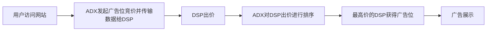

参考书籍：
- [《机器学习高级实践·计算广告、供需预测、智能营销、动态定价》机械工业出版社](https://book.douban.com/subject/36648547/)


---

# 前言

算是又开了个坑吧，之前写过B站的Recommendation System，但是理论很美好，实践出大问题。最严重的问题是正负类比例严重失衡，而且SMOTE没有丝毫作用，所以打算先学习他人的处理方法。

本文分为小型demo与项目实践两部分。
小型demo可能是对于某些数据集的解决方案，而项目实践则是对于某个项目的解决方案。比如kaggle上的好例子可能归为小型demo，而比较大的项目或者是某一类数据的分析方法则归为项目实践。

如果是他人的项目，会使用@引用。如果是自己的项目，会使用©。

---

# 1. 小型demo


---

# 2. 项目实践

## 2.1 计算广告——广告点击率预估 @《机器学习高级实践·计算广告、供需预测、智能营销、动态定价》

### 2.1.1 项目背景

#### 2.1.1.1 计算广告的目标

广告主(Demand,需求方)期望在线广告针对性更强，广告平台(Supply,供给方)期望广告点击率更高，用户期望广告更加个性化。
- **针对性**：广告能依据用户偏好精准地投放给潜在的、有需求的用户，以提高投入产出比。
- **点击率**：是广告投放效果的重要指标，是广告点击次数与广告曝光次数的比值。
- **个性化**：是指广告内容、形式、投放时间等因素能够根据用户的个性化需求进行定制。

#### 2.1.1.2 计算广告的术语

Computational Advertising：利用计算机技术、数学模型、统计方法等手段，通过对广告投放对象、广告内容、广告投放时机等进行精准分析，实现广告投放效果的最大化。

| 术语 | 全称 | 含义 |
| --- | --- | --- |
| **CTR** | Click-Through Rate, 点击率 | 点击次数÷曝光次数 |
| **CVR** | Conversion Rate, 转化率 | 转化次数÷点击次数，用户点击广告后完成特定行为Action(购买、下载等)的比例 |
| CPM | Cost Per Mille, 千次曝光成本 | 每千次曝光需支付的费用 |
| CPC | Cost Per Click, 单次点击成本 | 每次点击需支付的费用 |
| CPA | Cost Per Action, 单次行为成本 | 每次有效行为转化需支付的费用 |
| CPT | Cost Per Time, 单次时间成本 | 按播放时长计费 |
| **ROI** | Return On Investment, 投资回报率 | 收益÷成本 |

#### 2.1.1.3 计算广告的流程

<p style="color:#EC407A; font-weight:bold">1. 合约广告</p>


合约广告是单次交易，但粗粒度的广告投放方式会导致成本、收益不可控，不够理性。核心问题是：
1. 构建受众标签：聚类、分类、关联规则挖掘等
2. 事前流量预测：时序模型，如ARIMA、Prophet、LSTM、Transformer、DeepAR等
3. 在线流量分配：$\max \sum_{i=1}^{n} (r_i - c_i), \text{s.t.}  \sum_{i=1}^{n} d_i \leq D$，其中$r_i$是收入，$c_i$是成本，$d_i$是投放量，$D$是需求方的总投放量。转为为优化问题。

<p style="color:#EC407A; font-weight:bold">2. 竞价广告</p>

ADX(Ad Exchange)：广告交易平台，负责广告位的竞价、广告投放、广告效果监控等。
DSP(Demand Side Platform)：需求方平台。



竞价广告是实时交易，是精细化的广告投放方式，但是需要解决的问题更多，尤其是CTR预估与实时性。

### 2.1.2 核心算法


该部分内容在推荐系统中有详细介绍，这里不再赘述。

### 2.1.3 数据集介绍

[Ali_Display_Ad_Click](https://tianchi.aliyun.com/dataset/56)是阿里巴巴提供的一个淘宝展示广告点击率预估数据集。114万用户8天内的广告展示/点击日志（2600万条记录），用前面7天的做训练样本（20170506-20170512），用第8天的做测试样本（20170513）。
目前已有的研究：[CSDN](https://blog.csdn.net/weixin_39802763/article/details/105766042)，[CSDN](https://blog.csdn.net/sinat_28015305/article/details/108065830)

1. **ad_feature.csv 广告信息表**，29.8MB

| **属性** | adgroup_id | cate_id | campaign_id | customer | brand | price |
| --- | --- | --- | --- | --- | --- | --- |
| **解释** | 广告ID | 商品类别ID | 广告计划ID | 广告主ID | 品牌ID | 商品价格 |
| **第一行数据** | 63133 | 6406 | 83237 | 1 | 95471 | 170.0 |

- 一个广告ID对应一个商品，一个商品属于一个类目，一个商品属于一个品牌。

2. **raw_sample.csv 原始样本骨架**，用户-广告展示/点击数据，1.01GB

| **属性** | user | time_stamp | adgroup_id | pid | nonclk | clk |
| --- | --- | --- | --- | --- | --- | --- |
| **解释** | 用户ID | 日志时间戳 | 广告ID | 广告资源位 | 未点击 | 点击 |
| **第一行数据** | 581738 | 1494137644 | 1 | 430548_1007 | 1 | 0 |

- 未点击的时候，clk=0，nonclk=1

3. **user_profile.csv 用户信息表**，22.9MB

| **属性** | userid | cms_segid | cms_group_id | final_gender_code | age_level | pvalue_level | shopping_level | occupation | new_user_class_level |
| --- | --- | --- | --- | --- | --- | --- | --- | --- | --- |
| **解释** | 用户ID | 微群ID | 微群ID | 性别 | 年龄分层 | 消费能力 | 购物深度 | 职业 | 城市层级 |
| **第一行数据** | 234 | 0 | 5 | 2 | 5 |  | 3 | 0 | 3 |

- 性别：1-男，2-女
- 消费能力：1-低，2-中，3-高
- 购物深度：1-低，2-中，3-高
- 职业：是否是大学生，0-否，1-是

4. **behavior_log.csv 用户行为日志表**，22GB

| **属性** | user | time_stamp | btag | cate | brand |
| --- | --- | --- | --- | --- | --- |
| **解释** | 用户ID | 日志时间戳 | 行为类型 | 商品类别ID | 品牌ID |
| **第一行数据** | 558157 | 1493741625 | pv | 6250 | 91286 |

- 行为标签：pv-浏览，cart-加入购物车，fav-喜欢，buy-购买

5. **基线AUC：0.622**


### 2.1.4 数据预处理

#### 2.1.4.1 读取数据

因为数据过大，使用采样读取`behavior_log.csv`，并保留采样的用户，主要代码如下：

```python
n_sample = int(frac * total_rows)  # 采样的行数
behavior_log = pd.read_csv(f'{root_path}/behavior_log.csv', nrows=n_sample)
sampled_users = behavior_log['user'].unique()  # 采样的用户
raw_sample = raw_sample[raw_sample['user'].isin(sampled_users)]  # 保留采样的用户
user_profile = user_profile[user_profile['userid'].isin(sampled_users)]
```

假设选取0.5%的数据，得到的数据shape为：
```python
user_profile用户数据： (434353, 9)
raw_sample样本数据： (14884786, 6)
behavior_log用户行为数据： (3616340, 5)
ad_feature广告特征数据： (846811, 6)
```

#### 2.1.4.2 缺失值&编码

`pvalue_level, new_user_class_level`、 `brand`有缺失值，比例分别为52.70%,26.45%、29.09%。