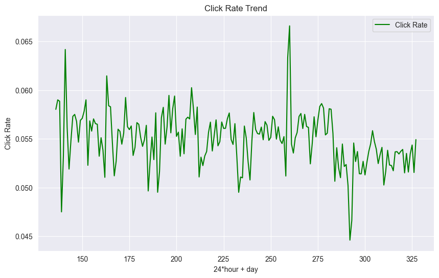

参考书籍：
- [《机器学习高级实践·计算广告、供需预测、智能营销、动态定价》机械工业出版社](https://book.douban.com/subject/36648547/)
- [《机器学习算法竞赛实战》](https://book.douban.com/subject/35595757/)，
  - 作者[知乎主页](https://www.zhihu.com/people/wang-he-13-93)

---

# 前言

算是又开了个坑吧，之前写过B站的Recommendation System，但是理论很美好，实践出大问题。最严重的问题是正负类比例严重失衡，而且SMOTE没有丝毫作用，所以打算先学习他人的处理方法。

本文分为小型demo与项目实践两部分。
小型demo可能是对于某些数据集的解决方案，而项目实践则是对于某个项目的解决方案。比如kaggle上的好例子可能归为小型demo，而比较大的项目或者是某一类数据的分析方法则归为项目实践。

如果是他人的项目，会使用@引用。如果是自己的项目，会使用©。

---

# 1. 小型demo

## 1.1 House Price - Advanced Regression Techniques 
@Kaggle, 《机器学习算法竞赛实战》

[数据集](https://www.kaggle.com/competitions/house-prices-advanced-regression-techniques)

### 1.1.1 数据集介绍

`train shape: (1460, 81), test shape: (1459, 80)`，除`ID`与`SalePrice`外，还有79个特征。

提交是根据RMSE进行评估的，所以score越小越好。

已有的研究：[kaggle](https://www.kaggle.com/code/pmarcelino/comprehensive-data-exploration-with-python)

| 代码 | 描述 | 模型 | score |
| --- | --- | --- | --- |
| D_HP_1_quick_start.ipynb | 快速开始 | `lgb`+`KFold` | 0.40853 |
| D_HP_2_data_preprocessing.ipynb | 数据预处理 | `train['SalePrice'].mean()` | 0.42577 |

### 1.1.2 数据预处理

#### 1.1.2.1 缺失值处理

```python
stats = []
for col in train.columns:
    stats.append((col, train[col].nunique(), train[col].isnull().sum() * 100 / train.shape[0],
                  train[col].value_counts(normalize=True, dropna=False).values[0] * 100, train[col].dtype))
stats_df = pd.DataFrame(stats, columns=['Feature', 'Unique_values', 'Percentage of missing values',
                                        'Percentage of values in the biggest category', 'type'])
stats_df.sort_values('Percentage of missing values', ascending=False)
```
这段代码可以查看每个特征的缺失值情况、唯一值数量、最大类别占比、数据类型，挺好用的。

#### 1.1.2.2 了解特征

后面的EDA都用这个代码，简单好用就是运行时间好长。

<div style="display: flex; justify-content: center; align-items: center;">
<div style=" max-height: 200px; max-width: 90%; overflow-y: auto; border: 1px solid #39c5bb; border-radius: 10px;">

```python
import matplotlib.pyplot as plt
import seaborn as sns
import math


def describe_and_visualize(df, table_name):
    print("\n[log] -------------------- \n")
    print(f"分析表格：{table_name}")
    print(f"表格的形状：{df.shape}")

    categorical_columns = []  # 类别型字段
    numerical_columns = []  # 数值型字段

    # 分类字段与数值字段区分
    for column in df.columns:
        if df[column].dtype == 'object' or df[column].nunique() < 30:  # 类别型或唯一值较少
            categorical_columns.append(column)
        else:
            numerical_columns.append(column)

    # 输出类别型字段的信息
    print(f"\n>>> 类别型字段（{len(categorical_columns)} 个）：{categorical_columns}")
    for column in categorical_columns:
        print(f"字段：{column}")
        print(f"{column}是类别型数据，共有{df[column].nunique()}个不同的值")
        print(df[column].value_counts())

    # 绘制类别型字段的条形图
    if categorical_columns:
        print("\n[log] 正在绘制类别型字段的统计图...")
        rows = math.ceil(len(categorical_columns) / 4)
        fig, axes = plt.subplots(rows, min(len(categorical_columns), 4), figsize=(20, 5 * rows))
        axes = axes.flatten()  # 展平方便处理
        for i, column in enumerate(categorical_columns):
            df[column].value_counts().plot(kind='bar', ax=axes[i], title=f'{column} - Count Values')
            axes[i].set_xlabel(column)
            axes[i].set_ylabel('Frequency')
        # 隐藏多余的子图
        for j in range(len(categorical_columns), len(axes)):
            axes[j].axis('off')
        plt.tight_layout()
        plt.show()

    # 输出数值型字段的信息
    print(f"\n>>> 数值型字段（{len(numerical_columns)} 个）：{numerical_columns}")
    for column in numerical_columns:
        print(f"\n字段：{column}")
        print(f"{column}是数值型数据，共有{df[column].nunique()}个不同的值")
        print(df[column].describe())

    # 绘制数值型字段的分布图
    if numerical_columns:
        print("\n[log] 正在绘制数值型字段的分布图...")
        rows = math.ceil(len(numerical_columns) / 4)
        fig, axes = plt.subplots(rows, min(len(numerical_columns), 4), figsize=(20, 5 * rows))
        axes = axes.flatten()  # 展平方便处理
        for i, column in enumerate(numerical_columns):
            sns.histplot(df[column], kde=True, bins=30, ax=axes[i])
            axes[i].set_title(f'{column} - Distribution')
            axes[i].set_xlabel(column)
            axes[i].set_ylabel('Frequency')
        # 隐藏多余的子图
        for j in range(len(numerical_columns), len(axes)):
            axes[j].axis('off')
        plt.tight_layout()
        plt.show()
```

</div>
</div>

---

# 2. 项目实践

## 2.1 计算广告——广告点击率预估 
@《机器学习高级实践·计算广告、供需预测、智能营销、动态定价》

[数据集](https://tianchi.aliyun.com/dataset/56)

| 代码 | 描述 |
| --- | --- |
| [data_preprocessing.ipynb](https://github.com/virtualxiaoman/Easier_DataScience/blob/master/data_analyse/ML_HUB/Project_AD/P_AD_1_data_preprocessing.ipynb) | 数据预处理 |
| [data_visualization.ipynb](https://github.com/virtualxiaoman/Easier_DataScience/blob/master/data_analyse/ML_HUB/Project_AD/P_AD_2_data_visualization.ipynb) | 数据可视化 |

### 2.1.1 项目背景

#### 2.1.1.1 计算广告的目标

广告主(Demand,需求方)期望在线广告针对性更强，广告平台(Supply,供给方)期望广告点击率更高，用户期望广告更加个性化。
- **针对性**：广告能依据用户偏好精准地投放给潜在的、有需求的用户，以提高投入产出比。
- **点击率**：是广告投放效果的重要指标，是广告点击次数与广告曝光次数的比值。
- **个性化**：是指广告内容、形式、投放时间等因素能够根据用户的个性化需求进行定制。

#### 2.1.1.2 计算广告的术语

Computational Advertising：利用计算机技术、数学模型、统计方法等手段，通过对广告投放对象、广告内容、广告投放时机等进行精准分析，实现广告投放效果的最大化。

| 术语 | 全称 | 含义 |
| --- | --- | --- |
| **CTR** | Click-Through Rate, 点击率 | 点击次数÷曝光次数 |
| **CVR** | Conversion Rate, 转化率 | 转化次数÷点击次数，用户点击广告后完成特定行为Action(购买、下载等)的比例 |
| CPM | Cost Per Mille, 千次曝光成本 | 每千次曝光需支付的费用 |
| CPC | Cost Per Click, 单次点击成本 | 每次点击需支付的费用 |
| CPA | Cost Per Action, 单次行为成本 | 每次有效行为转化需支付的费用 |
| CPT | Cost Per Time, 单次时间成本 | 按播放时长计费 |
| **ROI** | Return On Investment, 投资回报率 | 收益÷成本 |

#### 2.1.1.3 计算广告的流程

<p style="color:#EC407A; font-weight:bold">1. 合约广告</p>


合约广告是单次交易，但粗粒度的广告投放方式会导致成本、收益不可控，不够理性。核心问题是：
1. 构建受众标签：聚类、分类、关联规则挖掘等
2. 事前流量预测：时序模型，如ARIMA、Prophet、LSTM、Transformer、DeepAR等
3. 在线流量分配：$\max \sum_{i=1}^{n} (r_i - c_i), \text{s.t.}  \sum_{i=1}^{n} d_i \leq D$，其中$r_i$是收入，$c_i$是成本，$d_i$是投放量，$D$是需求方的总投放量。转为为优化问题。

<p style="color:#EC407A; font-weight:bold">2. 竞价广告</p>

ADX(Ad Exchange)：广告交易平台，负责广告位的竞价、广告投放、广告效果监控等。
DSP(Demand Side Platform)：需求方平台。


竞价广告是实时交易，是精细化的广告投放方式，但是需要解决的问题更多，尤其是CTR预估与实时性。

### 2.1.2 核心算法


该部分内容在推荐系统中有详细介绍，这里不再赘述。

### 2.1.3 数据集介绍

[Ali_Display_Ad_Click](https://tianchi.aliyun.com/dataset/56)是阿里巴巴提供的一个淘宝展示广告点击率预估数据集。114万用户8天内的广告展示/点击日志（2600万条记录），用前面7天的做训练样本（20170506-20170512），用第8天的做测试样本（20170513）。
目前已有的研究：[CSDN](https://blog.csdn.net/weixin_39802763/article/details/105766042)，[CSDN](https://blog.csdn.net/sinat_28015305/article/details/108065830)，[arXiv](https://arxiv.org/abs/1706.0697)，[arXiv](https://arxiv.org/abs/1704.05194)。

1. **ad_feature.csv 广告信息表**，29.8MB

| **属性** | adgroup_id | cate_id | campaign_id | customer | brand | price |
| --- | --- | --- | --- | --- | --- | --- |
| **解释** | 广告ID | 商品类别ID | 广告计划ID | 广告主ID | 品牌ID | 商品价格 |
| **第一行数据** | 63133 | 6406 | 83237 | 1 | 95471 | 170.0 |

- 一个广告ID对应一个商品，一个商品属于一个类目，一个商品属于一个品牌。

2. **raw_sample.csv 原始样本骨架**，用户-广告展示/点击数据，1.01GB

| **属性** | user | time_stamp | adgroup_id | pid | nonclk | clk |
| --- | --- | --- | --- | --- | --- | --- |
| **解释** | 用户ID | 日志时间戳 | 广告ID | 广告资源位 | 未点击 | 点击 |
| **第一行数据** | 581738 | 1494137644 | 1 | 430548_1007 | 1 | 0 |

- 未点击的时候，clk=0，nonclk=1

3. **user_profile.csv 用户信息表**，22.9MB

| **属性** | userid | cms_segid | cms_group_id | final_gender_code | age_level | pvalue_level | shopping_level | occupation | new_user_class_level |
| --- | --- | --- | --- | --- | --- | --- | --- | --- | --- |
| **解释** | 用户ID | 微群ID | 微群ID | 性别 | 年龄分层 | 消费能力 | 购物深度 | 职业 | 城市层级 |
| **第一行数据** | 234 | 0 | 5 | 2 | 5 |  | 3 | 0 | 3 |

- 性别：1-男，2-女
- 消费能力：1-低，2-中，3-高
- 购物深度：1-低，2-中，3-高
- 职业：是否是大学生，0-否，1-是

4. **behavior_log.csv 用户行为日志表**，22GB

| **属性** | user | time_stamp | btag | cate | brand |
| --- | --- | --- | --- | --- | --- |
| **解释** | 用户ID | 日志时间戳 | 行为类型 | 商品类别ID | 品牌ID |
| **第一行数据** | 558157 | 1493741625 | pv | 6250 | 91286 |

- 行为标签：pv-浏览，cart-加入购物车，fav-喜欢，buy-购买

5. **基线AUC：0.622**


### 2.1.4 数据预处理与初步分析

#### 2.1.4.1 读取数据

源代码请查看[data_preprocessing.ipynb](https://github.com/virtualxiaoman/Easier_DataScience/blob/master/data_analyse/ML_HUB/Project_AD/P_AD_1_data_preprocessing.ipynb) 。

因为数据过大，使用采样读取`behavior_log.csv`，并保留采样的用户，主要代码如下：

```python
n_sample = int(frac * total_rows)  # 采样的行数
behavior_log = pd.read_csv(f'{root_path}/behavior_log.csv', nrows=n_sample)
sampled_users = behavior_log['user'].unique()  # 采样的用户
raw_sample = raw_sample[raw_sample['user'].isin(sampled_users)]  # 保留采样的用户
user_profile = user_profile[user_profile['userid'].isin(sampled_users)]
```

假设选取0.1%(即使0.1%也很大了)的`behavior_log.csv`数据，采样其他表格，最后得到的数据shape为：
```python
user_profile用户数据： (185915, 9)
raw_sample样本数据： (7114606, 6)
behavior_log用户行为数据： (723268, 5)
ad_feature广告特征数据： (846811, 6)
```

顺便，对同一含义的不同列名进行统一，统一为`user_id`和`cate_id`。


#### 2.1.4.2 缺失值&编码

`pvalue_level, new_user_class_level`、 `brand`有缺失值，比例分别为52.70%,26.45%、29.09%。在初步分析阶段暂时不做缺失值处理。
> new_user_class_level为分类属性，众数填充；brand为id类数据，填充上一条数据的值；pvalue_level通过KNN算法进行预测填充(train是pvalue_level≠0的行，test是pvalue_level=0的行。X是非pvalue_level属性，y是pvalue_level属性)。[来源](https://blog.csdn.net/weixin_39802763/article/details/105766042)

~~对`cate_id`, `brand`进行编码，使用`LabelEncoder`。意义不大，故不做了~~

#### 2.1.4.3 了解特征

源代码请看[data_visualization.ipynb](https://github.com/virtualxiaoman/Easier_DataScience/blob/master/data_analyse/ML_HUB/Project_AD/P_AD_2_data_visualization.ipynb) 。

下面列举部分特征的取值情况（分布较为均匀的、特征是ID的不列出，部分数据使用给出图像方便查看）：

1. **ad_feature**

基本为ID型数据，略去。

2. **raw_sample**

pid(2个取值)：

| 430548_1007 | 430539_1007 |
| --- | --- |
| 4016881 | 3097725 |

clk(2个取值)：

| 0 | 1 |
| --- | --- |
| 6722820 | 391786 |

样本不平衡率$\frac{6722820}{391786} = 17.16$，严重不平衡。$0$类占比94.5%。

<div style="display: flex; justify-content: center; align-items: center;">
    <div style="text-align: center;">
        
        <p style="font-size: small; color: gray;">用户在傍晚的数据反而较少，有可能是数据集做的时间脱敏，也可能是本身在傍晚的广告投放量较少，也可能是下班了陪伴家人或者刷视频而不会去摸鱼购物</p>
    </div>
</div>

3. **user_profile**

final_gender_code(2个取值)：

| 1 | 2 |
| --- | --- |
| 52258 | 133657 |

女性是男性的2.56倍，占71.9%。

pvalue_level消费能力(3个取值)：

| 1.0 | 2.0 | 3.0 |
| --- | --- | --- |
| 24351 | 55492 | 8467 |

大部分用户消费能力在中等水平与偏下水平。

shopping_level购物深度(3个取值)：

| 1 | 2 | 3 |
| --- | --- | --- |
| 7318 | 16606 | 161991 |

大部分用户购物深度在高水平。

occupation是否大学生(2个取值)：

| 0 | 1 |
| --- | --- |
| 174450 | 11465 |

大学生只占6.2%。

new_user_class_level城市层级(4个取值)：

| 1.0 | 2.0 | 3.0 | 4.0 |
| --- | --- | --- | --- |
| 16012 | 63962 | 33769 | 25057 |

大部分用户城市层级在中等水平与偏下水平。

<div style="display: flex; justify-content: center; align-items: center;">
    <div style="text-align: center;">
        
        <p style="font-size: small; color: gray;">分析见上文</p>
    </div>
</div>

4. **behavior_log**

btag(4个取值)：

| pv | cart | buy | fav |
| --- | --- | --- | --- |
| 688331 | 16119 | 9577 | 9241 |

加入购物车的比例是$\frac{16119}{688331} = 2.34\%$，购买的比例是$\frac{9577}{688331} = 1.39\%$。buy与fav相近，可能是用户购买之后加入了收藏，（yysy我才知道淘宝有收藏功能）具体的行为链还需要进一步分析。


day（20个取值，下面只列出最主要的3个）：

| 3 | 2 | 1 |
| --- | --- | --- |
| 641372 | 81573 | 190 |

<div style="display: flex; justify-content: center; align-items: center;">
    <div style="text-align: center;">
        
        <p style="font-size: small; color: gray;">用户在傍晚的日志反而较少，这个与之前的图raw-sample-hour-distribution类似</p>
    </div>
</div>


#### 2.1.4.4 异常值等处理

让我们转回[data_preprocessing.ipynb](https://github.com/virtualxiaoman/Easier_DataScience/blob/master/data_analyse/ML_HUB/Project_AD/P_AD_1_data_preprocessing.ipynb) 。

通过2.1.4.3的图像输出发现ad_feature的price有极高的异常值(99999999.0)，采取`ad_feature.loc[ad_feature['price'] > 999999, 'price'] = 999999`处理。

<div style="display: flex; justify-content: center; align-items: center;">
    <div style="text-align: center;">
        
        <p style="font-size: small; color: gray;">使用price_90 = np.percentile(ad_feature["price"], 90), sns.histplot(ad_feature["price"][ad_feature["price"] <= price_90], kde=False, bins=100)绘制前90%的数据</p>
    </div>
</div>

另外为了节约存储空间，这里顺便对pid进行编码。`raw_sample['pid'] = raw_sample['pid'].apply(lambda x: 1 if x == '430548_1007' else 2)`

#### 2.1.4.5 corr

回到[data_visualization.ipynb](https://github.com/virtualxiaoman/Easier_DataScience/blob/master/data_analyse/ML_HUB/Project_AD/P_AD_2_data_visualization.ipynb) 。

<div style="display: flex; justify-content: center; align-items: center;">
    <div style="text-align: center;">
        
        <p style="font-size: small; color: gray;"></p>
    </div>
</div>

后三个数据的corr较小，我们这里重点分析**用户画像**。
首先是`cms_segid`与`cms_group_id`与性别、年龄都有一定的相关性，可能是相似的用户往往会聚在一起，而这种聚集与购物深度、职业、城市层级等特征关系很小。
现在不考虑userid、cms_segid、cms_group_id这三列，`age_level`与`pvakue_level`相关性为0.25，与`occupation`相关性为-0.29，年龄越大消费能力越高，越不可能为大学生。`pvalue_level`与`occupation`和`new_user_class_level`相关性都是-0.11，说明消费能力越高越不可能为大学生，越可能是一线城市。


#### 2.1.4.6 合并数据

```python
# 1. 合并 raw_sample 和 user_profile。通过主键user_id 字段进行连接。
merged_data = pd.merge(raw_sample, user_profile, on='user_id', how='left')
# 2. 再将上述结果与 ad_feature 合并。通过主键adgroup_id 字段进行连接。
ad_u_data = pd.merge(merged_data, ad_feature, on='adgroup_id', how='left')
```
保存为`ad_u_data.csv`。
其实这等价于
```SQL
SELECT * FROM raw_sample
LEFT JOIN user_profile ON raw_sample.user_id = user_profile.userid
LEFT JOIN ad_feature ON raw_sample.adgroup_id = ad_feature.adgroup_id
```

在本次合并后，数据的shape为`(7114606, 21)`，存放在`G:/DataSets/Ali_Display_Ad_Click/processed_data/ad_u_data.csv`(654MB)里。其中包含了`raw_sample`、`user_profile`、`ad_feature`的所有信息。下面按照原先表格的顺序给出各个属性列的解释(方便查看以及喂给GPT)：

| **属性** | user_id | time_stamp | adgroup_id | pid | nonclk | clk | day | hour |
| --- | --- | --- | --- | --- | --- | --- | --- | --- |
| **解释** | 用户ID | 日志时间戳 | 广告ID | 广告资源位 | 未点击(未点击的时候，clk=0，nonclk=1) | 点击 | day | hour |

| **属性** | cms_segid | cms_group_id | final_gender_code | age_level | pvalue_level | shopping_level | occupation | new_user_class_level |
| --- | --- | --- | --- | --- | --- | --- | --- | --- |
| **解释** | 微群ID | 微群ID | 性别(1-男，2-女) | 年龄分层 | 消费能力(1-低，2-中，3-高) | 购物深度(1-低，2-中，3-高) | 职业(是否是大学生，0-否，1-是) | 城市层级 |

| **属性** | cate_id | campaign_id | customer | brand | price |
| --- | --- | --- | --- | --- | --- |
| **解释** | 商品类别ID | 广告计划ID | 广告主ID | 品牌ID | 商品价格 |

一个广告ID对应一个商品，一个商品属于一个类目，一个商品属于一个品牌。

#### 2.1.4.7 其余可视化

点击量/点击率的时间趋势：

<div style="display: flex; justify-content: center; align-items: center;">
    <div style="text-align: center;">
        
        <p style="font-size: small; color: gray;">点击与不点击的数量随时间的变化趋势，十分有规律</p>
    </div>
</div>


<div style="display: flex; justify-content: center; align-items: center;">
    <div style="text-align: center;">
        
        <p style="font-size: small; color: gray;">点击率的变化不大</p>
    </div>
</div>

二八定律：

<div style="display: flex; justify-content: center; align-items: center;">
    <div style="text-align: center;">
        
        <p style="font-size: small; color: gray;">小于20%的品牌贡献了大于80%的广告数量</p>
    </div>
    <div style="text-align: center;">
        
        <p style="font-size: small; color: gray;">约20%的用户贡献了80%的点击量</p>
    </div>
</div>

性别、价格与点击率：

<div style="display: flex; justify-content: center; align-items: center;">
    <div style="text-align: center;">
        
        <p style="font-size: small; color: gray;">男性点击的商品价格一般比女性高，并且不点击的商品价格均值也都比点击的商品要高一点点</p>
    </div>
</div>


点击率与点击量的关系：

<div style="display: flex; justify-content: center; align-items: center;">
    <div style="text-align: center;">
        
        <p style="font-size: small; color: gray;">x轴是点击的次数，点击量低的可能是某些小众群体的喜好，点击量高的可能是大众喜好，所以点击量高一点。因为平台的展示量比较固定，点击量与点击率近似成正比，所以我认为这个图体现的信息不多。</p>
    </div>
    <div style="text-align: center;">
        
        <p style="font-size: small; color: gray;">x轴是展示的次数，展示次数多的点击率更高。这可能是与平台的正反馈的一个良性循环，质量越好、投放越精准的广告能让平台给予更大的支持力度，从而更加提升点击量与点击率</p>
    </div>
</div>


#### 2.1.4.8 构建embedding向量

代码可见[P_AD_3_book_optimbyGPT](https://github.com/virtualxiaoman/Easier_DataScience/blob/master/data_analyse/ML_HUB/Project_AD/P_AD_3_book_optimbyGPT.py)，这是书上的代码经过GPT优化后的版本(文件名包含book的就是纯照抄书上的代码，加上byGPT后缀的就是经过GPT修改了的代码)。

这个代码依据id进行embedding来训练(使用点积结果与clk的BCE进行训练)，书上最后给了acc评价指标(我还加上了AUC指标)，但是我觉得这样评估不合适，如果**只是使用id**进行embedding，本身无法泛化，而valid的会被train的id泄露(请看中间的shape输出，我写了注释的)，不然怎么acc那么高呢？所以这个模型是不可靠的，只是一个embedding的示例，或者是只是为了建模每个id的embedding而已。

另外暂时无法使用pytorch复现结果(模型几乎不会去预测类别为1)，原因未知。

模型输出如下：

<div style="display: flex; justify-content: center; align-items: center;">
<div style=" max-height: 200px; max-width: 90%; overflow-y: auto; border: 1px solid #39c5bb; border-radius: 10px;">

```python
User length: 116430, Ad length: 76846
Input data: ((524761,), (524761,))   # 整个数据集，属性为user_id, adgroup_id
(419808, 2)  # 训练集的shape
(289265, 2)  # 验证集的user_id在训练集中出现的次数
(341164, 2)  # 验证集的adgroup_id在训练集中出现的次数
(227251, 2)  # 验证集的元组在训练集中出现的次数
Model: "model"
__________________________________________________________________________________________________
 Layer (type)                Output Shape                 Param #   Connected to                  
==================================================================================================
 adgroup_id (InputLayer)     [(None, 1)]                  0         []                            
                                                                                                  
 user_id (InputLayer)        [(None, 1)]                  0         []                            
                                                                                                  
 ad_embedding (Embedding)    (None, 1, 50)                3842300   ['adgroup_id[0][0]']          
                                                                                                  
 user_embedding (Embedding)  (None, 1, 50)                5821500   ['user_id[0][0]']             
                                                                                                  
 dot_product (Dot)           (None, 1, 1)                 0         ['ad_embedding[0][0]',        
                                                                     'user_embedding[0][0]']      
                                                                                                  
 reshape (Reshape)           (None, 1)                    0         ['dot_product[0][0]']         
                                                                                                  
 dense (Dense)               (None, 1)                    2         ['reshape[0][0]']             
                                                                                                  
==================================================================================================
Total params: 9663802 (36.86 MB)
Trainable params: 9663802 (36.86 MB)
Non-trainable params: 0 (0.00 Byte)
__________________________________________________________________________________________________
开始训练 Embedding 模型
Epoch 1/3
257/257 [==============================] - 24s 93ms/step - loss: 0.6397 - accuracy: 0.8784 - val_loss: 0.5675 - val_accuracy: 0.9506
Epoch 2/3
257/257 [==============================] - 22s 87ms/step - loss: 0.5073 - accuracy: 0.9496 - val_loss: 0.4113 - val_accuracy: 0.9583
Epoch 3/3
257/257 [==============================] - 22s 86ms/step - loss: 0.3709 - accuracy: 0.9581 - val_loss: 0.2943 - val_accuracy: 0.9764
评估模型性能
3280/3280 [==============================] - 2s 641us/step
Predicted 0: 102252, Predicted 1: 2701
Predicted 0 ratio: 0.97, Predicted 1 ratio: 0.03
Validation AUC: 0.9998
              precision    recall  f1-score   support

           0       0.98      1.00      0.99     99772
           1       1.00      0.52      0.69      5181

    accuracy                           0.98    104953
   macro avg       0.99      0.76      0.84    104953
weighted avg       0.98      0.98      0.97    104953
```

</div>
</div>


### 2.1.5 特征工程

书里面的代码根本没办法运行，要么参数不对，要么OOM。对应的代码是P_AD_4_FE_book.py, P_AD_5_book_model.ipynb。

### 2.1.6 ItemCF

`N`记录每个广告被点击的总人数， `C`记录每对广告共同被点击的次数。
初始化共现矩阵的简要代码如下：
```python
for userid, item in dataSet.items():
    for ad_i, _ in item.items():
        N[ad_i] += 1  # 如果广告ad_i被用户点击，点击人数加1
        for ad_j, _ in item.items():
            if ad_j != ad_i:  # 不计算广告自身的共现
                C[ad_i][ad_j] += 1  # 如果用户同时点击了广告ad_i和广告ad_j，那么这两个广告的共现次数就加1
```

`W`是最终的相似度矩阵，`W[i][j] = C[i][j] / sqrt(N[i] * N[j])`：
```python
for ad_i, item in C.items():  # 遍历每个广告i
    for ad_j, count in item.items():  # 遍历广告i的共现广告j
        W[ad_i][ad_j] = C[ad_i][ad_j] / sqrt(N[ad_i] * N[ad_j])  # 余弦相似度
```

推荐方法有两种：
1. 基于物品的协同过滤：对于某个广告$i$，找到与广告$i$相似的广告$\mathcal{D}_j$(依据`W[i][j]`)，然后对$\mathcal{D}_j$按照相似度进行排序，推荐相似度最高的`top_n`个广告。
2. 基于用户的协同过滤：对于用户$u$，计算其历史上点击过的广告集合$\mathcal{D}_i$的相似广告$\mathcal{D}_j$，然后对$\mathcal{D}_j$按照相似度进行排序，推荐相似度最高的`top_n`个广告。

最终得到结果是：

```python
---与广告10000相似的广告---
             相似度
153247  1.000000
576560  1.000000
588978  1.000000
405680  0.707107
503010  0.707107
695765  0.707107
688732  0.577350
749768  0.577350
322827  0.577350
648820  0.577350
---为用户387456推荐的广告---
  adgroup_id      推荐分数
0     156293  0.577350
1     175825  0.577350
2      26738  0.534522
3     224929  0.377964
4     500288  0.377964
5     110597  0.377964
6     466129  0.377964
7     681901  0.377964
8      29126  0.377964
9     316317  0.377964
```


### 2.1.7 NCF

<div style="display: flex; justify-content: center; align-items: center;">
    <div style="text-align: center;">
        
        <p style="font-size: small; color: gray;">Neural Collaborative Filtering</p>
    </div>
</div>

这里主要实现[NCF](https://arxiv.org/pdf/1708.05031)中的Multi-Layer Perceptron (MLP)：
用户潜在向量User Latent Vector为$P \in \mathbb{R}^{M \times K}$，物品潜在向量Item Latent Vector为$Q \in \mathbb{R}^{N \times K}$，其中$M$是用户数，$N$是物品数，$K$是潜在向量的维度。然后将其拼接为$2K$维的向量，然后通过多层感知机(使用ReLU)，最后使用无bias的全连接层和激活函数得到预测分数。

论文中还有**GMF**(Generalized Matrix Factorization)、**NeuMF**(Neural Matrix Factorization)。**GMF**是MF的一种推广，使用element-wise的乘法(即哈达玛积，这里wise是way方法的意思)来模拟用户和物品之间的潜在特征交互。**NeuMF**将GMF和MLP的输出连接在一起，然后通过一个全连接层来预测评分。

参考资料：[Neural Collaborative Filtering](https://arxiv.org/pdf/1708.05031)、[知乎](https://zhuanlan.zhihu.com/p/158417209)。

作者的代码在[github](https://github.com/hexiangnan/neural_collaborative_filtering/tree/master)，还有其他人实现的[PyTorch版本](https://github.com/HeartbreakSurvivor/RsAlgorithms/blob/main/NCF/network.py)，我的代码在[github](https://github.com/virtualxiaoman/Easier_DataScience/blob/master/data_analyse/ML_HUB/Project_AD/P_AD_7_NCF_byGPT.py)。简化版本的模型代码如下，首先是嵌入：
```python
self.user_embedding = nn.Embedding(num_users, embedding_dim)
self.ad_embedding = nn.Embedding(num_ads, embedding_dim)
user_emb = self.user_embedding(user_id)
ad_emb = self.ad_embedding(adgroup_id)
```

GMF：
```python
self.fc = nn.Linear(embedding_dim, 1)
x = user_emb * ad_emb  # Element-wise multiplication
x = self.fc(x)
return torch.sigmoid(x).squeeze()
```

MLP：
```python
x = torch.cat([user_emb, ad_emb], dim=-1)  # 拼接用户和广告组的嵌入
x = self.relu(self.fc1(x))  # 全连接层，后面可以继续加dropout, fc2, fc3等层
  ...
return self.sigmoid(x).squeeze()  # Sigmoid 输出概率
```

NeuMF：
```python
self.fc = nn.Linear(mf_embedding_dim + mlp_hidden_dim, 1)
predict_vector = torch.cat([mf_output, mlp_output], dim=-1)  # Concatenate the outputs of GMF and MLP parts
prediction = torch.sigmoid(self.fc(predict_vector))  # Final prediction layer
```

注意，在我的实现里面使用带权重的`BCEWithLogitsLoss`，所以最后一层不需要`sigmoid`。如果不带权重，acc较高但是auc很低。如果加上权重，auc会高一些，结果如下：
```python
Epoch [100/100], Train Loss: 0.0786, Train Accuracy: 0.9816, Train AUC: 0.9916, Val Loss: 11.7236, Val Accuracy: 0.8234, Val AUC: 0.5455
Classification Report (Test):
              precision    recall  f1-score   support

         0.0       0.95      0.86      0.90     18894
         1.0       0.08      0.21      0.11      1106

    accuracy                           0.82     20000
   macro avg       0.51      0.53      0.51     20000
weighted avg       0.90      0.82      0.86     20000
```
上面的训练在epoch较大(30~40)的时候auc开始下降(train的上升，valid的下降)。

如果加上过采样，最初结果基本一致。结果如下：
```python
Epoch [100/100], Train Loss: 0.0595, Train Accuracy: 0.9901, Train AUC: 0.9909, Val Loss: 9.9872, Val Accuracy: 0.4651, Val AUC: 0.5117
Classification Report (Test):
              precision    recall  f1-score   support

         0.0       0.95      0.46      0.62     18894
         1.0       0.06      0.55      0.10      1106

    accuracy                           0.47     20000
   macro avg       0.50      0.50      0.36     20000
weighted avg       0.90      0.47      0.59     20000
```

首先，二者都有问题：
1. 过拟合+类别不平衡，debuff叠满了。
2. 第二种方法使用`SMOTE(sampling_strategy='minority')`，过采样可能导致了模型对少数类的过度拟合，因为过采样的少数类样本可能与真实的用户行为不符(与现实数据分布不一致)。注意到`SMOTE`后，模型的R基本都是0.5了(随机猜测)，而且1的R更高一些，说明模型学到的是过采样的特征，而不是真实的特征。

修改学习率 `optimizer = optim.Adam(model.parameters(), lr=0.0005, weight_decay=1e-5)`、dropout从0.2到0.5 `model = NCFModel(num_users=train_dataset.num_users, num_ads=train_dataset.num_ads, dropout=0.5).to(device)`参数后，结果如下：
```python
Epoch [100/100], Train Loss: 0.1323, Train Accuracy: 0.9754, Train AUC: 0.9799, Val Loss: 6.0587, Val Accuracy: 0.8890, Val AUC: 0.5630
Test Accuracy: 0.8890, Test AUC: 0.5630

Classification Report (Test):
              precision    recall  f1-score   support

         0.0       0.95      0.93      0.94     18894
         1.0       0.10      0.13      0.12      1106

    accuracy                           0.89     20000
   macro avg       0.53      0.53      0.53     20000
weighted avg       0.90      0.89      0.90     20000
```
如果在`epoch=30`处早停，结果几乎一致。
