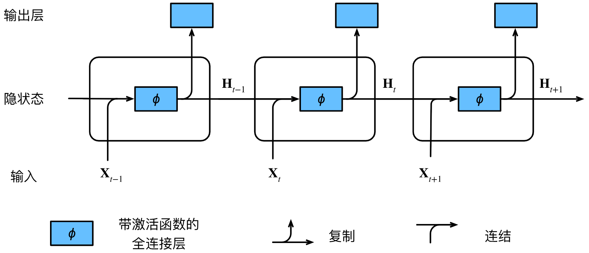
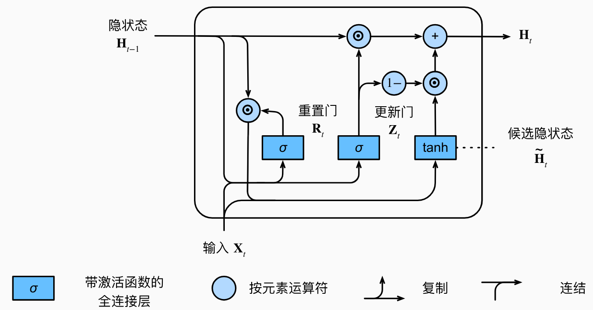
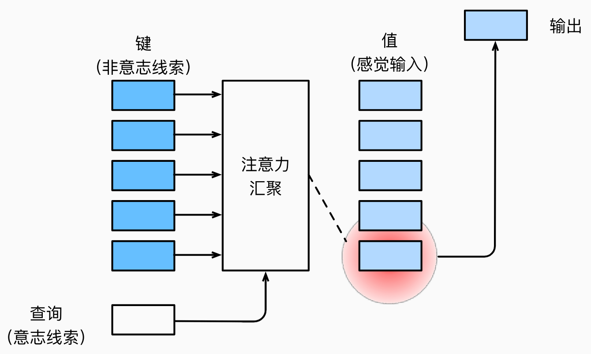
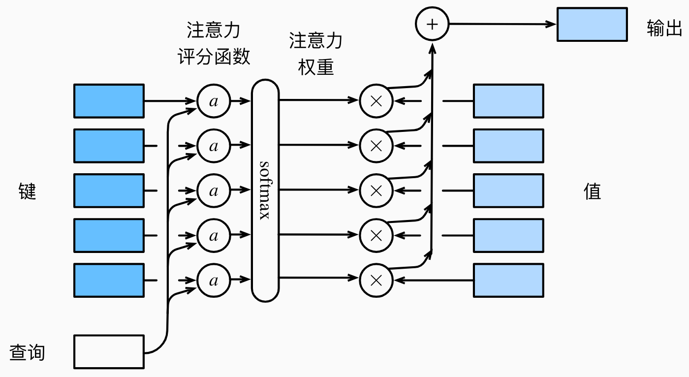
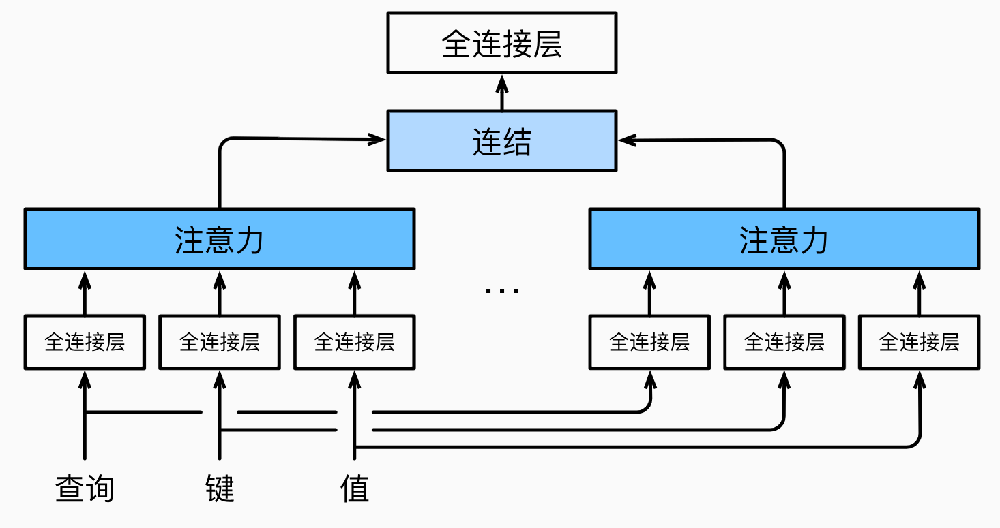

# 1. shape

简表：

|名称|`nn.`|输入参数|输入shape|输出shape|
|:---:|:---:|:---:|:---:|:---:|
|[激活函数](https://pytorch.org/docs/stable/generated/torch.nn.ReLU.html)|`Relu`|\ |*|*|
|[展平层](https://pytorch.org/docs/stable/generated/torch.nn.Flatten.html)|`Flatten`|[start_dim=1, end_dim=-1]|[batch_size, $*$]|[batch_size, $\prod *$]|
|[线性层](https://pytorch.org/docs/stable/generated/torch.nn.Linear.html)|`Linear`|in_features, out_features|[$*$, in_features]|[$*$, out_features]|
|[CNN](https://pytorch.org/docs/stable/generated/torch.nn.Conv2d)|`Conv2d`|in_channels, out_channels, kernel_size|[$N$, in_channels, $h$, $w$]|[$N$, out_channels, $h_{out}$, $w_{out}$]|
|[汇聚层](https://pytorch.org/docs/stable/generated/torch.nn.MaxPool2d.html)|`MaxPool2d`|kernel_size|[$N$, $C$, $H$, $W$]|[$N$, $C$, $H_{out}$, $W_{out}$]|
|[归一化](https://pytorch.org/docs/stable/generated/torch.nn.BatchNorm2d)|`BatchNorm2d`|channels|[$N$, $C$, $H$, $W$]|[$N$, $C$, $H$, $W$]|
|[RNN](https://pytorch.org/docs/stable/generated/torch.nn.RNN.html)|`RNN`|input_size, hidden_size, num_layers|[seq_len, $N$, input_size]|[seq_len, $N$, hidden_size]|

**表的一些约定**：
- 对于一个名称，如果存在多个对应链接，一般取最常用的那个。
- 维度变量的表示：比如图片的输入维度一般是[batch_size, channels, height, width]，也会使用in_前缀或下标$_{in}$来区分变换前后的维度，也会使用[$N$, $C$, $H$, $W$]等简化表示。一般地，大部分情况下会使用$N$来简化表示batch_size。
- 符号：shape里的$*$代表代表任意数量的维度，输入参数里的[]用于表示可选参数。
- 还没填到表里的：深度可分离卷积、膨胀卷积

**补充说明**：
- **`Flatten`层**：所有非batch维度展平成一个维度，所以输出的是二维的。
- **`CNN`层**：`in_channels`是输入的通道数，`out_channels`是输出的通道数，`kernel_size`是卷积核的大小，`stride`是步长，`padding`是填充，`dilation`是膨胀率。
$$\begin{aligned}
H_{out}&=\left \lfloor \frac{H_{in}+2\times \text{padding}[0]-\text{dilation}[0]\times (\text{kernel\_size}[0]-1)-1}{\text{stride}[0]}+1\right \rfloor \\
W_{out}&=\left \lfloor \frac{W_{in}+2\times \text{padding}[1]-\text{dilation}[1]\times (\text{kernel\_size}[1]-1)-1}{\text{stride}[1]}+1\right \rfloor 
\end{aligned}$$上式的shape计算也适用于汇聚层。
- **`Norm`层**：对于`Batch`是对每个通道进行归一化，对于`Layer`是对每个样本进行归一化，对于`Instance`是对每个通道的每个样本进行归一化。输入输出的shape是一样的。
- **`RNN`层**：`num_layers`是层数，`seq_len`是序列长度，`hidden_size`是隐状态的维度，`input_size`是输入的维度。
输入：`input`：[seq_len, $N$, input_size]，`h_0`：[num_layers, $N$, hidden_size]。
输出：`output`：[seq_len, $N$, hidden_size]，`h_t`：[num_layers, $N$, hidden_size]。


# 2. 激活函数

# 3. 损失函数

一般使用$L$是我简化后的表达式，使用$\ell$是pytorch官方的表达式。

1. [CrossEntropyLoss](https://pytorch.org/docs/stable/generated/torch.nn.CrossEntropyLoss.html)
$$ L = -\text{ln} \frac {e^{x_{target}}} {\sum_{c \in C} e^{x_c}} $$
$$ \ell(x,y)=L=\{l_1,\ldots,l_N\}^\top,\quad l_n=-w_{y_n}\log\frac{\exp(x_{n,y_n})}{\sum_{c=1}^C\exp(x_{n,c})}\cdot1\{y_n\neq\text{ignore}_\text{index}\} $$

```python
y = torch.LongTensor([0])
z = torch.Tensor([[0.2, 0.1, -0.1]])
criterion = torch.nn.CrossEntropyLoss()
loss = criterion(z, y)
print(loss)  # tensor(0.9729)
p = torch.exp(z[0, y]) / torch.sum(torch.exp(z[0]))  # tensor([0.3780])
loss = -math.log(p.item())
print(loss)  # 0.9729189784937841
```

# 4. 优化器

# 5. 正则化、标准化

# 6. 数据处理
## 6.1. 数据增强
### 6.1.1. 图像增广

使用方法：
```python
train_augs = torchvision.transforms.Compose([torchvision.transforms.RandomHorizontalFlip(),
                                             torchvision.transforms.ToTensor()])
test_augs = torchvision.transforms.Compose([torchvision.transforms.ToTensor()])
def load_cifar10(is_train, augs, batch_size):
    dataset = torchvision.datasets.CIFAR10(root="../data", train=is_train, transform=augs, download=True)
    dataloader = torch.utils.data.DataLoader(dataset, batch_size=batch_size, shuffle=is_train)
    return dataloader
train_iter = load_cifar10(True, train_augs, batch_size)
test_iter = load_cifar10(False, test_augs, batch_size)
```
1. **翻转和裁剪**
  - 左右翻转：`torchvision.transforms.RandomHorizontalFlip(p=0.5)`，`p`是概率。
  - 上下翻转：`torchvision.transforms.RandomVerticalFlip(p=0.5)`，`p`是概率。
  - 随机裁剪：`torchvision.transforms.RandomResizedCrop((200, 200), scale=(0.1, 1), ratio=(0.5, 2))`，`size`是裁剪后的大小，`scale`是裁剪比例范围，`ratio`是裁剪长宽比范围。这个代码将随机裁剪一个面积为原始面积10%~100%的区域，该区域的宽高比从0.5～2之间随机取值，然后缩放到200*200像素。

2. **旋转和平移**
 - 旋转：`torchvision.transforms.RandomRotation(degrees=45)`，`degrees`是旋转角度范围，即原始角度加减45度之间的随机数。
 - 平移：`torchvision.transforms.RandomAffine(degrees=0, translate=(0.1, 0.1))`，`degrees`是旋转角度范围，`translate`是平移范围。

3. **亮度、对比度、饱和度、色调**
亮度brightness、对比度contrast、饱和度saturation、色调hue：
`torchvision.transforms.ColorJitter(brightness=0.5, contrast=0.5, saturation=0.5, hue=0.5)`，`brightness`是亮度变化范围，即原始亮度乘以0.5~1.5之间的随机数，其余一样。


4. **噪声和模糊**
 - 噪声：`torchvision.transforms.Lambda(lambda x: x + 0.1 * torch.randn_like(x))`，这个代码将输入张量的每个元素加上一个服从正态分布的噪声。
 - 模糊：`torchvision.transforms.GaussianBlur(kernel_size=5)`，`kernel_size`是模糊核大小。


5. **归一化**
 - `torchvision.transforms.Normalize(mean=[0.485, 0.456, 0.406], std=[0.229, 0.224, 0.225])`，`mean`是均值，`std`是标准差。


# 7. 经典网络

## 7.1 AlexNet

## 7.2 VGG

## 7.3 GoogLeNet

## 7.4 ResNet

## 7.5 DenseNet

## 7.6 SENet

## 7.7 UNet
<div align=center>
    
</div>


# 8. 深度学习模型

## 8.1. MLP
Multi-Layer Perceptron多层感知机

## 8.2. CNN
Convolutional Neural Network卷积神经网络

## 8.3. RNN
Recurrent Neural Network循环神经网络
<p style="color:#EC407A; font-weight:bold">1. 基本的RNN</p>

之前都是默认数据来自于某种分布，并且所有样本都是独立同分布的。序列信息需要RNN来处理。
对于$n$元语言模型 $P(x_t\left|x_{t-1},...,x_1\right)$,若词表大小是$\left|V\right|$,则其成本是$\left|V\right|^n$,所以需要简化为：$P(x_t\left|x_{t-1},\ldots,x_1\right)\approx P(x_t\left|h_{t-1}\right)$,并使用$h_t=f(x_t,h_{t-1})$更新隐状态。
对于具体的RNN模型：
隐藏层输出$H_t \in\mathbb{R}^{n\times h}$的计算公式如下：
$${H}_t=\phi({X}_t{W}_{xh}+{H}_{t-1}{W}_{hh}+{b}_h)$$式中，$D$是输入维度，$h$是隐状态维度，$n$是批量大小，$t$是时间步，$X_t \in\mathbb{R}^{n\times D} $是输入，$H_t \in\mathbb{R}^{n\times h}$是隐状态，$W_{xh} \in\mathbb{R}^{D\times h}$和$W_{hh} \in\mathbb{R}^{h\times h}$是权重，$b_h \in\mathbb{R}^{1\times h}$是偏置(求和时使用广播机制)，$\phi$是激活函数。需要注意的是，不同时间步的权重是一样的，所以$W_{xh},W_{hh},b_h$是共享的。
输出层的输出的计算公式如下：
$${O}_t={H}_t{W}_{hq}+{b}_q$$式中，$O_t \in\mathbb{R}^{n\times q}$是输出，$W_{hq} \in\mathbb{R}^{h\times q}$是权重，$b_q \in\mathbb{R}^{1\times q}$是偏置(求和时使用广播机制)。同样的，$W_{hq},b_q$是共享的。
网络结构如下：
<div align=center>
    
</div>

评价语言模型的标准是**困惑度**(perplexity)，对于一篇长度为$n$的文本$W=(x_1,x_2,\ldots,x_n)$，困惑度的计算公式如下：
$$\text{perplexity}(W)=\exp\left(-\frac1n\sum_{t=1}^n\log P(x_t\mid x_{t-1},\ldots,x_1)\right)$$当困惑度为$k$时，表示有$k$个等可能的词来预测下一个词。

RNN的不同变种：
<div align=center>
    
</div>

<p style="color:#EC407A; font-weight:bold">2. GRU</p>
gated recurrent unit门控循环单元
<div align=center>
    
</div>

重置门$R\in \mathbb{R}^{n\times h}$允许我们控制可能还想记住的过去状态的数量；更新门$Z\in \mathbb{R}^{n\times h}$将允许我们控制新状态中有多少个是旧状态的副本。简而言之：
- **重置门**reset gate打开时，模型在这个时间步就像一个基本的RNN单元一样，会**使用整个隐状态**$H_{t-1}$来计算新的状态，有助于捕获序列中的**短期**依赖关系；
- **更新门**update gate打开时，模型在这个时间步几乎不更新隐状态$H_t$，就像**跳过**了这个时间步，有助于捕获序列中的**长期**依赖关系。
(打开的意思就是其值接近1)

计算公式如下：
$$\begin{aligned}
{R}_t&=\sigma({X}_t{W}_{xr}+{H}_{t-1}{W}_{hr}+{b}_r)\in (0,1)\\
{Z}_t&=\sigma({X}_t{W}_{xz}+{H}_{t-1}{W}_{hz}+{b}_z)\in (0,1)\end{aligned}$$其中，$\sigma$是sigmoid函数，$W_{xr},W_{hr},b_r,W_{xz},W_{hz},b_z$的维度是$D\times h,h\times h,1\times h$并且参数共享。下面的$\tilde{H}_t$公式里的$W,b$也是如此。
候选隐状态$\tilde{H}_t\in \mathbb{R}^{n\times h}$的计算公式如下：
$$\tilde{{H}}_t=\tanh({X}_t{W}_{xh}+({R}_t\odot{H}_{t-1}){W}_{hh}+{b}_h)\in (-1,1)$$该式与RNN的隐状态计算公式基本一致，只是使用$\tanh$激活函数(为了保证输出在$(-1,1)$之间)并且多了一个重置门(当$R_t$接近1时与普通的RNN一致，当$R_t$接近0时会忽略掉$H_{t-1}$)。
最终的隐状态$H_t\in \mathbb{R}^{n\times h}$的计算公式如下：
$$H_t=Z_t\odot{H}_{t-1}+(1-Z_t)\odot\tilde{H}_t$$这个式子的意思是，如果更新门$Z_t$接近1，那么新的隐状态$H_t$就会接近于旧的隐状态$H_{t-1}$；如果更新门$Z_t$接近于0，那么$H_t$就会接近于候选隐状态$\tilde{H}_t$。

<p style="color:#EC407A; font-weight:bold">3. LSTM</p>
Long Short-Term Memory长短期记忆
<div align=center>
    
</div>

输入门$I\in \mathbb{R}^{n\times h}$允许我们控制新输入的数量；遗忘门$F\in \mathbb{R}^{n\times h}$允许我们控制过去状态的数量；输出门$O\in \mathbb{R}^{n\times h}$允许我们控制输出的数量。简而言之：
- **输入门**input gate打开时，模型允许当前输入$X_t$影响**新的记忆元**$C_t$，有助于捕获序列中的短期依赖关系。
- **遗忘门**forget gate打开时，模型保留更多的**过去状态信息**$C_{t-1}$，有助于捕获序列中的长期依赖关系。
- **输出门**output gate打开时，模型允许**当前记忆元**$C_t$影响隐状态输出$H_t$，有助于捕获短期和长期依赖关系。

计算公式如下：
$$\begin{aligned}
{I}_t&=\sigma({X}_t{W}_{xi}+{H}_{t-1}{W}_{hi}+{b}_i)\in (0,1)\\
{F}_t&=\sigma({X}_t{W}_{xf}+{H}_{t-1}{W}_{hf}+{b}_f)\in (0,1)\\
{O}_t&=\sigma({X}_t{W}_{xo}+{H}_{t-1}{W}_{ho}+{b}_o)\in (0,1)\end{aligned}$$其中，$\sigma$是sigmoid函数，$W_{xi},W_{hi},b_i,W_{xf},W_{hf},b_f,W_{xo},W_{ho},b_o$的维度是$D\times h,h\times h,1\times h$并且参数共享。下面的$\tilde{C}_t$公式里的$W,b$也是如此。
候选记忆元$\tilde{C}_t\in \mathbb{R}^{n\times h}$的计算公式如下：
$$\tilde{{C}}_t=\tanh({X}_t{W}_{xc}+{H}_{t-1}{W}_{hc}+{b}_c)$$该式与RNN的隐状态计算公式基本一致，只是使用$\tanh$激活函数(为了保证输出在$(-1,1)$之间)。
记忆元$C_t\in \mathbb{R}^{n\times h}$的计算公式如下：
$$C_t=F_t\odot{C}_{t-1}+I_t\odot\tilde{C}_t$$这个式子的意思是，如果遗忘门$F_t$接近1，那么新的记忆元$C_t$就会接近于旧的记忆元$C_{t-1}$；如果遗忘门$F_t$接近于0，那么$C_t$就会接近于候选记忆元$\tilde{C}_t$。
最终的隐状态$H_t\in \mathbb{R}^{n\times h}$的计算公式如下：
$$H_t=O_t\odot\tanh(C_t)$$这个式子的意思是，输出门$O_t$控制着细胞状态$C_t$的信息流向隐状态$H_t$。

<p style="color:#EC407A; font-weight:bold">4. 深度循环神经网络</p>

<div align=center>
    
</div>

深度循环神经网络的隐藏层输出$H_t^{(l)}\in\mathbb{R}^{n\times h^{(l)}}$的计算公式如下：
$${H}_t^{(l)}=\phi_l({H}_t^{(l-1)}{W}_{xh}^{(l)}+{H}_{t-1}^{(l)}{W}_{hh}^{(l)}+{b}_h^{(l)})$$其中$H_t^{(l)}\in\mathbb{R}^{n\times h^{(l)}}$是第$l$层的隐状态，$W_{xh}^{(l)}\in\mathbb{R}^{h^{(l-1)}\times h^{(l)}}$和$W_{hh}^{(l)}\in\mathbb{R}^{h^{(l)}\times h^{(l)}}$是第$l$层的权重，$b_h^{(l)}\in\mathbb{R}^{1\times h^{(l)}}$是第$l$层的偏置，$\phi_l$是第$l$层的激活函数，$H_t^{(0)}=X_t\in\mathbb{R}^{n\times D}$是输入，$H_t^{(L)}\in\mathbb{R}^{n\times h^{(L)}}$是输出，$L$是层数。
输出层的输出的计算公式如下：
$${O}_t={H}_t^{(L)}{W}_{hq}+{b}_q$$其中$O_t\in\mathbb{R}^{n\times q}$是输出，$W_{hq}\in\mathbb{R}^{h^{(L)}\times q}$是权重，$b_q\in\mathbb{R}^{1\times q}$是偏置。

<p style="color:#EC407A; font-weight:bold">5. 双向循环神经网络</p>

<div align=center>
    
</div>

双向循环神经网络的隐藏层输出$H_t^{(f)}\in\mathbb{R}^{n\times h}$(正向，也记为$\overrightarrow{H}_t$)和$H_t^{(b)}\in\mathbb{R}^{n\times h}$(反向，也记为$\overleftarrow{H}_t$)的计算公式如下：
$$\begin{aligned}
\overrightarrow{{H}}_{t}&=\phi({X}_t{W}_{xh}^{(f)}+\overrightarrow{{H}}_{t-1}{W}_{hh}^{(f)}+{b}_h^{(f)})\\
\overleftarrow{{H}}_{t}&=\phi({X}_t{W}_{xh}^{(b)}+\overleftarrow{{H}}_{t+1}{W}_{hh}^{(b)}+{b}_h^{(b)})\end{aligned}$$其中W,b的shape和上面的一样，是$D\times h,h\times h,1\times h$，$\phi$是激活函数。最终的隐状态$H_t\in\mathbb{R}^{n\times 2h}$的计算公式如下：
$$H_t=[\overrightarrow{H}_t,\overleftarrow{H}_t]$$输出层的输出的计算公式如下：
$${O}_t={H}_t{W}_{hq}+{b}_q$$其中$O_t\in\mathbb{R}^{n\times q}$是输出，$W_{hq}\in\mathbb{R}^{2h\times q}$是权重，$b_q\in\mathbb{R}^{1\times q}$是偏置。
需要注意的是，实际使用中不一定能得到$\overleftarrow{H}_t$，所以将不会得到很好的精度。并且训练速度很慢，梯度链过长。可以用于填充缺失的单词、词元注释等。

<p style="color:#EC407A; font-weight:bold">6. 编码器-解码器架构</p>

<div align=center>
    
</div>

**输入序列**$X = {x_1, x_2, ..., x_T}$，其中 $x_t \in \mathbb{R}^d$ 表示时间步 $t$ 的输入向量，$d$ 是输入向量的维度。
**编码器**将输入序列映射到隐状态序列$H={h_1, h_2, ..., h_T} = \text{Encoder}(X)$，其中$h_t \in \mathbb{R}^h$表示时间步$t$的隐状态。
**解码器**接收编码器的隐状态(解码器的初始隐状态通常是编码器最后一个时间步的隐状态，也可以是全部隐状态的函数$c=q(h_1,...,h_T)$)，并生成目标序列${y_1, y_2, ..., y_{T'}}$，其中$y_t \in \mathbb{R}^d$表示时间步$t$的输出向量。
**输出序列**$Y = {y_1, y_2, ..., y_{T'}} = \text{Decoder}(H)$，其中$T'$是输出序列的长度。
图中**右侧的输入**指的是解码器在每个时间步接收的前一时间步的输出$y_{t-1}$。


<p style="color:#EC407A; font-weight:bold">7. seq2seq</p>

<div align=center>
    
    <p><small>eos表示序列结束词元，一旦输出序列生成此词元，模型就会停止预测。</br>bos表示序列开始词元，它是解码器的输入序列的第一个词元。</small></p>
</div>

遵循编码器－解码器架构的设计原则，循环神经网络**编码器**使用长度可变的序列作为输入，将其转换为**固定形状的隐状态**。换言之，输入序列的信息被编码到循环神经网络编码器的隐状态中。
为了连续生成输出序列的词元，独立的循环神经网络**解码器**是基于输入序列的编码信息和输出序列已经看见的或者生成的词元来预测下一个词元。可以使用循环神经网络编码器最终的隐状态来**初始化**解码器的隐状态，也可以让编码器最终的隐状态在**每一个时间步**都作为解码器的输入序列的一部分。

<div align=center>
    
    <p><small>训练时解码器的输入是已知序列(强制教学teacher forcing)，而预测时解码器的输入是模型生成的上一步输出。</small></p>
</div>

在预测时，如果每次选择概率最大的词元，那么模型可能会陷入**重复**或**循环**的输出序列中，并且贪心本来就不能保证概率最大化。为了解决这个问题，可以使用**束搜索**beam search，它在每个时间步都会保留$k$(束宽)个当前概率最大的备选输出序列，直到生成了eos词元。贪心搜索可以束宽为1的束搜索。

## 8.4. 注意力机制
分为：
- 由于突出性的**非自主性**提示，如全连接层、汇聚层。
- 依赖于任务的意志提示，即**自主性**提示，这将注意力机制与全连接层或汇聚层区别开来。

自主性提示被称为查询`query`。给定任何查询，注意力机制通过注意力汇聚`attention pooling`将选择引导至感官输入`sensory inputs`(例如中间特征表示)。在注意力机制中，这些感官输入被称为值`value`。更通俗的解释，每个值都与一个键`key`配对，这可以想象为感官输入的非自主提示：
<div align=center>
    
</div>

<p style="color:#EC407A; font-weight:bold">1. 非参数注意力汇聚 Nadaraya-Watson核回归</p>

$$f(x)=\sum_{i=1}^n\frac{K(x-x_i)}{\sum_{j=1}^nK(x-x_j)}y_i=\sum_{i=1}^n\alpha(x,x_i)y_i$$式中，$K$是核函数，$\alpha$是注意力权重($x$和$x_i$的相似度)，$x$是查询，$(x_i,y_i)$是键值对。查询$x$的输出是值$y_i$的加权和。
将高斯核$K(u)=\frac1{\sqrt{2\pi}}\exp(-\frac{u^2}2)$代入可得：
$$\begin{aligned}
f(x)&=\sum_{i=1}^n\frac{\exp(-\frac{(x-x_i)^2}2)}{\sum_{j=1}^n\exp(-\frac{(x-x_j)^2}2)}y_i\\
&=\sum_{i=1}^n\text{softmax}\left(-\frac12(x-x_i)^2\right)y_i\end{aligned}$$

<p style="color:#EC407A; font-weight:bold">2. 带参数注意力汇聚</p>

以高斯核为例，带参数的注意力汇聚的计算公式如下：
$$f(x)=\sum_{i=1}^n\text{softmax}\left(-\frac12\left((x-x_i)w\right)^2\right)y_i$$
为了与$q,k,v$对应，将其改写为：
$$f(q)=\sum_{i=1}^n\text{softmax}\left(-\frac12\left((q-k_i)w\right)^2\right)v_i$$

<p style="color:#EC407A; font-weight:bold">3. 注意力评分函数</p>
<div align=center>
    
</div>

**注意力评分函数**就是计算查询和键之间的相似度的函数。比如上文的$-\frac12\left((q-k_i)w\right)^2$就是一个评分函数$a(q,k)$。注意力权重$\alpha$是由注意力评分函数$a(q,k)$通过softmax操作得到的：
$$\alpha(q,k_i)=\text{softmax}(a(q,k_i))=\frac{\exp(a(q,k_i))}{\sum_{j=1}^n\exp(a(q,k_j))}$$
常用的评分函数有：
- 点积评分函数：$a(q,k)=q^\top k$，式中$q,k\in\mathbb{R}^d$是查询和键。
- 加性评分函数：$a(q,k)=w_v^\top\tanh(W_qq+W_kk)$，式中$q\in\mathbb{R}^q,k\in\mathbb{R}^k$是查询和键，$w_v\in\mathbb{R}^h,W_q\in\mathbb{R}^{h\times q},W_k\in\mathbb{R}^{h\times k}$是权重参数。
- 缩放点积评分函数：$a(q,k)=\frac{q^\top k}{\sqrt{d}}$，其中$d$是查询和键的维度，又由于我们假设$q,k$都满足$\mu=0,\sigma^2=1$，所以$d$的意义是方差，这就是在标准化。

给定查询$q\in\mathbb{R}^{n\times d_q}$、键$k\in\mathbb{R}^{m\times d_k}$和值$v\in\mathbb{R}^{m\times d_v}$，输出(缩放点积注意力)$o\in\mathbb{R}^{n\times d_o}$的计算公式如下：
$$o=\text{softmax}\left(\frac{qk^\top}{\sqrt{d_k}}\right)v\in\mathbb{R}^{n\times d_v}$$由于点积需要维度匹配，所以需要满足$d_q=d_k$。因为没有额外的权重参数，所以$d_o=d_v$。

<div align=center>
    
</div>

在**多头注意力**机制中，我们可以计算$h$个不同的输出$o_i$，并将它们连接在一起并通过另一个线性变换得到最终的输出。具体来说，给定查询$q\in\mathbb{R}^{n\times d_q}$、键$k\in\mathbb{R}^{m\times d_k}$和值$v\in\mathbb{R}^{m\times d_v}$，输出$o_i\in\mathbb{R}^{n\times d_o}$的计算公式如下：
$$o_i=\text{softmax}\left(\frac{qW_i^Q(kW_i^K)^\top}{\sqrt{d_k}}\right)vW_i^V\in\mathbb{R}^{n\times p_v}$$式中，$W_i^Q\in\mathbb{R}^{d_q\times p_q},W_i^K\in\mathbb{R}^{d_q\times p_k},W_i^V\in\mathbb{R}^{d_v\times p_v}$是权重参数。同样地，满足$p_q=p_k$，$p_v=d_o$。
多头注意力机制的输出$o\in\mathbb{R}^{n\times d_o}$是这些不同输出$o_i$的连接：
$$o=\text{Concat}(o_1,\ldots,o_h)W^O$$式中，$W^O\in\mathbb{R}^{(h\cdot p_v)\times d_o}$是权重参数，$h$是头数。注意到$h=1$时，多头注意力机制就是单头注意力机制。


<p style="color:#EC407A; font-weight:bold">4. Bahdanau注意力</p>
Bahdanau 注意力（也称为 Additive Attention）是一种在序列到序列模型（如机器翻译）中广泛使用的注意力机制。它通过计算查询和键之间的相似度来分配权重，并利用这些权重对值进行加权求和，从而生成上下文向量。
<div align=center>
    
</div>

上下文向量$c_t'$的计算公式如下：
$${c}_{t'}=\sum_{t=1}^T\alpha({s}_{t'-1},{h}_t){h}_t$$式中，$s_{t'-1}$是解码器在时间步$t'-1$的隐状态(查询)，$h_t$是编码器在时间步$t$的隐藏状态(键、值)，$\alpha$是注意力权重，$T$是编码器的时间步数。
比如在机器翻译中，假设我们正在从`I am happy`解码法文句子`Je suis content`：
- 当前解码器状态$s_{t'-1}$：在时间步$t'-1$，解码器已经生成了`Je suis`，此时的隐状态为$s_{t'-1}$，这是查询$q$。
- 编码器状态 $h_1, h_2, h_3$：编码器将英文句子`I am happy`编码成隐藏状态序列$h_1, h_2, h_3$，分别对应于`I`,`am`,`happy`，这些是键和值。
- 计算上下文向量$c_{t'}$，然后使用它来更新解码器的状态$s_{t'}$，并预测下一个法文词元`content`。


<p style="color:#EC407A; font-weight:bold">5. 自注意力和位置编码</p>

**序列的自注意力：**
对于输入序列$X=(x_1,x_2,\ldots,x_n)$，自注意力输出序列$Y=(y_1,y_2,\ldots,y_n)$的计算公式如下：
$${y}_i=f({x}_i,({x}_1,{x}_1),\ldots,({x}_n,{x}_n))\in{\mathbb{R}}^d$$式中，$f$是注意力汇聚函数。
自注意力机制是一种特殊的注意力机制，查询、键和值都来自同一组输入。

**位置编码：**
对于输入$X\in\mathbb{R}^{n\times d}$，位置编码$P\in\mathbb{R}^{n\times d}$的计算公式如下：
$$\begin{aligned}
p_{i,2j}=\sin\left(\frac i{10000^{2j/d}}\right),
p_{i,2j+1}=\cos\left(\frac i{10000^{2j/d}}\right)\end{aligned}$$式中，$p_{i,2j}$和$p_{i,2j+1}$是位置第$i$行和隐藏单元第$2j,2j+1$列的位置编码，$d$是隐藏单元的维度。位置编码矩阵的每一行是一个位置的位置编码。最终的输出结果是$X+P$。为什么使用$+$而不是拼接？事实上，由于分块矩阵乘权重之后相当于每个块乘对应的权重后相加，也就是$+$与拼接的效果是一样的，证明如下：
- 假设使用one-hot拼接，即$X' = [X,P]^T$，那么$X'W = [X,P]^TW = XW^X + PW^P$，因为$X$本身就要乘上权重矩阵(相当于$XW^X$)，所以可以直接将位置编码$P$加到$X$上(相当于直接加上$PW^P$)。

除了捕获绝对位置信息之外，上述的位置编码还允许模型学习得到输入序列中相对位置信息。这是因为对于任何确定的位置偏移$\delta$,位置$i+ \delta$处的位置编码可以线性投影位置$i$处的位置编码来表示。令$\omega_j$ = $1/10000^{2j/d}$,对于任何确定的位置偏移$\delta$上式中的任何一对$(p_{i,2j},p_{i,2j+1})$都可以线性投影到$(p_i+\delta,2j,p_{i+\delta,2j+1})$：
$$\begin{aligned}
\begin{bmatrix}\cos(\delta\omega_j)&\sin(\delta\omega_j)\\-\sin(\delta\omega_j)&\cos(\delta\omega_j)\end{bmatrix}\begin{bmatrix}p_{i,2j}\\p_{i,2j+1}\end{bmatrix}
=&\begin{bmatrix}\cos(\delta\omega_j)\sin(i\omega_j)+\sin(\delta\omega_j)\cos(i\omega_j)\\-\sin(\delta\omega_j)\sin(i\omega_j)+\cos(\delta\omega_j)\cos(i\omega_j)\end{bmatrix}\\
=&\begin{bmatrix}\sin\left((i+\delta)\omega_j\right)\\\cos\left((i+\delta)\omega_j\right)\end{bmatrix}
=\begin{bmatrix}p_{i+\delta,2j}\\p_{i+\delta,2j+1}\end{bmatrix}
\end{aligned}$$

**CNN、RNN、self-attention的对比：**
<div align=center>
    
</div>

如上图，设序列长度为$n$
- 卷积神经网络：设卷积核大小为$k$，输入和输出的通道数量为$d$，则计算复杂度为$O(knd^2)$，最大路径长度为$O(n/k)$。
- 循环神经网络：设$d\times d$重矩阵和$d$维隐状态，则计算复杂度为$O(nd^2)$，最大路径长度为$O(n)$。
- 自注意力：设$q,k,v$都是$n\times d$的矩阵，计算复杂度为$O(n^2d)$，最大路径长度为$O(1)$。
RNN因为有$O(n)$个顺序操作，所以不便于并行计算。CNN与self-attention因为有$O(1)$个顺序操作，所以便于并行计算，但计算复杂度还是较高。

<p style="color:#EC407A; font-weight:bold">6. Transformer</p>

Transformer模型完全基于注意力机制，没有任何卷积层或循环神经网络层。
**编码器**：
由多个相同的层叠加而成的，每个层包含两个子层`sublayer`。第一个子层是**多头自注意力**(multi-head self-attention)汇聚；第二个子层是**基于位置的前馈网络**(position-wise feed-forward network)。在每个子层中，都会应用残差连接和层规范化。
- 在计算自注意力时，对于序列中任何位置的输入${x_i}\in\mathbb{R}^d$，查询、键、值都来自前一个编码器层的输出，或在第一层中来自输入嵌入(embedding)向量加上位置编码(positional encoding)。
- 残差连接确保子层的输出与输入维度一致，即$\text{sublayer}(x_i)\in\mathbb{R}^d$，从而可以进行${x_i} + \text{sublayer}(x_i)\in\mathbb{R}^d$的加法操作。加法操作之后，紧接着应用层规范化(layer normalization)。因此，输入序列对应的每个位置，Transformer编码器都将输出一个$d$维向量。

**解码器**：
也由多个相同的层叠加而成，也使用残差连接和层规范化。除了包含编码器中的两个子层之外，还在这两个子层之间插入了第三个子层，称为**编码器-解码器注意力**(encoder-decoder attention)层。
- 在编码器-解码器注意力中，查询来自前一个解码器层的输出，而键和值来自整个编码器的输出。这样可以使解码器在生成序列时关注编码器生成的上下文。
- 解码器的自注意力机制与编码器类似，但增加了掩蔽`masked`操作，以确保解码器中的每个位置只能考虑该位置之前的所有位置。这种自回归(auto-regressive)属性保证预测仅依赖于已生成的输出词元，从而保持生成过程的顺序。

<div align=center>
    
</div>

然后我们再根据上图来详细解释一下Transformer的结构，对于$q,k,v$的讲解，我们假定输入是`Good morning, I am`，输出是`happy`，$d=6$。
**编码器**：
1. **编码器输入**：输入词序列，长度为$T$，维度$(T, 1)$
2. **输入嵌入层**：因为词无法直接输入到神经网络中，所以将输入的词转换为稠密向量表示。设词序列长度为$T$，稠密向量维度为$d$，则输入输出维度为$(T, 1) \rightarrow (T, d)$
3. **位置编码层**：因为Transformer没有循环结构，不能自动捕捉序列的顺序信息，所以需要显式地添加位置信息。$(T, d) \rightarrow (T, d)$
4. **多头注意力**： 计算每个词在序列中的注意力权重，并加权求和得到新的词向量表示。$(T, d) \rightarrow (T, d)$
$q$代表当前处理的词向量，$k$代表所有词向量(用于与$q$匹配以找到关注点)，$v$则是与$k$相关联的值(其信息将被传递给$q$)。对于我们的举例，具体如下：
输入词经过词嵌入后变为$X = [x_1, x_2, x_3, x_4]^T\in \mathbb{R}^{4\times 6}$，其中每个$x_i$都是$d=6$的行向量，在多头注意力中，$Q,K,V$是通过输入向量$X$经过不同的线性变换得到的，即$Q = X * W_q, K = X * W_k, V = X * W_v$，其中每个权重$W$的维度都是$6\times 6$，得到的是$Q=[q_1,q_2,q_3,q_4]^T\in \mathbb{R}^{4\times 6}$，然后计算输出`Attention(Q, K, V) = softmax(Q * K^T / sqrt(d)) * V`$\in \mathbb{R}^{4\times 6}$，也就是通过计算注意力权重和加权求和，得到新向量表示。
5. **加&规范化**：将多头注意力的输出与输入进行残差连接，然后进行层规范化。因为残差连接可以缓解梯度消失问题，层规范化可以加速训练收敛。$(T, d) \rightarrow (T, d)$
6. **逐位前馈网络**：对每个位置的词向量进行前馈网络计算，逐位置地应用两个全连接层和一个ReLU激活函数。$(T, d) \rightarrow (T, d)$
简而言之，逐位前馈网络在实现时是`(batch_size, seq_len, d) -> (batch_size, seq_len, d_ff) -> (batch_size, seq_len, d)`的过程，而MLP是`(batch_size, input_dim) -> (batch_size, hidden_dim) -> (batch_size, output_dim)`的过程。
7. **加&规范化**：将逐位前馈网络的输出与输入进行残差连接，然后进行层规范化。$(T, d) \rightarrow (T, d)$
8. $n\times$：将上述过程重复$n$次。$(T, d) \rightarrow (T, d)$
9. **编码器输出**：编码器的输出是解码器的编码器-解码器注意力的$Q$的输入。$(T, d)$

**解码器**：
1. **解码器输入**：目标词序列，长度为$T'$，维度$(T', 1)$
2. **输入嵌入层**：将目标词转换为稠密向量表示。$(T', 1) \rightarrow (T', d)$
3. **位置编码层**：添加位置信息。$(T', d) \rightarrow (T', d)$
4. **掩码多头注意力**： 计算每个词在序列中的注意力权重，但掩蔽未来的词，防止模型在训练时看到未来的信息。简言之，就是遮蔽矩阵对角线上方的元素。$(T', d) \rightarrow (T', d)$
与编码器类似，$Y=[y_1]^T\in \mathbb{R}^{1\times 6}$，$Q,K,V$也是与$Y$线性变换得到的，得到$Q=[q_1]^T\in \mathbb{R}^{1\times 6}$，然后加权求和得到新变量$\text{Output}\in \mathbb{R}^{1\times 6}$。
5. **加&规范化**：将掩码多头注意力的输出与输入进行残差连接，然后进行层规范化。$(T', d) \rightarrow (T', d)$
6. **编码器-解码器注意力**：计算目标序列中每个词对源序列中每个词的注意力权重，使解码器能够关注编码器生成的上下文信息。输入是长度为$T'$的目标词向量序列和长度为$T$的源词向量序列，输出是新的目标词向量序列。$(T', d),(T, d) \rightarrow (T', d)$
$Q$来自解码器层的输出，$K,V$来自编码器的输出，即`Q = Decoder_Self_Attention_Output * Wq, K = Encoder_Output * Wk, V = Encoder_Output * Wv`，不妨记`Decoder_Self_Attention_Output`为$Z$，显然$Z \in \mathbb{R}^{1\times 6}$，那么$Q=Z\times W_q = \mathbb{R}^{1\times 6} \times \mathbb{R}^{6\times 6} = \mathbb{R}^{1\times 6}$，同样地，$K,V$是$\mathbb{R}^{4\times 6}$，那么在计算`Attention(Q, K, V)`的时候是$\mathbb{R}^{1\times 6}\times {(\mathbb{R}^{4\times 6})}^T\times \mathbb{R}^{4\times 6}=\mathbb{R}^{1\times 6}$，因此维度还是还原回了$\mathbb{R}^{1\times 6}$！这就是注意力机制的魅力所在！！
7. **加&规范化**：将编码器-解码器注意力的输出与输入进行残差连接，然后进行层规范化。$(T', d) \rightarrow (T', d)$
8. **逐位前馈网络**：逐位置地应用两个全连接层和一个ReLU激活函数。$(T', d) \rightarrow (T', d)$
9. **加&规范化**：将逐位前馈网络的输出与输入进行残差连接，然后进行层规范化。$(T', d) \rightarrow (T', d)$
10. $\times n$：将上述过程重复$n$次。$(T', d) \rightarrow (T', d)$
11. **全连接层**：将解码器的输出投影到词表大小的维度上，生成每个位置上词的概率分布。$(T', d) \rightarrow (T', |V|)$

建议看[李宏毅视频](https://www.youtube.com/watch?v=ugWDIIOHtPA&list=PLJV_el3uVTsOK_ZK5L0Iv_EQoL1JefRL4&index=61)，神中神。

# 9. 我的一些想法
## 1. 象形字->embedding
使用汉字的象形字图片转化为其embedding。