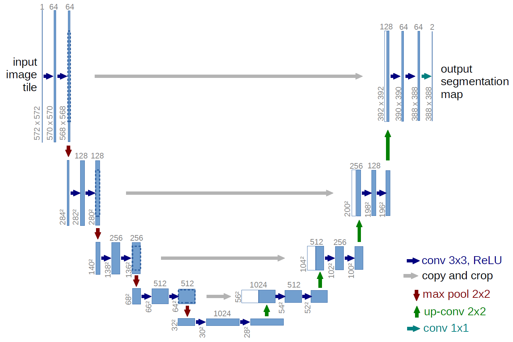
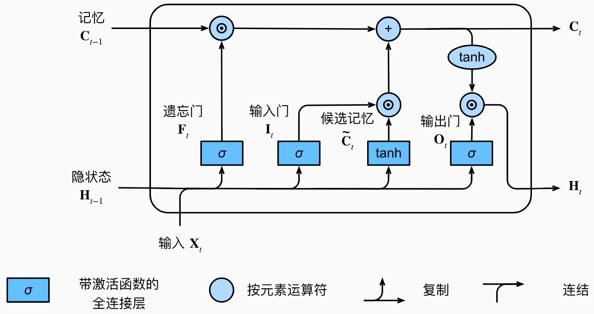
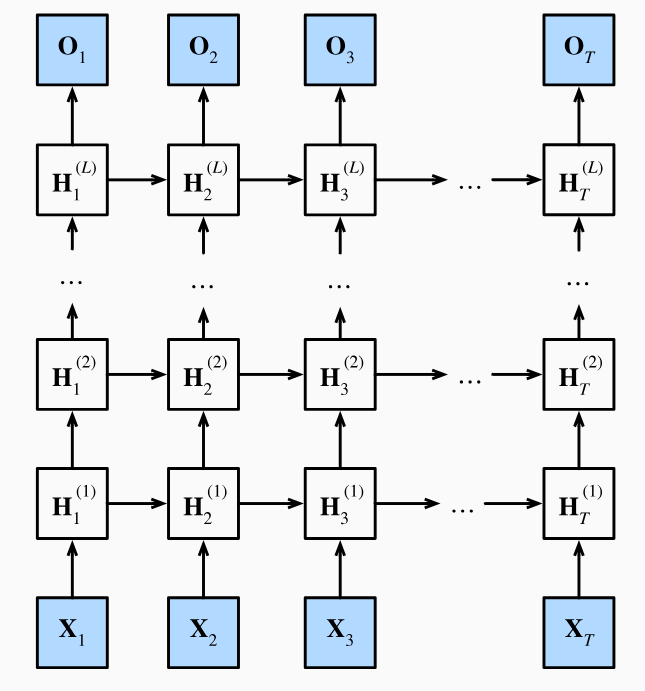
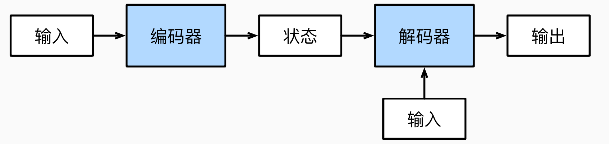
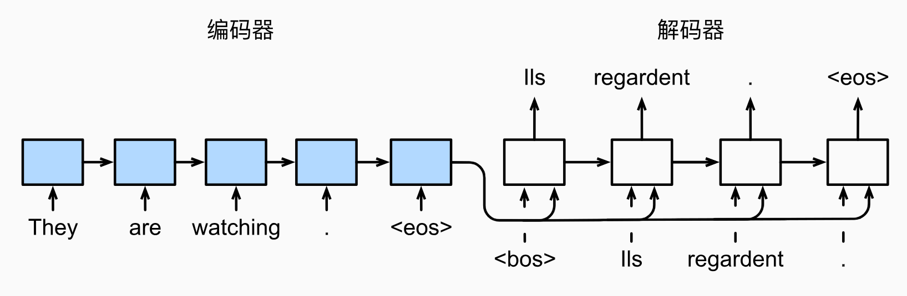

# 1. shape

简表：

|名称|`nn.`|输入参数|输入shape|输出shape|
|:---:|:---:|:---:|:---:|:---:|
|[激活函数](https://pytorch.org/docs/stable/generated/torch.nn.ReLU.html)|`Relu`|\ |*|*|
|[展平层](https://pytorch.org/docs/stable/generated/torch.nn.Flatten.html)|`Flatten`|[start_dim=1, end_dim=-1]|[batch_size, *]|[batch_size, $\prod *$]|
|[线性层](https://pytorch.org/docs/stable/generated/torch.nn.Linear.html)|`Linear`|in_features, out_features|[*, in_features]|[*, out_features]|
|[互相关](https://pytorch.org/docs/stable/generated/torch.nn.Conv2d)|`Conv2d`|in_channels, out_channels, kernel_size|[$N$, in_channels, $h$, w]|[$N$, out_channels, $h_{out}$, $w_{out}$]|
|[汇聚层](https://pytorch.org/docs/stable/generated/torch.nn.MaxPool2d.html)|`Pool2d`|kernel_size|[$N$, $C$, $h$, $w$]|[$N$, $C$, $h_{out}$, $w_{out}$]|
|[归一化](https://pytorch.org/docs/stable/generated/torch.nn.BatchNorm2d)|`BatchNorm2d`|channels|[$N$, $C$, $H$, $W$]|[$N$, $C$, $H$, $W$]|

**表的一些约定**：
- 对于一个名称，如果存在多个对应链接，一般取最常用的那个。
- 维度变量的表示：一般输入维度都是[batch_size, channels, height, width]，偶尔使用in_前缀来区分前后的维度名称，也会使用[$N$, $C$, $H$, $W$]，[$N$, $C$, $h$, $w$]等简化表示。
- 符号：*代表代表任意数量的维度，输入参数里的[]用于表示可选参数。
- 计算：限于表格大小，公式在上文给出，表格内只给出大致流程。

- 还没填到表里的：深度可分离卷积、膨胀卷积


# 2. 激活函数

# 3. 损失函数

一般使用$L$是我简化后的表达式，使用$\ell$是pytorch官方的表达式。

1. [CrossEntropyLoss](https://pytorch.org/docs/stable/generated/torch.nn.CrossEntropyLoss.html)
$$ L = -\text{ln} \frac {e^{x_{target}}} {\sum_{c \in C} e^{x_c}} $$
$$ \ell(x,y)=L=\{l_1,\ldots,l_N\}^\top,\quad l_n=-w_{y_n}\log\frac{\exp(x_{n,y_n})}{\sum_{c=1}^C\exp(x_{n,c})}\cdot1\{y_n\neq\text{ignore}_\text{index}\} $$

```python
y = torch.LongTensor([0])
z = torch.Tensor([[0.2, 0.1, -0.1]])
criterion = torch.nn.CrossEntropyLoss()
loss = criterion(z, y)
print(loss)  # tensor(0.9729)
p = torch.exp(z[0, y]) / torch.sum(torch.exp(z[0]))  # tensor([0.3780])
loss = -math.log(p.item())
print(loss)  # 0.9729189784937841
```

# 4. 优化器

# 5. 正则化

# 6. 批标准化

# 7. 经典网络

## 7.1 AlexNet

## 7.2 VGG

## 7.3 GoogLeNet

## 7.4 ResNet

## 7.5 DenseNet

## 7.6 SENet

## 7.7 UNet
<div align=center>
    
</div>


# 8. 深度学习模型

## 8.1. MLP
Multi-Layer Perceptron多层感知机

## 8.2. CNN
Convolutional Neural Network卷积神经网络

## 8.3. RNN
Recurrent Neural Network循环神经网络
<p style="color:#EC407A; font-weight:bold">1. 基本的RNN</p>

之前都是默认数据来自于某种分布，并且所有样本都是独立同分布的。序列信息需要RNN来处理。
对于$n$元语言模型 $P(x_t\left|x_{t-1},...,x_1\right)$,若词表大小是$\left|V\right|$,则其成本是$\left|V\right|^n$,所以需要简化为：$P(x_t\left|x_{t-1},\ldots,x_1\right)\approx P(x_t\left|h_{t-1}\right)$,并使用$h_t=f(x_t,h_{t-1})$更新隐状态。
对于具体的RNN模型：
隐藏层输出$H_t \in\mathbb{R}^{n\times h}$的计算公式如下：
$${H}_t=\phi({X}_t{W}_{xh}+{H}_{t-1}{W}_{hh}+{b}_h)$$式中，$D$是输入维度，$h$是隐状态维度，$n$是批量大小，$t$是时间步，$X_t \in\mathbb{R}^{n\times D} $是输入，$H_t \in\mathbb{R}^{n\times h}$是隐状态，$W_{xh} \in\mathbb{R}^{D\times h}$和$W_{hh} \in\mathbb{R}^{h\times h}$是权重，$b_h \in\mathbb{R}^{1\times h}$是偏置(求和时使用广播机制)，$\phi$是激活函数。需要注意的是，不同时间步的权重是一样的，所以$W_{xh},W_{hh},b_h$是共享的。
输出层的输出的计算公式如下：
$${O}_t={H}_t{W}_{hq}+{b}_q$$式中，$O_t \in\mathbb{R}^{n\times q}$是输出，$W_{hq} \in\mathbb{R}^{h\times q}$是权重，$b_q \in\mathbb{R}^{1\times q}$是偏置(求和时使用广播机制)。同样的，$W_{hq},b_q$是共享的。
网络结构如下：
<div align=center>
    
</div>

评价语言模型的标准是**困惑度**(perplexity)，对于一篇长度为$n$的文本$W=(x_1,x_2,\ldots,x_n)$，困惑度的计算公式如下：
$$\text{perplexity}(W)=\exp\left(-\frac1n\sum_{t=1}^n\log P(x_t\mid x_{t-1},\ldots,x_1)\right)$$当困惑度为$k$时，表示有$k$个等可能的词来预测下一个词。

RNN的不同变种：
<div align=center>
    
</div>

<p style="color:#EC407A; font-weight:bold">2. GRU</p>
gated recurrent unit门控循环单元
<div align=center>
    
</div>

重置门$R\in \mathbb{R}^{n\times h}$允许我们控制可能还想记住的过去状态的数量；更新门$Z\in \mathbb{R}^{n\times h}$将允许我们控制新状态中有多少个是旧状态的副本。简而言之：
- **重置门**reset gate打开时，模型在这个时间步就像一个基本的RNN单元一样，会**使用整个隐状态**$H_{t-1}$来计算新的状态，有助于捕获序列中的**短期**依赖关系；
- **更新门**update gate打开时，模型在这个时间步几乎不更新隐状态$H_t$，就像**跳过**了这个时间步，有助于捕获序列中的**长期**依赖关系。
(打开的意思就是其值接近1)

计算公式如下：
$$\begin{aligned}
{R}_t&=\sigma({X}_t{W}_{xr}+{H}_{t-1}{W}_{hr}+{b}_r)\in (0,1)\\
{Z}_t&=\sigma({X}_t{W}_{xz}+{H}_{t-1}{W}_{hz}+{b}_z)\in (0,1)\end{aligned}$$其中，$\sigma$是sigmoid函数，$W_{xr},W_{hr},b_r,W_{xz},W_{hz},b_z$的维度是$D\times h,h\times h,1\times h$并且参数共享。下面的$\tilde{H}_t$公式里的$W,b$也是如此。
候选隐状态$\tilde{H}_t\in \mathbb{R}^{n\times h}$的计算公式如下：
$$\tilde{{H}}_t=\tanh({X}_t{W}_{xh}+({R}_t\odot{H}_{t-1}){W}_{hh}+{b}_h)\in (-1,1)$$该式与RNN的隐状态计算公式基本一致，只是使用$\tanh$激活函数(为了保证输出在$(-1,1)$之间)并且多了一个重置门(当$R_t$接近1时与普通的RNN一致，当$R_t$接近0时会忽略掉$H_{t-1}$)。
最终的隐状态$H_t\in \mathbb{R}^{n\times h}$的计算公式如下：
$$H_t=Z_t\odot{H}_{t-1}+(1-Z_t)\odot\tilde{H}_t$$这个式子的意思是，如果更新门$Z_t$接近1，那么新的隐状态$H_t$就会接近于旧的隐状态$H_{t-1}$；如果更新门$Z_t$接近于0，那么$H_t$就会接近于候选隐状态$\tilde{H}_t$。

<p style="color:#EC407A; font-weight:bold">3. LSTM</p>
Long Short-Term Memory长短期记忆
<div align=center>
    
</div>

输入门$I\in \mathbb{R}^{n\times h}$允许我们控制新输入的数量；遗忘门$F\in \mathbb{R}^{n\times h}$允许我们控制过去状态的数量；输出门$O\in \mathbb{R}^{n\times h}$允许我们控制输出的数量。简而言之：
- **输入门**input gate打开时，模型允许当前输入$X_t$影响**新的记忆元**$C_t$，有助于捕获序列中的短期依赖关系。
- **遗忘门**forget gate打开时，模型保留更多的**过去状态信息**$C_{t-1}$，有助于捕获序列中的长期依赖关系。
- **输出门**output gate打开时，模型允许**当前记忆元**$C_t$影响隐状态输出$H_t$，有助于捕获短期和长期依赖关系。

计算公式如下：
$$\begin{aligned}
{I}_t&=\sigma({X}_t{W}_{xi}+{H}_{t-1}{W}_{hi}+{b}_i)\in (0,1)\\
{F}_t&=\sigma({X}_t{W}_{xf}+{H}_{t-1}{W}_{hf}+{b}_f)\in (0,1)\\
{O}_t&=\sigma({X}_t{W}_{xo}+{H}_{t-1}{W}_{ho}+{b}_o)\in (0,1)\end{aligned}$$其中，$\sigma$是sigmoid函数，$W_{xi},W_{hi},b_i,W_{xf},W_{hf},b_f,W_{xo},W_{ho},b_o$的维度是$D\times h,h\times h,1\times h$并且参数共享。下面的$\tilde{C}_t$公式里的$W,b$也是如此。
候选记忆元$\tilde{C}_t\in \mathbb{R}^{n\times h}$的计算公式如下：
$$\tilde{{C}}_t=\tanh({X}_t{W}_{xc}+{H}_{t-1}{W}_{hc}+{b}_c)$$该式与RNN的隐状态计算公式基本一致，只是使用$\tanh$激活函数(为了保证输出在$(-1,1)$之间)。
记忆元$C_t\in \mathbb{R}^{n\times h}$的计算公式如下：
$$C_t=F_t\odot{C}_{t-1}+I_t\odot\tilde{C}_t$$这个式子的意思是，如果遗忘门$F_t$接近1，那么新的记忆元$C_t$就会接近于旧的记忆元$C_{t-1}$；如果遗忘门$F_t$接近于0，那么$C_t$就会接近于候选记忆元$\tilde{C}_t$。
最终的隐状态$H_t\in \mathbb{R}^{n\times h}$的计算公式如下：
$$H_t=O_t\odot\tanh(C_t)$$这个式子的意思是，输出门$O_t$控制着细胞状态$C_t$的信息流向隐状态$H_t$。

<p style="color:#EC407A; font-weight:bold">4. 深度循环神经网络</p>

<div align=center>
    
</div>

深度循环神经网络的隐藏层输出$H_t^{(l)}\in\mathbb{R}^{n\times h^{(l)}}$的计算公式如下：
$${H}_t^{(l)}=\phi_l({H}_t^{(l-1)}{W}_{xh}^{(l)}+{H}_{t-1}^{(l)}{W}_{hh}^{(l)}+{b}_h^{(l)})$$其中$H_t^{(l)}\in\mathbb{R}^{n\times h^{(l)}}$是第$l$层的隐状态，$W_{xh}^{(l)}\in\mathbb{R}^{h^{(l-1)}\times h^{(l)}}$和$W_{hh}^{(l)}\in\mathbb{R}^{h^{(l)}\times h^{(l)}}$是第$l$层的权重，$b_h^{(l)}\in\mathbb{R}^{1\times h^{(l)}}$是第$l$层的偏置，$\phi_l$是第$l$层的激活函数，$H_t^{(0)}=X_t\in\mathbb{R}^{n\times D}$是输入，$H_t^{(L)}\in\mathbb{R}^{n\times h^{(L)}}$是输出，$L$是层数。
输出层的输出的计算公式如下：
$${O}_t={H}_t^{(L)}{W}_{hq}+{b}_q$$其中$O_t\in\mathbb{R}^{n\times q}$是输出，$W_{hq}\in\mathbb{R}^{h^{(L)}\times q}$是权重，$b_q\in\mathbb{R}^{1\times q}$是偏置。

<p style="color:#EC407A; font-weight:bold">5. 双向循环神经网络</p>

<div align=center>
    
</div>

双向循环神经网络的隐藏层输出$H_t^{(f)}\in\mathbb{R}^{n\times h}$(正向，也记为$\overrightarrow{H}_t$)和$H_t^{(b)}\in\mathbb{R}^{n\times h}$(反向，也记为$\overleftarrow{H}_t$)的计算公式如下：
$$\begin{aligned}
\overrightarrow{{H}}_{t}&=\phi({X}_t{W}_{xh}^{(f)}+\overrightarrow{{H}}_{t-1}{W}_{hh}^{(f)}+{b}_h^{(f)})\\
\overleftarrow{{H}}_{t}&=\phi({X}_t{W}_{xh}^{(b)}+\overleftarrow{{H}}_{t+1}{W}_{hh}^{(b)}+{b}_h^{(b)})\end{aligned}$$其中W,b的shape和上面的一样，是$D\times h,h\times h,1\times h$，$\phi$是激活函数。最终的隐状态$H_t\in\mathbb{R}^{n\times 2h}$的计算公式如下：
$$H_t=[\overrightarrow{H}_t,\overleftarrow{H}_t]$$输出层的输出的计算公式如下：
$${O}_t={H}_t{W}_{hq}+{b}_q$$其中$O_t\in\mathbb{R}^{n\times q}$是输出，$W_{hq}\in\mathbb{R}^{2h\times q}$是权重，$b_q\in\mathbb{R}^{1\times q}$是偏置。
需要注意的是，实际使用中不一定能得到$\overleftarrow{H}_t$，所以将不会得到很好的精度。并且训练速度很慢，梯度链过长。可以用于填充缺失的单词、词元注释等。

<p style="color:#EC407A; font-weight:bold">6. 编码器-解码器架构</p>

<div align=center>
    
</div>

**输入序列**$X = {x_1, x_2, ..., x_T}$，其中 $x_t \in \mathbb{R}^d$ 表示时间步 $t$ 的输入向量，$d$ 是输入向量的维度。
**编码器**将输入序列映射到隐状态序列$H={h_1, h_2, ..., h_T} = \text{Encoder}(X)$，其中$h_t \in \mathbb{R}^h$表示时间步$t$的隐状态。
**解码器**接收编码器的隐状态(解码器的初始隐状态通常是编码器最后一个时间步的隐状态，也可以是全部隐状态的函数$c=q(h_1,...,h_T)$)，并生成目标序列${y_1, y_2, ..., y_{T'}}$，其中$y_t \in \mathbb{R}^d$表示时间步$t$的输出向量。
**输出序列**$Y = {y_1, y_2, ..., y_{T'}} = \text{Decoder}(H)$，其中$T'$是输出序列的长度。
图中**右侧的输入**指的是解码器在每个时间步接收的前一时间步的输出$y_{t-1}$。


<p style="color:#EC407A; font-weight:bold">7. seq2seq</p>

<div align=center>
    
    <p><small>eos表示序列结束词元，一旦输出序列生成此词元，模型就会停止预测。</br>bos表示序列开始词元，它是解码器的输入序列的第一个词元。</small></p>
</div>

遵循编码器－解码器架构的设计原则，循环神经网络**编码器**使用长度可变的序列作为输入，将其转换为**固定形状的隐状态**。换言之，输入序列的信息被编码到循环神经网络编码器的隐状态中。
为了连续生成输出序列的词元，独立的循环神经网络**解码器**是基于输入序列的编码信息和输出序列已经看见的或者生成的词元来预测下一个词元。可以使用循环神经网络编码器最终的隐状态来**初始化**解码器的隐状态，也可以让编码器最终的隐状态在**每一个时间步**都作为解码器的输入序列的一部分。

<div align=center>
    
    <p><small>训练时解码器的输入是已知序列(强制教学teacher forcing)，而预测时解码器的输入是模型生成的上一步输出。</small></p>
</div>

在预测时，如果每次选择概率最大的词元，那么模型可能会陷入**重复**或**循环**的输出序列中，并且贪心本来就不能保证概率最大化。为了解决这个问题，可以使用**束搜索**beam search，它在每个时间步都会保留$k$(束宽)个当前概率最大的备选输出序列，直到生成了eos词元。贪心搜索可以束宽为1的束搜索。

## 8.4. 注意力机制
分为：
- 由于突出性的**非自主性**提示，如全连接层、汇聚层。
- 依赖于任务的意志提示，即**自主性**提示，这将注意力机制与全连接层或汇聚层区别开来。

自主性提示被称为查询`query`。给定任何查询，注意力机制通过注意力汇聚`attention pooling`将选择引导至感官输入`sensory inputs`(例如中间特征表示)。在注意力机制中，这些感官输入被称为值`value`。更通俗的解释，每个值都与一个键`key`配对，这可以想象为感官输入的非自主提示：
<div align=center>
    
</div>

给定查询$q\in\mathbb{R}^{n\times d_q}$、键$k\in\mathbb{R}^{m\times d_k}$和值$v\in\mathbb{R}^{m\times d_v}$，输出$o\in\mathbb{R}^{n\times d_o}$的计算公式如下：
$$o=\text{softmax}\left(\frac{qk^\top}{\sqrt{d_k}}\right)v$$
在多头注意力机制中，我们可以计算$h$个不同的输出$o_i$，并将它们连接在一起并通过另一个线性变换得到最终的输出。具体来说，给定查询$q\in\mathbb{R}^{n\times d_q}$、键$k\in\mathbb{R}^{m\times d_k}$和值$v\in\mathbb{R}^{m\times d_v}$，输出$o\in\mathbb{R}^{n\times h\times d_o}$的计算公式如下：
$$o_i=\text{softmax}\left(\frac{qW_i^Q(kW_i^K)^\top}{\sqrt{d_k}}\right)W_i^V$$
其中$W_i^Q\in\mathbb{R}^{d_q\times d_k},W_i^K\in\mathbb{R}^{d_q\times d_k},W_i^V\in\mathbb{R}^{d_q\times d_v}$是第$i$个注意力头的权重参数。最终的输出$o\in\mathbb{R}^{n\times h\times d_o}$是$h$个头的输出连接在一起并通过另一个线性变换得到的。

