感谢开源资料：
- [d2l](https://zh-v2.d2l.ai/) 动手学深度学习
- [LeeDL](https://github.com/datawhalechina/leedl-tutorial) 李宏毅深度学习课程

其余参考资料：
- [PyTorch](https://pytorch.org/docs/stable/index.html) PyTorch官方文档
- [ChatGPT-4o](https://chatgpt.com/) ChatGPT-4o
- [PyTorch深度学习与企业级项目实战](https://wqbook.wqxuetang.com/book/3250710) 书写的一般，我只是学点项目看看

将要看的：
- [花书讲解](https://www.bilibili.com/video/BV1Gk4y1m7LQ)
- [模版](https://chen-hao.blog.csdn.net/article/details/135992162)

# 1. 动手算神经网络

## 1.1 前向传播的shape

### 1.1.1 简表

|名称|`nn.`|输入参数|输入shape|输出shape|
|:---:|:---:|:---:|:---:|:---:|
|[激活函数](https://pytorch.org/docs/stable/generated/torch.nn.ReLU.html)|`Relu`|\ |*|*|
|[展平层](https://pytorch.org/docs/stable/generated/torch.nn.Flatten.html)|`Flatten`|[start_dim=1, end_dim=-1]|(batch_size, $*$)|[batch_size, $\prod *$]|
|[线性层](https://pytorch.org/docs/stable/generated/torch.nn.Linear.html)|`Linear`|in_features, out_features|($*$, in_features)|($*$, out_features)|
|[CNN](https://pytorch.org/docs/stable/generated/torch.nn.Conv2d)|`Conv2d`|in_channels, out_channels, kernel_size|($N$, in_channels, $H$, $W$)|($N$, out_channels, $H_{out}$, $W_{out}$)|
|[汇聚层](https://pytorch.org/docs/stable/generated/torch.nn.MaxPool2d.html)|`MaxPool2d`|kernel_size|($N$, $C$, $H$, $W$)|($N$, $C$, $H_{out}$, $W_{out}$)|
|[归一化](https://pytorch.org/docs/stable/generated/torch.nn.BatchNorm2d)|`BatchNorm2d`|channels|($N$, $C$, $H$, $W$)|($N$, $C$, $H$, $W$)|
|[RNN](https://pytorch.org/docs/stable/generated/torch.nn.RNN.html)|`RNN`|input_size, hidden_size, [num_layers]|($L$, $N$, input_size)|($L$, $N$, hidden_size)|
|[Transformer](https://pytorch.org/docs/stable/generated/torch.nn.Transformer.html)|`Transformer`|[d_model, nhead, num_encoder_layers, num_decoder_layers]|($L$, $N$, d_model)|($L$, $N$, d_model)|

https://pytorch.org/docs/stable/generated/torch.nn.utils.rnn.pack_padded_sequence.html

### 1.1.2 对该表的一些约定
- 对于一个名称，如果存在多个对应链接，一般取最常用的那个。
- **维度变量的表示**：
  比如图片的输入维度一般是[batch_size, channels, height, width]，也会使用in_前缀或下标$ _{in}$来区分变换前后的维度，也会使用[$N$, $C$, $H$, $W$]等简化表示。
  一般地，大部分情况下会使用$N$来简化表示batch_size，$C$来简化表示channels，$H$来简化表示height，$W$来简化表示width, $L$来简化表示sequence length。
- 符号：shape里的$*$代表任意数量的维度(包括none)，输入参数里的[]用于表示可选参数。
- 还没填到表里的：深度可分离卷积、膨胀卷积

###  1.1.3 补充说明
- **`Flatten`层**：所有非batch维度展平成一个维度，所以输出的是二维的。
- **`CNN`层**：`in_channels`是输入的通道数，`out_channels`是输出的通道数，`kernel_size`是卷积核的大小，`stride`是步长，`padding`是填充，`dilation`是膨胀率。
$$\begin{aligned}
H_{out}&=\left \lfloor \frac{H_{in}+2\times \text{padding}[0]-\text{dilation}[0]\times (\text{kernel\_size}[0]-1)-1}{\text{stride}[0]}+1\right \rfloor \\
W_{out}&=\left \lfloor \frac{W_{in}+2\times \text{padding}[1]-\text{dilation}[1]\times (\text{kernel\_size}[1]-1)-1}{\text{stride}[1]}+1\right \rfloor 
\end{aligned}$$上式的shape计算也适用于汇聚层。
对于`conv1d`，与conv2d基本一致，只是将$H$和$W$换成了$L$(序列长度)。
$$L_{out}=\left \lfloor \frac{L_{in}+2\times \text{padding}-\text{dilation}\times (\text{kernel\_size}-1)-1}{\text{stride}}+1\right \rfloor$$
- **`Norm`层**：`Batch`是对每个通道进行归一化，`Layer`是对每个样本进行归一化，`Instance`是对每个通道的每个样本进行归一化。输入输出的shape是一样的。
- **`RNN`层**：`num_layers`是层数，`seq_len`是序列长度，`hidden_size`是隐状态的维度，`input_size`是输入的维度。
输入：`input`：[$L$, $N$, input_size]，`h_0`：[num_layers, $N$, hidden_size]。
输出：`output`：[$L$, $N$, hidden_size]，`h_t`：[num_layers, $N$, $L$]。
- **`Transformer`层**：`d_model`是输入和输出的维度，`nhead`是头的数量，`num_encoder_layers`和`num_decoder_layers`是编码器和解码器的层数。


## 1.2 前向传播的计算
### 1.2.1 激活函数
- 输入：[*]
- 输出：[*]

```python
relu = nn.ReLU()
sigmoid = nn.Sigmoid()
x = torch.tensor([[1.0, 2.0, -3.0], [4.0, 5.0, -6.0]])  # (2, 3)
x_relu = relu(x)  # (2, 3)
print(x_relu)
x_sigmoid = sigmoid(x)  # (2, 3)
print(x_sigmoid)
```
输出：
```python
tensor([[1., 2., 0.],
        [4., 5., 0.]])
tensor([[0.7311, 0.8808, 0.0474],
        [0.9820, 0.9933, 0.0025]])
```
计算如下：
$$\begin{aligned}
\text{Sigmoid}(\boldsymbol{X})&=\frac{1}{1+\exp(-\boldsymbol{X})} 
=\frac{1}{1+\exp\left(\begin{bmatrix}1.0&2.0&-3.0\\4.0&5.0&-6.0\end{bmatrix}\right)} \\
&=\begin{bmatrix}\frac{1}{1+\exp(-1.0)}&\frac{1}{1+\exp(-2.0)}&\frac{1}{1+\exp(3.0)}\\\frac{1}{1+\exp(-4.0)}&\frac{1}{1+\exp(-5.0)}&\frac{1}{1+\exp(6.0)}\end{bmatrix} 
=\begin{bmatrix}0.7311&0.8808&0.0474\\0.9820&0.9933&0.0025\end{bmatrix}
\end{aligned}$$本质还是独立地对每个元素进行计算。

---

### 1.2.2 展平层
- 输入：[batch_size, *]
- 输出：[batch_size, $\prod *$]

```python
flatten = nn.Flatten()
x = torch.tensor([[[1.0, 2.0, 3.0], [4.0, 5.0, 6.0]],
                  [[7.0, 8.0, 9.0], [10.0, 11.0, 12.0]]])  # (2, 2, 3)
x_flat = flatten(x)  # (2, 6)
print(x_flat)
```
输出：
```python
tensor([[ 1.,  2.,  3.,  4.,  5.,  6.],
        [ 7.,  8.,  9., 10., 11., 12.]])
```

---

### 1.2.3 线性层
- 输入：[∗, in_features]
- 输出：[∗, out_features]
- 公式：$\text{linear}(\boldsymbol{X}_{n\times D_{in}})=\boldsymbol{X}_{n\times D_{in}}\boldsymbol{W}_{D_{out}\times D_{in}}^T+\boldsymbol{b}_{1\times D_{out}} $

#### 1.2.3.1 二维输入

```python
linear = nn.Linear(3, 4)
with torch.no_grad():
    linear.weight = nn.Parameter(torch.tensor([[0.1, 0.2, 0.3], [0.4, 0.5, 0.6], [0.7, 0.8, 0.9], [1.0, 1.1, 1.2]]))
    linear.bias = nn.Parameter(torch.tensor([2.0, 3.0, 4.0, 5.0]))
x = torch.tensor([[1.0, 2.0, 3.0], [4.0, 5.0, 6.0]])  # (2, 3)
y = linear(x)  # (2, 4)
print(y)
```
计算如下：
$$\begin{aligned}
\text{linear}(\boldsymbol{X}_{n\times D_{in}})&=\boldsymbol{X}_{n\times D_{in}}\boldsymbol{W}_{D_{out}\times D_{in}}^T+\boldsymbol{b}_{1\times D_{out}} \\
&=\begin{bmatrix}{1.0}&{2.0}&{3.0}\\{4.0}&{5.0}&{6.0}\end{bmatrix}
\begin{bmatrix}0.1&0.2&0.3\\0.4&0.5&0.6\\0.7&0.8&0.9\\1.0&1.1&1.2\end{bmatrix}^T
+\begin{bmatrix}{2.0}&{3.0}&{4.0}&{5.0}\end{bmatrix} \\
&=\begin{bmatrix}1.4&3.2&5&6.8\\3.2&7.7&12.2&16.7\end{bmatrix} + \begin{bmatrix}2.0&3.0&4.0&5.0\end{bmatrix} \\
&=\begin{bmatrix}3.4&6.2&9.0&11.8\\5.2&10.7&16.2&21.7\end{bmatrix}
\end{aligned}$$
其shape变化是: $[n, D_{in}]\times [D_{out}, D_{in}]^T+[D_{out}] \overset{\text{矩阵乘法}}{\rightarrow} [n, D_{out}] + [D_{out}] \overset{\text{广播原则}}{\rightarrow} [n, D_{out}]$。抽象一点写的话就是下面的样子：
$$
\begin{aligned}
\text{linear}(\boldsymbol{X}_{n\times D_{in}}) &= \boldsymbol{X}_{n\times D_{in}} \boldsymbol{W}_{D_{out}\times D_{in}}^T + \boldsymbol{b}_{1\times D_{out}} \\
&= \begin{bmatrix}
x_{11} & x_{12} & \cdots & x_{1D_{in}} \\
x_{21} & x_{22} & \cdots & x_{2D_{in}} \\
\vdots & \vdots & \ddots & \vdots \\
x_{n1} & x_{n2} & \cdots & x_{nD_{in}}
\end{bmatrix}_{n\times D_{in}}
\begin{bmatrix}
w_{11} & w_{12} & \cdots & w_{1D_{in}} \\
w_{21} & w_{22} & \cdots & w_{2D_{in}} \\
\vdots & \vdots & \ddots & \vdots \\
w_{D_{out}1} & w_{D_{out}2} & \cdots & w_{D_{out}D_{in}}
\end{bmatrix}^T _{D_{out}\times D_{in}} + \begin{bmatrix}
b_1 & b_2 & \cdots & b_{D_{out}}
\end{bmatrix} \\
&= \begin{bmatrix}
\sum_{k=1}^{D_{in}} x_{1k} w_{1k} & \sum_{k=1}^{D_{in}} x_{1k} w_{2k} & \cdots & \sum_{k=1}^{D_{in}} x_{1k} w_{D_{out}k} \\
\sum_{k=1}^{D_{in}} x_{2k} w_{1k} & \sum_{k=1}^{D_{in}} x_{2k} w_{2k} & \cdots & \sum_{k=1}^{D_{in}} x_{2k} w_{D_{out}k} \\
\vdots & \vdots & \ddots & \vdots \\
\sum_{k=1}^{D_{in}} x_{nk} w_{1k} & \sum_{k=1}^{D_{in}} x_{nk} w_{2k} & \cdots & \sum_{k=1}^{D_{in}} x_{nk} w_{D_{out}k}
\end{bmatrix}_{n\times D_{out}} + \begin{bmatrix}
b_1 & b_2 & \cdots & b_{D_{out}}
\end{bmatrix} 
\end{aligned}
$$
简而言之，记$\boldsymbol{X} \boldsymbol{W}^T = \boldsymbol{Y}$，则$\boldsymbol{Y}_{ij} = \sum_{k=1}^{D_{in}} x_{ik} w_{jk}$，也就是$\boldsymbol{Y}_{ij}$是$\boldsymbol{X}$的第$i$行与$\boldsymbol{W}$的第$j$行的点积。


#### 1.2.3.2 高维输入
相当于对最后一个维度的数据进行线性变换。比如经过如前变换的另一组输入输出是：

<div style="display: flex; justify-content: space-between;margin: 0 20%;" >

<div style="margin-right: 5%;">

```python
[[[1.0, 2.0, 3.0], 
  [4.0, 5.0, 6.0]],
 [[7.0, 8.0, 9.0],
  [10.0, 11.0, 12.0]],
 [[13.0, 14.0, 15.0],
  [16.0, 17.0, 18.0]]]
```

</div>

<div style="margin-left: 5%;">

```python
[[[ 3.4000,  6.2000,  9.0000, 11.8000],
  [ 5.2000, 10.7000, 16.2000, 21.7000]],
 [[ 7.0000, 15.2000, 23.4000, 31.6000],
  [ 8.8000, 19.7000, 30.6000, 41.5000]],
 [[10.6000, 24.2000, 37.8000, 51.4000],
  [12.4000, 28.7000, 45.0000, 61.3000]]]
```

</div>

</div>

可以发现二者的shape很相似(观察最左侧的`[`个数)，只有最后一个shape发生了变化。
根据我们之前的计算，不难知道$[1, 2, 3] \rightarrow [3.4,  6.2,  9.0, 11.8], [4, 5, 6] \rightarrow [ 5.2, 10.7, 16.2, 21.7]\cdots$。也就是在保证其他维度不变的情况下，逐个对最后一个维度的数据进行线性变换。也就是[∗, in_features] $\rightarrow$ [∗, out_features]

---

### 1.2.4 卷积层

#### 1.2.4.1 `conv2d`
- 输入：[∗, in_channels, $H$, $W$]  
- 输出：[∗, out_channels, $H_{out}$, $W_{out}$]
- 公式：$\text{conv2d}(\boldsymbol{X}_{n\times C_{in} \times H \times W}) = \text{conv}(\boldsymbol{X}, \boldsymbol{W}, \boldsymbol{b}) = \boldsymbol{X} \star  \boldsymbol{W} + \boldsymbol{b}$，其中，$\star $表示卷积运算(更准确讲叫cross-correlation互相关)，$\boldsymbol{X}$为输入特征图，$\boldsymbol{W}$为卷积核，$\boldsymbol{b}$为偏置。


```python
conv = nn.Conv2d(in_channels=1, out_channels=1, kernel_size=3, stride=1, padding=0)
with torch.no_grad():
    conv.weight = nn.Parameter(torch.tensor([[[[0.1, 0.2, 0.3], [0.4, 0.5, 0.6], [0.7, 0.8, 0.9]]]]))  # (1, 1, 3, 3)
    conv.bias = nn.Parameter(torch.tensor([1.0]))  # (1)
x = torch.tensor([[[[1.0, 2.0, 3.0], [4.0, 5.0, 6.0], [7.0, 8.0, 9.0]]]])  # (1, 1, 3, 3)
y = conv(x)  # (1, 1, 1, 1)
print(y)  # tensor([[[[29.5000]]]], grad_fn=<ConvolutionBackward0>)
```

计算如下，主体是逐元素相乘再求和。这里我们未考虑外层的维度，只计算最内层的变化（相当于对一个batch的一个channel的特征图进行卷积）：
$$
\begin{aligned}
\text{conv2d}(\boldsymbol{X}_{1\times1\times3\times3}) &= \boldsymbol{X} \star  \boldsymbol{W} + \boldsymbol{b} \\
&= \begin{bmatrix} 1.0 & 2.0 & 3.0 \\ 4.0 & 5.0 & 6.0 \\ 7.0 & 8.0 & 9.0 \end{bmatrix} \star  \begin{bmatrix} 0.1 & 0.2 & 0.3 \\ 0.4 & 0.5 & 0.6 \\ 0.7 & 0.8 & 0.9 \end{bmatrix} + 1.0 \\
&= \left((0.1 + 0.4 + 0.9) + (1.6 + 2.5 + 3.6) + (4.9 + 6.4 + 8.1)\right) + 1.0 \\
&= 29.5
\end{aligned}
$$

形状变化：$[n, C_{in}, H, W] \overset{\text{卷积}\star}{\rightarrow} [n, C_{out}, H_{out}, W_{out}]$，其中$H_{out}=\left \lfloor \frac{H_{in}+2\times \text{padding}[0]-\text{dilation}[0]\times (\text{kernel\_size}[0]-1)-1}{\text{stride}[0]}+1\right \rfloor = \left \lfloor \frac{3+2\times 0-1\times (3-1)-1}{1}+1\right \rfloor = 1$，$W_{out}=1$(同理)。

#### 1.2.4.2 `conv1d`：
- 输入：[∗, in_channels, $L_{in}$]  
- 输出：[∗, out_channels, $L_{out}$]
- 公式：$\text{conv1d}(\boldsymbol{X}_{n\times C_{in} \times L_{in}}) = \text{conv}(\boldsymbol{X}, \boldsymbol{W}, \boldsymbol{b}) = \boldsymbol{X} \star  \boldsymbol{W} + \boldsymbol{b}$

```python
conv = nn.Conv1d(in_channels=1, out_channels=1, kernel_size=3, stride=1, padding=0)
with torch.no_grad():
    conv.weight = nn.Parameter(torch.tensor([[[0.1, 0.2, 0.3]]]))  # (1, 1, 3)
    conv.bias = nn.Parameter(torch.tensor([1.0]))  # (1)
x = torch.tensor([[[1.0, 2.0, 3.0, 4.0, 5.0]]])  # (1, 1, 5)
y = conv(x)  # (1, 1, 3)
print(y)  # tensor([[[2.4000, 3.0000, 3.6000]]], grad_fn=<ConvolutionBackward0>)
```
计算如下，相比于conv2d，这里只是将卷积核从二维变成了一维，卷积核的移动方式从水平与竖直方向变成了仅水平方向：
$$
\begin{aligned}
\text{conv1d}(\boldsymbol{X}_{1\times1\times5}) &= \boldsymbol{X} \star  \boldsymbol{W} + \boldsymbol{b} \\
&= \begin{bmatrix} 1.0 & 2.0 & 3.0 & 4.0 & 5.0 \end{bmatrix} \star  \begin{bmatrix} 0.1 & 0.2 & 0.3 \end{bmatrix} + 1.0 \\
&= \begin{bmatrix} 1.4 & 2.0 & 2.6 \end{bmatrix} + 1.0 \\
&= \begin{bmatrix} 2.4 & 3.0 & 3.6 \end{bmatrix}
\end{aligned}
$$

形状变化：$[n, C_{in}, L_{in}] \overset{\text{卷积}}{\rightarrow} [n, C_{out}, L_{out}]$，其中$L_{out}=\left \lfloor \frac{L_{in}+2\times \text{padding}-\text{dilation}\times (\text{kernel\_size}-1)-1}{\text{stride}}+1\right \rfloor = \left \lfloor \frac{5+2\times 0-1\times (3-1)-1}{1}+1\right \rfloor = 3$。

总结来说，`conv2d`是在二维平面上进行卷积运算，而`conv1d`是在一维序列上进行卷积。

#### 1.2.4.3 out_channels > 1

```python
conv = nn.Conv2d(in_channels=1, out_channels=2, kernel_size=3, stride=1, padding=0)
with torch.no_grad():
    conv.weight = nn.Parameter(torch.tensor(([[[[0.1, 0.2, 0.3], [0.4, 0.5, 0.6], [0.7, 0.8, 0.9]]],
                                              [[[0.1, -0.1, 0.1], [0.2, -0.2, 0.2], [0.3, -0.3, 0.3]]]])))  # (2, 1, 3, 3)
    conv.bias = nn.Parameter(torch.tensor([1.0, -1.0]))  # (2)
x = torch.tensor([[[[1.0, 2.0, 3.0], [4.0, 5.0, 6.0], [7.0, 8.0, 9.0]]]])  # (1, 1, 3, 3)
y = conv(x)  # (1, 2, 1, 1)
print(y)  # tensor([[[[29.5000]], [[ 2.6000]]]], grad_fn=<ConvolutionBackward0>)
```
其中$29.5$同1.2.4.1的计算，$2.6$的计算是：$(0.2 + 1 + 2.4) - 1 = 2.6$，仍然是逐元素相乘再求和。

#### 1.2.4.4 in_channels > 1

```python
conv = nn.Conv2d(in_channels=2, out_channels=1, kernel_size=3, stride=1, padding=0)
with torch.no_grad():
    conv.weight = nn.Parameter(torch.tensor([[[[0.1, 0.2, 0.3], [0.4, 0.5, 0.6], [0.7, 0.8, 0.9]],
                                               [[0.1, -0.1, 0.1], [0.2, -0.2, 0.2], [0.3, -0.3, 0.3]]]]))  # (1, 2, 3, 3)
    conv.bias = nn.Parameter(torch.tensor([1.0]))  # (1)
x = torch.tensor([[[[1.0, 2.0, 3.0], [4.0, 5.0, 6.0], [7.0, 8.0, 9.0]],
                   [[1.0, 2.0, 3.0], [4.0, 5.0, 6.0], [7.0, 8.0, 9.0]]]])  # (1, 2, 3, 3)
y = conv(x)  # (1, 1, 1, 1)
print(y)  # tensor([[[[33.1000]]]], grad_fn=<ConvolutionBackward0>)
```
这里$33.1 = (29.5 - 1) + (3.6 + 1) + 1 $，$29.5, 3.6$在1.2.4.3里已经计算过了，这里$+1,-1$只是因为偏置。
请仔细比较与`out_channels > 1`的区别。对于卷积核，`out_channels = 2`时其shape是(2, 1, 3, 3)，`in_channels = 2`时其shape是(1, 2, 3, 3)，所以前者的channel是1映射到2，后者是2映射到1：

<div style="display: flex; justify-content: space-between;margin: 0 8%;" >

<div style="margin-right: 5%;">

```python
[[[[0.1, 0.2, 0.3], [0.4, 0.5, 0.6], [0.7, 0.8, 0.9]]],
 [[[0.1, -0.1, 0.1], [0.2, -0.2, 0.2], [0.3, -0.3, 0.3]]]]
```

</div>

<div style="margin-left: 5%; margin-right: 5%;">

```python
[[[[0.1, 0.2, 0.3], [0.4, 0.5, 0.6], [0.7, 0.8, 0.9]],
 [[0.1, -0.1, 0.1], [0.2, -0.2, 0.2], [0.3, -0.3, 0.3]]]]
```

</div>

</div>

---

### 1.2.5 汇聚层
感觉比较简单，以后有空再研究

---

### 1.2.6 归一化


## 1.3 损失函数的计算

本部分参考[datawhalechina](https://datawhalechina.github.io/thorough-pytorch/%E7%AC%AC%E4%B8%89%E7%AB%A0/3.6%20%E6%8D%9F%E5%A4%B1%E5%87%BD%E6%95%B0.html)与[PyTorch官方文档](https://pytorch.org/docs/stable/nn.html#loss-functions)


下文如不额外说明，默认$x$是模型的预测值，$y$是目标值，$n$是样本的数量。将给出下面损失函数的动手算：
- 回归：`MSELoss`, `L1Loss`, `HuberLoss`。[代码](https://github.com/virtualxiaoman/Easier_DataScience/blob/master/trial_models/Hands-On-DL/do_to_cal/regression_Loss.py)
- 分类：`CrossEntropyLoss`, `BCEWithLogitsLoss`, `BCELoss`。[代码](https://github.com/virtualxiaoman/Easier_DataScience/blob/master/trial_models/Hands-On-DL/do_to_cal/classify_Loss.py)

### 1.3.1 `MSELoss`(均方误差损失)

$$\text{MSELoss}(x, y) = \frac{1}{n} \sum_{i=1}^{n} (x_i - y_i)^2$$

对于预测值 $x = \begin{bmatrix} 0.5 & 0.2 \\ 0.7 & 0.9 \end{bmatrix}$和真实值 $y = \begin{bmatrix} 0.6 & 0.4 \\ 0.3 & 0.5 \end{bmatrix}$(下同)，**计算损失**：
$$
\text{MSELoss}(x, y) = \frac{1}{4} \left[ 0.01 + 0.04 + 0.16 + 0.16 \right] = \frac{0.37}{4} = 0.0925
$$

**代码验证**：

```python
x = torch.tensor([[0.5, 0.2], [0.7, 0.9]])
y = torch.tensor([[0.6, 0.4], [0.3, 0.5]])
loss = nn.MSELoss()(x, y)
print(f'MSE Loss: {loss.item()}')  # 0.0924999937415123
```

默认是`reduction='mean'`，改为`reduction='none'`得到的是每个样本的损失值$\begin{bmatrix}0.01&0.04\\0.16&0.16\end{bmatrix}$，改为`reduction='sum'`得到的是所有样本的总损失值$0.37$。

---

### 1.3.2 `L1Loss` (绝对误差损失)
$$\text{L1Loss}(x, y) = \frac{1}{n} \sum_{i=1}^{n} |x_i - y_i|$$

**计算损失**：
$$\text{L1Loss}(x, y) = \frac{1}{4} \left[ 0.1 + 0.2 + 0.4 + 0.4 \right] = \frac{1.1}{4} = 0.275$$

**代码验证**：
```python
loss = nn.L1Loss()(x, y)
print(f'L1 Loss: {loss.item()}')  # 0.2749999761581421
```

同样地可以修改`reduction`参数，与上文类似，得到是分别是$\begin{bmatrix}0.1&0.2\\0.4&0.4\end{bmatrix}$和$1.1$。

---

### 1.3.3 `HuberLoss` (Huber 损失)

$$\text{HuberLoss}(x, y) = \frac{1}{n} \sum_{i=1}^{n}
\begin{cases}
\frac{1}{2}(x_i - y_i)^2, & \text{if} \ |x_i - y_i| \leq \delta \\
\delta |x_i - y_i| - \frac{1}{2}\delta^2, & \text{if} \ |x_i - y_i| > \delta
\end{cases}$$其中$\delta$是超参数，在PyTorch中默认值为$1$。
在默认值的情况下，注意到我们这里$|x_i-y_i|<1$，所以计算的是$\frac{1}{2}(x_i - y_i)^2$，相当于$\frac{\text{MSELoss} }{2} = \frac{0.0925}{2} = 0.04625$。
如果改为$\delta=0.2$，则计算的是$\frac{1}{4} \left( \frac{1}{2} (0.01+0.04) + 0.2\times   0.4-\frac{1}{2} \times   0.04 + 0.2\times   0.4-\frac{1}{2} \times   0.04 \right) = \frac{1}{4}(0.025+0.12) = 0.03625$。

**代码验证**：
```python
loss = nn.HuberLoss()(x, y)
print(f'Huber Loss: {loss.item()}')  # 0.04624999687075615
loss = nn.HuberLoss(delta=0.2)(x, y)
print(f'Huber Loss: {loss.item()}')  # 0.036249998956918716
```
`reduction`参数的修改不再赘述。

---

### 1.3.4 `CrossEntropyLoss` (交叉熵损失)

$$\text{CrossEntropyLoss}(x, y) = -\frac{1}{n} \sum_{i=1}^{n} \sum_{c=1}^{C} y_{i,c} \log(p_{i,c})$$其中：$x$ 是模型的原始输出(未经激活函数softmax的logits)，$y$ 是真实标签的 one-hot 编码，$p_{i,c} = \frac{e^{x_{i,c}}}{\sum_{c'} e^{x_{i,c'}}}$ 是通过softmax转换后的预测概率。$C$是类别数，$n$是样本数。

假设有一个包含3个样本，4个类别的分类任务，预测值$x$和标签$y$如下：
预测值$x = \begin{bmatrix} 2.0 & 1.0 & 0.5 & -1.0 \\ 1.0 & 2.0 & -0.5 & 0.5 \\ -0.5 & 1.0 & 1.5 & 2.0 \end{bmatrix}$，真实标签$y = \begin{bmatrix} 1 & 0 & 0 & 0 \\ 0 & 1 & 0 & 0 \\ 0 & 0 & 0 & 1 \end{bmatrix}$(one-hot 编码)。

**计算损失**：
1. 对每个样本，首先通过 `F.softmax` 计算预测概率：
   - 对第一个样本：$p_1 = [0.6095, 0.2242, 0.1360, 0.0303]$
   - 对第二个样本：$p_2 = [0.2199, 0.5977, 0.0491, 0.1334]$
   - 对第三个样本：$p_3 = [0.0399, 0.1789, 0.2949, 0.4863]$

2. 使用交叉熵损失公式计算损失：
   $$\text{CrossEntropyLoss}(x, y) = - \frac{1}{3} \left[ \ln(0.6095) + \log(0.5977) + \log(0.4863) \right]
   \approx 0.5769$$

**代码验证**：
```python
# 原始预测值logits(未经激活函数)，假设每行是一个样本，每列是一个类别
x = torch.tensor([[2.0, 1.0, 0.5, -1.0],
                  [1.0, 2.0, -0.5, 0.5],
                  [-0.5, 1.0, 1.5, 2.0]])
y = torch.tensor([0, 1, 3])  # 类别索引
cross_entropy_loss = nn.CrossEntropyLoss()
loss = cross_entropy_loss(x, y)
print(f'Cross Entropy Loss: {loss.item()}')  # 0.5769533514976501

print(F.softmax(torch.tensor([2.0, 1.0, 0.5, -1.0]), dim=0))  # tensor([0.6095, 0.2242, 0.1360, 0.0303])
print(F.softmax(torch.tensor([1.0, 2.0, -0.5, 0.5]), dim=0))  # tensor([0.2199, 0.5977, 0.0491, 0.1334])
print(F.softmax(torch.tensor([-0.5, 1.0, 1.5, 2.0]), dim=0))  # tensor([0.0399, 0.1789, 0.2949, 0.4863])
```

`print(nn.CrossEntropyLoss(reduction='none')(x, y))`得到$[0.4952, 0.5147, 0.7210]$，也就是每个样本的损失值。


**输入要求**：
- $x$：shape`(batch_size, num_classes)`，每个样本的输出是类别的**logits**。可以是 **`float32`** 或 **`float64`**。不能是`float16`，会报错`"nll_loss_out_frame" not implemented for 'Half'`，显然也不能是`int`，会报错`"log_softmax_lastdim_kernel_impl" not implemented for 'Int'`。
- $y$：shape `(batch_size)`，是每个样本的类别索引，必须是 **`int64(long)`**，`int32`等都不可以，会报错`expected scalar type Long but found Int`。

---

### 1.3.5 `BCEWithLogitsLoss` (带 `sigmoid` 的二分类交叉熵损失)
$$\text{BCEWithLogitsLoss}(x, y) = -\frac{1}{n} \sum_{i=1}^{n} \left[ y_i \log(\sigma(x_i)) + (1 - y_i) \log(1 - \sigma(x_i)) \right]$$其中$\sigma(x_i)$ 是通过`sigmoid` 激活函数得到的预测概率(注意不是softmax)。

假设有一个包含3个样本的二分类任务：
预测值 $x = \begin{bmatrix} 2.0 & 1.0 \\ 1.0 & 2.0 \\ -0.5 & 1.0 \end{bmatrix}$，真实标签 $y = \begin{bmatrix} 1 & 0 \\ 0 & 1 \\ 0 & 1 \end{bmatrix}$。

`sigmoid`请见代码输出，我们这里只计算第一行的BCE：
$$\begin{aligned}
\text{BCEWithLogitsLoss}(x_{11}, y_1) &= -\ln 0.8808 = 0.1269 \\ 
\text{BCEWithLogitsLoss}(x_{12}, y_2) &= -\ln (1-0.7311) = 1.3134
\end{aligned}$$
这与`reduction='none'`输出是一致的。将矩阵的六个数除6即可得到最终的`reduce='mean'`的损失值。

**代码验证**：
```python
# 原始预测值logits(未经激活函数)，假设每行是一个样本，每列是一个类别
x = torch.tensor([[2.0, 1.0],
                  [1.0, 2.0],
                  [-0.5, 1.0]])
# 目标值（每个类别的二进制标签）
y = torch.tensor([[1, 0],
                  [0, 1],
                  [0, 1]], dtype=torch.float)
# 定义 BCEWithLogitsLoss
bce_with_logits_loss = nn.BCEWithLogitsLoss()
# 计算损失
loss = bce_with_logits_loss(x, y)
print(f'BCE With Logits Loss: {loss}')  #  0.6112863421440125
print(F.sigmoid(torch.tensor([2.0, 1.0])))  # [0.8808, 0.7311]
print(F.sigmoid(torch.tensor([1.0, 2.0])))  # [0.7311, 0.8808]
print(F.sigmoid(torch.tensor([-0.5, 1.0])))  # [0.3775, 0.7311]
```
`nn.BCEWithLogitsLoss(reduction='none')(x, y)`输出为$\begin{bmatrix}0.1269 & 1.3133\\1.3133 & 0.1269\\0.4741 & 0.3133\end{bmatrix}$，也就是每个样本的损失值。

**注1**：可以在多分类中使用。以1.3.4的$x,y$为例，`reduction='none'`的输出是$\begin{bmatrix}0.1269 & 1.3133 & 0.9741 & 0.3133\\1.3133 & 0.1269 & 0.4741 & 0.9741\\0.4741 & 1.3133 & 1.7014 & 0.1269\end{bmatrix}$。
- 下面计算第一行，其`softmax`为$\begin{bmatrix}0.8808 & 0.7311 & 0.6225 & 0.2689\end{bmatrix}$，所以损失依次为$\ln (0.8808) \approx 0.1269, \ln (1-0.7311) \approx 1.3133, \ln (1-0.6225) \approx 0.9741, \ln (1-0.2689) \approx 0.3133$。
- 求得所有的值后$\div 12$可得`reduction='mean'`的损失值。
- 因为BCE的概率没有归一化，所以更适合多标签分类(每个样本可以同时属于多个类别)而不是互斥类别的多分类问题。

**注2**：使用这个Loss经常有一个很经典的错误：`result type Float can't be cast to the desired output type Long`，这是因为一般我们的$y$的类型是`Long`，而`BCEWithLogitsLoss`的期望的$y$是`Float`，所以代码改为了`dtype=torch.float`。`result`指的是模型的输出，`output`指的是当前错误的$y$的类型是`Long`。具体如下：
- $x$: shape`(batch_size, num_classes)`，每个样本的输出是类别的**logits**。可以是 **`float64, float32, float16`**。
- $y$: shape`(batch_size, num_classes)`，可以是 **`float64, float32, float16`**。不能是`int64/int32/int16/int8`，会报错`result type Float can't be cast to the desired output type Long/Int/Short/Char`。

---

### 1.3.6 `BCELoss` (二分类交叉熵损失)
$$\text{BCELoss}(x, y) = -\frac{1}{n} \sum_{i=1}^{n} \left[ y_i \log(x_i) + (1 - y_i) \log(1 - x_i) \right]$$

其中：$x_i$ 是每个类别的预测概率，这也是与`BCEWithLogitsLoss`的区别，`BCEWithLogitsLoss`会在$x_i$上加`sigmoid`。

为了与`BCEWithLogitsLoss`对应，这里取预测值(概率) $x = \begin{bmatrix} 0.8808 & 0.7311 \\ 0.7311 & 0.8808 \\ 0.3755 & 0.7311 \end{bmatrix}$，标签$y = \begin{bmatrix} 1 & 0 \\ 0 & 1 \\ 0 & 1 \end{bmatrix}$。损失计算和`BCEWithLogitsLoss`一样，只是不需要`sigmoid`了，这里不再给出。

**代码验证**：
```python
# x是每个类别的预测概率(经过softmax激活函数后的值)，y是每个类别的二进制标签
x = torch.tensor([[0.8808, 0.7311],
                  [0.7311, 0.8808],
                  [0.3755, 0.7311]])
y = torch.tensor([[1, 0],
                  [0, 1],
                  [0, 1]], dtype=torch.float)
bce_loss = nn.BCELoss()
loss = bce_loss(x, y)
print(f'BCE Loss: {loss}')  # 0.6107816696166992，这与BCEWithLogitsLoss的结果仅存在精度上的差异
```

**输入要求**：
- $x$: shape`(batch_size, num_classes)`，是经过**sigomid**之后的数据，不然会报错`all elements of input should be between 0 and 1`，只能是 **`float64`**。不能是`float32, float16`，会报错`Found dtype Double but expected Float`。
- $y$: shape`(batch_size, num_classes)`，只能是 **`float64`**。不能是其余的，以`float16`为例，会报错`Found dtype Half but expected Double`。


# 2. 常遇到的问题

## 2.1 代码运行问题


### 2.1.1 损失函数的问题

```python
loss = loss_fn(outputs, labels)  # CrossEntropyLoss
```
报错：
`RuntimeError: Expected floating point type for target with class probabilities, got Long`
解决方法：
检查outputs是不是概率值(数量与类别数相同)，labels的类型是不是Long。

数据类型如下表：

```
╔══════════════════════════╦═══════════════════════════════╦════════════════════╦═════════════════════════╗
║        Data type         ║             dtype             ║     CPU tensor     ║       GPU tensor        ║
╠══════════════════════════╬═══════════════════════════════╬════════════════════╬═════════════════════════╣
║ 32-bit floating point    ║ torch.float32 or torch.float  ║ torch.FloatTensor  ║ torch.cuda.FloatTensor  ║
║ 64-bit floating point    ║ torch.float64 or torch.double ║ torch.DoubleTensor ║ torch.cuda.DoubleTensor ║
║ 16-bit floating point    ║ torch.float16 or torch.half   ║ torch.HalfTensor   ║ torch.cuda.HalfTensor   ║
║ 8-bit integer (unsigned) ║ torch.uint8                   ║ torch.ByteTensor   ║ torch.cuda.ByteTensor   ║
║ 8-bit integer (signed)   ║ torch.int8                    ║ torch.CharTensor   ║ torch.cuda.CharTensor   ║
║ 16-bit integer (signed)  ║ torch.int16 or torch.short    ║ torch.ShortTensor  ║ torch.cuda.ShortTensor  ║
║ 32-bit integer (signed)  ║ torch.int32 or torch.int      ║ torch.IntTensor    ║ torch.cuda.IntTensor    ║
║ 64-bit integer (signed)  ║ torch.int64 or torch.long     ║ torch.LongTensor   ║ torch.cuda.LongTensor   ║
║ Boolean                  ║ torch.bool                    ║ torch.BoolTensor   ║ torch.cuda.BoolTensor   ║
╚══════════════════════════╩═══════════════════════════════╩════════════════════╩═════════════════════════╝
```


## 2.2 理论问题

### 2.2.1 梯度消失和梯度爆炸

- **梯度消失**：在反向传播过程中，梯度值小于1，导致梯度不断缩小；
- **梯度爆炸**：在反向传播过程中，梯度值大于1，导致梯度不断增大。
- **解决方法**：
  - 梯度消失：使用激活函数ReLU、使用Batch Normalization(批量归一化一般需要比较大的batch_size)、使用残差连接，使用LSTM/GRU等带有门控机制的网络结构。
  - 梯度爆炸：使用梯度裁剪、学习率预热。预热代码如下：
```python
optimizer = optim.Adam(model.parameters(), lr=0.001)
# 下面代码可以使用scheduler = get_linear_schedule_with_warmup(optimizer, num_warmup_steps=1000, num_training_steps=10000)来代替，但要先from transformers import get_linear_schedule_with_warmup
# 定义lr_lambda函数，参数依次是当前步数、预热步数、总训练步数
def lr_lambda(current_step, warmup_steps, total_steps):
    if current_step < warmup_steps:
        return float(current_step) / float(max(1, warmup_steps))
    return max(0.0, float(total_steps - current_step) / float(max(1, total_steps - warmup_steps)))
lr_lambda_partial = functools.partial(lr_lambda, warmup_steps=1000, total_steps=10000)  # 使用partial将参数传递给lr_lambda
scheduler = optim.lr_scheduler.LambdaLR(optimizer, lr_lambda=lr_lambda_partial)  # 使用LambdaLR将lr_lambda传递给优化器
# 在训练时在optimizer.step()后面使用scheduler.step()更新学习率
        # optimizer.step()
        # scheduler.step()  # 更新学习率
# 还可以通过pip install torch-optimizer，import torch_optimizer as optim来使用optimizer = optim.RAdam(model.parameters(), lr=0.001)，这与torch.optim.Adam()的用法完全一样
```


### 2.2.2 过拟合和欠拟合

- **过拟合**：模型在训练集上表现很好，但在测试集上表现很差；
- **欠拟合**：模型在训练集和测试集上表现都很差。
- **解决方法**：增加数据量、减少模型复杂度、使用正则化、使用Dropout。
批量大小等于数据集样本数乘**0.1**时，大批量跟小批量的训练准确率差不多，但大批量更容易过拟合，因为小批量更适合跳出尖锐的局部最小值区域，[出处](https://arxiv.org/pdf/1609.04836)

### 2.2.3 网络越深效果越差

- **原因**：梯度消失、梯度爆炸、信息丢失。
- **解决方法**：使用残差连接、使用Batch Normalization。
- **注意**：不是网络的灵活性不够(因为深层的网络可以分为浅层网络与剩余的网络，假定剩余的网络是恒等映射，那么深层网络的表达能力不会低于浅层网络)，因此问题出在**优化**上，而不是网络的表达能力。

### 2.2.4 数据不匹配domain mismatch

- **原因**：训练集和测试集的分布不一致。比如训练集是真实世界的数据而测试集是二次元的数据。
- **解决方法**：数据增强Data Augmentation、迁移学习Transfer Learning、领域适应Domain Adaptation。
- **注意**：单纯增加训练集的数据量并不能解决这个问题，因为数据的分布不一致，这不是过拟合的问题。

### 2.2.5 局部极小值 OR 鞍点？

- **局部极小值**：在某个点的梯度为0，但不是全局最优解。
- **鞍点**：在某个点的梯度为0，但在某个方向上是可以继续优化的。
- **解决方法**：使用动量Momentum、使用自适应学习率Adaptive Learning Rate。
- **注意**：鞍点的问题比局部极小值的问题更加严重，因为鞍点的存在会导致梯度下降算法陷入停滞。而且鞍点出现的概率比局部极小值高得多。
- **理论**：对某个参数$\boldsymbol{\theta}$，在$\boldsymbol{\theta}^{\prime}$处的泰勒展开式为：
  $$L(\boldsymbol{\theta})\approx L\left(\boldsymbol{\theta}^{\prime}\right)+\left(\boldsymbol{\theta}-\boldsymbol{\theta}^{\prime}\right)^{\mathrm{T}}\boldsymbol{g}+\frac{1}{2}\left(\boldsymbol{\theta}-\boldsymbol{\theta}^{\prime}\right)^{\mathrm{T}}\boldsymbol{H}\left(\boldsymbol{\theta}-\boldsymbol{\theta}^{\prime}\right)$$其中，$\boldsymbol{g}$是梯度$g_i=\frac{\partial L\left(\boldsymbol{\theta}'\right)}{\partial\theta_i}$，$\boldsymbol{H}$是Hessian矩阵$H_{ij}=\frac{\partial^2}{\partial\theta_i\partial\theta_j}L\left(\boldsymbol{\theta}^{\prime}\right)=\frac{\partial g_i}{\partial\theta_j}$。在鞍点处，$\boldsymbol{g}=0$，因此:
  $$L(\boldsymbol{\theta})\approx L\left(\boldsymbol{\theta}^{\prime}\right)+\frac{1}{2}\left(\boldsymbol{\theta}-\boldsymbol{\theta}^{\prime}\right)^{\mathrm{T}}\boldsymbol{H}\left(\boldsymbol{\theta}-\boldsymbol{\theta}^{\prime}\right)$$其中$\frac{1}{2}\left(\boldsymbol{\theta}-\boldsymbol{\theta}^{\prime}\right)^{\mathrm{T}}\boldsymbol{H}\left(\boldsymbol{\theta}-\boldsymbol{\theta}^{\prime}\right)=\frac{1}{2}\boldsymbol{u}^{\mathrm{T}}\boldsymbol{H}\boldsymbol{u}$被称为$\boldsymbol{\theta}^{\prime}$附近的**误差表面**(error surface)或称为**二次型**(quadratic form)。如果$\boldsymbol{H}$是正定的(所有特征值都是正的)，那么这个二次型是凸的，如果$\boldsymbol{H}$是负定的，那么这个二次型是凹的，如果$\boldsymbol{H}$是不定的，那么这个二次型是鞍点。
  - 例如：假设一个样本点$x=1,y=1$，$L=(y-w_1w_2x)^2=\left(1-w_1w_2\right)^2$。$\boldsymbol{H}=\begin{bmatrix}{2w_2^2}&{-2+4w_1w_2}\\{-2+4w_1w_2}&{2w_1^2}\end{bmatrix}=\begin{bmatrix}{0}&{-2}\\{-2}&{0}\end{bmatrix}$的特征值是$\lambda_1=-2,\lambda_2=2$，所以$\boldsymbol{H}$是不定的，这个二次型是鞍点。
  另外，由于$\boldsymbol{u}^{\mathrm{T}}\boldsymbol{H}\boldsymbol{u}=-\boldsymbol{u}^T({\lambda}\boldsymbol{u})=-\lambda\|\boldsymbol{u}\|^2$，所以当$\lambda<0$时，$L(\boldsymbol{\theta})<L(\boldsymbol{\theta}^{\prime})$，且$\boldsymbol{\theta}-\boldsymbol{\theta}^{\prime}=\boldsymbol{u}$，所以$\boldsymbol{\theta}$沿着特征向量$\boldsymbol{u}$的方向下降。即：只要找出负的特征值，再找出这个特征值对应的特征向量，沿着$\boldsymbol{u}$的方向更新$\boldsymbol\theta:\boldsymbol\theta=\boldsymbol\theta^{\prime}+\boldsymbol{u}$，就可以找到一个损失更低的点。


## 2.3 评估问题

### 2.3.1 基准语料库

NLP：
- GLUE

语音：
- SUPERB


# 3. 激活函数&损失函数

一般使用$L$是我简化后的表达式，使用$\ell$是pytorch官方的表达式。

## 3.1 [CrossEntropyLoss](https://pytorch.org/docs/stable/generated/torch.nn.CrossEntropyLoss.html)
$$ L = -\text{ln} \frac {e^{x_{target}}} {\sum_{c \in C} e^{x_c}} $$
$$ \ell(x,y)=L=\{l_1,\ldots,l_N\}^\top,\quad l_n=-w_{y_n}\log\frac{\exp(x_{n,y_n})}{\sum_{c=1}^C\exp(x_{n,c})}\cdot1\{y_n\neq\text{ignore}_\text{index}\} $$

```python
y = torch.LongTensor([0])
z = torch.Tensor([[0.2, 0.1, -0.1]])
criterion = torch.nn.CrossEntropyLoss()
loss = criterion(z, y)
print(loss)  # tensor(0.9729)
p = torch.exp(z[0, y]) / torch.sum(torch.exp(z[0]))  # tensor([0.3780])
loss = -math.log(p.item())
print(loss)  # 0.9729189784937841
```

比如对于一个2分类问题，如果模型胡乱猜测，其CrossEntropyLoss大约是$-\ln(1/2)=0.6931$，所以如果训练的时候loss与这个值接近，说明模型正在胡乱猜测。下面列出了一些常见的CrossEntropyLoss值：
|2分类|3分类|4分类|5分类|6分类|7分类|8分类|9分类|10分类|
|:---:|:---:|:---:|:---:|:---:|:---:|:---:|:---:|:----:|
|0.6931|1.0986|1.3863|1.6094|1.7918|1.9459|2.0794|2.1972|2.3026|


# 4. 优化器

# 5. 正则化、标准化

# 6. 数据处理
## 6.1 数据增强
### 6.1.1 图像增广

使用方法：
<div style="display: flex; justify-content: center; align-items: center;">
<div style=" max-height: 200px; max-width: 90%; overflow-y: auto; border: 1px solid #39c5bb; border-radius: 10px;">

```python
train_augs = torchvision.transforms.Compose([torchvision.transforms.RandomHorizontalFlip(),
                                             torchvision.transforms.ToTensor()])
test_augs = torchvision.transforms.Compose([torchvision.transforms.ToTensor()])
def load_cifar10(is_train, augs, batch_size):
    dataset = torchvision.datasets.CIFAR10(root="../data", train=is_train, transform=augs, download=True)
    dataloader = torch.utils.data.DataLoader(dataset, batch_size=batch_size, shuffle=is_train)
    return dataloader
train_iter = load_cifar10(True, train_augs, batch_size)
test_iter = load_cifar10(False, test_augs, batch_size)
```
</div>
</div>

或者：
<div style="display: flex; justify-content: center; align-items: center;">
<div style=" max-height: 200px; max-width: 90%; overflow-y: auto; border: 1px solid #39c5bb; border-radius: 10px;">

```python
data_transform = {
    # 训练集数据增强、归一化
    'train': transforms.Compose([
        transforms.RandomResizedCrop((224, 224), scale=(0.1, 1), ratio=(0.5, 2)),  # 随机裁剪
        transforms.RandomHorizontalFlip(),  # 左右翻转
        transforms.ToTensor(),
        transforms.Normalize([0.485, 0.456, 0.406], [0.229, 0.224, 0.225])  # 均值方差归一化
    ]),
    # 验证集不增强，仅进行归一化
    'val/test': transforms.Compose([
        transforms.Resize((224, 224)),  # 缩放
        transforms.ToTensor(),  # 转换为张量
        transforms.Normalize([0.485, 0.456, 0.406], [0.229, 0.224, 0.225])
    ]),
}
# 形成训练集验证集 与 迭代器
train_dataset = datasets.ImageFolder(root=os.path.join(image_path, 'train'), transform=data_transform['train'])
val_dataset = datasets.ImageFolder(root=os.path.join(image_path, 'val'), transform=data_transform['val/test'])
train_loader = torch.utils.data.DataLoader(train_dataset, batch_size, True)
val_loader = torch.utils.data.DataLoader(val_dataset, batch_size, True)
```
</div>
</div>


<p style="color:#EC407A; font-weight:bold">1. 翻转和裁剪</p>

  - 左右翻转：`torchvision.transforms.RandomHorizontalFlip(p=0.5)`，`p`是概率。（常用）
  - 上下翻转：`torchvision.transforms.RandomVerticalFlip(p=0.5)`，`p`是概率。（很少用）
  - 随机裁剪：`torchvision.transforms.RandomResizedCrop((200, 200), scale=(0.1, 1), ratio=(0.5, 2))`，`size`是裁剪后的大小，`scale`是裁剪比例范围，`ratio`是裁剪长宽比范围。这个代码将随机裁剪一个面积为原始面积10%~100%的区域，该区域的宽高比从0.5～2之间随机取值，然后缩放到200*200像素。

<p style="color:#EC407A; font-weight:bold">2. 旋转和平移</p>

 - 旋转：`torchvision.transforms.RandomRotation(degrees=45)`，`degrees`是旋转角度范围，即原始角度加减45度之间的随机数。
 - 平移：`torchvision.transforms.RandomAffine(degrees=0, translate=(0.1, 0.1))`，`degrees`是旋转角度范围，`translate`是平移范围。

<p style="color:#EC407A; font-weight:bold">3. 亮度、对比度、饱和度、色调</p>

- 亮度brightness、对比度contrast、饱和度saturation、色调hue：
`torchvision.transforms.ColorJitter(brightness=0.5, contrast=0.5, saturation=0.5, hue=0.5)`，`brightness`是亮度变化范围，即原始亮度乘以0.5~1.5之间的随机数，其余一样。


<p style="color:#EC407A; font-weight:bold">4. 噪声和模糊</p>

 - 噪声：`torchvision.transforms.Lambda(lambda x: x + 0.1 * torch.randn_like(x))`，这个代码将输入张量的每个元素加上一个服从正态分布的噪声。
 - 模糊：`torchvision.transforms.GaussianBlur(kernel_size=5)`，`kernel_size`是模糊核大小。


<p style="color:#EC407A; font-weight:bold">5. 归一化</p>

 - `torchvision.transforms.Normalize(mean=[0.485, 0.456, 0.406], std=[0.229, 0.224, 0.225])`，`mean`是均值，`std`是标准差。


# 7. 经典网络

## 7.1 CNN相关

### 7.1.1 AlexNet

### 7.1.2 VGG

### 7.1.3 GoogLeNet

### 7.1.4 ResNet

### 7.1.5 DenseNet

### 7.1.6 SENet

### 7.1.7 UNet
<div align=center>
    
</div>

### 7.1.8 MobileNet

### 7.1.9 MnasNet
<div style="display: flex; justify-content: center; align-items: center;">
    <div style="text-align: center;">
        
        <p style="font-size: small; color: gray;">MnasNet</p>
    </div>
</div>

[arxiv原文](https://arxiv.org/pdf/1807.11626)

后续将参考：
- [|从零搭建网络| Mnasnet网络详解及pytorch搭建](https://blog.csdn.net/qq_58202678/article/details/137011720)
- [|从零搭建网络| MobileNet系列网络详解及搭建](https://blog.csdn.net/qq_58202678/article/details/136760535)
- [【精读AI论文】谷歌轻量化网络Mnasnet（神经架构搜索）](https://www.bilibili.com/video/BV16b4y1b7dd/)

## 7.2 RNN相关

### 7.2.1 LSTM

### 7.2.2 GRU

## 7.3 Transformer


# 8. 深度学习模型

## 8.1 MLP
Multi-Layer Perceptron多层感知机

## 8.2 CNN
Convolutional Neural Network卷积神经网络

### 8.2.1 基本的CNN

为什么要有CNN？
- **检测模式不需要整张图像**：图像存在局部特征，不需要直接丢进去整张图像。 $\Rightarrow$ **感受野** $\Rightarrow$ 比如眼睛这个局部特征就很有助于判断这是什么动物。
- **同样的模式会出现在各个区域(平移不变性)**：对于某个特征，可能出现在图像的各个区域，对于检测这个特征的参数，不需要每个都使用单独的参数。 $\Rightarrow$ **参数共享** $\Rightarrow$ 比如大学开设的公共课一样，没有很强的个性化需求，但是方便组织与管理。
- **下采样不影响模式检测**：丢掉部分精细的东西，虽然可能影响acc，但可以减少运算量。 $\Rightarrow$ **汇聚** $\Rightarrow$ 比如把图像偶数的列都拿掉，奇数的行都拿掉，是不应该影响模式的检测的。

总结一下就是：
- 每个**感受野**`receptive field`都只有一组参数(参数共享`parameter sharing`)，这些参数称为**滤波器**`filter`或**卷积核**`convolution kernel`。常见的滤波器大小有$1\times 3 \times 3$($c\times h \times w$)。

CNN干什么不好？
- **不适合处理序列数据**：因为参数共享机制会导致过少地利用上下文的信息。
- **不适合精细的类图像任务**：这个解决方法很简单，不要用汇聚层。比如AlphaGo搞围棋就没用汇聚。
- **不能处理图像缩放scaling与旋转rotation的问题**：因为CNN假设的是平移不变性，若要处理这个问题，需要使用空间变换网络[Spatial Transformer Network](https://arxiv.org/pdf/1506.02025)，其代码实现可见[PyTorch](https://pytorch.org/tutorials/intermediate/spatial_transformer_tutorial.html)，包含三个主要部分：定位网络`Localization Network`：预测变换参数。网格生成器`Grid Generator`：根据定位网络的输出生成采样网格。采样器`Sampler`：将输入图像映射到新的坐标系中，根据生成的网格进行采样得到变换后的图像。


### 8.2.2 深度可分离卷积
depthwise separable convolution

假设batch_size=1，传统的滤波器输入是$(C_\text{in}, H_\text{in}, W_\text{in})$，输出是$(C_\text{out}, H_\text{out}, W_\text{out})$，滤波器总参数量是$C_\text{in}\times C_\text{out}\times h_\text{k}\times w_\text{k}$。

<a id="8.2.2DSC"></a>

而深度可分离卷积是将传统的滤波器分为两部分：**深度卷积**和**逐点卷积**。
- 深度卷积是对每个输入通道分别进行卷积，深度卷积里面滤波器数量与通道数量相同，每一个滤波器就只负责一个通道。参数量是$C_\text{in}\times h_\text{k}\times w_\text{k}$。
- 逐点卷积是对深度卷积的输出通道进行卷积，但核大小是$1\times 1$。参数量是$C_\text{in}\times C_\text{out} \times 1\times 1 = C_\text{in}\times C_\text{out}$。
总参数量是$C_\text{in}\times h_\text{k}\times w_\text{k} + C_\text{in}\times C_\text{out}$。

其比值是：
$$\frac{C_\text{in}\times h_\text{k}\times w_\text{k} + C_\text{in}\times C_\text{out}}{C_\text{in}\times C_\text{out}\times h_\text{k}\times w_\text{k}} = \frac1{C_\text{out}}+\frac1{h_\text{k}\times w_\text{k}} \approx \frac1{h_\text{k}\times w_\text{k}}$$因此，深度可分离卷积的参数量往往是普通卷积的$\frac1{3\times3}=\frac19$。

<div style="display: flex; justify-content: center; align-items: center;">
    <div style="text-align: center;">
        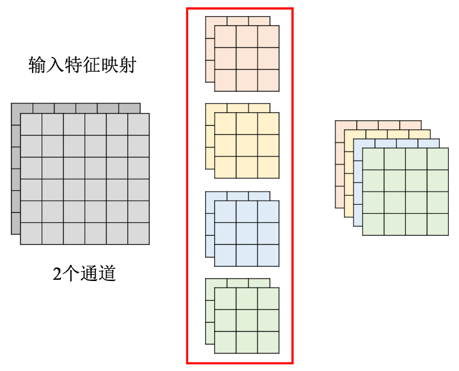
        <p style="font-size: small; color: gray;">标准卷积</p>
    </div>
    <div style="text-align: center; margin-left: 20px;">
        
        <p style="font-size: small; color: gray;">深度卷积 depthwise convolution</p>
        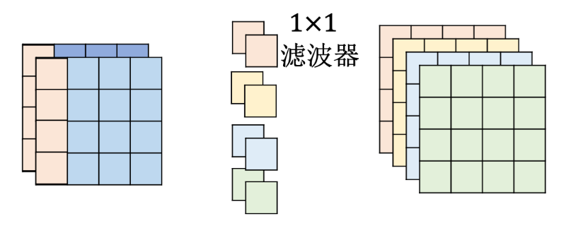
        <p style="font-size: small; color: gray;">逐点卷积 pointwise convolution</p>
    </div>
</div>

<div style="display: flex; justify-content: center; align-items: center;">
    <div style="text-align: center;">
        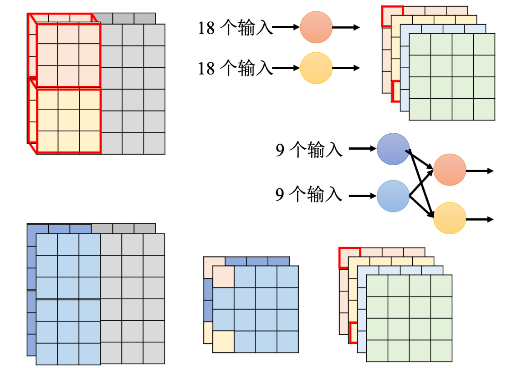
        <p style="font-size: small; color: gray;">标准卷积与深度可分离卷积对比<br/>
        标准卷积是$9\times2 \rightarrow 1$，深度可分离卷积是$(9 \rightarrow 1)\times 2 \rightarrow 1$，两者的参数量分别是$2\times 4\times 3\times 3=72$和$2\times 3\times 3+2\times 4=26$<br/>
        深度可分离卷积的中间那一层就像是低秩近似的矩阵分解中间层。
        </p>
    </div>
</div>

李宏毅视频: [p1](https://www.youtube.com/watch?v=L0TOXlNpCJ8), [p2](https://www.youtube.com/watch?v=f0rOMyZSZi4)

## 8.3 RNN
Recurrent Neural Network循环神经网络

### 8.3.1 基本的RNN

之前都是默认数据来自于某种分布，并且所有样本都是独立同分布的。序列信息需要RNN来处理。
对于$n$元语言模型 $P(x_t\left|x_{t-1},...,x_1\right)$,若词表大小是$\left|V\right|$,则其成本是$\left|V\right|^n$,所以需要简化为：$P(x_t\left|x_{t-1},\ldots,x_1\right)\approx P(x_t\left|h_{t-1}\right)$,并使用$h_t=f(x_t,h_{t-1})$更新隐状态。
对于具体的RNN模型：
隐藏层输出$H_t \in\mathbb{R}^{n\times h}$的计算公式如下：
$${H}_t=\phi({X}_t{W}_{xh}+{H}_{t-1}{W}_{hh}+{b}_h)$$式中，$D$是输入维度，$h$是隐状态维度，$n$是批量大小，$t$是时间步，$X_t \in\mathbb{R}^{n\times D} $是输入，$H_t \in\mathbb{R}^{n\times h}$是隐状态，$W_{xh} \in\mathbb{R}^{D\times h}$和$W_{hh} \in\mathbb{R}^{h\times h}$是权重，$b_h \in\mathbb{R}^{1\times h}$是偏置(求和时使用广播机制)，$\phi$是激活函数。需要注意的是，不同时间步的权重是一样的，所以$W_{xh},W_{hh},b_h$是共享的。
输出层的输出的计算公式如下：
$${O}_t={H}_t{W}_{hq}+{b}_q$$式中，$O_t \in\mathbb{R}^{n\times q}$是输出，$W_{hq} \in\mathbb{R}^{h\times q}$是权重，$b_q \in\mathbb{R}^{1\times q}$是偏置(求和时使用广播机制)。同样的，$W_{hq},b_q$是共享的。
网络结构如下：
<div align=center>
    
</div>

评价语言模型的标准是**困惑度**(perplexity)，对于一篇长度为$n$的文本$W=(x_1,x_2,\ldots,x_n)$，困惑度的计算公式如下：
$$\text{perplexity}(W)=\exp\left(-\frac1n\sum_{t=1}^n\log P(x_t\mid x_{t-1},\ldots,x_1)\right)$$当困惑度为$k$时，表示有$k$个等可能的词来预测下一个词。


RNN的不同变种：
<div align=center>
    
</div>


Elman网络与Jordan网络：
<div align=center>
    
</div>

区别在于：Elman网络的隐状态是由输入和上一个时间步的**隐状态**共同决定的(没有目标，不清楚隐藏层里学到的是什么)，而Jordan网络的隐状态是由输入和上一个时间步的**输出**共同决定的(有目标，隐藏层里学到的是更具体的任务相关信息)

### 8.3.2 GRU

gated recurrent unit门控循环单元
<div align=center>
    
</div>

重置门$R\in \mathbb{R}^{n\times h}$允许我们控制可能还想记住的过去状态的数量；更新门$Z\in \mathbb{R}^{n\times h}$将允许我们控制新状态中有多少个是旧状态的副本。简而言之：
- **重置门**reset gate打开时，模型在这个时间步就像一个基本的RNN单元一样，会**使用整个隐状态**$H_{t-1}$来计算新的状态，有助于捕获序列中的**短期**依赖关系；
- **更新门**update gate打开时，模型在这个时间步几乎不更新隐状态$H_t$，就像**跳过**了这个时间步，有助于捕获序列中的**长期**依赖关系。
(打开的意思就是其值接近1)

计算公式如下：
$$\begin{aligned}
{R}_t&=\sigma({X}_t{W}_{xr}+{H}_{t-1}{W}_{hr}+{b}_r)\in (0,1)\\
{Z}_t&=\sigma({X}_t{W}_{xz}+{H}_{t-1}{W}_{hz}+{b}_z)\in (0,1)\end{aligned}$$其中，$\sigma$是sigmoid函数，$W_{xr},W_{hr},b_r,W_{xz},W_{hz},b_z$的维度是$D\times h,h\times h,1\times h$并且参数共享。下面的$\tilde{H}_t$公式里的$W,b$也是如此。
候选隐状态$\tilde{H}_t\in \mathbb{R}^{n\times h}$的计算公式如下：
$$\tilde{{H}}_t=\tanh({X}_t{W}_{xh}+({R}_t\odot{H}_{t-1}){W}_{hh}+{b}_h)\in (-1,1)$$该式与RNN的隐状态计算公式基本一致，只是使用$\tanh$激活函数(为了保证输出在$(-1,1)$之间)并且多了一个重置门(当$R_t$接近1时与普通的RNN一致，当$R_t$接近0时会忽略掉$H_{t-1}$)。
最终的隐状态$H_t\in \mathbb{R}^{n\times h}$的计算公式如下：
$$H_t=Z_t\odot{H}_{t-1}+(1-Z_t)\odot\tilde{H}_t$$这个式子的意思是，如果更新门$Z_t$接近1，那么新的隐状态$H_t$就会接近于旧的隐状态$H_{t-1}$；如果更新门$Z_t$接近于0，那么$H_t$就会接近于候选隐状态$\tilde{H}_t$。

### 8.3.3 LSTM

Long Short-Term Memory长短期记忆
**注意**：是长时间的短期`Short-Term`记忆，而不是`Long-Short`时期的记忆。最简单的RNN每次都会更新记忆元，导致长期依赖关系的捕获困难，而LSTM通过遗忘门机制让短期的记忆元能够记忆更长时间的信息。

<div align=center>
    
</div>

输入门$I\in \mathbb{R}^{n\times h}$允许我们控制新输入的数量；遗忘门$F\in \mathbb{R}^{n\times h}$允许我们控制过去状态的数量；输出门$O\in \mathbb{R}^{n\times h}$允许我们控制输出的数量。简而言之：
- **输入门**input gate打开时，模型允许当前输入$X_t$影响**新的记忆元**$C_t$，有助于捕获序列中的短期依赖关系。
- **遗忘门**forget gate打开时，模型保留更多的**过去状态信息**$C_{t-1}$，有助于捕获序列中的长期依赖关系。
- **输出门**output gate打开时，模型允许**当前记忆元**$C_t$影响隐状态输出$H_t$，有助于捕获短期和长期依赖关系。

计算公式如下：
$$\begin{aligned}
{I}_t&=\sigma({X}_t{W}_{xi}+{H}_{t-1}{W}_{hi}+{b}_i)\in (0,1)\\
{F}_t&=\sigma({X}_t{W}_{xf}+{H}_{t-1}{W}_{hf}+{b}_f)\in (0,1)\\
{O}_t&=\sigma({X}_t{W}_{xo}+{H}_{t-1}{W}_{ho}+{b}_o)\in (0,1)\end{aligned}$$其中，$\sigma$是sigmoid函数，$W_{xi},W_{hi},b_i,W_{xf},W_{hf},b_f,W_{xo},W_{ho},b_o$的维度是$D\times h,h\times h,1\times h$并且参数共享。下面的$\tilde{C}_t$公式里的$W,b$也是如此。
候选记忆元$\tilde{C}_t\in \mathbb{R}^{n\times h}$的计算公式如下：
$$\tilde{{C}}_t=\tanh({X}_t{W}_{xc}+{H}_{t-1}{W}_{hc}+{b}_c)$$该式与RNN的隐状态计算公式基本一致，只是使用$\tanh$激活函数(为了保证输出在$(-1,1)$之间)。
记忆元$C_t\in \mathbb{R}^{n\times h}$的计算公式如下：
$$C_t=F_t\odot{C}_{t-1}+I_t\odot\tilde{C}_t$$这个式子的意思是，如果遗忘门$F_t$接近1，那么新的记忆元$C_t$就会接近于旧的记忆元$C_{t-1}$；如果遗忘门$F_t$接近于0，那么$C_t$就会接近于候选记忆元$\tilde{C}_t$。
最终的隐状态$H_t\in \mathbb{R}^{n\times h}$的计算公式如下：
$$H_t=O_t\odot\tanh(C_t)$$这个式子的意思是，输出门$O_t$控制着细胞状态$C_t$的信息流向隐状态$H_t$。

### 8.3.4 深度循环神经网络

<div align=center>
    
</div>

深度循环神经网络的隐藏层输出$H_t^{(l)}\in\mathbb{R}^{n\times h^{(l)}}$的计算公式如下：
$${H}_t^{(l)}=\phi_l({H}_t^{(l-1)}{W}_{xh}^{(l)}+{H}_{t-1}^{(l)}{W}_{hh}^{(l)}+{b}_h^{(l)})$$其中$H_t^{(l)}\in\mathbb{R}^{n\times h^{(l)}}$是第$l$层的隐状态，$W_{xh}^{(l)}\in\mathbb{R}^{h^{(l-1)}\times h^{(l)}}$和$W_{hh}^{(l)}\in\mathbb{R}^{h^{(l)}\times h^{(l)}}$是第$l$层的权重，$b_h^{(l)}\in\mathbb{R}^{1\times h^{(l)}}$是第$l$层的偏置，$\phi_l$是第$l$层的激活函数，$H_t^{(0)}=X_t\in\mathbb{R}^{n\times D}$是输入，$H_t^{(L)}\in\mathbb{R}^{n\times h^{(L)}}$是输出，$L$是层数。
输出层的输出的计算公式如下：
$${O}_t={H}_t^{(L)}{W}_{hq}+{b}_q$$其中$O_t\in\mathbb{R}^{n\times q}$是输出，$W_{hq}\in\mathbb{R}^{h^{(L)}\times q}$是权重，$b_q\in\mathbb{R}^{1\times q}$是偏置。

### 8.3.5 双向循环神经网络

<div align=center>
    
</div>

双向循环神经网络的隐藏层输出$H_t^{(f)}\in\mathbb{R}^{n\times h}$(正向，也记为$\overrightarrow{H}_t$)和$H_t^{(b)}\in\mathbb{R}^{n\times h}$(反向，也记为$\overleftarrow{H}_t$)的计算公式如下：
$$\begin{aligned}
\overrightarrow{{H}}_{t}&=\phi({X}_t{W}_{xh}^{(f)}+\overrightarrow{{H}}_{t-1}{W}_{hh}^{(f)}+{b}_h^{(f)})\\
\overleftarrow{{H}}_{t}&=\phi({X}_t{W}_{xh}^{(b)}+\overleftarrow{{H}}_{t+1}{W}_{hh}^{(b)}+{b}_h^{(b)})\end{aligned}$$其中W,b的shape和上面的一样，是$D\times h,h\times h,1\times h$，$\phi$是激活函数。最终的隐状态$H_t\in\mathbb{R}^{n\times 2h}$的计算公式如下：
$$H_t=[\overrightarrow{H}_t,\overleftarrow{H}_t]$$输出层的输出的计算公式如下：
$${O}_t={H}_t{W}_{hq}+{b}_q$$其中$O_t\in\mathbb{R}^{n\times q}$是输出，$W_{hq}\in\mathbb{R}^{2h\times q}$是权重，$b_q\in\mathbb{R}^{1\times q}$是偏置。
需要注意的是，实际使用中不一定能得到$\overleftarrow{H}_t$，所以将不会得到很好的精度。并且训练速度很慢，梯度链过长。可以用于填充缺失的单词、词元注释等。

### 8.3.6 编码器-解码器架构

<div align=center>
    
</div>

**输入序列**$X = {x_1, x_2, ..., x_T}$，其中 $x_t \in \mathbb{R}^d$ 表示时间步 $t$ 的输入向量，$d$ 是输入向量的维度。
**编码器**将输入序列映射到隐状态序列$H={h_1, h_2, ..., h_T} = \text{Encoder}(X)$，其中$h_t \in \mathbb{R}^h$表示时间步$t$的隐状态。
**解码器**接收编码器的隐状态(解码器的初始隐状态通常是编码器最后一个时间步的隐状态，也可以是全部隐状态的函数$c=q(h_1,...,h_T)$)，并生成目标序列${y_1, y_2, ..., y_{T'}}$，其中$y_t \in \mathbb{R}^d$表示时间步$t$的输出向量。
**输出序列**$Y = {y_1, y_2, ..., y_{T'}} = \text{Decoder}(H)$，其中$T'$是输出序列的长度。
图中**右侧的输入**指的是解码器在每个时间步接收的前一时间步的输出$y_{t-1}$。


### 8.3.7 seq2seq

<div align=center>
    
    <p style="font-size: small; color: gray;">eos表示序列结束词元，一旦输出序列生成此词元，模型就会停止预测。</br>bos表示序列开始词元，它是解码器的输入序列的第一个词元。</p>
</div>

遵循编码器－解码器架构的设计原则，循环神经网络**编码器**使用长度可变的序列作为输入，将其转换为**固定形状的隐状态**。换言之，输入序列的信息被编码到循环神经网络编码器的隐状态中。
为了连续生成输出序列的词元，独立的循环神经网络**解码器**是基于输入序列的编码信息和输出序列已经看见的或者生成的词元来预测下一个词元。可以使用循环神经网络编码器最终的隐状态来**初始化**解码器的隐状态，也可以让编码器最终的隐状态在**每一个时间步**都作为解码器的输入序列的一部分。

<div align=center>
    
    <p style="font-size: small; color: gray;">训练时解码器的输入是已知正确序列(强制教学teacher forcing)，<br/>而预测时解码器的输入是模型生成的上一步输出(自回归auto-regressive)。</p>
</div>

在预测时，如果每次选择概率最大的词元，那么模型可能会陷入**重复**或**循环**的输出序列中，并且贪心本来就不能保证概率最大化。为了解决这个问题，可以使用**束搜索**beam search，它在每个时间步都会保留$k$(束宽)个当前概率最大的备选输出序列，直到生成了eos词元。贪心搜索可以束宽为1的束搜索。

## 8.4. 注意力机制
分为：
- 由于突出性的**非自主性**提示，如全连接层、汇聚层。
- 依赖于任务的意志提示，即**自主性**提示，这将注意力机制与全连接层或汇聚层区别开来。

自主性提示被称为查询`query`。给定任何查询，注意力机制通过**注意力汇聚**`attention pooling`将选择引导至感官输入`sensory inputs`(例如中间特征表示)。在注意力机制中，这些感官输入被称为值`value`。更通俗的解释，每个值都与一个键`key`配对，这可以想象为感官输入的非自主提示：
<div align=center>
    
</div>

### 8.4.1 非参数注意力汇聚 Nadaraya-Watson核回归

$$f(x)=\sum_{i=1}^n\frac{K(x-x_i)}{\sum_{j=1}^nK(x-x_j)}y_i=\sum_{i=1}^n\alpha(x,x_i)y_i$$式中，$K$是核函数，$\alpha$是注意力权重($x$和$x_i$的相似度)，$x$是查询，$(x_i,y_i)$是键值对。查询$x$的输出是值$y_i$的加权和。
将高斯核$K(u)=\frac1{\sqrt{2\pi}}\exp(-\frac{u^2}2)$代入可得：
$$\begin{aligned}
f(x)&=\sum_{i=1}^n\frac{\exp(-\frac{(x-x_i)^2}2)}{\sum_{j=1}^n\exp(-\frac{(x-x_j)^2}2)}y_i\\
&=\sum_{i=1}^n\text{softmax}\left(-\frac12(x-x_i)^2\right)y_i\end{aligned}$$

### 8.4.2. 带参数注意力汇聚

以高斯核为例，带参数的注意力汇聚的计算公式如下：
$$f(x)=\sum_{i=1}^n\text{softmax}\left(-\frac12\left((x-x_i)w\right)^2\right)y_i$$
为了与$q,k,v$对应，将其改写为：
$$f(q)=\sum_{i=1}^n\text{softmax}\left(-\frac12\left((q-k_i)w\right)^2\right)v_i$$

### 8.4.3 注意力评分函数

<div align=center>
    
</div>

**注意力评分函数**就是计算查询和键之间的相似度的函数。比如上文的$-\frac12\left((q-k_i)w\right)^2$就是一个评分函数$a(q,k)$。注意力权重$\alpha$是由注意力评分函数$a(q,k)$通过softmax操作得到的：
$$\alpha(q,k_i)=\text{softmax}(a(q,k_i))=\frac{\exp(a(q,k_i))}{\sum_{j=1}^n\exp(a(q,k_j))}$$
常用的评分函数有：
- 点积评分函数：$a(q,k)=q^\top k$，式中$q,k\in\mathbb{R}^d$是查询和键。
- 加性评分函数：$a(q,k)=w_v^\top\tanh(W_qq+W_kk)$，式中$q\in\mathbb{R}^q,k\in\mathbb{R}^k$是查询和键，$w_v\in\mathbb{R}^h,W_q\in\mathbb{R}^{h\times q},W_k\in\mathbb{R}^{h\times k}$是权重参数。
- 缩放点积评分函数：$a(q,k)=\frac{q^\top k}{\sqrt{d}}$，其中$d$是查询和键的维度，又由于我们假设$q,k$都满足$\mu=0,\sigma^2=1$，所以$d$的意义是方差，这就是在标准化。

给定查询$q\in\mathbb{R}^{n\times d_q}$、键$k\in\mathbb{R}^{m\times d_k}$和值$v\in\mathbb{R}^{m\times d_v}$，输出(缩放点积注意力)$o\in\mathbb{R}^{n\times d_o}$的计算公式如下：
$$o=\text{softmax}\left(\frac{qk^\top}{\sqrt{d_k}}\right)v\in\mathbb{R}^{n\times d_v}$$由于点积需要维度匹配，所以需要满足$d_q=d_k$。因为没有额外的权重参数，所以$d_o=d_v$。

<div align=center>
    
</div>

在**多头注意力**机制中，我们可以计算$h$个不同的输出$o_i$，并将它们连接在一起并通过另一个线性变换得到最终的输出。具体来说，给定查询$q\in\mathbb{R}^{n\times d_q}$、键$k\in\mathbb{R}^{m\times d_k}$和值$v\in\mathbb{R}^{m\times d_v}$，输出$o_i\in\mathbb{R}^{n\times d_o}$的计算公式如下：
$$o_i=\text{softmax}\left(\frac{qW_i^Q(kW_i^K)^\top}{\sqrt{d_k}}\right)vW_i^V\in\mathbb{R}^{n\times p_v}$$式中，$W_i^Q\in\mathbb{R}^{d_q\times p_q},W_i^K\in\mathbb{R}^{d_q\times p_k},W_i^V\in\mathbb{R}^{d_v\times p_v}$是权重参数。同样地，满足$p_q=p_k$，$p_v=d_o$。
多头注意力机制的输出$o\in\mathbb{R}^{n\times d_o}$是这些不同输出$o_i$的连接：
$$o=\text{Concat}(o_1,\ldots,o_h)W^O$$式中，$W^O\in\mathbb{R}^{(h\cdot p_v)\times d_o}$是权重参数，$h$是头数。注意到$h=1$时，多头注意力机制就是单头注意力机制。


### 8.4.4 Bahdanau注意力

Bahdanau 注意力（也称为 Additive Attention）是一种在序列到序列模型（如机器翻译）中广泛使用的注意力机制。它通过计算查询和键之间的相似度来分配权重，并利用这些权重对值进行加权求和，从而生成上下文向量。
<div align=center>
    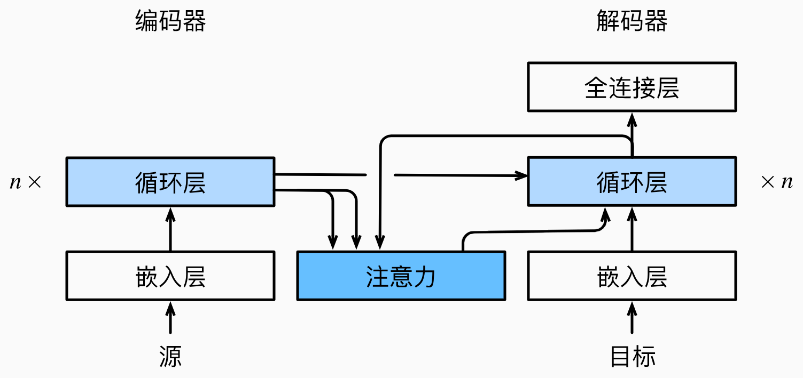
</div>

上下文向量$c_t'$的计算公式如下：
$${c}_{t'}=\sum_{t=1}^T\alpha({s}_{t'-1},{h}_t){h}_t$$式中，$s_{t'-1}$是解码器在时间步$t'-1$的隐状态(查询)，$h_t$是编码器在时间步$t$的隐藏状态(键、值)，$\alpha$是注意力权重，$T$是编码器的时间步数。
比如在机器翻译中，假设我们正在从`I am happy`解码法文句子`Je suis content`：
- 当前解码器状态$s_{t'-1}$：在时间步$t'-1$，解码器已经生成了`Je suis`，此时的隐状态为$s_{t'-1}$，这是查询$q$。
- 编码器状态 $h_1, h_2, h_3$：编码器将英文句子`I am happy`编码成隐藏状态序列$h_1, h_2, h_3$，分别对应于`I`,`am`,`happy`，这些是键和值。
- 计算上下文向量$c_{t'}$，然后使用它来更新解码器的状态$s_{t'}$，并预测下一个法文词元`content`。


### 8.4.5 自注意力和位置编码

**序列的自注意力：**
对于输入序列$X=(x_1,x_2,\ldots,x_n)$，自注意力输出序列$Y=(y_1,y_2,\ldots,y_n)$的计算公式如下：
$${y}_i=f({x}_i,({x}_1,{x}_1),\ldots,({x}_n,{x}_n))\in{\mathbb{R}}^d$$式中，$f$是注意力汇聚函数。
自注意力机制是一种特殊的注意力机制，查询、键和值都来自同一组输入。

**位置编码：**
对于输入$X\in\mathbb{R}^{n\times d}$，位置编码$P\in\mathbb{R}^{n\times d}$的计算公式如下：
$$\begin{aligned}
p_{i,2j}=\sin\left(\frac i{10000^{2j/d}}\right),
p_{i,2j+1}=\cos\left(\frac i{10000^{2j/d}}\right)\end{aligned}$$式中，$p_{i,2j}$和$p_{i,2j+1}$是位置第$i$行和隐藏单元第$2j,2j+1$列的位置编码，$d$是隐藏单元的维度。位置编码矩阵的每一行是一个位置的位置编码。最终的输出结果是$X+P$。为什么使用$+$而不是拼接？事实上，由于分块矩阵乘权重之后相当于每个块乘对应的权重后相加，也就是$+$与拼接的效果是一样的，证明如下：
- 假设使用one-hot拼接，即$X' = [X,P]^T$，那么$X'W = [X,P]^TW = XW^X + PW^P$，因为$X$本身就要乘上权重矩阵(相当于$XW^X$)，所以可以直接将位置编码$P$加到$X$上(相当于直接加上$PW^P$)。

除了捕获绝对位置信息之外，上述的位置编码还允许模型学习得到输入序列中相对位置信息。这是因为对于任何确定的位置偏移$\delta$,位置$i+ \delta$处的位置编码可以线性投影位置$i$处的位置编码来表示。令$\omega_j$ = $1/10000^{2j/d}$,对于任何确定的位置偏移$\delta$上式中的任何一对$(p_{i,2j},p_{i,2j+1})$都可以线性投影到$(p_i+\delta,2j,p_{i+\delta,2j+1})$：
$$\begin{aligned}
\begin{bmatrix}\cos(\delta\omega_j)&\sin(\delta\omega_j)\\-\sin(\delta\omega_j)&\cos(\delta\omega_j)\end{bmatrix}\begin{bmatrix}p_{i,2j}\\p_{i,2j+1}\end{bmatrix}
=&\begin{bmatrix}\cos(\delta\omega_j)\sin(i\omega_j)+\sin(\delta\omega_j)\cos(i\omega_j)\\-\sin(\delta\omega_j)\sin(i\omega_j)+\cos(\delta\omega_j)\cos(i\omega_j)\end{bmatrix}\\
=&\begin{bmatrix}\sin\left((i+\delta)\omega_j\right)\\\cos\left((i+\delta)\omega_j\right)\end{bmatrix}
=\begin{bmatrix}p_{i+\delta,2j}\\p_{i+\delta,2j+1}\end{bmatrix}
\end{aligned}$$

**CNN、RNN、self-attention的对比：**
<div align=center>
    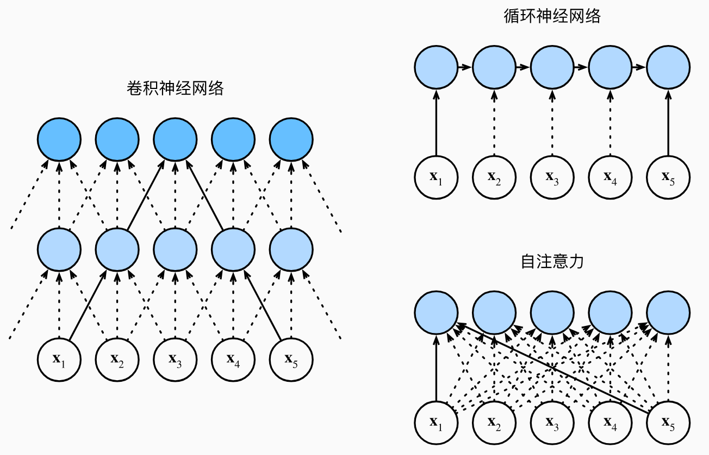
</div>

如上图，设序列长度为$n$
- 卷积神经网络：设卷积核大小为$k$，输入和输出的通道数量为$d$，则计算复杂度为$O(knd^2)$，最大路径长度为$O(n/k)$。
- 循环神经网络：设$d\times d$重矩阵和$d$维隐状态，则计算复杂度为$O(nd^2)$，最大路径长度为$O(n)$。
- 自注意力：设$q,k,v$都是$n\times d$的矩阵，计算复杂度为$O(n^2d)$，最大路径长度为$O(1)$。
RNN因为有$O(n)$个顺序操作，所以不便于并行计算。CNN与self-attention因为有$O(1)$个顺序操作，所以便于并行计算，但计算复杂度还是较高。

### 8.4.6 Transformer

Transformer模型完全基于注意力机制，没有任何卷积层或循环神经网络层。

<p style="color:#EC407A; font-weight:bold">编码器</p>

由多个相同的层叠加而成的，每个层包含两个子层`sublayer`。第一个子层是**多头自注意力**(multi-head self-attention)汇聚；第二个子层是**基于位置的前馈网络**(position-wise feed-forward network)。在每个子层中，都会应用残差连接和层规范化。
- 在计算自注意力时，对于序列中任何位置的输入${x_i}\in\mathbb{R}^d$，查询、键、值都来自前一个编码器层的输出，或在第一层中来自输入嵌入(embedding)向量加上位置编码(positional encoding)。
- 残差连接确保子层的输出与输入维度一致，即$\text{sublayer}(x_i)\in\mathbb{R}^d$，从而可以进行${x_i} + \text{sublayer}(x_i)\in\mathbb{R}^d$的加法操作。加法操作之后，紧接着应用层规范化(layer normalization)。因此，输入序列对应的每个位置，Transformer编码器都将输出一个$d$维向量。

<p style="color:#EC407A; font-weight:bold">解码器</p>

也由多个相同的层叠加而成，也使用残差连接和层规范化。除了包含编码器中的两个子层之外，还在这两个子层之间插入了第三个子层，称为**编码器-解码器注意力**(encoder-decoder attention)层。
- 在编码器-解码器注意力中，查询来自前一个解码器层的输出，而键和值来自整个编码器的输出。这样可以使解码器在生成序列时关注编码器生成的上下文。
- 解码器的自注意力机制与编码器类似，但增加了掩蔽`masked`操作，以确保解码器中的每个位置只能考虑该位置之前的所有位置。这种自回归(auto-regressive)属性保证预测仅依赖于已生成的输出词元，从而保持生成过程的顺序。
  - 有时候也使用非自回归(non-autoregressive)解码器，输入是一堆`<BOS>`(这个一堆的数量可以使用一个分类器来获得长度、或者限定一个数值如300个)，然后并行化地生成输出序列，直至生成`<EOS>`(且忽略`<EOS>`右边的输出词元)。优势：可并行化、速度快、能比较有效地控制输出的长度。缺点：质量不如自回归。

<div align=center>
    
</div>

然后我们再根据上图来详细解释一下Transformer的结构，对于$q,k,v$的讲解，我们假定输入是`Good morning, I am`，输出是`happy`，$d=6$。

<p style="color:#EC407A; font-weight:bold">编码器</p>

1. **编码器输入**：输入词序列，长度为$T$，维度$(T, 1)$
2. **输入嵌入层**：因为词无法直接输入到神经网络中，所以将输入的词转换为稠密向量表示。设词序列长度为$T$，稠密向量维度为$d$，则该层的输入输出维度为$(T, 1) \rightarrow (T, d)$
3. **位置编码层**：因为Transformer没有循环结构，不能自动捕捉序列的顺序信息，所以需要显式地添加位置信息。$(T, d) \rightarrow (T, d)$
4. **多头注意力**： 计算每个词在序列中的注意力权重，并加权求和得到新的词向量表示。$(T, d) \rightarrow (T, d)$
$q$代表当前处理的词向量，$k$代表所有词向量(用于与$q$匹配以找到关注点)，$v$则是与$k$相关联的值(其信息将被传递给$q$)。对于我们的举例，具体如下：
输入词经过词嵌入后变为$X = [x_1, x_2, x_3, x_4]^T\in \mathbb{R}^{4\times 6}$，其中每个$x_i$都是$d=6$的行向量，在多头注意力中，$Q,K,V$是通过输入向量$X$经过不同的线性变换得到的，即$Q = X * W_q, K = X * W_k, V = X * W_v$，其中每个权重$W$的维度都是$6\times 6$，得到的是$Q=[q_1,q_2,q_3,q_4]^T\in \mathbb{R}^{4\times 6}$，然后计算输出`Attention(Q, K, V) = softmax(Q * K^T / sqrt(d)) * V`$\in \mathbb{R}^{4\times 6}$，也就是通过计算注意力权重和加权求和，得到新向量表示。
5. **加&规范化**：将多头注意力的输出与输入进行残差连接，然后进行层规范化。因为残差连接可以缓解梯度消失问题，层规范化可以加速训练收敛。$(T, d) \rightarrow (T, d)$
6. **逐位前馈网络**：对每个位置的词向量进行前馈网络计算，逐位置地应用两个全连接层和一个ReLU激活函数。$(T, d) \rightarrow (T, d)$
简而言之，逐位前馈网络在实现时是`(batch_size, seq_len, d) -> (batch_size, seq_len, d_ff) -> (batch_size, seq_len, d)`的过程，而MLP是`(batch_size, input_dim) -> (batch_size, hidden_dim) -> (batch_size, output_dim)`的过程。
7. **加&规范化**：将逐位前馈网络的输出与输入进行残差连接，然后进行层规范化。$(T, d) \rightarrow (T, d)$
8. $n\times$：将上述过程重复$n$次。$(T, d) \rightarrow (T, d)$
9. **编码器输出**：编码器的输出是解码器的编码器-解码器注意力的$Q$的输入。$(T, d)$

<p style="color:#EC407A; font-weight:bold">解码器</p>

1. **解码器输入**：目标词序列，长度为$T'$，维度$(T', 1)$
2. **输入嵌入层**：将目标词转换为稠密向量表示。$(T', 1) \rightarrow (T', d)$
3. **位置编码层**：添加位置信息。$(T', d) \rightarrow (T', d)$
4. **掩码多头注意力**： 计算每个词在序列中的注意力权重，但掩蔽未来的词，防止模型在训练时看到未来的信息。简言之，就是遮蔽矩阵对角线上方的元素。$(T', d) \rightarrow (T', d)$
与编码器类似，$Y=[y_1]^T\in \mathbb{R}^{1\times 6}$，$Q,K,V$也是与$Y$线性变换得到的，得到$Q=[q_1]^T\in \mathbb{R}^{1\times 6}$，然后加权求和得到新变量$\text{Output}\in \mathbb{R}^{1\times 6}$。
5. **加&规范化**：将掩码多头注意力的输出与输入进行残差连接，然后进行层规范化。$(T', d) \rightarrow (T', d)$
6. **编码器-解码器注意力**：计算目标序列中每个词对源序列中每个词的注意力权重，使解码器能够关注编码器生成的上下文信息。输入是长度为$T'$的目标词向量序列和长度为$T$的源词向量序列，输出是新的目标词向量序列。$(T', d),(T, d) \rightarrow (T', d)$
$Q$来自解码器层的输出，$K,V$来自编码器的输出，即`Q = Decoder_Self_Attention_Output * Wq, K = Encoder_Output * Wk, V = Encoder_Output * Wv`，不妨记`Decoder_Self_Attention_Output`为$Z$，显然$Z \in \mathbb{R}^{1\times 6}$，那么$Q=Z\times W_q = \mathbb{R}^{1\times 6} \times \mathbb{R}^{6\times 6} = \mathbb{R}^{1\times 6}$，同样地，$K,V$是$\mathbb{R}^{4\times 6}$，那么在计算`Attention(Q, K, V)`的时候是$\mathbb{R}^{1\times 6}\times {(\mathbb{R}^{4\times 6})}^T\times \mathbb{R}^{4\times 6}=\mathbb{R}^{1\times 6}$，因此维度还是还原回了$\mathbb{R}^{1\times 6}$！这就是注意力机制的魅力所在！！
7. **加&规范化**：将编码器-解码器注意力的输出与输入进行残差连接，然后进行层规范化。$(T', d) \rightarrow (T', d)$
8. **逐位前馈网络**：逐位置地应用两个全连接层和一个ReLU激活函数。$(T', d) \rightarrow (T', d)$
9. **加&规范化**：将逐位前馈网络的输出与输入进行残差连接，然后进行层规范化。$(T', d) \rightarrow (T', d)$
10. $\times n$：将上述过程重复$n$次。$(T', d) \rightarrow (T', d)$
11. **全连接层**：将解码器的输出投影到词表大小的维度上，生成每个位置上词的概率分布。$(T', d) \rightarrow (T', |V|)$

建议看[李宏毅视频](https://www.youtube.com/watch?v=ugWDIIOHtPA&list=PLJV_el3uVTsOK_ZK5L0Iv_EQoL1JefRL4&index=61)，神中神。


### 8.4.7 对比

与CNN：[卷积神经网络就是自注意力的特例](https://arxiv.org/pdf/1911.03584)：
<div align=center>
    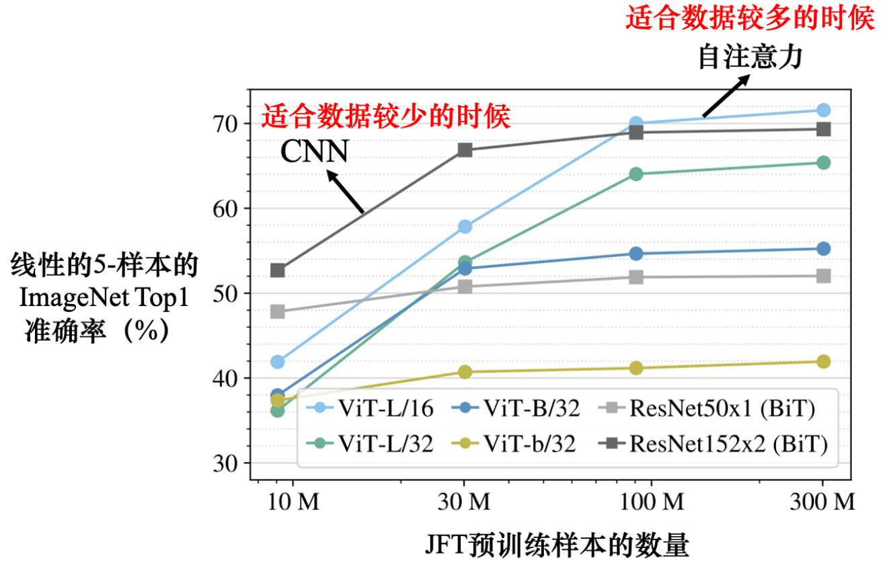
    <p>自注意力与卷积神经网络对比</p>
</div>

与RNN：[自注意力能更轻易地抽取远距离信息](https://arxiv.org/pdf/2006.16236)

与GNN：图上面的边暗示节点跟节点之间的关联性，而这个关联性可以通过注意力机制来学习。

### 8.4.8 tricks

<p style="color:#EC407A; font-weight:bold">1. 复制机制copy mechanism</p>

- 很多任务(如QA、摘要)，输出序列中的词可能是输入序列中的词。
- 优势：可以处理OOV(out-of-vocabulary)问题，让模型在遇到`<UNK>`时，直接将其复制到输出序列中。
- 模型：指针网络pointer network、复制网络copy network

<p style="color:#EC407A; font-weight:bold">2. 引导注意力guided attention</p>

- 当我们对问题有先验知识时，可以通过引导注意力来指导模型关注特定的信息。比如语音合成时，注意力一般是从左到右，而不是到处看。

<p style="color:#EC407A; font-weight:bold">3. 束搜索beam search</p>

- 在每个时间步都会保留$k$个当前概率最大的备选输出序列，直到生成了`<EOS>`词元。束宽$k$，贪心搜索(greedy search)可以看作束宽为1的束搜索。
- 适合于问题答案明确的任务(如语音识别)，不适合需要创造力的任务。而且束搜索容易造成重复的输出序列。

<p style="color:#EC407A; font-weight:bold">4. 温度temperature</p>

- 用于调节模型输出的多样性，温度越高，输出的多样性越大。适合于生成式任务，如对话系统、文本生成。$\text{softmax}(z)_i = \frac{\exp(z_i/T)}{\sum_j\exp(z_j/T)}$

<p style="color:#EC407A; font-weight:bold">5. 加入噪声add noise</p>

- 训练时加入噪声，可以让模型更加鲁棒，提高泛化能力。
- 测试时加入噪声，可以提高模型的多样性，比如语音合成时给解码器加噪声反而效果比不加噪声好。

<p style="color:#EC407A; font-weight:bold">6. 强化学习reinforcement learning</p>

- 评估输出序列(尤其是翻译任务)的BLEU分数的计算公式为：$$\mathrm{BLEU}=\mathrm{BP}\cdot\exp\left(\sum_{n=1}^Nw_n\log p_n\right)$$其中$p_n$表示`n-gram`精确度$p_n=\frac{\sum_{\text{matched }n\text{-grams}}}{\sum_{\text{generated }n\text{-grams}}}$。$w_n$是第$n$阶`n-gram`的权重，通常为$w_n=\frac1N$,其中$N$是最大`n-gram`阶数。BP是长度惩罚(Brevity Penalty),用于惩罚生成的翻译过短的情况，定义为：$\text{BP}=\begin{cases}1,&\text{if}\:c>r\\e^{(1-\frac{r}{c})},&\text{if}\:c\leq r\end{cases}$，其中$c$是生成翻译的长度，$r$是参考译文的长度。
因为最小化交叉熵不一定可以最大化BLEU分数，而BLEU无法微分，因此可以使用强化学习，把损失函数当成强化学习的奖励，把解码器当成智能体，[可见此论文](https://arxiv.org/pdf/1511.06732)。

<p style="color:#EC407A; font-weight:bold">7. 计划采样scheduled sampling</p>

- 训练时，解码器的输入是已知正确序列(强制教学teacher forcing)，而预测时解码器的输入是模型生成的上一步输出(自回归auto-regressive)，这种不一致的现象叫做**曝光偏差**(exposure bias)，导致的问题是：一步错步步错，因为解码器在训练时从来没见过错的情况。
- 该方法会损害Transformer并行化的能力，解决方法可参考[Scheduled Sampling for Transformers](https://arxiv.org/pdf/1906.07651)、[Parallel Scheduled Sampling](https://arxiv.org/pdf/1906.04331)。


## 8.5 生成式模型

### 8.5.1 GAN
Generative Adversarial Networks生成对抗网络

<p style="color:#EC407A; font-weight:bold">1. 生成器 generator</p>

**输入**：原始数据$x$，随机变量$z$。可以使用concatenate或者add的方式。
- 如果没有$x$，则称为无限制生成(un-conditional generation)，反之是条件型生成(conditional generation)。使用$x$的好处是可以**控制**生成的数据，比如$x$是图片风格的词向量。
- $z$的分布一般足够简单，如高斯或均匀分布，其作用是引入**随机性**，使得生成器可以生成不同的数据。比如$z\sim \text{Bernoulli}(0.5)$，网络能学习到不同的$z$值所对应的操作模式，比如$z$采样到1时左转，采样到0时右转。
- 一般而言, $z$的维度要比$x$的维度小，比如$x$是$28\times 28$的图片，$z$可以是$100$维的向量。

**输出**：$G(\underset{\text{opt}}{x}, z) = y$，维度与$x$相同，$\underset{\text{opt}}{x}$表示$x$是可选参数。

<div align=center>
    
</div>


<p style="color:#EC407A; font-weight:bold">2. 判别器 discriminator</p>

**输入**：$x$, $y$。$y$是生成器生成的数据。un-conditional的情况下不需要$x$。

**输出**：$D(\underset{\text{opt}}{x}, y)$，表示$y$(在$x$的条件下)是真实数据的概率。也就是说判别器就是将高维张量映射到一个标量的函数。如果使用$x$，则会强化输入与输出之间的关系，让判别器除了判别真假外，还能判别是否符合$x$的特征。


<p style="color:#EC407A; font-weight:bold">3. 训练过程</p>

<div align=center>
    
</div>

1. 固定生成器，训练判别器：将真实图片标1，生成图片标0，目标是尽可能区分开两种图片，视为一个二分类问题。
2. 固定判别器，训练生成器：目标是让图片更真实(判别器给出的分数更高)，视为一个回归问题。
3. 重复1、2步骤。

其目标函数的最大值和 JS 散度是相关的。
目标函数：
$$\min_G\max_DV(D,G)=\mathbb{E}_{x\sim p_r(x)}[\log D(x)]+\mathbb{E}_{z\sim p_z(z)}[\log(1-D(G(z)))]$$其中$D(x)$表示判别器给出$x$是真实数据的概率，$G(z)$表示生成器生成的数据，$p_r(x)$是真实数据的分布，$p_z(z)$是$z$的分布。
JS散度：
$$\mathrm{JS}(P\parallel Q)=\frac12\mathrm{KL}(P\parallel M)+\frac12\mathrm{KL}(Q\parallel M)$$其中$M=\frac12(P+Q)$，$\mathrm{KL}$是相对熵。
可以推导出：
$$\max_DV(D,G)=\log4-2\cdot\mathrm{JS}(p_r\parallel p_g)$$


<p style="color:#EC407A; font-weight:bold">4. 训练的问题</p>

然而，JS散度的两个输入$p_r$和$p_g$的重叠部分很少，因为图片是高维空间里低维的[流形](#manifold-comment)。就好像是二维平面上的两条线，几乎不可能有重叠的部分。如果两个分布$P$和$Q$不重叠，那么$\mathrm{JS}=\log2$。证明如下：
- 不重叠：$P(x)$和$Q(x)$不能同时大于0。因此
$$M(x)=\begin{cases}
\frac12P(x)&\mathrm{if~}P(x)>0\mathrm{~and~}Q(x)=0\\
\frac12Q(x)&\mathrm{if~}Q(x)>0\mathrm{~and~}P(x)=0\\
0=\frac12P(x)=\frac12Q(x)&\mathrm{otherwise}
\end{cases}$$
- 计算KL散度和JS散度：
$$\mathrm{KL}(P\parallel M)=\int p(x)\log\frac{p(x)}{m(x)}dx=\int p(x)\log\frac{p(x)}{\frac12p(x)}dx=\int p(x)\log2dx=\log2\int p(x)dx=\log2$$第二个等号认为$m(x)=\frac12p(x)$是因为只用考虑$P(x)>0$的情况。同理，$\mathrm{KL}(Q\parallel M)=\log2$
所以$\mathrm{JS}(P\parallel Q)=\frac12\log2+\frac12\log2=\log2$
显然，对于两个没有重叠的分布，JS是**常量**，与具体的分布无关，因此**不能很好地反应两个分布的差异**，而且**梯度也会消失**。准确地来说：当$P$与$Q$的[支撑集](#support-comment)是高维空间中的低维[流形](#manifold-comment)时，$P$与$Q$重叠部分[测度](#measure-comment)为0的概率为1。

<a id="manifold-comment"></a>

> **流形**manifold：简单来说就是一个**看起来像平坦的**空间，地球的表面是一个三维空间中的二维流形。虽然地球是一个球体(弯曲的)，但如果你站在地球上某一个地方，向四周看，地面看起来是平坦的，就像在一张二维的平面上一样。因此，地球表面可以被视为一个二维流形。

<a id="support-comment"></a>

> **支撑集**support：一个随机变量的支撑集是指其可能取值的集合(简单而言，就是非0部分)。比如一个均匀分布的支撑集是$[a,b]$，一个正态分布的支撑集是$(-\infty,+\infty)$。

<a id="measure-comment"></a>

> **测度**measure：测度是一个函数，用来度量集合的大小。


> **高维空间中的低维流形**：GAN中的生成器通常从一个低维（例如100维）的随机分布中采样出一个潜在编码向量，然后通过神经网络生成一个高维样本（如64x64的图片，4096维）。尽管生成器输出的样本分布定义在4096维空间中，但由于潜在编码是从100维随机分布中采样的，因此生成样本的本质维度实际上受到这个100维分布的限制。由于神经网络映射的非线性性质，样本分布的支撑集会形成一个嵌入在4096维空间中的低维流形，而这个流形的维度不会超过100维，甚至可能更低。换句话说，生成器生成的样本仅覆盖了高维空间中的一部分区域，而不是整个空间。

<p style="color:#EC407A; font-weight:bold">5. 解决方法-Wasserstein GAN</p>

给定真实数据分布$p_r$和生成数据$p_g$分布，其**Wasserstein距离**是：
$$W(p_r,p_g)=\inf_{\gamma\in\Pi(p_r,p_g)}\mathbb{E}_{(x,y)\sim\gamma}[\|x-y\|]$$式中，$\Pi(p_r,p_g)$是$p_r$和$p_g$的联合分布的集合，$\gamma$是$p_r$和$p_g$的联合分布，$\|x-y\|$度量两个样本之间的距离，$\inf$表示取下确界，也就是最小值。Wasserstein距离是两个分布之间的最小运输成本，也就是将一个分布转换为另一个分布的最小代价。[可参考](https://0809zheng.github.io/2022/05/16/Wasserstein.html)
**WGAN的目标函数**定义为：
$$\min_G\max_{D\in 1\text{-Lipschitz}}\mathbb{E}_{x\sim p_r}[D(x)]-\mathbb{E}_{z\sim p_z(z)}[D(G(z))]$$其中$D$是1-Lipschitz的，也就是说$|D(x)-D(y)|\leq\|x-y\|$。这个约束条件可以通过权重剪裁(weight clipping)或者梯度惩罚(gradient penalty)来实现。
- 权重剪裁：在每次更新后，将$D$的权重限制在一个范围内。简单，但可能会限制模型的表达能力。
- 梯度惩罚：在计算梯度时，对梯度进行惩罚，使其不超过一个阈值。$\mathcal{L}_D=\mathbb{E}_{\hat{x}\sim p_{\hat{x}}}[(\|\nabla_{\hat{x}}D(\hat{x})\|_2-1)^2]$，其中$\hat{x}=\epsilon x+(1-\epsilon)G(z), \epsilon\sim U(0,1)$是真实数据和生成数据的线性插值样本。


### 8.5.2 CycleGAN

<div align=center>
    
</div>

Cycle GAN中会训练两个生成器和一个判别器：
- $x$域原始风格的图像，$y$域目标风格的图像。
- 第一个生成器$G_{x\rightarrow y}$是把$x$域的图变成$y$域的图
- 第二个生成器$G_{y\rightarrow x}$是看到一张$y$域的图，把它还原回$x$域的图。
- 判别器$D_y$是看到一张图片，判断它是$x$域的还是$y$域的，输出仍然是标量。

训练时会增加一个额外的目标：希望输入一张图片，其从$x$域转成$y$域后要从$y$域转回原来一模一样的$x$域的图片。经过两次转换后的输入跟输出越接近越好，因为是循环的，所以叫Cycle GAN。如果$G_{x\rightarrow y}$产生出来的人脸跟输入的人脸没有关系，那$G_{y\rightarrow x}$就无法把它还原回原来的$x$域的图片。


### 8.5.3 扩散模型diffusion

主要是**去噪扩散概率模型**(Denoising Diffusion Probabilistic Model，DDPM)

<div align=center>
    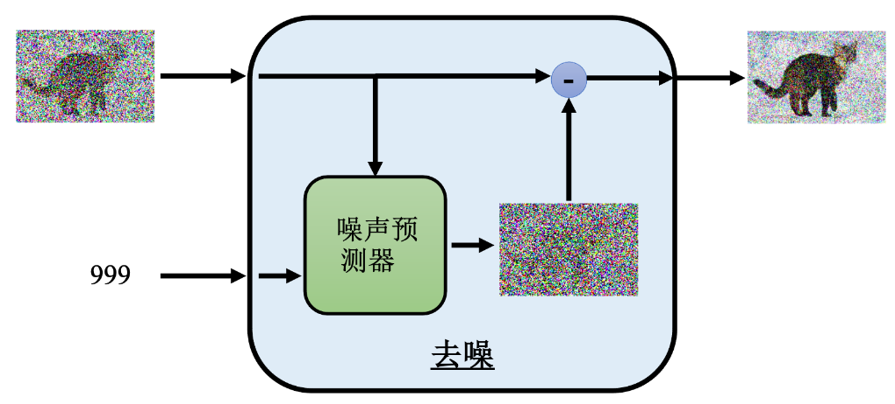
</div>

1. 输入图像：左侧的图像为带有噪声的图像，通常表示为$\boldsymbol{x}_t$，其中$t$是时间步。此处时间步$t=999$。一般而言，去噪过程是一个逆向过程，假如总共$1000$步的话，那么$t=999$其实是第2步。而前向过程是一个加噪过程，所以$t=999$是第999步。
2. 噪声预测器：图中绿色方框表示噪声预测器(通常是一个神经网络)，用于预测当前图像中的噪声$\hat{\epsilon}=\epsilon_\theta(\boldsymbol{x}_t,t)$
3. 去噪操作：右侧的减法操作表示将带有噪声的图像$\boldsymbol{x}_t$减去噪声预测值$\hat{\epsilon}$来获得去噪后的图像：$\boldsymbol{x}_{t-1}=\boldsymbol{x}_t-\hat{\epsilon}$，其中，$\boldsymbol{x}_{t-1}$是去噪后的图像。


## 8.6 自监督学习

Self-Supervised Learning(SSL)是一种无监督学习的方法，通过利用数据本身的信息来学习有用的特征。自监督学习的目标是学习一个特征表示，使得在这个表示下，数据的某种性质是容易预测的。自监督学习的一个重要特点是，它可以利用大量的无标签数据，从而可以在大规模数据集上进行训练。
<div align=center>
    
    <p style="font-size: small; color: gray;">监督学习和自监督学习的对比</p>
    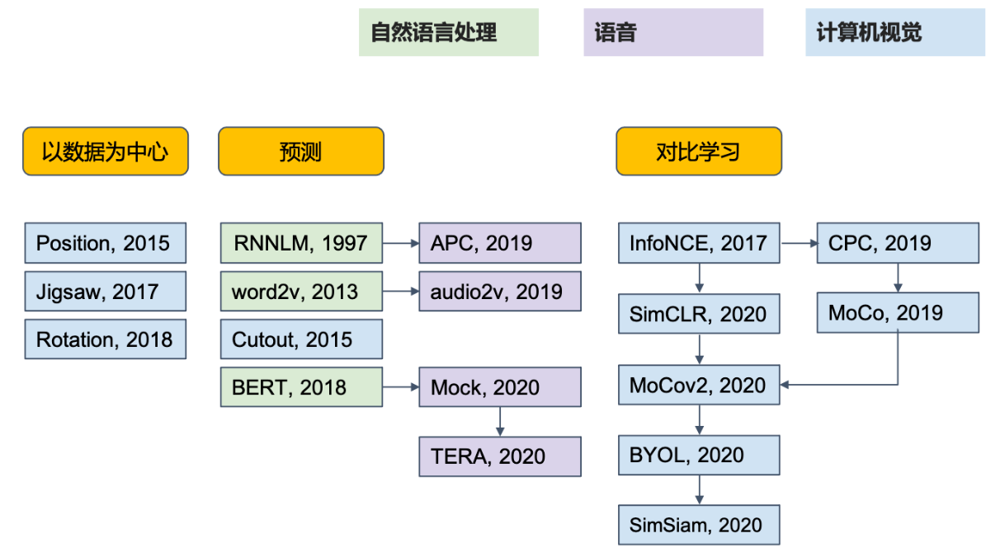
    <p style="font-size: small; color: gray;">各个领域的自监督学习</p>
</div>


### 8.6.1 BERT

BERT(来自Transformers的双向编码器表示, Bidirectional Encoder Representations from Transformers)是一种预训练语言模型。BERT的训练过程分为两个阶段：
- 预训练(pre-training)：在大规模文本语料上进行预训练，学习通用的语言表示。
- 微调(fine-tuning)：在特定任务上进行微调，以适应特定任务的需求。

<p style="color:#EC407A; font-weight:bold">1. 预训练 (无监督)</p>

BERT的预训练任务是**掩码语言模型**(Masked Language Model, MLM)和**下一句预测**(Next Sentence Prediction, NSP)。
- MLM：在输入序列中随机掩码(MASK)一些词或者替换为其他词，然后预测这些词。让模型学习到上下文信息。
- NSP：判断两个句子是否是连续的。这个任务可以让模型学习到句子之间的关系。(但实际上因为这个任务太简单了，毕竟只是个二分类，所以不如句序预测Sentence Order Prediction, SOP)
<div align=center>
    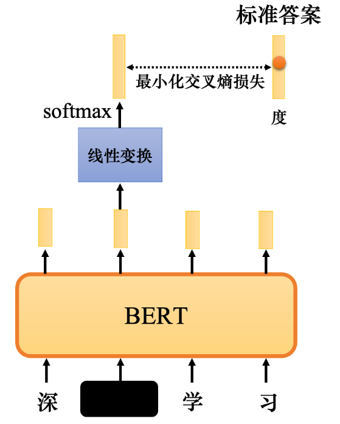
    <p style="font-size: small; color: gray;">BERT的骨干网络的输出也是一个序列，经过分类层(线性变换与softmax)后得到每个词的概率分布。<br/>比如图中的"[MASK]"应当被预测为"度"。</p>
</div>

<p style="color:#EC407A; font-weight:bold">2. 微调 (半监督)</p>

随机初始化的参数只是线性变换的参数，而不是整个模型的参数。在微调阶段，可以冻结BERT的大部分参数，只训练最后的分类层。

- **情感分析**：输入是$\text{[CLS]}, w_1, w_2, \cdots, w_n$，其中$\text{[CLS]}$是`Classification`，表示分类任务的句子的开始。将$\text{[CLS]}$的输出传递给分类层，输出类别概率分布。

- **词性标注**：输入是$\text{[CLS]}, w_1, w_2, \cdots, w_n$，将每个词的输出传递给分类层，输出词性标签。

- **自然语言推理**：输入是$\text{[CLS]}, w_1, w_2, \cdots, w_n, \text{[SEP]}, w_1', w_2', \cdots, w_m'$，其中$\text{[SEP]}$是`Separation`，表示两个句子的分隔。输入的语句是前提`premise`和假设`hypothesis`。将$\text{[CLS]}$的输出传递给分类层，输出类别(矛盾、蕴含、中立，赞成、反对...)概率分布。

- **基于提取的问答**：输入是$\text{[CLS]}, w_1, w_2, \cdots, w_n, \text{[SEP]}, w_1', w_2', \cdots, w_m'$，其中$\text{[SEP]}$是问题与文档的分隔。将文档的输出传递给分类层，输出答案的起始和终止位置。

<div align=center>
    
    <p style="font-size: small; color: gray;">先计算橙色向量与文档输出向量的内积，经过softmax，取得分最高的位置为起始位置；同理可使用蓝色向量得到结束位置。<br/>这自注意力的想法类似。</p>
</div>

简而言之，BERT就是一个深度版本的CBOW，一种语境化的embedding，训练方法是做**填空题**。


### 8.6.2 GPT

GPT(Generative Pre-trained Transformer)是一种基于Transformer的预训练语言模型。同样分为预训练和微调两个阶段。不同的是，GPT是单向的，只能看到前面的词，而BERT是双向的，可以看到前后的词。

<div align=center>
    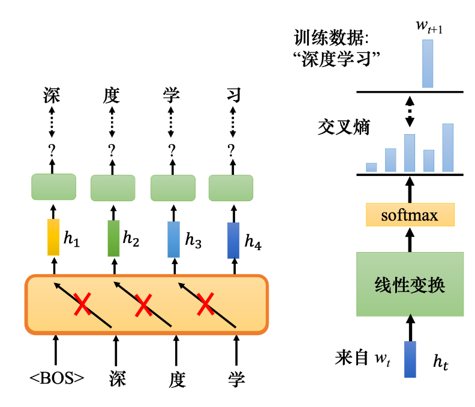
    <p style="font-size: small; color: gray;">与BERT类似，将网络的输出$h$经过分类层之后，与标准答案$w_{t+1}$进行比较</p>
</div>

因为GPT太大了，所以微调也很困难。可以使用**小样本学习**(few-shot learning，每个类只有$k$个标注样本)，$k = 1$称为单样本学习(one-shot learning)，$k = 0$称为零样本学习(zero-shot learning)。
也就是说，GPT的微调都没有梯度下降，而是**语境学习**(in-context learning)。

### 8.6.3 自编码器

自编码器(Autoencoder)是一种无监督学习的模型，其目标是学习输入数据的压缩表示。
原始数据$\rightarrow$`编码器`$\rightarrow$低维表示$\rightarrow$`解码器`$\rightarrow$重构数据，其实就是一种有失真但高压缩率的压缩$\rightarrow$解压缩的过程。

`编码器`可以是CNN等，`解码器`像GAN里面的生成器。而CycleGAN的两个生成器就像是自编码器的`编码器`+`解码器`。

<div align=center>
    
    <p style="font-size: small; color: gray;">BERT可以视为一个编码器、解码器结构。注：解码器不一定只能是像图中这样的线性的。</p>
</div>

自编码器可以特征解耦(feature disentanglement)、离散隐表征(discrete latent representation)。
- **特征解耦**：嵌入层的某个/某些维度能对应一个特定的特征。
- **离散隐表征**：嵌入层是离散的，比如：
  - 独热向量，嵌入层维度与类别数量一致，每个类别对应一个维度。
  - 向量量化变分自编码器(vector quantized-variational autoencoder, VQ-VAE)，嵌入层的向量是一般的、连续的向量，但会与`码本`($k$个向量)中的向量计算相似度，然后取最相似的向量作为嵌入向量，即：解码器的输入一定是那个码本里面的向量的其中一个。因此限制了嵌入向量的取值范围(只有$k$种可能)，使其变得离散。
<div align=center>
    
    <p style="font-size: small; color: gray;">向量量化变分自编码器示例</p>
</div>

  - 文字形式的离散隐表征：嵌入层难道一定要是向量？因此这里使用一段文字作为嵌入层，希望这段文字能够表示文本的摘要，但一般是行不通的，因为摘要的文本是机器看得懂的，所以对嵌入层加上一个判别器，这样就形成了CycleGAN的结构。这是从自编码器的角度来看待 CycleGAN的思路。
<div align=center>
    
    <p style="font-size: small; color: gray;">Cycle GAN 自编码解析文字</p>
</div>


## 8.7 迁移学习
transfer learning。假设A、B是两个相关的任务，A任务有很多训练数据，就可以把从A任务中学习到的某些可以泛化知识迁移到B任务。有领域自适应(domain adaptation)和领域泛化(domain generalization)两种方法。

### 8.7.1 领域偏移 domain shift
训练数据与测试数据的分布不同。比如在黑白MNIST上训练，然后在彩色MNIST-M上测试。

### 8.7.2 领域自适应 domain adaptation
领域自适应侧重于解决特征空间与类别空间一致，但特征分布不一致的问题。分为两种情况：
- **有监督领域自适应**：源域和目标域都有标签，但特征分布不一致。方法是在源域上训练一个模型，然后在目标域上微调。因为目标域的数据很少，所以微调时不要让参数变化太大，防止在目标域上过拟合。
- **无监督领域自适应**：只有源域有标签，目标域没有标签。将分类器分成特征提取器(feature extractor)和标签预测器(label predictor)两个部分。
对于$\mathcal{D}_{\text{source}}$和$\mathcal{D}_{\text{target}}$，我们希望特征提取器的对应`领域`分布尽可能一致(为了迁移学习)，标签预测器希望特征提取器的对应`标签`分布尽可能不一致(为了预测更准确)，但领域分类器希望特征提取器的对应`领域`分布尽可能不一致(为了判别更准确)。因此，可以使用**领域对抗训练**(domain adversarial training)来实现这个目标，特征提取器的$\theta_f$希望$L_d$更大，标签预测器的$\theta_d$希望$L_d$更小。
<div align=center>
    
    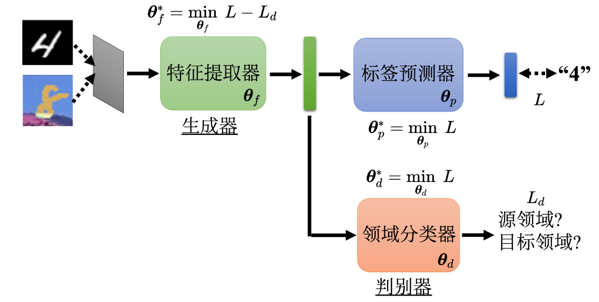
    <p style="font-size: small; color: gray;">训练特征提取器，让源领域和目标领域的特征无差异。上半部分是图像分类，其中深绿色指向的橙色是领域对抗训练，通过领域对抗训练，使得特征提取器的特征分布在两个领域上尽可能一致。<br/>图中$\theta_d^*$的公式有误，应该是$L_d$。</p>
</div>

领域自适应的问题：
- **目标领域的分类效果不佳**：我们希望网络能在目标领域预测时熵较小，可以使用DIRT-T、最大分类器差异(maximum classifier discrepancy)等方法，让样本尽可能远离决策边界。
- **目标领域的特征不一致**：可以使用最大均值差异(maximum mean discrepancy, MMD)等方法，让特征分布尽可能一致。
- **目标领域的类别不一致**：[Universal Domain Adaptation](https://openaccess.thecvf.com/content_CVPR_2019/papers/You_Universal_Domain_Adaptation_CVPR_2019_paper.pdf)
- **目标领域几乎没有数据**：[Test-Time Training, TTT](https://arxiv.org/pdf/1909.13231)

### 8.7.3 领域泛化 domain generalization
领域泛化：不是要适应到某一个特定的领域上。分为两种情况：
- **训练数据丰富**：[Domain Generalization with Adversarial Feature Learning](https://openaccess.thecvf.com/content_cvpr_2018/papers/Li_Domain_Generalization_With_CVPR_2018_paper.pdf)
- **训练数据单一**：[Learning to Learn Single Domain Generalization](https://arxiv.org/pdf/2003.13216)


## 8.8 强化学习
Lee-DL第14章，暂时不看，到时候跟蘑菇书一起看。


# 9. 实际应用中的挑战与优化

## 9.1 对抗攻击

### 9.1.1 如何攻击网络
假设有一个神经网络，输入是$x_0$，输出是$y$，$y$是一个概率分布，$y_i$表示第$i$类的概率。攻击者的目标是让网络输出错误的结果，比如将$x^*$输入网络，让网络将其分类为第$j$类，但实际上$x^*$是第$i$类。攻击者可以通过以下几种方式来攻击网络：
- **添加扰动**：在输入$x_0$上添加一个扰动$\delta$，使得网络将$x^*=x_0+\delta$分类为第$j$类。这种攻击方式称为**扰动攻击**。
- **对抗样本**：找到一个输入$x^*$，使得网络将$x^*$分类为第$j$类，但实际上$x^*$是第$i$类。这种攻击方式称为**对抗样本攻击**。

训练过程如下：
$$\begin{aligned}
x^*&=arg\min_{d(x_0,x)\leq\varepsilon}L(x) \\
L(x)&=-e(y,\widehat{y})+e(y,y^{\text{target}})
\end{aligned}$$式中，$d(x_0,x)$是原输入与新输入的距离($L_2$还是$L_\infty $或者都需要考虑，需要根据具体任务来判断人类对什么变化更敏感)，$\varepsilon$是扰动的最大范数，$L(x)$是损失函数，$e(y,\widehat{y})$是网络输出$y$和正确答案$\widehat{y}$的交叉熵损失，$e(y,y^{\text{target}})$是网络输出$y$和目标输出$y^{\text{target}}$的交叉熵损失(这一项当网络是“有目的攻击”网络时才要加上)。伪代码如下：
```python
def clip(x, x_min, x_max):
    return max(x_min, min(x_max, x))
for t in range(T):
    x = x + lr * grad(L(x))
    x = clip(x, x_0 - eps, x_0 + eps)
```
以上是知道模型参数(**白盒攻击**)的情况下，如果不知道则可以使用**黑盒攻击**，即只能通过输入输出来攻击目标网络。这种情况下，可以使用**代理网络**、**迭代优化**的方法
- 代理网络：获取目标网络的输入输出对，然后训练代理网络来近似目标网络，最后在代理网络上进行白盒攻击。代理网络可以使用集成学习的方法以提高成功率。
- 迭代优化：即通过多次查询网络来找到对抗样本。伪代码如下：
```python
def gradient_estimation(f, x, delta=1e-5):
    grad = np.zeros_like(x)
    for i in range(len(x)):
        x_pos = np.copy(x)
        x_pos[i] += delta  # 正向扰动
        grad[i] = (f(x_pos) - f(x)) / delta  # 计算梯度
    return grad
def clip(x, x_min, x_max):
    return np.maximum(x_min, np.minimum(x_max, x))
for t in range(max_iter):
    grad = gradient_estimation(lambda x: -f(x, y_target), x)  # 梯度估计
    x = x + lr * grad
    x = clip(x, x0 - eps, x0 + eps)
    if f(x, y_target) < f(x0, y_target):  # 如果损失降低，提前停止
        break
```

### 9.1.2 如何防御网络

- **被动防御**：训练还是老样子，但在使用模型前加一个盾牌，比如轻微的滤波器来模糊、平滑攻击信号、转为jpg这种有损格式后再输入、使用GAN重新生成输入。这种方法的缺点是会降低模型的性能。
- **主动防御**：第一次训练还是老样子，然后攻击当前网络，获取新数据集$\mathcal{D}_{\text{adv}}$，再用原数据集$\mathcal{D}$和新数据集$\mathcal{D}_{\text{adv}}$重新训练网络，如此往复，就好像是在做数据增强。这种方法的缺点是需要大量的计算资源，而且可能无法完全防御更新的攻击。


## 9.2 网络压缩
network compression。网络压缩的目的是减少模型的存储空间和计算量，同时保持模型的性能。

### 9.2.1 网络剪枝 network pruning
参数绝对值接近0，神经元输出接近0的次数多，可以认为这些参数和神经元对模型的贡献较小，可以将其剪掉。还有梯度的绝对值、Hessian矩阵的特征值、二阶导数等方法。具体流程是一个循环：评估重要性$\rightarrow$剪枝(10%)$\rightarrow$微调。

去掉不重要的参数(非结构化剪枝)后网络的形状可能不规则，不便于实现，可以用0填充。但这个方法没办法实际加速。所以可以使用神经元剪枝(结构化剪枝)。
那为什么不直接训练一个小网络？因为**彩票假说**(lottery ticket hypothesis)：一个大网络=很多个小网络，其中存在一个小网络，这个小网络在特定的参数初始化的情况下，可以达到和大网络一样的性能，这个小网络就是`中奖彩票`。剪枝就是找到这个`中奖彩票`。[只要不改变小网络参数的正负号，就可以训练起来](https://arxiv.org/pdf/1905.01067)，但在[在学习率设比较小，还有非结构化的时候才能观察到彩票假说](https://arxiv.org/pdf/1810.05270)。

### 9.2.2 知识蒸馏 knowledge distillation
知识蒸馏的目标是让小模型(学生网络)的输出尽可能接近大模型(教师网络)的输出。因为教师网络可以提供额外的信息，比如软标签(概率分布)，而概率分布可能体现出不同类别之间的关系(如相似度)，所以学生网络可以更好地学习。具体可见[推荐系统](/推荐系统.md)里的知识蒸馏部分。

### 9.2.3 参数量化 parameter quantization
参数量化的目标是减少参数的位数，从而减少存储空间和计算量。
- 减少参数精度，比如将32位浮点数转为8位。
- 使用权重聚类，对于每个参数，只需要记录属于哪个群，然后记录群的中心值即可。但这样训练完再聚类可能会导致聚类后的参数跟原来的参数相差太大。所以可以在训练的时候，要求网络的参数彼此之间比较接近。训练的量化可当做是损失的其中一个环节，直接塞到训练的过程中，让训练的过程中达到参数有权重聚类的效果。
- 使用二值网络，即参数只有两个值，-1和1，这样可以大大减少参数量，给网络容量(network capacity)比较大的限制，因此也不容易过拟合。


### 9.2.4 网络架构设计 network architecture design

<p style="color:#EC407A; font-weight:bold">1. 深度可分离卷积</p>

比如[深度可分离卷积](#8.2.2DSC)(depthwise separable convolution)，其参数量比普通卷积小很多。这里不再重复具体原理。

<p style="color:#EC407A; font-weight:bold">2. 低秩近似</p>

假设一个全连接层的输入神经元个数是$N$，输出神经元个数是$M$，那么这个全连接层的参数量是$N\times M$。只需要在中间插入一个神经元个数为$K$的隐藏层，那么这个全连接层的参数量就变成了$N\times K+K\times M$，这样就可以减少参数量。
其本质是将原来的参数矩阵$W\in \mathbb{R}^{N\times M}$分解为两个矩阵$U\in \mathbb{R}^{N\times K}$和$V\in \mathbb{R}^{K\times M}$的乘积$W=UV$。当$W$的秩本身较低，即使$K$值不大，也能够很好地近似原始矩阵。或者选取的$K$越接近原始矩阵的秩，近似的精度越高。

<p style="color:#EC407A; font-weight:bold">3. MSDNet</p>
评论区里看到的，还没学。
多尺度密集网络(Multi-Scale Dense Network)，即在网络中加入多个分支，每个分支都有自己的密集连接，然后将所有分支的输出进行融合。


### 9.2.5 动态计算 dynamic computation
我们希望一个网络能够根据现有计算资源、任务难度等因素，动态调整网络的深度、宽度等参数，在保证性能的情况下，减少计算量。
- **动态网络深度**：额外层：根据每一个隐藏层的输出决定现在分类的结果。当计算资源不足时，可以只计算前几层就跳入额外层。在训练时，损失函数是所有层的损失函数(每一个额外层的输出与真实标签的交叉熵)的加权和$L = \sum_{i=1}^N\alpha_iL_i$，其中$\alpha_i$是每一层的权重。更好的方法可以参考[MSDNet](https://arxiv.org/pdf/1703.09844)。
- **动态网络宽度**：在训练时，不同宽度的网络的输出都要与真实标签计算交叉熵，但在使用时，可以动态调整网络的宽度。
但是上面的方法都不是网络自主去决定深度/宽度，而是人为根据计算资源等因素来决定。根据输入任务的难度，让网络自己决定深度/宽度的方法是[SkipNet](https://arxiv.org/pdf/1711.09485)、[Runtime Neural Pruning](https://proceedings.neurips.cc/paper/2017/file/a51fb975227d6640e4fe47854476d133-Paper.pdf)、[BlockDrop](https://arxiv.org/pdf/1711.08393)等。


## 9.3 终身学习
LifeLong Learning(LLL)也称为持续学习(continous learning)、无止尽学习(never-ending learning)、增量学习(incremental learning)。

### 9.3.1 干什么
虽然我们希望一个模型如果能学会无数个任务就好了，但难以实现。因为遗忘、存储、计算都是问题。因此，终身学习的目标是让模型在学习新任务时不会忘记旧任务，也不会占用太多的存储和计算资源。新任务不一定是新的技能，可能是新的数据、新的环境(这就像前文提及的迁移学习)。比如一个模型上线后的数据反馈，这时候就形成了如下图的循环：
<div align=center>
    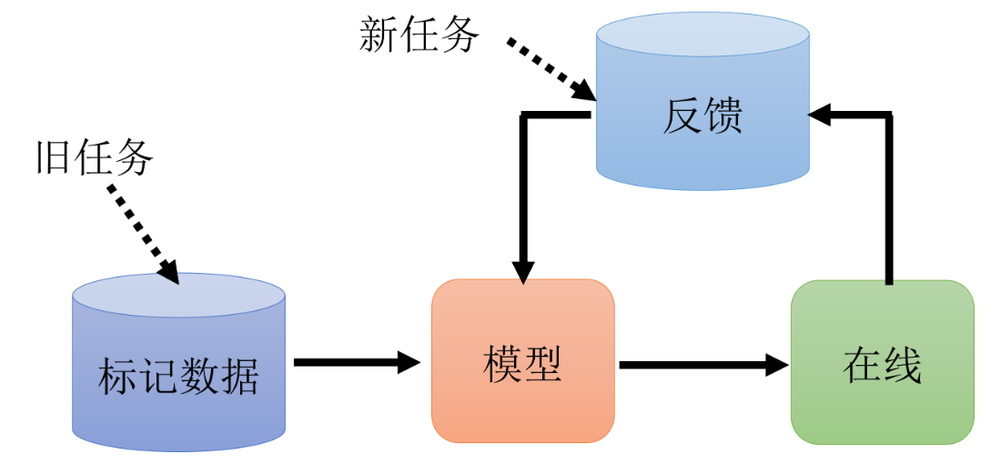
    <p style="font-size: small; color: gray;">相比于迁移学习，终身学习不仅在乎新任务的性能，还在乎旧任务的性能。</p>
</div>

### 9.3.2 评估指标
首先随机初始化参数，得到$R_{0,i}$，然后依次在第$k\in\{1,2,\cdots,T\}$个任务上训练模型，得到$R_{k,i}$，最后得到的$R_{T,i}$是在训练完第$T$个任务后，在第$i$个任务上的性能。评估指标有：
- **准确度**：$\frac1{T}\sum_{i=1}^T R_i$，准确度是在所有任务上的平均性能。
- **反向迁移**：$\frac1{T-1}\sum_{i=1}^{T-1}R_{T,i}-R_{T,i}$，反向迁移评估的是在学习新任务时，对旧任务的性能影响。
- **存储&计算**：模型的存储大小和计算复杂度。

### 9.3.3 解决方法
首先简要阐述问题的产生原因：假设任务1的参数是$\theta_1^*$，任务2的参数是$\theta_2^*$，那么在学习任务2时，参数会从$\theta_1^*$变为$\theta_2^*$，这就导致在任务1上的性能下降。解决方法有基于正则和基于梯度的方法：
- **选择性的突触可塑性(selective synaptic plasticity)**：在学习任务2时，不要让参数变为$\theta_2^*$，应该保留一部分$\theta_1^*$，具体做法是增加一个`守卫`$b$，改写任务2的损失函数为$$L^{\prime}(\boldsymbol{\theta})=L(\boldsymbol{\theta})+\lambda\sum_ib_i\left(\theta_i-\theta_i^b\right)^2$$其中$b_i$是`守卫`，$\theta_i^b$是被`守卫`的参数(即任务1的参数)，$\lambda$是超参数。
$b_i$越小，越容易遗忘$\theta_i^b$，可以根据$\theta_i^b$的重要性来设置$b_i$，如果$\theta_i^b$改变一点就对任务1的性能影响很大，那么$b_i$就应该设置得很小。
- **梯度回合记忆(gradient episodic memory，MMD)**：它不是在参数上做限制，而是在梯度更新的方向上做限制。实际梯度=历史任务对应的梯度+当前任务的梯度。为了防止对历史任务的干扰，GEM 强制要求 $\boldsymbol{g}$ 与所有历史任务的梯度 $\boldsymbol{g}_b$ 保持非负的点积关系，即 $\boldsymbol{g}^\top \boldsymbol{g}_b \geq 0$。如果这个条件不满足，那么会对 $\boldsymbol{g}$ 进行调整，使得与 $\boldsymbol{g}_b$ 的点积为零或更大。


## 9.4 可解释性人工智能
Explainable AI(XAI)。在一些场景(法律、医疗、金融)下，**我们**希望能够理解模型的决策过程。可解释性人工智能的目标是~~让模型的决策过程更加透明~~(其实还是想要模型能给一个人类能够理解的理由)，~~让人类能够理解模型的决策过程~~(自己看着开心就好)。
~~比如简单的决策树是可解释的，但是很多个决策树组成的随机森林就不可解释了。其实不可解释还是因为模型太tmd复杂了，我们一介布衣看不懂。~~


一般而言，我们希望模型提供的解释是：为什么这个模型会做出这个决策？而这个问题常常对应着的就是：哪些特征对这个决策起到了关键作用？因此问题转化为：`什么起到了关键作用？哪个部分是没它不行的(差异性、独特性)？`这个问题的答案可以通过局部解释和全局解释来回答。


### 9.4.1 局部解释
局部解释是指对于**一个特定的输入**，解释模型的输出。`为什么你觉得这张图是涩图？`
比如对于一个图像，可以通过可视化的方式来解释模型的输出，比如使用梯度、热力图等看出哪些像素对输出的影响最大。
- **修改**：对于一个输入，可以通过修改输入的某些部分，来观察模型的输出如何变化。比如对于一个图像，可以将某些地方变成灰色，然后观察模型的输出如何变化，**输出变化**最大的地方就是模型的关键部分。
- **梯度**：上个方法的本质是计算梯度，即$\frac{\partial l}{\partial x}$，其中$l$是损失函数，$x$是输入。这个梯度可以表示模型的输出对输入的敏感度(向量)。也可以使用梯度的范数$\|\frac{\partial l}{\partial x}\|$来表示模型的输出对输入的敏感度(标量)。这个值组成的图叫做**显著图**saliency map，通过这个图可以看出哪些部分对输出的影响最大(可以看看AI是否通过额外信息作弊了，比如水印)。
- **SmoothGrad**：梯度是一个很尖锐的值(局部不平滑性)，可能会有很多噪声，所以可以对输入加入一些噪声，得到很多含有噪声的图，然后各自计算梯度，最后取**平均值**，这样可以减少图像原有的噪声。有点像聚类，把噪声聚类到背景里，主体则聚在另一个类里。
- **可视化**：网络的输出是高维向量，可以通过t-SNE、PCA**降维**将高维向量映射到二维平面上。
- **探针probing**：在网络中插入一个探针，这个探针就是网络某一层的输出，然后根据这个输出来**训练分类器**，分类器的性能可以反应这一层输出的隐含信息。比如分类器训练词性标注POS很好，但是训练命名实体识别NEG很差，说明这一层的输出更具有词性信息，而不具有命名实体信息。不过要注意的是，分类器性能差也可能是分类器的问题。
- **还原输入**：对于网络某一层的输出，再训练一个网络，使得这个网络的输出尽可能接近原网络的输入。以语音为例，这样**复原**的内容可能只有一点点失真(浅层网络)，也可能去掉了音频里讲述者的声音、只保留内容、去掉了噪音(深层网络)。
- **知识蒸馏**：使用Linear来模仿DNN的行为。[局部可解释的模型无关解释](https://arxiv.org/pdf/1810.02678)(Local Interpretable Model-agnostic Explanations，LIME)


### 9.4.2 全局解释
全局解释是指对于**整个模型**，解释模型的整个知识。`你觉得什么样的图是涩图？`
- **最大化输出之和**：同样的，我们认为数值绝对值越大的是越重要的。对于模型的第$i$层的输出$f_i$，我们要找到一个$X^*$，这个$X^*$使得$\sum f_i(X^*)$最大，然后观察$X^*$有什么特征，对应的就是$f_i$提取的特征。
- **增加先验知识**：比如我们让$R(X)$是$X$的像素值的平方和加上$X$的梯度的平方和，训练时就要最大化$y_i+R(X)$，其中$y_i$是真实标签的概率，$R(X)$是先验知识(给模型加上更多的限制，此处的限制是`平滑`)。
- **GAN**：显然，为了符合人的认知，训练一个生成器肯定更能解释。图像生成器输入$z$，输出$X$(这个是分类器的输入)，$z^*=\arg \max_zy_i$，再将$z^*$输入到生成器得到$X^*$。

显然XAI目前有些像是为了解释而提出trick，但与为了acc不同，这里的目标变成了人类，trick所造成的主观性会更强。自编码器的隐向量人类也看不懂，那DNN怎么就要XAI了呢？


# 10. 我的一些想法
## 10.1 象形字->embedding
使用汉字的象形字图片转化为其embedding。
## 10.2 通过内积求张量的相似度，以此模拟颜色聚类
对于一幅图$(C, H, W)$，对于每个通道：
- 视每个像素点为一个向量，即$(C, 1, 1)$，总共有$H\times W$个向量。
- 计算这些向量的内积，得到一个$HW\times HW$的对称矩阵，其元素$(i, j)$表示第$i$个向量与第$j$个向量的相似度，计算公式是：$A_{ij} = \frac{v_i\cdot v_j}{\|v_i\|\|v_j\|}$。
- 对于每个像素点，查询其最相似的像素点(阈值如何确定？softmax？)，
然后怎么做？(重新生成一个$H\times W$的图，但是低于阈值的使用1e-6代替，将高于阈值的从待选集合中删除？颜色平均，感觉有点low，不如直接聚类？)
## 10.3 卷积+池化是模糊图片，那么反卷积+反池化是什么？提取图片的细节？
设输入是$x_0$，卷积+池化后是$x_1$，反卷积+反池化后是$x_2$，那么$x_2$是不是$x_0-x_1$？