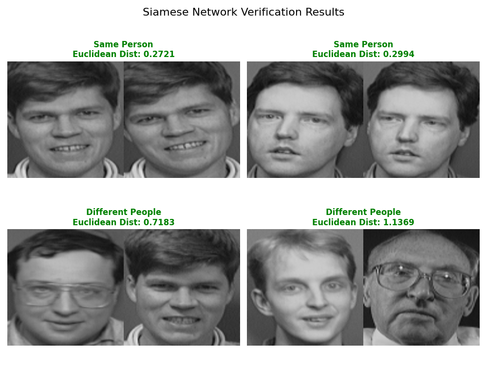
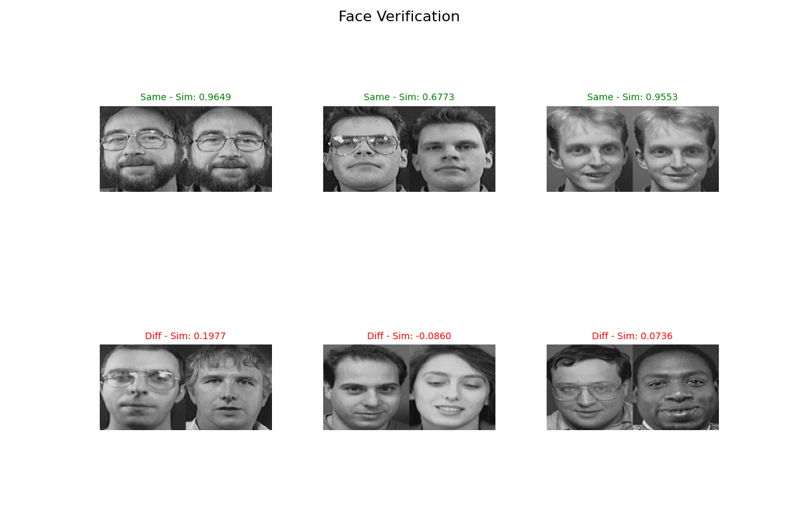
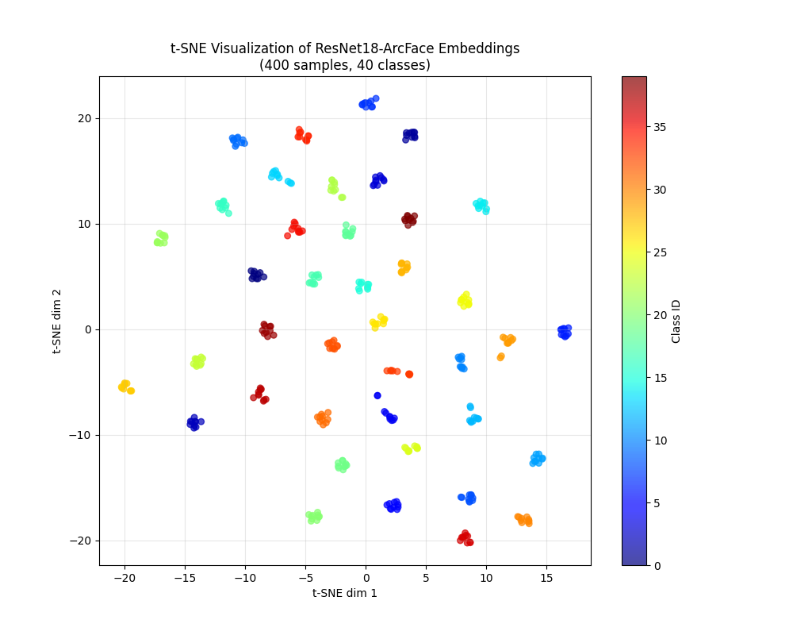

# 1. CV
## 1.1 Supervised
### 1.1.1 Image Classification
#### 1.1.1.1 传统分类
项目地址：https://github.com/virtualxiaoman/AI/tree/main/CV/Classification/Supervised_ResNet18_JAFFE
比较简单，只是练手。
#### 1.1.1.2 人脸识别
项目地址：https://github.com/virtualxiaoman/AI/tree/main/CV/Classification/Supervised_SiameseNet_ATTfaces
使用的模型定义如下：
```python
class ResNet18Embedding(nn.Module):
    def __init__(self, embedding_dim: int = 512):
        super().__init__()
        self.backbone = models.resnet18(weights=models.ResNet18_Weights.IMAGENET1K_V1)
        in_feat = self.backbone.fc.in_features
        self.backbone.fc = nn.Linear(in_feat, embedding_dim)
    def forward(self, x: torch.Tensor) -> torch.Tensor:
        x = self.backbone(x)  # [B, embedding_dim]
        x = F.normalize(x, p=2, dim=1)  # L2 normalize embeddings (important for ArcFace)
        return x
```

效果图：
1. 使用Contrastive Loss训练的结果（距离度量，设置`margin=1.0`）：
<div align=center>
    
</div>

2. 使用ArcFace Loss训练的结果（使用相似度`sim = torch.mm(emb1, emb2.t())`）：
<div align=center>
    
</div>
ArcFace在tsne下分类也比较明显：
<div align=center>
    
</div>
