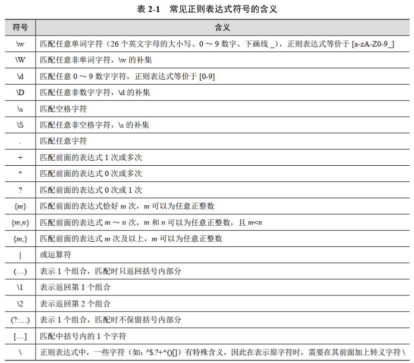

# $\color{ee0000} 1.\ 简介 $
## $\color{66ccff} 1.1\ 方法 $

- 符号主义：正则表达式、语言学
- 统计方法：N-gram、HMM、PCFG
- 联结主义：神经网络、深度学习

## $\color{66ccff} 1.2\ 参考资料 $
[动手学NLP](https://hnlp.boyuai.com/)：据说要出电子书，但是遥遥无期啊，最后还是买了纸质的。

# $\color{ee0000} 2.\ 文本规范化 $
## $\color{66ccff} 2.1\ 分词 $
### $\color{39c5bb} 2.1.1\ 英文 $

特点：词间有空格分隔。

1. **基于空格：**`tokens = sentence.split(' ')`

2. **基于正则表达式：**
  - **忽略所有标点：**`tokens = re.findall(r'\w+', sentence)`。（只替换标点而不分词：`re.sub(r'[^\w\s]', '', sentence)`）
  - **智能分词：**`\.\.\.|\$?\d+(?:\.\d+)?%?|(?:\w+\.)+\w+(?:\.)*|\w+(?:[-']\w+)*|\S\w*`
  其中：
  `\.\.\.`匹配省略号，
  `\$?\d+(?:\.\d+)?%?`匹配美元货币，
  `(?:\w+\.)+\w+(?:\.)*`匹配缩写或网址，
  `\w+(?:[-']\w+)*`匹配单词，
  `\S\w*`匹配连字符(比如It's的's或者单个标点符号)。
  最终效果是：
  ```python
  sentence = "Did you spend $3.4 on arxiv.org for your pre-print?   No, it's free! It's ..."
  pattern = r"\.\.\.|\$?\d+(?:\.\d+)?%?|(?:\w+\.)+\w+(?:\.)*|\w+(?:[-']\w+)*|\S\w*"
  print(re.findall(pattern, sentence))
  # 输出：['Did', 'you', 'spend', '$3.4', 'on', 'arxiv.org', 'for', 'your', 'pre-print', '?', 'No', ',', "it's", 'free', '!', "It's", '...']
  ```
  注：`(?:...)`是非捕获组，也就是匹配的时候要匹配到这个，但是不把这个组的内容放到匹配结果里面，比如`re.findall(r'(?:\w+)-(\d+)', 'abc-123 def-456')`的结果是`['123', '456']`。

<div align=center>

</div>

### $\color{39c5bb} 2.1.2\ 中文 $

特点：词间无空格分隔。

1. **基于监督学习的序列标注模型：** CRF
2. **基于子词的分词：** 字节对编码BPE、一元语言建模分词unigram language modeling tokenization、词片WordPiece。

<p style="color:#EC407A; font-weight:bold">BPE</p>

1. **初始化：** 将所有字符作为词并在最后面加上`_`，然后统计每个前后相连字符对的频率。比如将词`beijing`拆分成字符`['b', 'e', 'i', 'j', 'i', 'n', 'g', '_']`，统计语料库里所有的词`'be', 'ei', 'ij', 'ji', 'in', 'ng', 'g_'`的频率。
2. **合并：** 合并频率最高的字符对`merge_key`，更新字符对的频率。假设`merge_key`是`ng`，那么之前的`'n', 'g'`会被替换为`'ng'`。
3. **重复：** 重复步骤2，直到达到指定的词表大小或达到指定迭代次数。

<details>
<summary><span style="color:#009688; font-weight:bold">点击展开完整代码</span></summary>

代码实现：

```python
# 1. 语料库
corpus = "nan nan nan nan nan nanjing nanjing beijing beijing beijing beijing beijing beijing dongbei dongbei dongbei bei bei"
tokens = corpus.split(' ')

# 构建基于字符的初始词表
vocabulary = set(corpus)  # {'a', ' ', 'j', 'd', 'o', 'e', 'g', 'b', 'n', 'i'}
vocabulary.remove(' ')
vocabulary.add('_')
vocabulary = sorted(list(vocabulary))
print(vocabulary)  # ['_', 'a', 'b', 'd', 'e', 'g', 'i', 'j', 'n', 'o']

# 根据语料构建词表
corpus_dict = {}
for token in tokens:
    key = token + '_'
    if key not in corpus_dict:
        corpus_dict[key] = {"split": list(key), "count": 0}
    corpus_dict[key]['count'] += 1  # 比如：'nan_': {'split': ['n', 'a', 'n', '_'], 'count': 5}

print(f"语料：")
for key in corpus_dict:
    print(corpus_dict[key]['count'], corpus_dict[key]['split'])
print(f"词表：{vocabulary}")

# 2. BPE词元学习器
for step in range(9):
    print(f"------第{step + 1}次迭代------")
    split_dict = {}  # 用于统计符号组合的出现次数
    for key in corpus_dict:
        splits = corpus_dict[key]['split']  # key是当前符号nan_，splits是分割后的符号['n', 'a', 'n', '_']
        print(f"当前符号：{key}, 分割后的符号：{splits}")
        # 遍历所有符号进行统计
        for i in range(len(splits) - 1):
            # 组合两个符号作为新的符号
            current_group = splits[i] + splits[i + 1]
            if current_group not in split_dict:
                split_dict[current_group] = 0
            split_dict[current_group] += corpus_dict[key]['count']

    group_hist = [(k, v) for k, v in sorted(split_dict.items(), key=lambda item: item[1], reverse=True)]
    print(f"当前最常出现的前5个符号组合：{group_hist[:5]}")

    merge_key = group_hist[0][0]
    print(f"本次迭代组合的符号为：{merge_key}")
    for key in corpus_dict:
        if merge_key in key:
            new_splits = []
            splits = corpus_dict[key]['split']
            i = 0
            while i < len(splits):
                if i + 1 >= len(splits):
                    new_splits.append(splits[i])
                    i += 1
                    continue
                if merge_key == splits[i] + splits[i + 1]:
                    new_splits.append(merge_key)
                    i += 2
                else:
                    new_splits.append(splits[i])
                    i += 1
            corpus_dict[key]['split'] = new_splits  # 更新分割后的符号，比如merge_key是'ng'，那么之前的'n', 'g'会被替换为'ng'

    vocabulary.append(merge_key)
    print(f"迭代后的语料为：")
    for key in corpus_dict:
        print(corpus_dict[key]['count'], corpus_dict[key]['split'])
    print(f"词表：{vocabulary}")
ordered_vocabulary = {key: i for i, key in enumerate(vocabulary)}

# 3. BPE词元分词器
sentence = "nanjing beijing"
print(f"--------输入语句：{sentence}--------")
tokens = sentence.split(' ')
tokenized_string = []
for token in tokens:
    key = token + '_'
    splits = list(key)
    # 用于在没有更新的时候跳出
    flag = 1
    while flag:
        flag = 0
        split_dict = {}
        # 遍历所有符号进行统计
        for i in range(len(splits) - 1):
            # 组合两个符号作为新的符号
            current_group = splits[i] + splits[i + 1]
            if current_group not in ordered_vocabulary:
                continue  # 如果当前组合不在词表里，跳过
            if current_group not in split_dict:
                # 判断当前组合是否在词表里，如果是的话加入split_dict
                split_dict[current_group] = ordered_vocabulary[current_group]
                flag = 1
        if not flag:
            continue
        print(f"当前分词：{splits}")
        print(f"当前组合：{split_dict}")
        # 对每个组合进行优先级的排序（此处为从小到大）
        group_hist = [(k, v) for k, v in sorted(split_dict.items(), key=lambda item: item[1])]
        # 优先级最高的组合
        merge_key = group_hist[0][0]
        print(f"当前优先级最高的{merge_key}")
        new_splits = []
        i = 0
        # 根据优先级最高的组合产生新的分词
        while i < len(splits):
            if i + 1 >= len(splits):
                new_splits.append(splits[i])
                i += 1
                continue
            if merge_key == splits[i] + splits[i + 1]:
                new_splits.append(merge_key)
                i += 2
            else:
                new_splits.append(splits[i])
                i += 1
        splits = new_splits
    tokenized_string += splits

print(f"分词结果：{tokenized_string}")
```

</details>


## $\color{66ccff} 2.2\ 词规范化 $
### $\color{39c5bb} 2.2.1\ 英文 $

1. **大小写转换：** `sentence.lower()`
2. **词目还原：** `nltk.WordNetLemmatizer().lemmatize(word, pos='v')`，其中`pos`是词性，比如`v`是动词。
3. **词干还原：** `nltk.PorterStemmer().stem(word)`

### $\color{39c5bb} 2.2.2\ 中文 $

1. **繁简转换：** `opencc`、`hanziconv`


## $\color{66ccff} 2.3\ 分句 $
### $\color{39c5bb} 2.3.1\ 英文 $

1. **基于正则表达式：** `re.split(r'[.!?]', text)`，该方法可能会出现歧义，标点`.!?`可能会出现在缩写、数字、网址其他等地方。正确做法是先分词，再分句。如下：

<details>
<summary><span style="color:#009688; font-weight:bold">点击展开完整代码</span></summary>  

```python
import re
sentence_spliter = {".", "?", '!', '...'}
sentence = "Did you spend $3.4 on arxiv.org for your pre-print? No, it's free! It's ..."
pattern = r"\.\.\.|\$?\d+(?:\.\d+)?%?|(?:\w+\.)+\w+(?:\.)*|\w+(?:[-']\w+)*|\S\w*"
tokens = re.findall(pattern, sentence)
# ['Did', 'you', 'spend', '$3.4', 'on', 'arxiv.org', 'for', 'your', 'pre-print', '?', 'No', ',', "it's", 'free', '!', "It's", '...']
print(tokens)
sentences = []
boundary = [0]
# 遍历所有token，如果该token是句子边界，则将句子加入sentences
for token_id, token in enumerate(tokens):
    if token in sentence_spliter:
        # 如果是句子边界，则把分句结果加入进去
        sentences.append(tokens[boundary[-1]:token_id + 1])
        # 将下一句句子起始位置加入boundary
        boundary.append(token_id + 1)
    # print(sentences)
# 即使最后一个句子不是句子边界，也要加入进去
if boundary[-1] != len(tokens):
    sentences.append(tokens[boundary[-1]:])

print(f"分句结果：")
for seg_sentence in sentences:
    print(seg_sentence)
```
输出：
```
['Did', 'you', 'spend', '$3.4', 'on', 'arxiv.org', 'for', 'your', 'pre-print', '?']
['No', ',', "it's", 'free', '!']
["It's", '...']
```
</details>

### $\color{39c5bb} 2.3.2\ 中文 $

1. **基于正则表达式：** `re.split(r'[。！？]', text)`，同样可能会出现歧义，正确做法是先分词，再分句。

# $\color{ee0000} 3.\ 文本表示 $

## $\color{66ccff} 3.1\ 词向量 $

这里只给出GloVe的使用，不具体讨论词向量应该怎么表示更好。

<details>
<summary><span style="color:#009688; font-weight:bold">点击展开完整代码</span></summary>

```python
import pprint  # 美化输出
from gensim.models import KeyedVectors  # 加载词向量

model = KeyedVectors.load_word2vec_format('../model/official/glove/glove.6B.100d.txt', binary=False, no_header=True)
# 使用most_similar()找到词表中距离给定词最近（最相似）的n个词
pprint.pprint(model.most_similar('film'))
pprint.pprint(model.most_similar('car'))

# 类比
def analogy(x1, x2, y1):
    # y1 + x2 - x1
    result = model.most_similar(positive=[y1, x2], negative=[x1])
    return result[0][0]
print(analogy('china', 'chinese', 'japan'))  # japanese
print(analogy('australia', 'koala', 'china'))  # panda
print(analogy('tall', 'tallest', 'long'))  # longest
print(analogy('good', 'fantastic', 'bad'))  # terrible
print(analogy('man', 'woman', 'king'))  # queen
```

</details>

## $\color{66ccff} 3.2\ 稀疏向量 $

1. **共现矩阵：**`cooccur_matrix`大小为(vocab_size, vocab_size)，`cooccur_matrix[i, j]`表示词`i`和词`j`共现(在同一个窗口内，窗口长度可以设为`5`)的次数，是对称矩阵，对角线元素无效(实际过程中用0填充)。即$C_{ij} = \sum_{t=1}^{T} \mathbb{I}(w_t = i) \sum_{-c \leq j \leq c, j \ne 0} \mathbb{I}(w_{t+j} = j)$。与推荐系统当时问题一样，高频词会与很多词共现，主导着余弦相似度的计算结果。
2. **PPMI矩阵：**`ppmi_matrix`，大小为(vocab_size, vocab_size)，
`ppmi_matrix[i, j]`表示词`i`和词`j`的正点互信息(pointwise mutual information)值，是对称矩阵。即$\text {PMI}(i, j) = \log \frac{P(i, j)}{P(i)P(j)}$，$\text {PPMI}_{ij} = \max(\text {PMI}(i, j), 0)$。式中，$P(i, j) = \frac{C_{ij}}{N},P(i)=\frac{\sum_jC_{ij}}{N}$，$N$是语料库中的词数。

<details>
<summary><span style="color:#009688; font-weight:bold">点击展开完整代码</span></summary>

代码来自：https://stackoverflow.com/questions/58701337/how-to-construct-ppmi-matrix-from-a-text-corpus

```python
def co_occurrence(sentences, window_size):
    d = defaultdict(int)
    vocab = set()
    for text in sentences:
        # preprocessing (use tokenizer instead)
        text = text.lower().split()
        # iterate over sentences
        for i in range(len(text)):
            token = text[i]
            vocab.add(token)  # add to vocab
            next_token = text[i+1 : i+1+window_size]
            for t in next_token:
                key = tuple( sorted([t, token]) )
                d[key] += 1
    
    # formulate the dictionary into dataframe
    vocab = sorted(vocab) # sort vocab
    df = pd.DataFrame(data=np.zeros((len(vocab), len(vocab)), dtype=np.int16),
                      index=vocab,
                      columns=vocab)
    for key, value in d.items():
        df.at[key[0], key[1]] = value
        df.at[key[1], key[0]] = value
    return df

def pmi(df, positive=True):
    col_totals = df.sum(axis=0)
    total = col_totals.sum()
    row_totals = df.sum(axis=1)
    expected = np.outer(row_totals, col_totals) / total
    df = df / expected
    # Silence distracting warnings about log(0):
    with np.errstate(divide='ignore'):
        df = np.log(df)
    df[np.isinf(df)] = 0.0  # log(0) = 0
    if positive:
        df[df < 0] = 0.0
    return df

text = ["I go to school every day by bus .",
        "i go to theatre every night by bus"] 
df = co_occurrence(text, 2)
ppmi = pmi(df, positive=True)
```

</details>

## $\color{66ccff} 3.3\ 稠密向量 $

1. **基于SVD的潜在语义分析LSA**：对于一个文档-词语矩阵$A$(term-document matrix)，每行代表一个词，每列代表一个文档，矩阵中的值表示词在文档中的出现频率。$A = UΣV^T$取前$k$个特征值，左奇异矩阵$U$表示词语的特征向量，右奇异矩阵$V^T$表示文档的特征向量。

2. **word2vec**：在[推荐系统2.2.1](推荐系统.html)里，这里只给出pytorch的实现。

<details>
<summary><span style="color:#009688; font-weight:bold">点击展开完整代码</span></summary>

```python
from nltk.tokenize import sent_tokenize, word_tokenize
from collections import defaultdict
import numpy as np
import torch
from torch import nn
import torch.nn.functional as F
from tqdm import trange
import matplotlib.pyplot as plt
from torch.utils.data import DataLoader
from torch.optim import Adam

# 使用类管理数据对象，包括文本读取、文本预处理等
class TheLittlePrinceDataset:
    def __init__(self, tokenize=True):
        # 利用NLTK函数进行分句和分词
        text = open('data/the little prince.txt', 'r', encoding='utf-8').read()
        if tokenize:
            self.sentences = sent_tokenize(text.lower())
            self.tokens = [word_tokenize(sent) for sent in self.sentences]
        else:
            self.text = text

    def build_vocab(self, min_freq=1):
        # 统计词频
        frequency = defaultdict(int)
        for sentence in self.tokens:
            for token in sentence:
                frequency[token] += 1
        self.frequency = frequency

        # 加入<unk>处理未登录词，加入<pad>用于对齐变长输入进而加速
        self.token2id = {'<unk>': 1, '<pad>': 0}
        self.id2token = {1: '<unk>', 0: '<pad>'}
        for token, freq in sorted(frequency.items(), key=lambda x: -x[1]):
            # 丢弃低频词
            if freq > min_freq:
                self.token2id[token] = len(self.token2id)
                self.id2token[len(self.id2token)] = token
            else:
                break

    def get_word_distribution(self):
        distribution = np.zeros(vocab_size)
        for token, freq in self.frequency.items():
            if token in dataset.token2id:
                distribution[dataset.token2id[token]] = freq
            else:
                # 不在词表中的词按<unk>计算
                distribution[1] += freq
        distribution /= distribution.sum()
        return distribution

    # 将分词结果转化为索引表示
    def convert_tokens_to_ids(self, drop_single_word=True):
        self.token_ids = []
        for sentence in self.tokens:
            token_ids = [self.token2id.get(token, 1) for token in sentence]
            # 忽略只有一个token的序列，无法计算loss
            if len(token_ids) == 1 and drop_single_word:
                continue
            self.token_ids.append(token_ids)

        return self.token_ids

dataset = TheLittlePrinceDataset()
dataset.build_vocab(min_freq=1)
sentences = dataset.convert_tokens_to_ids()

# 遍历所有的中心词-上下文词对
window_size = 2
data = []  # 存储中心词-上下文词对
for sentence in sentences:
    for i in range(len(sentence)):
        for j in range(i-window_size, i+window_size+1):
            if j == i or j < 0 or j >= len(sentence):
                continue
            center_word = sentence[i]
            context_word = sentence[j]
            data.append([center_word, context_word])

data = np.array(data)
print(data.shape, data)

# 实现skipgram算法，使用对比学习计算损失
class SkipGramNCE(nn.Module):
    def __init__(self, vocab_size, embed_size, distribution, neg_samples=20):
        super(SkipGramNCE, self).__init__()
        print(f'vocab_size = {vocab_size}, embed_size = {embed_size}, ' + f'neg_samples = {neg_samples}')
        self.input_embeddings = nn.Embedding(vocab_size, embed_size)
        self.output_embeddings = nn.Embedding(vocab_size, embed_size)
        distribution = np.power(distribution, 0.75)
        distribution /= distribution.sum()
        self.distribution = torch.tensor(distribution)
        self.neg_samples = neg_samples

    def forward(self, input_ids, labels):
        i_embed = self.input_embeddings(input_ids)
        o_embed = self.output_embeddings(labels)
        batch_size = i_embed.size(0)
        n_words = torch.multinomial(self.distribution, batch_size * self.neg_samples, replacement=True).view(batch_size, -1)
        n_embed = self.output_embeddings(n_words)
        pos_term = F.logsigmoid(torch.sum(i_embed * o_embed, dim=1))
        # 负采样，用于对比学习
        neg_term = F.logsigmoid(- torch.bmm(n_embed, i_embed.unsqueeze(2)).squeeze())
        neg_term = torch.sum(neg_term, dim=1)
        loss = - torch.mean(pos_term + neg_term)
        return loss


# 为对比学习负采样准备词频率分布
vocab_size = len(dataset.token2id)
embed_size = 128
distribution = dataset.get_word_distribution()
print(distribution)
model = SkipGramNCE(vocab_size, embed_size, distribution)


# 定义静态方法collate_batch批量处理数据，转化为PyTorch可以需要的张量类型
class DataCollator:
    @classmethod
    def collate_batch(cls, batch):
        batch = np.array(batch)
        input_ids = torch.tensor(batch[:, 0], dtype=torch.long)
        labels = torch.tensor(batch[:, 1], dtype=torch.long)
        return {'input_ids': input_ids, 'labels': labels}


# 定义训练参数以及训练循环
epochs = 100
batch_size = 128
learning_rate = 1e-3
epoch_loss = []

data_collator = DataCollator()
dataloader = DataLoader(data, batch_size=batch_size, shuffle=True, collate_fn=data_collator.collate_batch)
optimizer = Adam(model.parameters(), lr=learning_rate)
model.zero_grad()
model.train()

# 训练过程，每步读取数据，送入模型计算损失，并使用PyTorch进行优化
with trange(epochs, desc='epoch', ncols=60) as pbar:
    for epoch in pbar:
        for step, batch in enumerate(dataloader):
            loss = model(**batch)
            pbar.set_description(f'epoch-{epoch}, loss={loss.item():.4f}')
            loss.backward()
            optimizer.step()
            model.zero_grad()
        epoch_loss.append(loss.item())

epoch_loss = np.array(epoch_loss)
plt.plot(range(len(epoch_loss)), epoch_loss)
plt.xlabel('training epoch')
plt.ylabel('loss')
plt.show()
# 保存模型
torch.save(model, '../model/prince/skipgram_nce.pth')
# 保存词向量
embeddings = model.input_embeddings.weight.data.numpy()
np.save('../model/prince/embeddings.npy', embeddings)
# 查询happy和sad的词向量，然后计算它们的余弦相似度
happy = embeddings[dataset.token2id['happy']]
sad = embeddings[dataset.token2id['sad']]
similarity = np.dot(happy, sad) / (np.linalg.norm(happy) * np.linalg.norm(sad))
print(similarity)  # 0.05455044
```

</details>


## $\color{66ccff} 3.4\ 文档表示 $

1. **TF-IDF**：
**TF**: Term Frequency，词频，表示词在文档中出现的频率。
**IDF**: Inverse Document Frequency，逆文档频率，表示词在文档集合中的稀有程度。
$$\text {TF}(w, d) = \frac{f_{w,d}}{\sum_{w' \in d} f_{w',d}}, \text {IDF}(w) = \log \frac{N}{\text {df}_w(+1)}$$
其中$f_{w,d}$是词$w$在文档$d$中的频率，$\text {df}_w$是包含词$w$的文档数，$N$是文档总数，$+1$是为了避免分母为0。

<details>
<summary><span style="color:#009688; font-weight:bold">点击展开完整代码</span></summary>

```python
class TFIDF:
    def __init__(self, vocab_size, norm='l2', smooth_idf=True, sublinear_tf=True):
        self.vocab_size = vocab_size
        self.norm = norm  # l2能让不同文档的TF-IDF向量长度一致
        self.smooth_idf = smooth_idf
        self.sublinear_tf = sublinear_tf

    def fit(self, X):
        doc_freq = np.zeros(self.vocab_size, dtype=np.float64)
        for data in X:
            for token_id in set(data):
                doc_freq[token_id] += 1
        doc_freq += int(self.smooth_idf)
        n_samples = len(X) + int(self.smooth_idf)
        self.idf = np.log(n_samples / doc_freq) + 1

    def transform(self, X):
        assert hasattr(self, 'idf')
        term_freq = np.zeros((len(X), self.vocab_size), dtype=np.float64)
        for i, data in enumerate(X):
            for token in data:
                term_freq[i, token] += 1
        if self.sublinear_tf:
            term_freq = np.log(term_freq + 1)
        Y = term_freq * self.idf
        if self.norm:
            row_norm = (Y ** 2).sum(axis=1)
            row_norm[row_norm == 0] = 1
            Y /= np.sqrt(row_norm)[:, None]
        return Y

    def fit_transform(self, X):
        self.fit(X)
        return self.transform(X)
```
</details>


2. **稠密向量**：
- 将文档里所有词的embedding求平均(平均池化、最大池化、注意力池化等)。
- 使用RNN、Transformer等模型的最后一层输出。


# $\color{ee0000} 4.\ 文本分类 $

## $\color{66ccff} 4.1\ 正则表达式 $

适合简单的文本分类任务，要求文本的特征比较明显(存在明显的关键词)。
不需要任何标注数据与训练，但是需要人工设计规则。

## $\color{66ccff} 4.2\ 朴素贝叶斯 $

对于分类问题$P(C|\boldsymbol{x})=\frac {P(\boldsymbol{x}|C)P(C)}{P(\boldsymbol{x})}:$

对于每个类别，计算其在所有样本中出现的概率，称之为先验概率$P(C)$。
对于每个特征，计算它在每个类别下的概率，称之为条件概率/似然函数$P(\boldsymbol x|C)$。
根据贝叶斯定理，计算给定特征下，每个类别出现的概率，称之为后验概率$P(C|\boldsymbol{x})$。
根据后验概率$P(C|\boldsymbol x)$的大小判定分类。
对于文本分类，朴素贝叶斯公式如下：
$$P(c|d) = \frac{P(d|c)P(c)}{P(d)} \propto P(d|c)P(c) = P(c)\prod_{i=1}^{n}P(w_i|c)$$
式中，将文档$d$表示为词的序列$d=(w_1,w_2,...,w_n)$，$P(c|d)$是文档$d$属于类别$c$的概率，$P(d|c)$是类别$c$下文档$d$的概率，$P(c)$是类别$c$的概率，$P(w_i|c)$是类别$c$下词$w_i$的概率。其中，naive Bayes的假设：
- **条件独立假设**：词之间相互独立，即$P(w_i|c)$与$P(w_j|c)$独立，因此$P(d|c)=P(w_1,w_2,...,w_n|c)=P_1(w_1|c)P_2(w_2|c)...P_n(w_n|c)$，P的下标表示词的位置。
- **词袋假设**：词的位置对分类没有影响，对于某个词$w_k$，有$\forall i,j, P_i(w_k|c)=P_j(w_k|c)=P(w_k|c)$。
但目前还有一个问题，如果某个词$w_p$虽然很能代表类别$C_q$，但是却没有在训练集的$C_q$里出现，那么$P(w_p|c_q)=0$，解决方法是Laplace平滑，$P(w_p|C_q)=\frac{\text {count}(w_p|c_q)+1}{(\sum_{w\in \mathcal{V} }^{}\text {count}(w|c_q)) +\mathcal{|V|} }$

<details>
<summary><span style="color:#009688; font-weight:bold">点击展开完整代码</span></summary>

```python
from tqdm import tqdm
from collections import defaultdict
import json
import spacy
from spacy.lang.zh.stop_words import STOP_WORDS
import numpy as np

nlp = spacy.load('zh_core_web_sm')


class BooksDataset:
    def __init__(self):
        train_file, test_file = 'data/Hands-on-NLP/train.jsonl', 'data/Hands-on-NLP/test.jsonl'

        # 下载数据为JSON格式，转化为Python对象
        def read_file(file_name):
            with open(file_name, 'r', encoding='utf-8') as fin:
                json_list = list(fin)
            data_split = []
            for json_str in json_list:
                data_split.append(json.loads(json_str))
            return data_split

        self.train_data, self.test_data = read_file(train_file), read_file(test_file)
        print('train size =', len(self.train_data),
              ', test size =', len(self.test_data))

        # 建立文本标签和数字标签的映射
        self.label2id, self.id2label = {}, {}
        for data_split in [self.train_data, self.test_data]:
            for data in data_split:
                txt = data['class']
                if txt not in self.label2id:
                    idx = len(self.label2id)
                    self.label2id[txt] = idx
                    self.id2label[idx] = txt
                label_id = self.label2id[txt]
                data['label'] = label_id

    def tokenize(self, attr='book'):
        # 使用以下两行命令安装spacy用于中文分词
        # pip install -U spacy
        # python -m spacy download zh_core_web_sm
        # 去除文本中的符号和停用词
        for data_split in [self.train_data, self.test_data]:
            for data in tqdm(data_split):
                # 转为小写
                text = data[attr].lower()
                # 符号替换为空
                tokens = [t.text for t in nlp(text) if t.text not in STOP_WORDS]
                # 这一步比较耗时，因此把tokenize的结果储存起来
                data['tokens'] = tokens

    # 根据分词结果建立词表，忽略部分低频词，
    # 可以设置词最短长度和词表最大大小
    def build_vocab(self, min_freq=3, min_len=2, max_size=None):
        frequency = defaultdict(int)
        for data in self.train_data:
            tokens = data['tokens']
            for token in tokens:
                frequency[token] += 1

        print(f'unique tokens = {len(frequency)}, ' + \
              f'total counts = {sum(frequency.values())}, ' + \
              f'max freq = {max(frequency.values())}, ' + \
              f'min freq = {min(frequency.values())}')

        self.token2id = {}
        self.id2token = {}
        total_count = 0
        for token, freq in sorted(frequency.items(), key=lambda x: -x[1]):
            if max_size and len(self.token2id) >= max_size:
                break
            if freq > min_freq:
                if (min_len is None) or (min_len and len(token) >= min_len):
                    self.token2id[token] = len(self.token2id)
                    self.id2token[len(self.id2token)] = token
                    total_count += freq
            else:
                break
        print(f'min_freq = {min_freq}, min_len = {min_len}, ' + \
              f'max_size = {max_size}, '
              f'remaining tokens = {len(self.token2id)}, '
              f'in-vocab rate = {total_count / sum(frequency.values())}')

    # 将分词后的结果转化为数字索引
    def convert_tokens_to_ids(self):
        for data_split in [self.train_data, self.test_data]:
            for data in data_split:
                data['token_ids'] = []
                for token in data['tokens']:
                    if token in self.token2id:
                        data['token_ids'].append(self.token2id[token])


dataset = BooksDataset()
dataset.tokenize()
print(dataset.train_data[0]['tokens'])
print(dataset.label2id)


dataset.build_vocab(min_freq=3)
dataset.convert_tokens_to_ids()
print(dataset.train_data[0]['token_ids'])


train_X, train_Y = [], []
test_X, test_Y = [], []

for data in dataset.train_data:
    x = np.zeros(len(dataset.token2id), dtype=np.int32)
    for token_id in data['token_ids']:
        x[token_id] += 1
    train_X.append(x)
    train_Y.append(data['label'])
for data in dataset.test_data:
    x = np.zeros(len(dataset.token2id), dtype=np.int32)
    for token_id in data['token_ids']:
        x[token_id] += 1
    test_X.append(x)
    test_Y.append(data['label'])
train_X, train_Y = np.array(train_X), np.array(train_Y)
test_X, test_Y = np.array(test_X), np.array(test_Y)


class NaiveBayes:
    def __init__(self, num_classes, vocab_size):
        self.num_classes = num_classes
        self.vocab_size = vocab_size
        self.prior = np.zeros(num_classes, dtype=np.float64)
        self.likelihood = np.zeros((num_classes, vocab_size), dtype=np.float64)

    def fit(self, X, Y):
        # NaiveBayes的训练主要涉及先验概率和似然的估计，
        # 这两者都可以通过计数简单获得
        for x, y in zip(X, Y):
            self.prior[y] += 1
            for token_id in x:
                self.likelihood[y, token_id] += 1

        self.prior /= self.prior.sum()
        # laplace平滑
        self.likelihood += 1
        self.likelihood /= self.likelihood.sum(axis=0)
        # 为了避免精度溢出，使用对数概率
        self.prior = np.log(self.prior)
        self.likelihood = np.log(self.likelihood)

    def predict(self, X):
        # 算出各个类别的先验概率与似然的乘积，找出最大的作为分类结果
        preds = []
        for x in X:
            p = np.zeros(self.num_classes, dtype=np.float64)
            for i in range(self.num_classes):
                p[i] += self.prior[i]
                for token in x:
                    p[i] += self.likelihood[i, token]
            preds.append(np.argmax(p))
        return preds


nb = NaiveBayes(len(dataset.label2id), len(dataset.token2id))
train_X, train_Y = [], []
for data in dataset.train_data:
    train_X.append(data['token_ids'])
    train_Y.append(data['label'])
nb.fit(train_X, train_Y)

for i in range(3):
    print(f'P({dataset.id2label[i]}) = {np.exp(nb.prior[i])}')
for i in range(3):
    print(f'P({dataset.id2token[i]}|{dataset.id2label[0]}) = ' + \
          f'{np.exp(nb.likelihood[0, i])}')

test_X, test_Y = [], []
for data in dataset.test_data:
    test_X.append(data['token_ids'])
    test_Y.append(data['label'])

NB_preds = nb.predict(test_X)

for i, (p, y) in enumerate(zip(NB_preds, test_Y)):
    if i >= 5:
        break
    print(f'test example-{i}, prediction = {p}, label = {y}')
```

</details>

## $\color{66ccff} 4.3\ 逻辑回归 $

在NB中，我们使用的是$d=(w_1,w_2,...,w_n)$来表示文档，但是这种表示方法忽略了词之间的关系，比如词的顺序、词的位置等。逻辑回归可以解决这个问题，它的输入是文档的特征向量$\boldsymbol{x}=(x_1,x_2,...,x_n)$，其中$x_i$是词$w_i$的特征向量，可以是词向量、TF-IDF向量等。逻辑回归的输出是一个标量，表示文档属于某个类别的概率。逻辑回归的损失函数是交叉熵损失函数：
$$L=-\frac 1 N \sum_{i=1}^{N}\log p_\theta(c_i|\boldsymbol{x}_i) + \lambda \|\theta\|_2^2$$
其中，$N$是样本数，$p_\theta(c_i|\boldsymbol{x}_i$是模型预测的文档$\boldsymbol{x}_i$属于类别$c_i$的概率，$\theta$是模型参数，$\lambda$是正则化系数。
二分类时，$p_\theta(c_i=1|\boldsymbol{x}_i)=\sigma(\boldsymbol{\theta}^T\boldsymbol{x}_i)=\frac{1}{1+\exp(-\boldsymbol{\theta}^T\boldsymbol{x}_i)}$，$p_\theta(c_i=0|\boldsymbol{x}_i)=1-p_\theta(c_i=1|\boldsymbol{x}_i)=\frac{\exp(-\boldsymbol{\theta}^T\boldsymbol{x}_i)}{1+\exp(-\boldsymbol{\theta}^T\boldsymbol{x}_i)}$。
多分类时，$p_\theta(c_i=k|\boldsymbol{x}_i)=\text{softmax}(\boldsymbol{\theta}_k^T\boldsymbol{x}_i)=\frac{\exp(\boldsymbol{\theta}_k^T\boldsymbol{x}_i)}{\sum_{j=1}^{K}\exp(\boldsymbol{\theta}_j^T\boldsymbol{x}_i)}$。

<details>
<summary><span style="color:#009688; font-weight:bold">点击展开完整代码</span></summary>

数据集同4.2朴素贝叶斯。另外还实现了微平均micro-average和宏平均macro-average。

```python
import torch
from torch import nn
from tqdm import tqdm, trange
import matplotlib.pyplot as plt
import numpy as np
from torch.utils.data import Dataset, DataLoader
from torch.optim import SGD, Adam

class TFIDF:
    def __init__(self, vocab_size, norm='l2', smooth_idf=True, sublinear_tf=True):
        self.vocab_size = vocab_size
        self.norm = norm  # l2能让不同文档的TF-IDF向量长度一致
        self.smooth_idf = smooth_idf
        self.sublinear_tf = sublinear_tf

    def fit(self, X):
        doc_freq = np.zeros(self.vocab_size, dtype=np.float64)
        for data in X:
            for token_id in set(data):
                doc_freq[token_id] += 1
        doc_freq += int(self.smooth_idf)
        n_samples = len(X) + int(self.smooth_idf)
        self.idf = np.log(n_samples / doc_freq) + 1

    def transform(self, X):
        assert hasattr(self, 'idf')
        term_freq = np.zeros((len(X), self.vocab_size), dtype=np.float64)
        for i, data in enumerate(X):
            for token in data:
                term_freq[i, token] += 1
        if self.sublinear_tf:
            term_freq = np.log(term_freq + 1)
        Y = term_freq * self.idf
        if self.norm:
            row_norm = (Y ** 2).sum(axis=1)
            row_norm[row_norm == 0] = 1
            Y /= np.sqrt(row_norm)[:, None]
        return Y

    def fit_transform(self, X):
        self.fit(X)
        return self.transform(X)

tfidf = TFIDF(len(dataset.token2id))
tfidf.fit(train_X)
train_F = tfidf.transform(train_X)
test_F = tfidf.transform(test_X)


class LR(nn.Module):
    def __init__(self, input_dim, output_dim):
        super(LR, self).__init__()
        self.linear = nn.Linear(input_dim, output_dim)

    def forward(self, input_feats, labels=None):
        outputs = self.linear(input_feats)

        if labels is not None:
            loss_fc = nn.CrossEntropyLoss()
            loss = loss_fc(outputs, labels)
            return (loss, outputs)

        return outputs


model = LR(len(dataset.token2id), len(dataset.label2id))


# 使用PyTorch的DataLoader来进行数据循环，因此按照PyTorch的接口
# 实现myDataset和DataCollator两个类
# myDataset是对特征向量和标签的简单封装便于对齐接口，
# DataCollator用于批量将数据转化为PyTorch支持的张量类型
class myDataset(Dataset):
    def __init__(self, X, Y):
        self.X = X
        self.Y = Y

    def __len__(self):
        return len(self.X)

    def __getitem__(self, idx):
        return self.X[idx], self.Y[idx]


class DataCollator:
    @classmethod
    def collate_batch(cls, batch):
        feats, labels = [], []
        for x, y in batch:
            feats.append(x)
            labels.append(y)
        # 直接将一个ndarray的列表转化为张量是非常慢的，
        # 所以需要提前将列表转化为一整个ndarray
        feats = torch.tensor(np.array(feats), dtype=torch.float)
        labels = torch.tensor(np.array(labels), dtype=torch.long)
        return {'input_feats': feats, 'labels': labels}


# 设置训练超参数和优化器，模型初始化
epochs = 50
batch_size = 128
learning_rate = 1e-3
weight_decay = 0

train_dataset = myDataset(train_F, train_Y)
test_dataset = myDataset(test_F, test_Y)

data_collator = DataCollator()
train_dataloader = DataLoader(train_dataset, batch_size=batch_size, shuffle=True, collate_fn=data_collator.collate_batch)
test_dataloader = DataLoader(test_dataset, batch_size=batch_size, shuffle=False, collate_fn=data_collator.collate_batch)
optimizer = Adam(model.parameters(), lr=learning_rate, weight_decay=weight_decay)
model.zero_grad()
model.train()

# 模型训练
with trange(epochs, desc='epoch', ncols=60) as pbar:
    epoch_loss = []
    for epoch in pbar:
        model.train()
        for step, batch in enumerate(train_dataloader):
            loss = model(**batch)[0]
            pbar.set_description(f'epoch-{epoch}, loss={loss.item():.4f}')
            loss.backward()
            optimizer.step()
            model.zero_grad()
            epoch_loss.append(loss.item())

    epoch_loss = np.array(epoch_loss)
    # 打印损失曲线
    plt.plot(range(len(epoch_loss)), epoch_loss)
    plt.xlabel('training epoch')
    plt.ylabel('loss')
    plt.show()

    model.eval()
    with torch.no_grad():
        loss_terms = []
        for batch in test_dataloader:
            loss = model(**batch)[0]
            loss_terms.append(loss.item())
        print(f'eval_loss = {np.mean(loss_terms):.4f}')

LR_preds = []
model.eval()
for batch in test_dataloader:
    with torch.no_grad():
        _, preds = model(**batch)
        preds = np.argmax(preds, axis=1)
        LR_preds.extend(preds)

for i, (p, y) in enumerate(zip(LR_preds, test_Y)):
    if i >= 5:
        break
    print(f'test example-{i}, prediction = {p}, label = {y}')


test_Y = np.array(test_Y)
NB_preds = np.array(NB_preds)
LR_preds = np.array(LR_preds)

def micro_f1(preds, labels):
    TP = np.sum(preds == labels)
    FN = FP = 0
    for i in range(len(dataset.label2id)):
        FN += np.sum((preds == i) & (labels != i))
        FP += np.sum((preds != i) & (labels == i))
    precision = TP / (TP + FP)
    recall = TP / (TP + FN)
    f1 = 2 * precision * recall / (precision + recall)
    return f1

def macro_f1(preds, labels):
    f_scores = []
    for i in range(len(dataset.label2id)):
        TP = np.sum((preds == i) & (labels == i))
        FN = np.sum((preds == i) & (labels != i))
        FP = np.sum((preds != i) & (labels == i))
        precision = TP / (TP + FP)
        recall = TP / (TP + FN)
        f1 = 2 * precision * recall / (precision + recall)
        f_scores.append(f1)
    return np.mean(f_scores)

print(f'NB: micro-f1 = {micro_f1(NB_preds, test_Y)}, '+\
      f'macro-f1 = {macro_f1(NB_preds, test_Y)}')
print(f'LR: micro-f1 = {micro_f1(LR_preds, test_Y)}, '+\
      f'macro-f1 = {macro_f1(LR_preds, test_Y)}')
```
输出：
```
NB: micro-f1 = 0.8961520630505331, macro-f1 = 0.8948572078813896
LR: micro-f1 = 0.9151599443671766, macro-f1 = 0.9143871512947528
```

</details>


# $\color{ee0000} 5.\ 文本聚类 $

先将文档转化为特征向量，然后使用聚类算法对特征向量进行聚类。

## $\color{66ccff} 5.1\ K-means $
注意使用TF-IDF向量的时候需要L2正则化，因为K-means对特征的尺度敏感。

## $\color{66ccff} 5.2\ 基于高斯混合的EM算法 $

高斯函数的PDF：
$$f_\chi(x)=\frac{\exp\left[-\frac12(x-\mu)^T\Sigma^{-1}\left(x-\mu\right)\right]}{(2\pi)^{\frac D2}\left|\Sigma\right|^{\frac12}}$$
式中，$\mu$是均值(维度与$x$一样，都是$D$)，$\Sigma_{D\times D}$是协方差矩阵，$D$是特征维度，$\chi=\{\mu,\Sigma\}$是高斯分布的参数。
高斯混合模型是多个高斯函数的线性组合，其PDF是：
$$f(x)=\sum_{k=1}^{K}\pi_kf_k(x)$$
式中，$\pi_k$是第$k$个高斯函数的权重(混合系数)，满足$\pi_k \ge 0,\sum_{k=1}^{K}\pi_k=1$，$f_k(x)$是第$k$个高斯函数。
EM算法的目标是最大化似然函数：
$$\max_{\theta} \prod_{i=1}^{N}f(x) = \max_{\theta} \prod_{i=1}^{N}\sum_{k=1}^{K}\pi_kf_k(x) \Rightarrow \max_{\theta} \sum_{i=1}^{N}\log\left(\sum_{k=1}^{K}\pi_kf_k(x_i)\right)$$
其中，参数$\theta=\{\pi_k,\mu_k,\Sigma_k\}_{k=1}^{K}$。
初始：随机初始化参数$\theta$。
E步：计算每个样本$x_i$属于第$k$个高斯函数的概率：
$$\gamma_{ik}=\frac{\pi_kf_k(x_i)}{\sum_{j=1}^{K}\pi_jf_j(x_i)}$$
$\gamma_{ik}$事实上建模的是一种概率分布。
M步：更新参数：
$$\pi_k=\frac1N\sum_{i=1}^{N}\gamma_{ik},\mu_k=\frac{\sum_{i=1}^{N}\gamma_{ik}x_i}{\sum_{i=1}^{N}\gamma_{ik}},\Sigma_k=\frac{\sum_{i=1}^{N}\gamma_{ik}(x_i-\mu_k)(x_i-\mu_k)^T}{\sum_{i=1}^{N}\gamma_{ik}}$$
式中，$N$是样本数。
EM算法的收敛条件：
- 最大迭代次数。
- 参数变化小于阈值。

**EM算法与K-means的关联：**
K-means是EM算法的特例，K-means的E步是硬聚类，M步是更新均值，K-means的E步是$\gamma_{ik}=\begin{cases}1 & \text{if }k=\arg\min_j\|x_i-\mu_j\|_2^2\\0 & \text{otherwise}\end{cases}$，M步是$\mu_k=\frac{\sum_{i=1}^{N}\gamma_{ik}x_i}{\sum_{i=1}^{N}\gamma_{ik}}$。也就是说，EM比K-means多了$\pi_k$和$\Sigma_k$的更新，而这两个参数代表着高斯分布的权重和协方差。
如果EM满足协方差矩阵等比于单位矩阵且权重和均方差均相同(只有均值可变)且假设方差无限接近于0时，EM等价于k-means：
- $\Sigma_k = \sigma^2 I$：每个高斯分布的形状相同(所有的高斯模型都为球状)，只是位置不同，这类似于K-means中的每个簇的形状相同。
- 权重和均方差均相同：所有高斯分布的权重和方差相同意味着每个簇的重要性相同，这与K-means中的簇没有优先级类似。
- 方差无限接近于0：方差接近于0意味着高斯分布变得非常尖锐，几乎所有的概率质量集中在均值附近，这样每个数据点只会被分配给离它最近的均值对应的簇，这与K-means中的硬聚类分配相同。


## $\color{66ccff} 5.3\ 无监督朴素贝叶斯 $

k-means和基于高斯混合的EM算法都是基于**文档的特征向量**进行聚类，无监督朴素贝叶斯是基于文档的**词序列**进行聚类。
朴素贝叶斯假设一个文档中的所有词都是在给定文档标签的条件下独立同分布地通过一个离散分布生成的。
无监督朴素贝叶斯的EM算法，对于文档$x_i$：
$$f(x_i)=\sum_{k=1}^{K}\pi_kf_k(x_i)$$
其中，$f_k(x_i)$是第$k$个簇的离散分布，表示为$f_k(x)=\prod_{j=1}^{|w_i|}\text{Multi}(x_{ij}|\theta_{k})$，$|w_i|$是文档$x_i$的词数，$x_{ij}$是文档$x_i$的第$j$个词，$\theta_{k}=(p_{k1},p_{k2},...,p_{k|V|})$是第$k$个簇的参数，$p_{kj}$是第$k$个簇生成词$w_j$的概率，$|V|$是词表大小。
E步：计算每个词$w_j$属于第$k$个簇的概率：
$$\gamma_{ijk}=\frac{\pi_kf_k(x_i)}{\sum_{j=1}^{K}\pi_jf_j(x_i)}$$
M步：更新参数：
$$\pi_k=\frac1N\sum_{i=1}^{N}\gamma_{ik},p_{kj}=\frac{\sum_{i=1}^{N}\gamma_{ijk}}{\sum_{i=1}^{N}\sum_{j=1}^{|V|}\gamma_{ijk}}$$
式中，$N$是文档数。


## $\color{66ccff} 5.4\ 主题模型 $

前面都是认为每个文档只有一个标签，主题模型假设文档有一个所有标签上的概率分布$y$，而每个词$w_i$还是仅有一个标签$z_i$，即$z_i$服从$y$的概率分布，是$y$上的一个采样。
概率潜在模型：pLSA(probabilistic Latent Semantic Analysis)：
$$P(w_i|d)=\sum_{z}P(w_i|z)P(z|d)$$
其中，$P(w_i|z)$是词$w_i$在主题$z$上的概率，$P(z|d)$是主题$z$在文档$d$上的概率。

潜在狄利克雷分配：LDA(Latent Dirichlet Allocation)：
认为标签概率分布是稀疏的，即每个文档只有少量主题，每个主题只有少量词。需要使用变分推断或者马尔可夫链蒙特卡洛方法进行求解。


# $\color{ee0000} 6.\ 语言模型 $
语言模型是用来计算一个句子(文字序列)的概率的模型。
**困惑度**(perplexity)是语言模型的评价指标，困惑度越低，模型越好。对于测试语料库$x_{1:N}$，困惑度的定义是：
$$\text{Perplexity}(x_{1:N})=\exp\left(-\frac1N\sum_{n=1}^{N}\log p(x_n|x_{1:n-1})\right)$$
其中，$p(x_n|x_{1:n-1})$是模型预测第$n$个词的概率。


牛魔的后面的LLM要显存那么多，kaggle上16G的都跑不了。不玩了，用下面的demo暂时结束吧。等之后找个4090的玩。


```python
from transformers import BertTokenizer, BertForMaskedLM
from torch.nn import functional as F
import torch

# 选用bert-base-uncased模型进行预测，使用相应的分词器
tokenizer = BertTokenizer.from_pretrained('../HF_model/google-bert/bert-base-uncased')
model = BertForMaskedLM.from_pretrained('../HF_model/google-bert/bert-base-uncased', return_dict=True)

# 准备输入句子“The capital of China is [MASK].”
text = 'The capital of China is ' + tokenizer.mask_token + '.'
# 将输入句子编码为PyTorch张量
inputs = tokenizer.encode_plus(text, return_tensors='pt')
# 定位[MASK]所在的位置
mask_index = torch.where(inputs['input_ids'][0] == tokenizer.mask_token_id)
output = model(**inputs)
logits = output.logits
# 从[MASK]所在位置的输出分布中，选择概率最高的5个并打印
distribution = F.softmax(logits, dim=-1)
mask_word = distribution[0, mask_index, :]
top_5 = torch.topk(mask_word, 5, dim=1)[1][0]
for token in top_5:
    word = tokenizer.decode([token])
    new_sentence = text.replace(tokenizer.mask_token, word)
    print(new_sentence)
```
输出：
```
hello again.
hello there.
hello mom.
hello kitty.
hello you.
```
