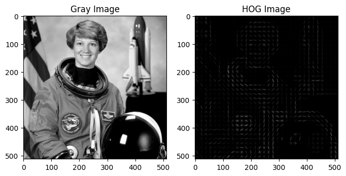
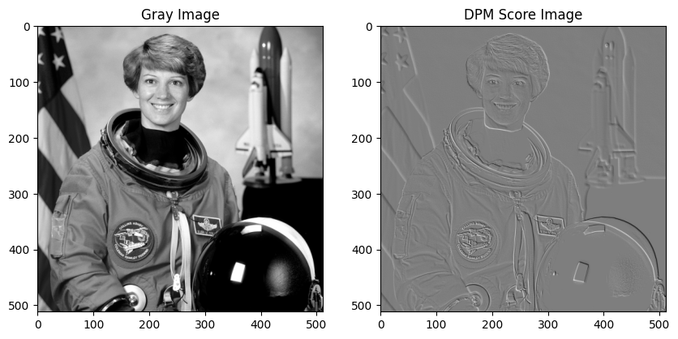

# 1. 机器学习

## 1.1 

### 1.1.1 HOG
方向梯度直方图Histogram of Oriented Gradients，是一种用于目标检测的特征描述子。
对于每个像素点，记水平、垂直梯度为$G_x$、$G_y$，则梯度幅值为$M = \sqrt{G_x^2 + G_y^2}$，梯度方向为$\theta = \arctan(G_y / G_x)$。

<div style="display: flex; justify-content: center; align-items: center;">
<div style=" max-height: 200px; max-width: 90%; overflow-y: auto; border: 1px solid #39c5bb; border-radius: 10px;">

```python
import numpy as np
from skimage.feature import hog
from skimage import data, exposure
from skimage.color import rgb2gray
import matplotlib.pyplot as plt

# 加载图像并灰度化
image = data.astronaut()
gray_image = rgb2gray(image)
# 计算HOG特征
fd, hog_image = hog(gray_image, orientations=8, pixels_per_cell=(16, 16), cells_per_block=(1, 1), visualize=True)
# 可视化HOG特征
hog_image_rescaled = exposure.rescale_intensity(hog_image, in_range=(0, 10))

# 显示原始灰度图像 和 HOG特征图像
plt.figure(figsize=(8, 4))
plt.subplot(1, 2, 1)
plt.title('Gray Image')
plt.imshow(gray_image, cmap='gray')
plt.subplot(1, 2, 2)
plt.title('HOG Image')
plt.imshow(hog_image_rescaled, cmap='gray')
plt.show()
```
</div>
</div>

<div style="display: flex; justify-content: center; align-items: center;">
    <div style="text-align: center;">
        
        <p style="font-size: small; color: gray;">HOG</p>
    </div>
</div>

### 1.1.2 DPM
可变现的组件模型Deformable Part Model，是一种用于目标检测的模型。
$$\text{score}(\boldsymbol{x})=\max_{\boldsymbol{z}} \left(\boldsymbol{w}_0\cdot\phi_0(\boldsymbol{x})+\sum_{i=1}^n\left[\boldsymbol{w}_i\cdot\phi_i(\boldsymbol{x},\boldsymbol{z}_i)-d_i(\boldsymbol{z}_i)\right]\right)$$其中$\boldsymbol{x}$是输入图像，$\boldsymbol{w}$是模型的权重(下标$0$代表根模型，下标$i$是部分模型)，$\phi$是特征提取函数，$\boldsymbol{z}$是模型的组件位置，$d$是组件的形变成本(部分模型相对于根模型的位置信息惩罚)。
- **根模型**`Root Model`：捕捉整体外观，通常是一个较大、低分辨率的过滤器，用于检测目标的大致形状。
- **部分模型**`Part Models`：目标被分解为多个部分模型，每个部分捕捉目标的一个局部特征。每个部分模型有自己独立的过滤器，用于检测该部分的特征。

<div style="display: flex; justify-content: center; align-items: center;">
<div style=" max-height: 200px; max-width: 90%; overflow-y: auto; border: 1px solid #39c5bb; border-radius: 10px;">

```python
from scipy.ndimage import convolve  # 其余包、变量在HOG的代码中已经导入

class DeformablePartModel:
    def __init__(self, root_filter, part_filters, deformation_costs):
        self.root_filter = root_filter
        self.part_filters = part_filters
        self.deformation_costs = deformation_costs

    def apply_filter(self, image, filter):
        # 使用卷积来应用过滤器
        return convolve(image, filter, mode='reflect')

    def score(self, image):
        # 计算根模型的分数
        root_score = self.apply_filter(image, self.root_filter)
        # 计算每个部分模型的分数，并加入位移惩罚
        total_score = root_score
        for part_filter, deformation_cost in zip(self.part_filters, self.deformation_costs):
            part_score = self.apply_filter(image, part_filter)
            total_score += part_score - deformation_cost  
        return total_score


# 定义根模型和部分模型的卷积核
root_filter = np.array([[-1, -1, -1], [-1, 8, -1], [-1, -1, -1]])  # 类似边缘检测
part_filter1 = np.array([[1, 0, -1], [1, 0, -1], [1, 0, -1]])  # 简单的Sobel滤波器
part_filter2 = np.array([[-1, -1, -1], [0, 0, 0], [1, 1, 1]])  # 另一个简单滤波器
deformation_costs = [0.5, 0.5]  # 位移惩罚项

dpm = DeformablePartModel(root_filter, [part_filter1, part_filter2], deformation_costs)  # 初始化DPM模型
dpm_score = dpm.score(gray_image)  # 计算DPM的得分图

# 可视化原始灰度图像和DPM得分图像
plt.figure(figsize=(10, 5))
plt.subplot(1, 2, 1)
plt.title('Gray Image')
plt.imshow(gray_image, cmap='gray')
plt.subplot(1, 2, 2)
plt.title('DPM Score Image')
plt.imshow(dpm_score, cmap='gray')
plt.show()
```
</div>
</div>

<div style="display: flex; justify-content: center; align-items: center;">
    <div style="text-align: center;">
        
        <p style="font-size: small; color: gray;">DPM</p>
    </div>
</div>


# 2. 深度学习