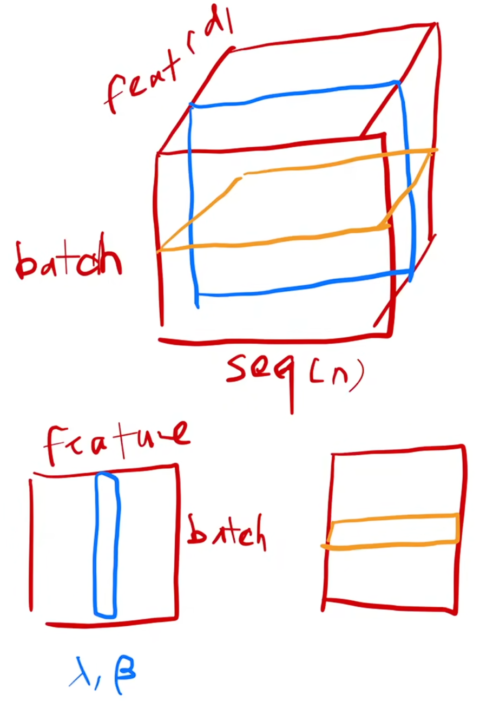

## CV
### 经典论文
#### ImageNet Classification with Deep Convolutional Neural Networks
> Our neural network architecture has 60 million parameters. Although the 1000 classes of ILSVRC make each training example impose 10 bits of constraint on the mapping from image to label, this turns out to be insufficient to learn so many parameters without considerable overfitting. 我们的神经网络架构有6000万个参数。尽管ILSVRC的1000个类别使得每个训练样本对图像到标签的映射施加了约10比特的约束，但这被证明不足以在避免严重过拟合的前提下学习如此多的参数。

60M parameters $\to$ 网络的表达能力capacity，一个param不止一个bit（比如32-bit float）。1000个标签 $\to$ 1000种可能性 $\to$ 需要 $\log_2(1000)$ 的二进制位才能唯一表示。也就是每张图片只提供约10 bits监督信息，所以网络是memorize而不是generalize。

ReLU作用：加速训练（6倍）、不需要input normalization、防止过拟合（Jarrett的实验）

Q: 系统要求固定的输入维度，如何下采样到256×256 ？
A: 缩放，使较短边长度为 256，然后从缩放后的图像中裁剪出中央的 256×256 区域。
PS. ResNet在缩放时，使较短边长度在 [256, 480] 范围内随机采样，以实现尺度增强。然后从图像或其水平翻转中随机裁剪出 224×224 的区块，并减去均值 。


#### Deep Residual Learning for Image Recognition
> Unexpectedly, such degradation is not caused by overfitting, and adding more layers to a suitably deep model leads to higher training error 出乎意料的是，这种退化并非由过拟合所致，而是向适当深度的模型中添加更多层会导致训练误差升高

过拟合：训练误差低、测试误差高。因此这里是退化（优化失败）。

> To the extreme, if an identity mapping were optimal, it would be easier to push the residual to zero than to fit an identity mapping by a stack of nonlinear layers. 极端情况下，如果恒等映射是最优的，那么将残差推向零要比通过堆叠非线性层来拟合恒等映射更容易。

- **前向优化更容易**：网络只需学习输入基础上的增量（残差），而不是完整映射。当某些层实际上不需要对特征做任何修改时，残差结构能够让这些层很容易退化成"什么都不做"（输出零残差），而普通网络则必须精确学习一个**恒等映射**。假设最好的情况就是$H(x)=x$，普通网络需要学习$H(x)=x$，而残差网络需要学习$F(x)=0$（定义$F(X):=H(x)-x$）。也就是学 Identity 容易还是学 Zero 容易？（作者认为是后者）
- **反向传播更顺畅**：恒等捷径为梯度提供了稳定的传播通道。对于残差块$y = x + F(x)$，反向传播时有$\frac{\partial y}{\partial x} = 1+\frac{\partial F(x)}{\partial x}$，$1$来自恒等连接，即使残差分支的梯度很小也不会梯度消失。
对于降低优化复杂度，可以这样理解：
  - 梯度下降要求$\eta < \frac{2}{\lambda_{\max}}$。另外，经验表明ResNet可以改善(降低)Hessian条件数 $\kappa(H)=\frac{\lambda_{\max}}{\lambda_{\min}}$（因为经验表明$\lambda$倾向于集中在1附近，也可参考下面一点来理解）
  - 优化空间缩小：因为$\frac{dx}{dt}\approx\frac{x(t+\Delta t)-x(t)}{\Delta t}$，即$x(t+\Delta t)=x(t)+\Delta t\cdot\frac{dx}{dt}$，写成$x_{k+1}=x_k+\Delta t f(x_k)$，和ResNet：$x_{k+1}=x_k+F(x_k)$类似，所以ResNet是用离散网络进行**连续优化**，即状态不会跳变，误差不会剧烈放大（而普通的网络是没有约束的优化，即任意映射$F:\mathbb R^n\rightarrow\mathbb R^m$）。也可以理解为ResNet每一层在走一个很小的切向量，沿着高维流形移动。普通网络学习function，ResNet学习velocity field。
  todo: 未来看Neural ODE的论文。


#### Attention Is All You Need

这里主要写一下BN和LN，其余的在深度学习笔记里写了。

<div style="display: flex; justify-content: center; align-items: center;">
    <div style="text-align: center;">
        
        <p style="font-size: small; color: gray;">BatchNorm(蓝)和LayerNorm(黄)在2D(下)和3D(上)时候的区别</p>
    </div>
</div>

BN: 固定一个特征（特征归一化）， batch 内对不同样本进行归一化，依赖当前的batch_size（对batch_size敏感）。
LN: 固定一个样本（样本归一化），在这个样本自己的 feature 内进行归一化。一般对最后一个维度 $D$ (每个 token)独立进行归一化，比BN更适合小 batch、变长序列。

以2维为例：

<div style="display: flex; justify-content: space-between;margin: 0 8%;" >
<div style="margin-right: 5%;">

```python
sample-feature矩阵:
          f1  f2  f3  f4
sample1   1   2   3   4
sample2   2   4   6   8
sample3   3   6   9  12
```

</div>

<div style="margin-left: 5%; margin-right: 5%;">

```python
BN: 看列，跨样本归一化。
f1: 1, 2, 3
f2: 2, 4, 6
f3: 3, 6, 9
f4: 4, 8, 12
```

</div>

<div style="margin-left: 5%">

```python
LN: 看行，跨特征归一化。
sample1: 1, 2, 3, 4
sample2: 2, 4, 6, 8
sample3: 3, 6, 9, 12
```

</div>
</div>


## 引理证明
### 优化问题
#### 梯度下降要求$\eta < \frac{2}{\lambda_{\max}}$
**描述：**
梯度下降法在强凸二次型目标函数上的收敛性定理。设 $H \in \mathbb{R}^{n \times n}$ 为实对称正定矩阵，$x \in \mathbb{R}^n$，对目标函数 $L(x) = \frac{1}{2}x^T H x$ 应用梯度下降 $x_{k+1} = x_k - \eta \nabla L(x_k)$。则对于任意初始点 $x_0$，迭代序列 $\{x_k\}$ 收敛到唯一全局极小点 $x^* = 0$ 的**充要条件**是：
$$
0 < \eta < \frac{2}{\lambda_{\max}(H)}
$$
其中 $\lambda_{\max}(H)$ 为 Hessian 矩阵的最大特征值。此时，收敛速度是线性的，且最慢的收敛方向对应于最大特征值对应的特征向量。
**证明：**
对 $L(x)$ 求梯度。利用二次型梯度公式 $\nabla (x^T H x) = (H + H^T)x$，且因 $H = H^T$，得到：$\nabla L(x) = Hx$。
梯度下降的更新规则为：$x_{k+1} = x_k - \eta \nabla L(x_k)$，其中 $\eta > 0$ 是学习率。将梯度代入，可得：
$$
x_{k+1} = x_k - \eta H x_k = (I - \eta H) x_k
$$
这里 $I$ 是 $n \times n$ 的单位矩阵。我们称矩阵 $M = I - \eta H$ 为**迭代矩阵**。
因为 $H$ 是实对称矩阵，根据谱定理，它一定可以被正交对角化。即存在一个正交矩阵 $Q$（满足 $Q^T Q = I$，也即 $Q^{-1} = Q^T$）和一个对角矩阵 $\Lambda$，使得$H = Q \Lambda Q^T$。其中对角矩阵 $\Lambda$ 的对角线元素是 $H$ 的特征值：$\Lambda = \text{diag}(\lambda_1, \lambda_2, \dots, \lambda_n)$。由于 $H$ 正定，所有特征值均大于零：$\lambda_i > 0$。
然后，进行坐标变换以解耦各维度，我们定义一个变换后的变量 $z_k$，令$z_k = Q^T x_k$。因为 $Q$ 是正交矩阵，所以其逆变换为 $x_k = Q z_k$。将 $x_k = Q z_k$ 和 $x_{k+1} = Q z_{k+1}$ 代入递推公式：$Q z_{k+1} = (I - \eta H) Q z_k$。将 $H = Q \Lambda Q^T$ 代入右边：
$$
Q z_{k+1} = (I - \eta Q \Lambda Q^T) Q z_k
$$
注意 $Q^T Q = I$，展开右边的括号$Q z_{k+1} = Q z_k - \eta Q \Lambda (Q^T Q) z_k = Q z_k - \eta Q \Lambda z_k= Q (I - \eta \Lambda) z_k$。
现在，等式两边同时左乘 $Q^T$（利用 $Q^T Q = I$），有：
$$
z_{k+1} = (I - \eta \Lambda) z_k
$$
由于 $I - \eta \Lambda$ 是一个对角矩阵，其第 $i$ 个对角线元素为 $1 - \eta \lambda_i$。因此，式中的各个分量之间完全不存在耦合，可以独立写出第 $i$ 个分量的迭代关系：
$$
z_i^{k+1} = (1 - \eta \lambda_i) z_i^k
$$
这里 $z_i^k$ 表示第 $k$ 次迭代中向量 $z_k$ 的第 $i$ 个分量。
直接迭代 $k$ 次可得通项公式：$z_i^k = (1 - \eta \lambda_i)^k z_i^0$
因为目标是让 $k \to \infty$ 时，$x_k \to 0$。由于 $x_k = Q z_k$ 且 $Q$ 是正交矩阵（保持范数不变），所以 $x_k \to 0$ 当且仅当 $z_k \to 0$，即每一个分量 $z_i^k \to 0$。要使 $z_i^k \to 0$ 对任意初始值 $z_i^0$ 都成立，底数必须满足严格小于 1 的绝对值条件：$|1 - \eta \lambda_i| < 1 $（如果绝对值等于 1，则序列不收敛到 0；大于 1 则发散）
解得$0 < \eta < \frac{2}{\lambda_i}$，为了让所有 $n$ 个分量同时收敛，于是：
$$
\eta < \min_{1 \le i \le n} \left\{ \frac{2}{\lambda_i} \right\} = \frac{2}{\lambda_{\max}}
$$